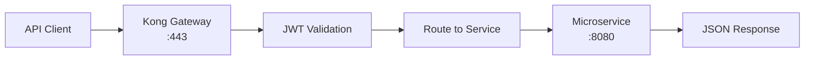

# API Reference -- ERP-BSS-OSS
> Version: 1.0 | Last Updated: 2026-02-23 | Status: Draft
> Classification: Internal | Author: AIDD System

---

## 1. API Architecture

All APIs follow REST conventions with TM Forum Open API alignment. Every endpoint requires the `X-Tenant-ID` header for multi-tenant isolation.



---

## 2. Common Headers

| Header | Required | Description |
|--------|----------|-------------|
| `X-Tenant-ID` | Yes | Tenant UUID for multi-tenant isolation |
| `Authorization` | Yes | Bearer JWT token (from ERP-IAM) |
| `Content-Type` | Yes (POST/PATCH) | `application/json` |
| `X-Correlation-ID` | No | Request correlation UUID (auto-generated if absent) |
| `Accept` | No | `application/json` (default) |

---

## 3. Response Envelope

**Success:**
```json
{
    "status": "success",
    "data": { ... },
    "meta": {
        "request_id": "uuid",
        "timestamp": "2026-02-23T10:00:00Z",
        "page": 1,
        "per_page": 20,
        "total": 150
    },
    "event_topic": "erp.bss_oss.entity.action"
}
```

**Error:**
```json
{
    "status": "error",
    "error": {
        "code": "ERROR_CODE",
        "message": "Human-readable description",
        "details": { ... }
    },
    "meta": { "request_id": "uuid", "timestamp": "..." }
}
```

---

## 4. Service Endpoints

### 4.1 Product Catalog (`/v1/product-catalog`)

| Method | Path | Description | Status Codes |
|--------|------|-------------|-------------|
| GET | `/products` | List products (filterable by category, status) | 200, 401, 403 |
| POST | `/products` | Create product | 201, 400, 401, 409 |
| GET | `/products/{id}` | Get product by ID | 200, 401, 404 |
| PATCH | `/products/{id}` | Update product | 200, 400, 401, 404 |
| DELETE | `/products/{id}` | Retire product (soft delete) | 200, 401, 404 |

### 4.2 Customer Management (`/v1/customer-management`)

| Method | Path | Description | Status Codes |
|--------|------|-------------|-------------|
| GET | `/customers` | List customers | 200, 401 |
| POST | `/customers` | Create customer | 201, 400, 401 |
| GET | `/customers/{id}` | Get customer | 200, 401, 404 |
| PATCH | `/customers/{id}` | Update customer | 200, 400, 401, 404 |
| DELETE | `/customers/{id}` | Soft delete customer | 200, 401, 404 |
| GET | `/customers/{id}/360` | Customer 360 view | 200, 401, 404 |
| POST | `/customers/{id}/kyc` | Submit KYC document | 201, 400, 401 |

### 4.3 Order Management (`/v1/order-management`)

| Method | Path | Description | Status Codes |
|--------|------|-------------|-------------|
| POST | `/orders` | Create order | 201, 400, 401 |
| GET | `/orders/{id}` | Get order | 200, 401, 404 |
| PATCH | `/orders/{id}` | Update order status | 200, 400, 401, 404 |
| POST | `/orders/{id}/cancel` | Cancel order | 200, 400, 401, 404 |

### 4.4 Billing & Rating (`/v1/billing-rating`)

| Method | Path | Description | Status Codes |
|--------|------|-------------|-------------|
| GET | `/balances/{subscriber_id}` | Get prepaid balance | 200, 401, 404 |
| POST | `/topup` | Top-up balance | 201, 400, 401, 402 |
| POST | `/charge` | Apply usage charge | 201, 400, 401, 402 |
| GET | `/invoices` | List invoices | 200, 401 |
| GET | `/invoices/{id}` | Get invoice detail | 200, 401, 404 |
| POST | `/disputes` | Create billing dispute | 201, 400, 401 |

### 4.5 Provisioning (`/v1/provisioning`)

| Method | Path | Description | Status Codes |
|--------|------|-------------|-------------|
| POST | `/activate` | Activate SIM/service | 201, 400, 401 |
| POST | `/sim-swap` | Initiate SIM swap | 201, 400, 401 |
| POST | `/port-in` | Initiate number port-in | 201, 400, 401 |
| GET | `/tasks/{id}` | Get provisioning task status | 200, 401, 404 |

### 4.6 USSD/IVR Gateway (`/v1/ussd-ivr-gateway`)

| Method | Path | Description | Status Codes |
|--------|------|-------------|-------------|
| POST | `/sessions` | Begin USSD session | 201, 400 |
| POST | `/sessions/{id}/continue` | Continue session with input | 200, 400, 404 |
| POST | `/sessions/{id}/end` | End session | 200, 404 |

### 4.7 Meter Management (`/v1/meter-management`)

| Method | Path | Description | Status Codes |
|--------|------|-------------|-------------|
| GET | `/meters` | List meters | 200, 401 |
| POST | `/meters` | Register meter | 201, 400, 401 |
| GET | `/meters/{id}/readings` | Get meter readings | 200, 401, 404 |
| POST | `/tokens` | Generate STS token | 201, 400, 401, 402 |

---

## 5. Pagination

All list endpoints support cursor-based pagination:

```
GET /v1/customers?page=2&per_page=50&sort=created_at&order=desc
```

| Parameter | Default | Max | Description |
|-----------|---------|-----|-------------|
| `page` | 1 | - | Page number |
| `per_page` | 20 | 100 | Items per page |
| `sort` | created_at | - | Sort field |
| `order` | desc | - | asc or desc |

---

## 6. Filtering

TMF-style filtering supported on list endpoints:

```
GET /v1/products?category=mobile&status=active&pricing_type=recurring
GET /v1/customers?customer_type=individual&segment=gold
GET /v1/orders?status=in_progress&priority=critical
```

---

## 7. Rate Limiting

| Tier | Rate Limit | Burst |
|------|-----------|-------|
| Standard | 1,000 req/min | 100 req/sec |
| Premium | 10,000 req/min | 500 req/sec |
| Internal | 100,000 req/min | 5,000 req/sec |

Rate limit headers returned:
```
X-RateLimit-Limit: 1000
X-RateLimit-Remaining: 950
X-RateLimit-Reset: 1708700400
```

---

## 8. Health Check

Every service exposes:

```
GET /healthz
```

Response:
```json
{
    "status": "healthy",
    "module": "ERP-BSS-OSS",
    "service": "billing-rating-service"
}
```
