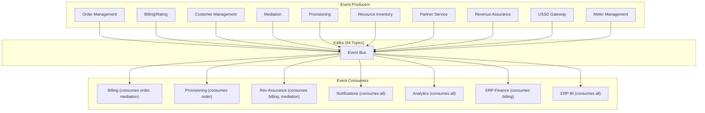

# Event Catalog -- ERP-BSS-OSS
> Version: 1.0 | Last Updated: 2026-02-23 | Status: Draft
> Classification: Internal | Author: AIDD System

---

## 1. Event Architecture

All inter-service communication uses CloudEvents v1.0 specification over Apache Kafka. Events are the backbone of the platform's eventual consistency and domain integration model.

### 1.1 Topic Naming Convention

```
erp.bss_oss.<entity>.<action>
```

- `erp` -- Platform prefix
- `bss_oss` -- Module name
- `<entity>` -- Domain entity (e.g., billing-rating, customer-management)
- `<action>` -- Verb (created, updated, deleted, listed, read)

---

## 2. Event Envelope (CloudEvents v1.0)

```json
{
    "specversion": "1.0",
    "type": "erp.bss_oss.order-management.created",
    "source": "/v1/order-management",
    "id": "a1b2c3d4-e5f6-7890-abcd-ef1234567890",
    "time": "2026-02-23T10:00:00.000Z",
    "datacontenttype": "application/json",
    "tenantid": "tenant-uuid",
    "correlationid": "correlation-uuid",
    "data": {
        "order_id": "uuid",
        "customer_id": "uuid",
        "status": "acknowledged",
        "items": [...]
    }
}
```

---

## 3. Complete Event Catalog

### 3.1 Billing and Rating Events

| Topic | Trigger | Key Payload Fields |
|-------|---------|-------------------|
| `erp.bss_oss.billing-rating.created` | New invoice/charge | invoice_id, customer_id, total_cents |
| `erp.bss_oss.billing-rating.updated` | Payment received, status change | invoice_id, status, paid_amount |
| `erp.bss_oss.billing-rating.deleted` | Invoice voided | invoice_id, void_reason |
| `erp.bss_oss.billing-rating.listed` | Bulk query | query_params |
| `erp.bss_oss.billing-rating.read` | Single invoice viewed | invoice_id |

### 3.2 Customer Management Events

| Topic | Trigger | Key Payload Fields |
|-------|---------|-------------------|
| `erp.bss_oss.customer-management.created` | New customer registered | customer_id, name, type |
| `erp.bss_oss.customer-management.updated` | Customer profile updated | customer_id, changed_fields |
| `erp.bss_oss.customer-management.deleted` | Customer soft-deleted | customer_id, reason |

### 3.3 Order Management Events

| Topic | Trigger | Key Payload Fields |
|-------|---------|-------------------|
| `erp.bss_oss.order-management.created` | New order submitted | order_id, customer_id, items[] |
| `erp.bss_oss.order-management.updated` | Order status changed | order_id, old_status, new_status |
| `erp.bss_oss.order-management.deleted` | Order cancelled | order_id, cancellation_reason |

### 3.4 Mediation Events

| Topic | Trigger | Key Payload Fields |
|-------|---------|-------------------|
| `erp.bss_oss.mediation.created` | CDR normalized and ready for rating | cdr_id, subscriber_id, service_type |
| `erp.bss_oss.mediation.updated` | CDR re-rated | cdr_id, new_charge |

### 3.5 Provisioning Events

| Topic | Trigger | Key Payload Fields |
|-------|---------|-------------------|
| `erp.bss_oss.provisioning.created` | Provisioning task started | task_id, order_id, action |
| `erp.bss_oss.provisioning.updated` | Provisioning step completed/failed | task_id, step, status |

### 3.6 Resource Inventory Events

| Topic | Trigger | Key Payload Fields |
|-------|---------|-------------------|
| `erp.bss_oss.resource-inventory.created` | Resource allocated (SIM, number, IP) | resource_type, resource_id |
| `erp.bss_oss.resource-inventory.updated` | Resource status changed | resource_id, new_status |
| `erp.bss_oss.resource-inventory.deleted` | Resource decommissioned | resource_id |

### 3.7 Other Service Events

| Domain | Topics |
|--------|--------|
| Partner | `erp.bss_oss.partner.{created,updated,deleted}` |
| Revenue Assurance | `erp.bss_oss.revenue-assurance.{created,updated}` |
| Self-Care | `erp.bss_oss.self-care.{created,updated}` |
| Service Inventory | `erp.bss_oss.service-inventory.{created,updated,deleted}` |
| Tariff | `erp.bss_oss.tariff.{created,updated,deleted}` |
| USSD/IVR | `erp.bss_oss.ussd-ivr-gateway.{created,updated}` |
| Meter Management | `erp.bss_oss.meter-management.{created,updated}` |
| Network Operations | `erp.bss_oss.network-operations.{created,updated}` |
| Product Catalog | `erp.bss_oss.product-catalog.{created,updated,deleted}` |

---

## 4. Event Flow Diagram



---

## 5. Consumer Group Configuration

| Consumer Group | Subscribed Topics | Partitions | Instances |
|---------------|------------------|-----------|-----------|
| `billing-consumer` | order-management.*, mediation.* | 12 | 5 |
| `provisioning-consumer` | order-management.created | 6 | 3 |
| `analytics-consumer` | erp.bss_oss.* (all) | 24 | 3 |
| `notification-consumer` | order-management.*, billing-rating.* | 6 | 2 |
| `revenue-assurance-consumer` | billing-rating.*, mediation.* | 12 | 3 |
| `finance-consumer` | billing-rating.created, billing-rating.updated | 6 | 2 |

---

## 6. Event Processing Guarantees

| Guarantee | Implementation |
|-----------|---------------|
| **At-least-once delivery** | Kafka consumer commits offset after processing |
| **Idempotency** | All consumers check event_id for deduplication |
| **Ordering** | Partition by subscriber_id for per-subscriber ordering |
| **Replay** | Kafka retention = 7 days (configurable up to 30 days) |
| **Dead letter** | Failed events routed to `erp.bss_oss.dlq.<original_topic>` |
