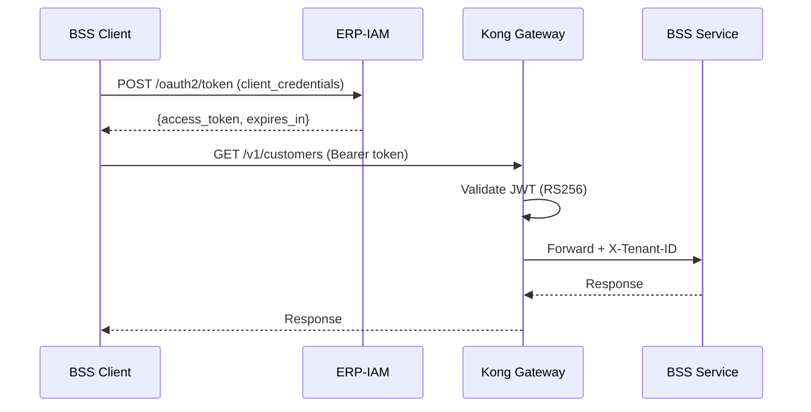
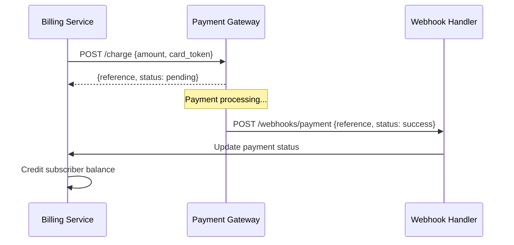

# Integration Guide -- ERP-BSS-OSS
> Version: 1.0 | Last Updated: 2026-02-23 | Status: Draft
> Classification: Internal | Author: AIDD System

---

## 1. Integration Overview

ERP-BSS-OSS integrates with both the broader ERP suite and external telecom/utilities systems. This document covers all integration points, protocols, data formats, and error handling patterns.

---

## 2. ERP Suite Integrations

### 2.1 ERP-IAM (Identity & Access Management)

| Aspect | Detail |
|--------|--------|
| Protocol | OIDC / OAuth 2.0 |
| Auth flow | Authorization Code Flow (web), Client Credentials (service-to-service) |
| Token format | JWT (RS256) |
| Token validation | Kong gateway validates signature + expiry + tenant_id |
| Claims | sub, tenant_id, roles, permissions |

### 2.2 ERP-Finance (General Ledger)

| Aspect | Detail |
|--------|--------|
| Integration | Event-driven (Kafka) |
| Direction | BSS -> Finance |
| Events | `erp.bss_oss.billing-rating.created` (invoice), `erp.bss_oss.billing-rating.updated` (payment) |
| Journal entry mapping | Invoice -> Revenue recognition (CR Revenue, DR Accounts Receivable) |
| Reconciliation | Daily automated reconciliation |

### 2.3 ERP-CRM (Sales & Marketing)

| Aspect | Detail |
|--------|--------|
| Integration | Event-driven (Kafka) |
| Direction | Bidirectional |
| BSS -> CRM | `erp.bss_oss.customer-management.created` (new subscriber -> lead conversion) |
| CRM -> BSS | `erp.crm.campaign.targeted` (campaign targets for BSS subscriber offers) |

### 2.4 ERP-BI (Business Intelligence)

| Aspect | Detail |
|--------|--------|
| Integration | Kafka event streaming + direct ClickHouse queries |
| Data | All `erp.bss_oss.*` events consumed by BI data pipelines |
| Dashboards | Revenue, ARPU, churn, usage analytics |

### 2.5 ERP-AI (Machine Learning)

| Aspect | Detail |
|--------|--------|
| Integration | Kafka (feature data) + gRPC (model inference) |
| Use cases | Fraud detection, churn prediction, next-best-offer |
| Feature store | ClickHouse `fraud_detection_features` table |

---

## 3. External System Integrations

### 3.1 Payment Gateways

| Gateway | Protocol | Integration Type | Supported Operations |
|---------|----------|-----------------|---------------------|
| Paystack | REST + Webhooks | Synchronous + callback | Charge, verify, refund |
| Flutterwave | REST + Webhooks | Synchronous + callback | Charge, verify, refund |
| Stripe | REST + Webhooks | Synchronous + callback | Charge, verify, refund, subscription |

### 3.2 Network Elements (HLR/HSS)

| Aspect | Detail |
|--------|--------|
| Protocol | SS7/MAP (voice), DIAMETER (LTE/5G) |
| Operations | Subscriber activation, SIM swap, service profile update |
| Adapter | Network adapter service translates REST to SS7/DIAMETER |

### 3.3 SMS Gateway (SMPP)

| Aspect | Detail |
|--------|--------|
| Protocol | SMPP v3.4 |
| Operations | Send SMS (notifications, OTP, billing alerts) |
| Throughput | 1,000 SMS/sec per connection |
| Failover | Primary + secondary SMSC connections |

### 3.4 Number Portability Clearinghouse

| Aspect | Detail |
|--------|--------|
| Protocol | SOAP/REST (varies by country) |
| Operations | Port-in request, port-out notification, query ported number |
| SLA | Response within 2 business days (varies by regulation) |

### 3.5 AMI Head-End (Smart Meters)

| Aspect | Detail |
|--------|--------|
| Protocol | DLMS/COSEM over TCP/IP, MQTT, LoRaWAN |
| Operations | Meter reading collection, remote disconnect/reconnect, firmware update |
| Frequency | Readings every 15 minutes |

---

## 4. Integration Error Handling

| Error Type | Strategy | Example |
|-----------|----------|---------|
| **Transient** | Retry with exponential backoff (3 attempts) | Network timeout, 503 Service Unavailable |
| **Permanent** | Dead letter queue + alert | Invalid payment reference, 400 Bad Request |
| **Partial failure** | Compensation transaction | Provisioning step 3 fails -> rollback steps 1 and 2 |
| **Timeout** | Circuit breaker (open after 5 failures in 30s) | External API consistently slow |

---

## 5. Integration Monitoring

| Metric | Alert Threshold | Dashboard |
|--------|----------------|-----------|
| Integration latency P99 | > 5 seconds | Grafana /d/integrations |
| Integration error rate | > 5% | Grafana /d/integrations |
| Kafka consumer lag | > 100K messages | Grafana /d/kafka |
| Dead letter queue depth | > 100 messages | Grafana /d/dlq |
| Circuit breaker state | OPEN for > 5 minutes | PagerDuty |
