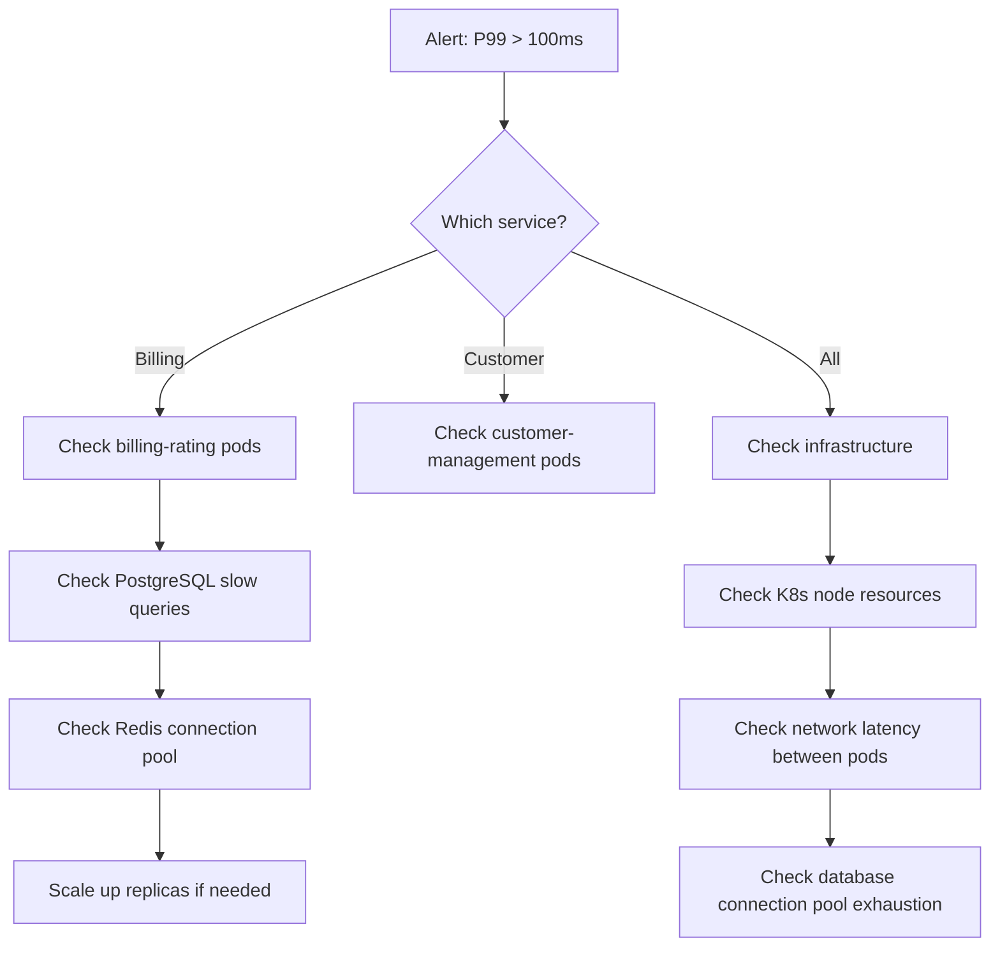

# Operational Runbook -- ERP-BSS-OSS
> Version: 1.0 | Last Updated: 2026-02-23 | Status: Draft
> Classification: Internal | Author: AIDD System

---

## 1. Purpose

This runbook provides step-by-step procedures for common operational tasks and incident response scenarios for the ERP-BSS-OSS platform.

---

## 2. Common Operational Procedures

### 2.1 Health Check Verification

```bash
# Check all service health endpoints
for svc in billing-rating customer-management order-management mediation \
  provisioning resource-inventory service-inventory partner \
  revenue-assurance self-care network-operations ussd-ivr-gateway \
  meter-management tariff product-catalog; do
    STATUS=$(curl -s -o /dev/null -w "%{http_code}" http://${svc}-service:8080/healthz)
    echo "${svc}: ${STATUS}"
done
```

### 2.2 Database Connection Verification

```bash
# PostgreSQL
PGPASSWORD=postgres psql -h postgres-primary -U postgres -d bss -c "SELECT 1;"

# Redis
redis-cli -h redis-primary ping

# MongoDB
mongosh mongodb://mongodb:27017/bss --eval "db.runCommand({ping: 1})"

# ClickHouse
clickhouse-client --host clickhouse-primary --query "SELECT 1"
```

### 2.3 Kafka Topic Status

```bash
# List all BSS topics
kafka-topics.sh --bootstrap-server kafka:9092 --list | grep erp.bss_oss

# Check consumer group lag
kafka-consumer-groups.sh --bootstrap-server kafka:9092 \
  --group billing-service --describe
```

---

## 3. Incident Response Procedures

### 3.1 High API Latency (P99 > 100ms)



**Steps:**
1. Identify affected service from Grafana dashboard
2. Check pod resource usage: `kubectl top pods -n bss-production`
3. Check PostgreSQL slow query log: `SELECT * FROM pg_stat_activity WHERE state = 'active' AND duration > interval '1 second';`
4. Check Redis connection pool: `redis-cli info clients`
5. If CPU > 80%: scale up replicas `kubectl scale deployment <service> --replicas=<N+2>`
6. If DB queries slow: check for missing indexes, long-running transactions

### 3.2 Billing Cycle Failure

**Steps:**
1. Navigate to Billing > Billing Cycles in admin console
2. Check error queue for failed invoices
3. Common causes:
   - Missing tariff plan for a subscription: Assign correct tariff
   - Customer data inconsistency: Fix customer record
   - ClickHouse unavailable: Check ClickHouse health
4. Re-process failed invoices individually or in batch
5. Verify invoice totals match expected revenue

### 3.3 CDR Pipeline Backlog

**Symptoms:** Kafka consumer lag > 1M messages on mediation topics

**Steps:**
1. Check mediation service pod health: `kubectl get pods -l app=mediation-service`
2. Check for processing errors in logs
3. If pods healthy but slow: scale up mediation replicas
4. If pod crashes: check memory (CDR batches too large)
5. If ClickHouse insert fails: check ClickHouse disk space and merge queue

### 3.4 Charging Engine Failure

**Severity:** CRITICAL -- Subscribers cannot make calls or use data

**Steps:**
1. Verify charging-engine pods: `kubectl get pods -l app=charging-engine`
2. Check Redis connectivity (balance store)
3. If Redis down: failover to PostgreSQL (slower but functional)
4. If charging engine pods crash: check for memory exhaustion (increase limits)
5. If widespread: activate emergency bypass mode (allow calls, rate later)

### 3.5 Database Failover

**Steps:**
1. Confirm primary failure from monitoring
2. PostgreSQL streaming replication auto-promotes replica
3. Verify new primary: `SELECT pg_is_in_recovery();` (should return false)
4. Update connection strings if not using DNS/service discovery
5. Verify application connections recovered
6. Plan replacement of failed node

---

## 4. Maintenance Procedures

### 4.1 Database Backup Verification

```bash
# Weekly: Verify backup integrity
pg_restore --list /backups/latest/bss_full.dump | head -20

# Monthly: Full restore test to staging
pg_restore -h staging-db -d bss_restore /backups/latest/bss_full.dump
```

### 4.2 Certificate Rotation

1. Generate new TLS certificates (Let's Encrypt or internal CA)
2. Update Kubernetes secrets: `kubectl create secret tls bss-tls --cert=new.crt --key=new.key`
3. Rolling restart of affected services
4. Verify TLS with: `openssl s_client -connect bss-api:443`

### 4.3 Kafka Topic Compaction

```bash
# Clean up old data on non-critical topics
kafka-configs.sh --bootstrap-server kafka:9092 \
  --alter --topic erp.bss_oss.billing-rating.listed \
  --add-config retention.ms=604800000  # 7 days
```

---

## 5. Escalation Matrix

| Severity | Response Time | Escalation Path |
|----------|-------------|----------------|
| **Critical** (service down) | 5 minutes | On-call engineer -> Team lead -> VP Engineering |
| **High** (degraded performance) | 15 minutes | On-call engineer -> Team lead |
| **Medium** (non-critical issue) | 1 hour | Assigned engineer |
| **Low** (cosmetic/minor) | Next business day | Backlog |

---

## 6. Contact List

| Role | Contact | Hours |
|------|---------|-------|
| On-call engineer | PagerDuty rotation | 24/7 |
| Database admin | DBA team Slack channel | 24/7 |
| Network operations | NOC desk | 24/7 |
| Security incident | security@bss-oss.com | 24/7 |
| Product owner | Product team Slack | Business hours |
