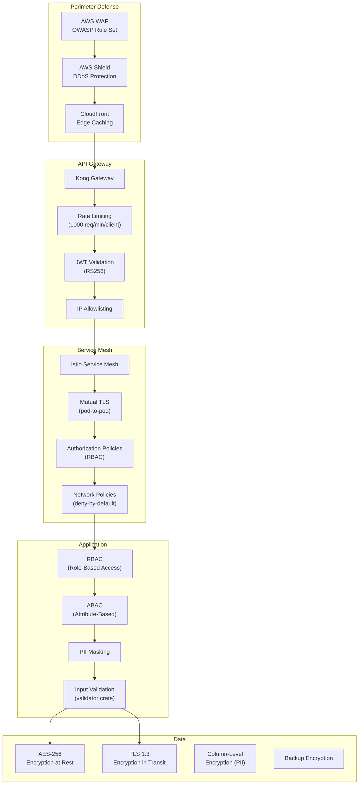
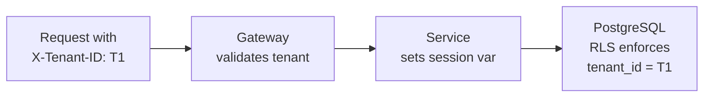
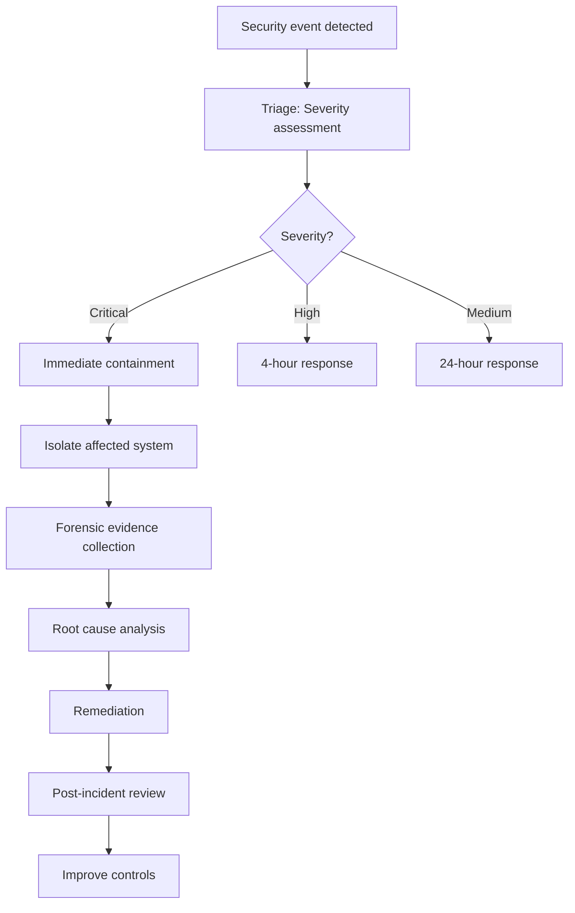

# Security Architecture -- ERP-BSS-OSS
> Version: 1.0 | Last Updated: 2026-02-23 | Status: Draft
> Classification: Internal | Author: AIDD System

---

## 1. Security Overview

ERP-BSS-OSS implements defense-in-depth security across all layers: network perimeter, API gateway, service mesh, application, and data.

---

## 2. Security Architecture



---

## 3. Authentication

### 3.1 OAuth 2.0 / OIDC

- **Provider:** ERP-IAM (OIDC-compliant)
- **Token type:** JWT (RS256 signed)
- **Token lifetime:** Access token: 15 minutes, Refresh token: 7 days
- **MFA requirement:** Mandatory for admin roles, optional for subscribers

### 3.2 API Key Authentication

For service-to-service and partner API access:
- API keys are UUID v4 with HMAC signature
- Keys are stored hashed (SHA-256) in PostgreSQL
- Rate limited per key
- Revocable in real-time

### 3.3 Password Security

- Hashing: Argon2id (current best practice)
- Minimum length: 12 characters
- Complexity: Must include uppercase, lowercase, digit, special character
- Lockout: 5 failed attempts triggers 15-minute lockout

---

## 4. Authorization

### 4.1 RBAC Model

| Role | Permissions |
|------|------------|
| **subscriber** | View own balance, top-up, view invoices, create tickets |
| **csr_agent** | View/edit customers, create orders, view balances |
| **billing_admin** | Run billing cycles, manage tariffs, resolve disputes |
| **partner_admin** | View partner data, approve settlements |
| **noc_operator** | View alarms, create tickets, dispatch workforce |
| **ra_analyst** | View fraud alerts, investigate leakage |
| **system_admin** | Full access to all functions |

### 4.2 Tenant Isolation



All database tables have a `tenant_id` column. Row-Level Security policies ensure that Tenant A can never access Tenant B data, even if application logic has a bug.

---

## 5. Data Security

### 5.1 Encryption

| Scope | Algorithm | Key Management |
|-------|-----------|---------------|
| At rest (disk) | AES-256-GCM | AWS KMS / HashiCorp Vault |
| In transit (external) | TLS 1.3 | Auto-renewed certificates (cert-manager) |
| In transit (internal) | mTLS (Istio) | Istio CA (auto-rotated) |
| Column-level (PII) | AES-256-GCM | Application-managed keys |
| Backups | AES-256-CTR | Separate backup encryption key |

### 5.2 PII Data Handling

| PII Field | Storage | Logging | API Response |
|-----------|---------|---------|-------------|
| Phone number | Encrypted column | Masked (***5678) | Full (authorized) |
| Email | Encrypted column | Masked (j***@example.com) | Full (authorized) |
| National ID | Encrypted column | Never logged | Never returned via API |
| PUK codes | Encrypted column | Never logged | Only via secure channel |
| Payment card | Not stored (tokenized at gateway) | Never logged | Last 4 digits only |

---

## 6. Network Security

### 6.1 Network Policies

- Default deny all ingress and egress
- Explicit allow rules per service
- Database pods only accessible from application pods
- External access only through API gateway

### 6.2 Pod Security Standards

```yaml
securityContext:
  runAsNonRoot: true
  runAsUser: 65534
  readOnlyRootFilesystem: true
  allowPrivilegeEscalation: false
  capabilities:
    drop: ["ALL"]
```

---

## 7. Telecom-Specific Security

### 7.1 SIM Security

- PUK codes encrypted at rest and never exposed in logs
- SIM swap requires re-authentication (KYC re-verification)
- IMSI change triggers fraud alert

### 7.2 Balance Security

- Distributed locks prevent double-charging
- Balance operations are idempotent (reference_id deduplication)
- All balance changes audited with before/after values

### 7.3 Fraud Prevention

| Threat | Detection | Response |
|--------|-----------|----------|
| SIM Box | ML model (outgoing ratio, fixed duration) | Auto-bar + alert |
| IRSF | Destination analysis, call pattern profiling | Block destination + alert |
| Wangiri | Short call clustering, callback trap | Block source + alert |
| Subscription fraud | Identity verification, credit check | Reject application |
| Internal fraud | Audit log analysis, separation of duties | Alert + investigation |

---

## 8. Security Monitoring

### 8.1 Security Events

| Event | Severity | Action |
|-------|----------|--------|
| Failed login (5+ attempts) | High | Lock account + alert |
| JWT with invalid signature | Critical | Block IP + alert |
| Tenant isolation bypass attempt | Critical | Block + PagerDuty |
| Unauthorized API access | High | Log + alert |
| Balance manipulation attempt | Critical | Block + alert + investigate |
| Unusual admin activity | Medium | Log + weekly review |

### 8.2 Vulnerability Management

| Activity | Frequency | Tool |
|----------|-----------|------|
| Container image scanning | Every build | Trivy |
| Rust dependency audit | Every build | cargo-audit |
| Penetration testing | Quarterly | Third-party |
| DAST scanning | Weekly | OWASP ZAP |
| K8s config audit | Weekly | kube-bench |

---

## 9. Incident Response



**Breach notification timeline:**
- Internal notification: Immediate
- Regulatory notification (GDPR): Within 72 hours
- Affected subscribers: Without undue delay
