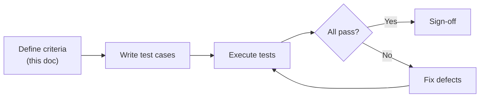

# Acceptance Criteria -- ERP-BSS-OSS
> Version: 1.0 | Last Updated: 2026-02-23 | Status: Draft
> Classification: Internal | Author: AIDD System

---

## 1. Overview

This document defines the acceptance criteria for the ERP-BSS-OSS platform, organized by service domain. Each criterion specifies the condition, expected behavior, and verification method.

---

## 2. Product Catalog (TMF620)

| ID | Criterion | Expected Behavior | Verification |
|----|-----------|-------------------|-------------|
| AC-PC-01 | Create product with valid data | Product created with status=draft, version=1.0.0, unique ID | API test: POST /v1/product-catalog/products returns 201 |
| AC-PC-02 | Publish product | Status transitions from draft to active | API test: PATCH status=active returns 200 |
| AC-PC-03 | Retire product | Status transitions to retired; existing subscriptions unaffected | API test + DB verification |
| AC-PC-04 | Add pricing rule | Pricing rule attached to product with valid type and amount | API test: POST pricing returns 201 |
| AC-PC-05 | Create bundle | Bundle product with component products and discount | API test: verify bundle_product_id references |
| AC-PC-06 | Version product | New version created, old version remains accessible | API test: both versions retrievable |

---

## 3. Customer Management (TMF629)

| ID | Criterion | Expected Behavior | Verification |
|----|-----------|-------------------|-------------|
| AC-CM-01 | Create individual customer | Customer created with type=individual, status=active | API test |
| AC-CM-02 | Create business customer | Customer created with type=business, account hierarchy supported | API test |
| AC-CM-03 | KYC submission | Document uploaded, status=pending | API test |
| AC-CM-04 | KYC approval | Customer kyc_status transitions to verified | API test + event published |
| AC-CM-05 | Customer 360 view | Returns subscriptions, billing, orders, tickets, usage in single response | API test: GET /customers/{id}/360 |
| AC-CM-06 | Soft delete | Customer deleted_at set; not returned in default queries | API test: DELETE returns 200; GET list excludes |

---

## 4. Order Management (TMF622)

| ID | Criterion | Expected Behavior | Verification |
|----|-----------|-------------------|-------------|
| AC-OM-01 | Create order | Order created with status=acknowledged, order_number generated | API test |
| AC-OM-02 | Order state transitions | Valid transitions: acknowledged->in_progress->completed | State machine test |
| AC-OM-03 | Invalid state transition | Reject transition completed->acknowledged | API returns 400 |
| AC-OM-04 | Cancel order | Status=cancelled only from acknowledged or in_progress | API test |
| AC-OM-05 | Fallout management | Failed provisioning creates fallout record | E2E test |
| AC-OM-06 | Order event publishing | order.created event published to Kafka | Kafka consumer test |

---

## 5. Billing and Rating (TMF678)

| ID | Criterion | Expected Behavior | Verification |
|----|-----------|-------------------|-------------|
| AC-BR-01 | Balance lookup | Returns current balance within 1ms | API test + latency assertion |
| AC-BR-02 | Prepaid top-up | Balance incremented by exact amount; balance_operation recorded | API test + DB verification |
| AC-BR-03 | Usage charge | Balance decremented; CDR recorded with correct charge | API test |
| AC-BR-04 | Insufficient balance | Charge rejected with INSUFFICIENT_BALANCE error | API returns 402 |
| AC-BR-05 | Auto-recharge trigger | Payment initiated when balance drops below threshold | Integration test |
| AC-BR-06 | Invoice generation | Invoice created with correct subtotal, tax, total | Billing cycle test |
| AC-BR-07 | Bill accuracy | 99.999% accuracy: CDR charges match invoice line items | Reconciliation test |
| AC-BR-08 | Dunning escalation | Correct action taken at each dunning level | Timer-based test |
| AC-BR-09 | Dispute creation | Dispute record created; customer notified | API test |
| AC-BR-10 | Credit limit enforcement | Postpaid charge rejected when credit limit exceeded | API test |

---

## 6. Mediation

| ID | Criterion | Expected Behavior | Verification |
|----|-----------|-------------------|-------------|
| AC-MED-01 | CDR normalization | Input CDR (any format) normalized to unified schema | Unit test per format |
| AC-MED-02 | Duplicate rejection | Duplicate CDR identified and discarded | Test with same CDR twice |
| AC-MED-03 | Throughput | Process >= 1.4M CDRs/second | Load test benchmark |
| AC-MED-04 | Partial CDR correlation | Long call interim records correlated into single CDR | Test with multi-part CDR |

---

## 7. Provisioning (TMF641)

| ID | Criterion | Expected Behavior | Verification |
|----|-----------|-------------------|-------------|
| AC-PROV-01 | SIM activation | SIM status transitions to active; HLR entry created | Integration test |
| AC-PROV-02 | SIM swap | Old SIM blocked, new SIM active, MSISDN preserved | API test |
| AC-PROV-03 | Number porting | MSISDN ported within regulatory window | E2E test with mock NPC |
| AC-PROV-04 | Rollback on failure | All provisioning steps reversed on failure | Failure injection test |

---

## 8. Resource Inventory (TMF639)

| ID | Criterion | Expected Behavior | Verification |
|----|-----------|-------------------|-------------|
| AC-RI-01 | SIM allocation | Available SIM assigned to customer; status=assigned | API test |
| AC-RI-02 | Number allocation | Available MSISDN assigned; status=assigned | API test |
| AC-RI-03 | IP address allocation | IP from pool assigned; pool count decremented | API test |
| AC-RI-04 | Resource release | Released resources return to available pool | API test |

---

## 9. Partner Management (TMF668)

| ID | Criterion | Expected Behavior | Verification |
|----|-----------|-------------------|-------------|
| AC-PM-01 | Partner onboarding | Partner created with KYC status | API test |
| AC-PM-02 | Revenue share calculation | Settlement matches agreement terms | Math verification test |
| AC-PM-03 | Settlement accuracy | Variance < 0.01% from manual calculation | Reconciliation test |

---

## 10. Non-Functional Acceptance Criteria

| ID | Criterion | Expected Behavior | Verification |
|----|-----------|-------------------|-------------|
| AC-NF-01 | API P99 latency | < 50 ms under 100K concurrent users | k6 load test |
| AC-NF-02 | Throughput | 150K+ TPS sustained for 30 minutes | k6 load test |
| AC-NF-03 | Availability | 99.99% over 30-day rolling window | Uptime monitoring |
| AC-NF-04 | RTO | < 5 minutes for single-service failure | Chaos engineering test |
| AC-NF-05 | Multi-tenant isolation | Tenant A cannot access Tenant B data | Security test |
| AC-NF-06 | Audit logging | All state changes logged with user, timestamp, before/after | Audit log verification |

---

## 11. Acceptance Test Execution Summary

**Sign-off authority:** Product Owner + QA Lead + Engineering Lead
