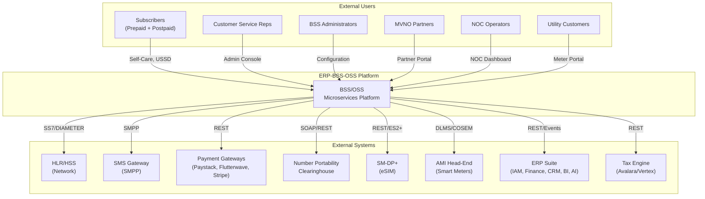
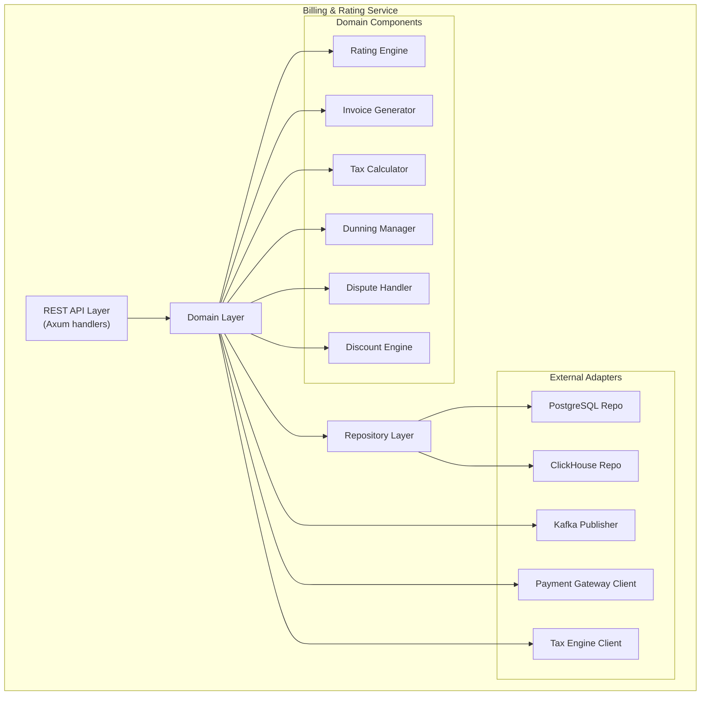
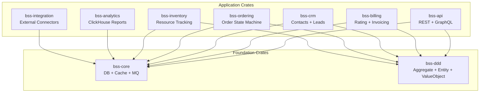
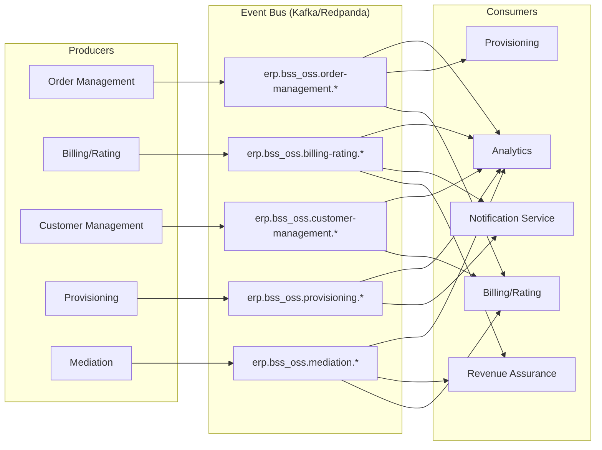
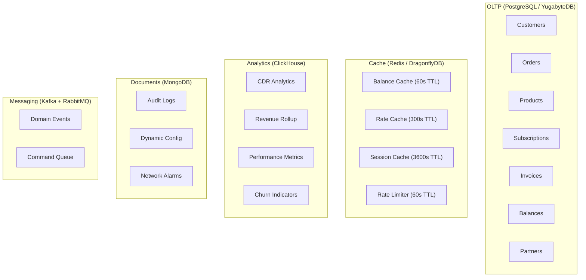
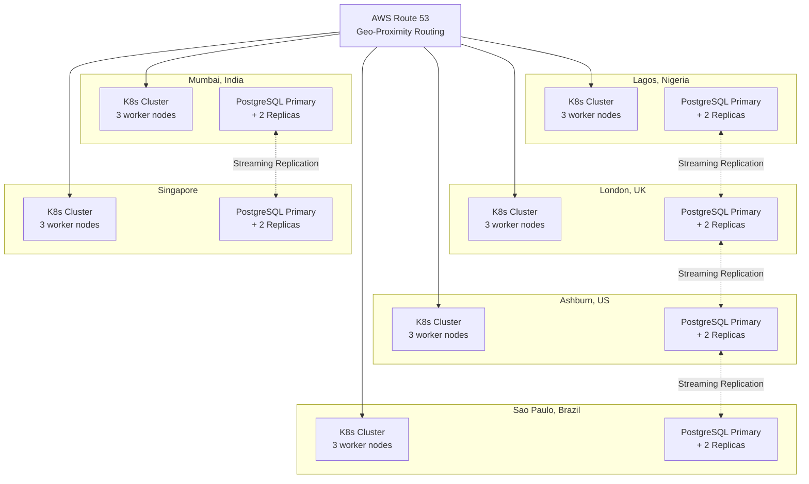
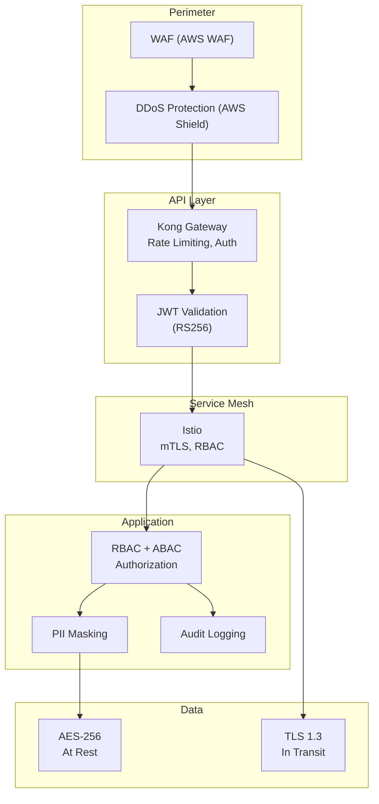
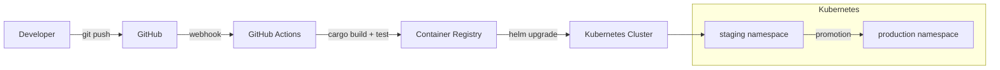

# System Architecture -- ERP-BSS-OSS
> Version: 1.0 | Last Updated: 2026-02-23 | Status: Draft
> Classification: Internal | Author: AIDD System

---

## 1. Architecture Overview

ERP-BSS-OSS is a cloud-native, microservices-based BSS/OSS platform built on Rust (Axum) with polyglot persistence and event-driven communication. The architecture follows Domain-Driven Design (DDD) principles with bounded contexts aligned to TM Forum Frameworx (eTOM process areas).

---

## 2. C4 Model

### 2.1 Context Diagram (Level 1)

### 2.2 Container Diagram (Level 2)

```mermaid
graph TB
    subgraph "API Layer"
        GW["API Gateway<br/>(Kong 3.5)"]
        MESH["Service Mesh<br/>(Istio)"]
    end

    subgraph "BSS Services"
        PC["Product Catalog<br/>TMF620<br/>(Rust/Go)"]
        CM["Customer Management<br/>TMF629<br/>(Rust/Go)"]
        OM["Order Management<br/>TMF622<br/>(Rust/Go)"]
        BR["Billing & Rating<br/>TMF678<br/>(Rust/Go)"]
        CE["Charging Engine<br/>OCS<br/>(Rust)"]
        MED["Mediation<br/>CDR Pipeline<br/>(Rust/Go)"]
        PS["Partner Service<br/>TMF668<br/>(Go)"]
        SC["Self-Care<br/>Portal<br/>(Go)"]
    end

    subgraph "OSS Services"
        PROV["Provisioning<br/>TMF641<br/>(Go)"]
        RI["Resource Inventory<br/>TMF639<br/>(Go)"]
        SI["Service Inventory<br/>TMF638<br/>(Go)"]
        NO["Network Operations<br/>Fault/Perf<br/>(Go)"]
        WF["Workforce Mgmt<br/>Field Dispatch<br/>(Rust)"]
    end

    subgraph "Specialized Services"
        RA["Revenue Assurance<br/>AI/ML<br/>(Go)"]
        USSD["USSD/IVR<br/>Gateway<br/>(Go)"]
        MM["Meter Management<br/>AMI<br/>(Go)"]
        TS["Tariff Service<br/>STS Tokens<br/>(Go)"]
    end

    subgraph "Data Layer"
        PG["PostgreSQL 16"]
        RD["Redis 7"]
        MG["MongoDB 7"]
        CH["ClickHouse"]
        KF["Kafka / Redpanda"]
        RMQ["RabbitMQ"]
    end

    GW --> MESH
    MESH --> PC & CM & OM & BR & CE & MED & PS & SC
    MESH --> PROV & RI & SI & NO & WF
    MESH --> RA & USSD & MM & TS

    PC & CM & OM & BR --> PG
    CE --> RD
    MED --> CH
    NO --> MG
    BR & OM & CM --> KF
    CE & PROV --> RMQ
```

### 2.3 Component Diagram -- Billing Service (Level 3)

---

## 3. Service Inventory

The platform comprises **30 microservices** organized into four domains:

| Domain | Services | Count |
|--------|----------|-------|
| **BSS Core** | product-catalog-service, customer-management-service, order-management-service, billing-rating-service, charging-engine, mediation-service, partner-service, self-care-service | 8 |
| **OSS Core** | provisioning-service, resource-inventory-service, service-inventory-service, network-operations-service, fault-management, performance-mgmt, workforce-mgmt, network-orchestration, network-inventory | 9 |
| **Specialized** | revenue-assurance-service, ussd-ivr-gateway, meter-management-service, tariff-service | 4 |
| **Foundation** | api-gateway, crm-service, finance-service, support-service, customer-management, order-management, product-catalog, partner-settlement, service-provisioning | 9 |

---

## 4. Rust Crate Architecture

---

## 5. Event-Driven Architecture

### 5.1 Event Bus Topology

All inter-service communication uses CloudEvents envelope format published to Kafka/Redpanda topics.

**Topic naming convention:** `erp.bss_oss.<entity>.<action>`

### 5.2 Event Catalog

| Topic | Payload | Producer | Consumers |
|-------|---------|----------|-----------|
| `erp.bss_oss.order-management.created` | Order + Items | Order Service | Billing, Provisioning, Analytics |
| `erp.bss_oss.order-management.updated` | Order delta | Order Service | Billing, Notification |
| `erp.bss_oss.billing-rating.created` | Invoice / Charge | Billing Service | Revenue Assurance, Analytics |
| `erp.bss_oss.customer-management.created` | Customer record | Customer Service | Billing, CRM, Analytics |
| `erp.bss_oss.provisioning.created` | Provisioning task | Provisioning | Network Ops, Analytics |
| `erp.bss_oss.mediation.created` | Normalized CDR | Mediation | Billing, Revenue Assurance |
| `erp.bss_oss.revenue-assurance.created` | Alert / Finding | Revenue Assurance | Notification, Analytics |

---

## 6. Data Architecture

### 6.1 Polyglot Persistence Strategy

### 6.2 Database Sizing (per 1M subscribers)

| Database | Storage | IOPS | Connections |
|----------|---------|------|------------|
| PostgreSQL | 500 GB | 10K | 200 |
| Redis | 32 GB RAM | N/A | 500 |
| ClickHouse | 2 TB | 5K | 50 |
| MongoDB | 100 GB | 2K | 100 |
| Kafka | 1 TB (7-day retention) | 20K | 300 |

---

## 7. Network Architecture

### 7.1 Global 6-PoP Deployment

---

## 8. Security Architecture

---

## 9. Deployment Architecture

---

## 10. Technology Stack Summary

| Layer | Technology | Purpose |
|-------|-----------|---------|
| Language | Rust 1.83, Go 1.22 | Core logic, microservice stubs |
| Framework | Axum 0.7, Tower, Tokio | HTTP, middleware, async runtime |
| API | REST (JSON), GraphQL | External and internal APIs |
| Database | PostgreSQL 16, ClickHouse, MongoDB 7, Redis 7 | OLTP, analytics, documents, cache |
| Messaging | Apache Kafka, RabbitMQ | Events, commands |
| Observability | OpenTelemetry, Prometheus, Grafana, Jaeger | Traces, metrics, dashboards |
| Orchestration | Kubernetes 1.29, Istio 1.20 | Container orchestration, service mesh |
| Gateway | Kong 3.5 | API gateway, rate limiting |
| IaC | Terraform, Helm | Infrastructure as code |
| CI/CD | GitHub Actions | Build, test, deploy |
