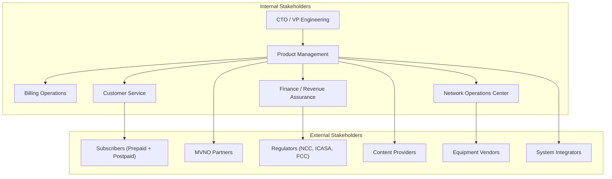
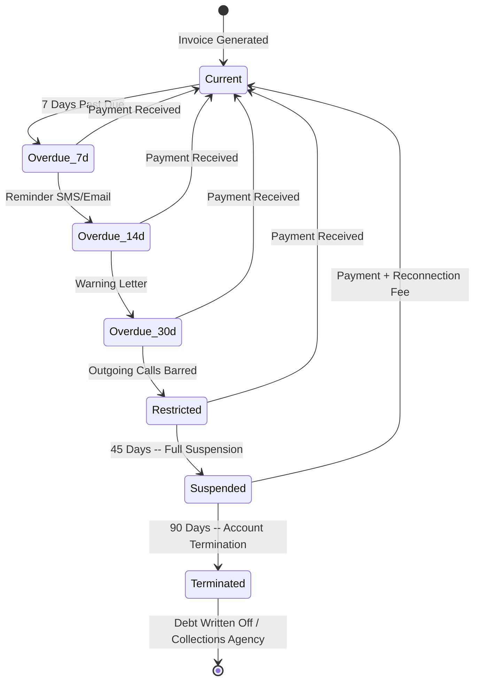
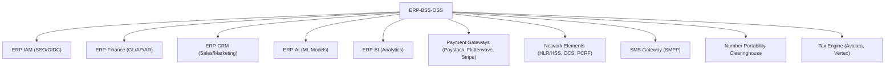

# Business Requirements Document (BRD) -- ERP-BSS-OSS
> Version: 1.0 | Last Updated: 2026-02-23 | Status: Draft
> Classification: Internal | Author: AIDD System

---

## 1. Business Context

The global telecommunications industry processes over $1.7 trillion in annual revenue, yet operators remain trapped in vendor lock-in cycles with BSS/OSS platforms from Amdocs, Netcracker, Oracle Communications, and Ericsson that cost $3-5M in annual licenses and take 12-18 months to deploy. ERP-BSS-OSS addresses this market failure by delivering an open-source, carrier-grade platform that reduces total cost of ownership by 88% and deployment time to 4-6 weeks.

### 1.1 Business Objectives

| Objective | Measure | Target |
|-----------|---------|--------|
| Eliminate vendor lock-in | Source code ownership | 100 % open source |
| Reduce licensing costs | Annual license spend | $0 (vs $3-5M) |
| Accelerate time-to-market | Deployment duration | 4-6 weeks (vs 12-18 months) |
| Support convergent billing | Service types on single platform | Voice + Data + SMS + MMS + Content + IoT + Utilities |
| Enable MVNO/MVNE model | Partner onboarding time | < 2 weeks |
| Comply with TM Forum | Open API coverage | 10+ TMF APIs |

### 1.2 Stakeholder Map

---

## 2. Business Process Requirements

### 2.1 Subscriber Onboarding

**Current Pain Points:**
- KYC verification takes 24-48 hours with manual processes
- SIM activation requires multiple system touchpoints
- Number allocation is error-prone and manual

**Target State:**
- Automated KYC with document OCR and biometric verification
- One-click SIM activation via provisioning service
- Automatic number allocation from managed MSISDN pools
- Self-service onboarding via web portal or USSD

### 2.2 Convergent Billing Cycle

**Business Rule:** A single invoice must consolidate all service charges (voice, data, SMS, VAS, devices, one-time fees) with correct tax treatment per jurisdiction.

**Requirements:**
- Bill cycle scheduling: daily, weekly, bi-weekly, monthly, quarterly
- Pro-rata calculations for mid-cycle changes
- Discount application hierarchy: plan discount -> loyalty discount -> promotional discount -> manual adjustment
- Multi-currency invoicing with FX rate locking at bill-run time
- Electronic invoice delivery: email, SMS link, portal, paper (optional)

### 2.3 Revenue Sharing and Settlement

**Business Rule:** MVNO partners receive revenue shares calculated monthly, with settlement within 30 days of bill cycle close.

**Revenue Share Models:**
- Fixed percentage (e.g., MVNO gets 65% of voice revenue)
- Tiered by volume (0-100K minutes: 60%, 100K-500K: 65%, 500K+: 70%)
- Hybrid: fixed base + variable per subscriber
- Minimum revenue guarantee with true-up

### 2.4 Prepaid Balance Management

**Business Rule:** Prepaid subscribers must see real-time balance updates within 500ms of usage event completion.

**Requirements:**
- Balance top-up channels: voucher, bank transfer, mobile money, credit card, auto-recharge
- Auto-recharge triggers: balance below threshold, daily schedule, weekly schedule
- Balance expiry policies: main balance (90 days), bonus balance (30 days), data balance (30 days)
- Grace period: 7 days after expiry before number reclamation

### 2.5 Dunning and Collections

**Business Rule:** Postpaid subscribers with overdue balances follow a configurable dunning escalation.

---

## 3. Financial Requirements

### 3.1 Revenue Recognition

| Revenue Type | Recognition Rule | TMF Alignment |
|-------------|-----------------|---------------|
| Subscription | Straight-line over period | TMF678 |
| Usage (voice/data) | At point of consumption | TMF678 |
| One-time activation | At point of activation | TMF678 |
| Device installment | Over installment period | IFRS 15 |
| VAS/Content | At point of delivery | TMF678 |

### 3.2 Tax Requirements

- VAT/GST calculation per jurisdiction
- Withholding tax on partner settlements
- Tax exemption handling (government, NGO)
- Tax audit trail with full CDR lineage

### 3.3 Financial Reporting

- Daily revenue summary by service type
- Monthly P&L by product category
- ARPU (Average Revenue Per User) tracking
- Churn and retention financial impact

---

## 4. Regulatory and Compliance Requirements

| Requirement | Standard | Jurisdiction |
|------------|----------|-------------|
| TM Forum Open APIs | TMF620, 622, 629, 638, 639, 641, 656, 668, 678 | Global |
| Data Protection | GDPR, CCPA, POPIA | EU, US (CA), South Africa |
| Number Portability | Local NPC regulations | Per country |
| Lawful Intercept | ETSI LI, CALEA | EU, US |
| SIM Registration | Country-specific KYC | Nigeria (NCC), Kenya (CA), India (TRAI) |
| Billing Accuracy | 99.99% accuracy | Regulatory requirement |
| Emergency Services | E911, E112 | US, EU |

---

## 5. Business Continuity Requirements

| Scenario | RTO | RPO | Strategy |
|----------|-----|-----|----------|
| Single service failure | 0 min | 0 sec | Kubernetes auto-restart |
| Database node failure | < 1 min | 0 sec | PostgreSQL streaming replication |
| Full PoP outage | < 5 min | < 30 sec | Geo-failover to nearest PoP |
| Ransomware / data corruption | < 4 hours | < 1 hour | Immutable backups in separate region |

---

## 6. Integration Requirements

---

## 7. Acceptance Criteria Summary

| Requirement | Acceptance Criteria |
|-------------|-------------------|
| Subscriber onboarding | KYC to active in < 15 minutes for self-service |
| Bill accuracy | 99.999% charge accuracy verified by CDR-to-bill reconciliation |
| Balance update latency | < 500ms for prepaid balance reflection |
| Partner settlement | Automated monthly settlement with < 0.01% variance |
| System availability | 99.99% measured over rolling 30-day window |
| Regulatory compliance | Pass TM Forum Open API conformance tests |
