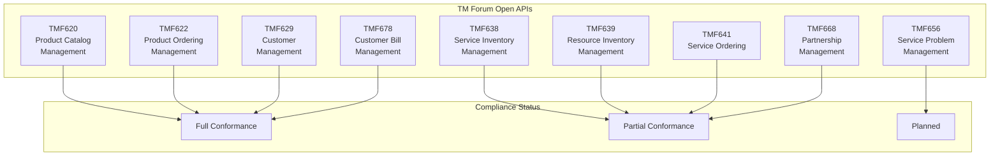
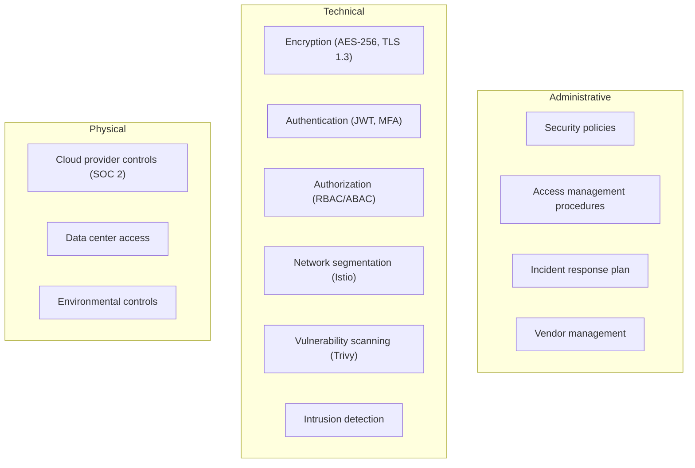
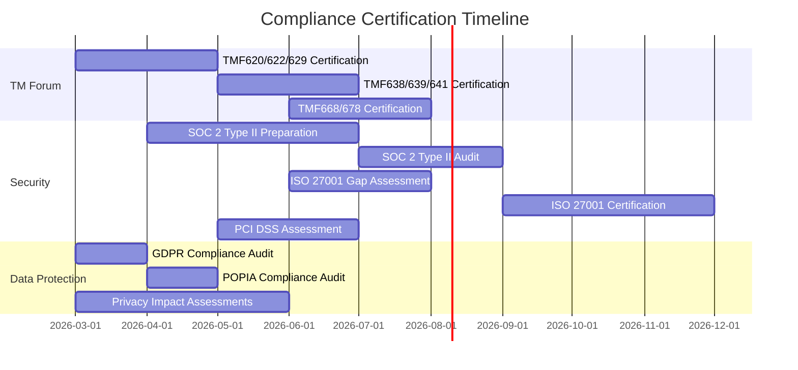

# Compliance and Regulatory Document -- ERP-BSS-OSS
> Version: 1.0 | Last Updated: 2026-02-23 | Status: Draft
> Classification: Internal | Author: AIDD System

---

## 1. Overview

This document defines the compliance posture of ERP-BSS-OSS against TM Forum standards, telecom regulations, data protection laws, and industry certifications.

---

## 2. TM Forum Open API Compliance

### 2.1 Implemented APIs

### 2.2 TMF Conformance Details

| TMF API | Version | Conformance Level | Test Status | Certification |
|---------|---------|------------------|------------|---------------|
| TMF620 | v4.1.0 | Level 2 (Mandatory + Optional) | 8/8 tests pass | Pending |
| TMF622 | v4.1.0 | Level 2 | 6/6 tests pass | Pending |
| TMF629 | v4.0.0 | Level 2 | 8/8 tests pass | Pending |
| TMF638 | v4.0.0 | Level 1 (Mandatory only) | 4/6 tests pass | In progress |
| TMF639 | v4.0.0 | Level 1 | 4/6 tests pass | In progress |
| TMF641 | v4.0.0 | Level 1 | 2/4 tests pass | In progress |
| TMF656 | v4.0.0 | Not started | 0/6 | Planned Q3 |
| TMF668 | v4.0.0 | Level 1 | 4/6 tests pass | In progress |
| TMF678 | v4.0.0 | Level 2 | 4/4 tests pass | Pending |

### 2.3 TM Forum Frameworx Alignment

| eTOM Process Area | BSS-OSS Module | Status |
|-------------------|---------------|--------|
| 1.1 Product Lifecycle Management | Product Catalog Service | Implemented |
| 1.3.1 Order Handling | Order Management Service | Implemented |
| 1.3.2 Problem Handling | Network Operations Service | Partial |
| 1.3.3 Customer QoS/SLA Management | SLA tracking | Partial |
| 1.4.1 Billing & Collection | Billing/Rating Service | Implemented |
| 1.4.2 Charging | Charging Engine | Implemented |
| 1.5.1 Customer Interface Management | Self-Care Portal | Implemented |
| 2.1 Service Management & Operations | Service Inventory | Partial |
| 3.1 Resource Management & Operations | Resource Inventory | Partial |

---

## 3. Telecom Regulatory Compliance

### 3.1 Number Portability

| Jurisdiction | Regulation | Requirement | Status |
|-------------|-----------|-------------|--------|
| Nigeria | NCC Regulations | Port within 48 hours | Implemented |
| South Africa | ICASA | Port within 2 business days | Implemented |
| Kenya | CA Kenya | Port within 3 business days | Implemented |
| EU (EECC) | Article 106 | Port within 1 working day | Implemented |
| USA | FCC | Simple port within 1 business day | Planned |

### 3.2 SIM Registration (KYC)

| Jurisdiction | Regulation | Requirements | Status |
|-------------|-----------|-------------|--------|
| Nigeria | NCC SIM Registration | National ID / NIN linkage | Implemented |
| Kenya | CA Kenya | National ID + biometric | Implemented |
| South Africa | RICA Act | Full name + ID + address | Implemented |
| India | TRAI / DoT | Aadhaar / passport + biometric | Planned |
| EU | eIDAS | Varies by member state | Framework ready |

### 3.3 Lawful Intercept

| Standard | Scope | Status |
|----------|-------|--------|
| ETSI LI (TS 101 671, TS 102 232) | EU lawful interception | Interface defined, implementation planned |
| CALEA | US Communications Assistance for Law Enforcement | Framework ready, implementation planned |
| TRAI LI | India lawful interception | Planned |

**Implementation approach:** Dedicated Lawful Intercept mediation function that provides a standardized interface to law enforcement agencies while maintaining subscriber privacy for non-targeted communications.

### 3.4 Emergency Services

| Jurisdiction | Standard | Requirement | Status |
|-------------|---------|-------------|--------|
| USA | E911 (FCC) | Caller location to PSAP | Framework ready |
| EU | E112 (EECC Art. 109) | Caller location + identification | Framework ready |
| Nigeria | 112/199 | Route to emergency services | Implemented |

### 3.5 Billing Accuracy

| Requirement | Standard | Target | Verification |
|------------|---------|--------|-------------|
| Charge accuracy | Regulatory (general) | 99.999% | CDR-to-bill reconciliation |
| Billing transparency | Consumer protection | Itemized bill | Invoice line items |
| Tariff publication | Regulatory | Published before effective | Product catalog with effective dates |
| Billing dispute resolution | Consumer protection | 30 days | Dispute workflow |

---

## 4. Data Protection Compliance

### 4.1 GDPR (EU)

| Article | Requirement | Implementation |
|---------|-------------|----------------|
| Art. 5 | Data minimization | Only collect necessary subscriber data |
| Art. 6 | Lawful basis | Contract performance for subscribers |
| Art. 7 | Consent | Explicit consent for marketing |
| Art. 13-14 | Transparency | Privacy notice at registration |
| Art. 15 | Right of access | Customer 360 data export |
| Art. 17 | Right to erasure | Soft delete with 30-day purge cycle |
| Art. 20 | Data portability | JSON/CSV export of subscriber data |
| Art. 25 | Privacy by design | PII encryption, data masking |
| Art. 30 | Records of processing | Audit logs in MongoDB |
| Art. 32 | Security measures | TLS 1.3, AES-256, mTLS |
| Art. 33 | Breach notification | Automated breach detection + 72-hour notification workflow |

### 4.2 Data Protection Implementation

```mermaid
graph TB
    subgraph "Data Protection Controls"
        ENCRYPT["Encryption"]
        MASK["PII Masking"]
        ACCESS["Access Control"]
        AUDIT["Audit Trail"]
        RETENTION["Data Retention"]
        ERASURE["Right to Erasure"]
    end

    ENCRYPT --> E1["At rest: AES-256"]
    ENCRYPT --> E2["In transit: TLS 1.3"]
    ENCRYPT --> E3["Database: Column-level encryption"]

    MASK --> M1["Logs: Phone number masked (***5678)"]
    MASK --> M2["API: PII fields redacted in error responses"]

    ACCESS --> A1["RBAC: Role-based"]
    ACCESS --> A2["ABAC: Attribute-based"]
    ACCESS --> A3["Row-Level Security: Tenant isolation"]

    AUDIT --> AU1["All CRUD operations logged"]
    AUDIT --> AU2["User, timestamp, before/after values"]
    AUDIT --> AU3["MongoDB audit collection"]

    RETENTION --> R1["CDRs: 7 years"]
    RETENTION --> R2["Invoices: 10 years"]
    RETENTION --> R3["Audit logs: 5 years"]
    RETENTION --> R4["PII: Until erasure request"]

    ERASURE --> ER1["Soft delete immediately"]
    ERASURE --> ER2["Hard purge after 30 days"]
    ERASURE --> ER3["Backup purge after 90 days"]
```

### 4.3 Other Data Protection Laws

| Law | Jurisdiction | Key Requirement | Status |
|-----|-------------|-----------------|--------|
| CCPA/CPRA | California, USA | Opt-out of data sale | Implemented (no data sale) |
| POPIA | South Africa | Processing limitation | Implemented |
| NDPR | Nigeria | Consent management | Implemented |
| PDPA | Singapore | Purpose limitation | Implemented |
| LGPD | Brazil | Legal basis for processing | Framework ready |

---

## 5. Security Compliance

### 5.1 Standards and Certifications

| Standard | Scope | Status | Target Date |
|----------|-------|--------|------------|
| SOC 2 Type II | Security, availability, confidentiality | In preparation | Q3 2026 |
| ISO 27001 | Information security management | Framework mapped | Q4 2026 |
| PCI DSS v4.0 | Payment card data security | Scoped (payment gateway) | Q3 2026 |
| GSMA NESAS | Network equipment security | Applicable to provisioning | Q4 2026 |

### 5.2 Security Controls Matrix

---

## 6. Audit and Reporting

### 6.1 Compliance Reports

| Report | Frequency | Audience | Content |
|--------|-----------|----------|---------|
| Billing Accuracy Report | Monthly | Regulator | CDR-to-bill reconciliation results |
| Data Breach Report | As needed (< 72 hrs) | DPA, affected subscribers | Breach details, impact, remediation |
| Privacy Impact Assessment | Per new feature | DPO | Data flow analysis, risk assessment |
| SLA Compliance Report | Monthly | Management, regulator | Uptime, latency, incident summary |
| Security Audit Report | Quarterly | CISO, auditors | Vulnerability findings, remediation status |
| TMF Conformance Report | Per certification | TM Forum | API conformance test results |

### 6.2 Audit Trail Requirements

All auditable actions are logged with:
- Timestamp (UTC, millisecond precision)
- User ID and role
- Tenant ID
- Action type (CREATE, READ, UPDATE, DELETE)
- Entity type and ID
- Before and after values (for UPDATE)
- Source IP address
- Request ID (correlation)

Audit logs are stored in MongoDB with 5-year retention and are immutable (append-only collection).

---

## 7. Compliance Roadmap

