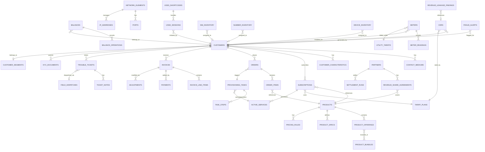
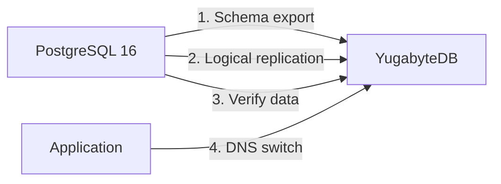

# Database Schema and ERD -- ERP-BSS-OSS
> Version: 1.0 | Last Updated: 2026-02-23 | Status: Draft
> Classification: Internal | Author: AIDD System

---

## 1. Database Overview

ERP-BSS-OSS uses a polyglot persistence strategy aligned with the data characteristics of each domain:

| Database | Role | Version | Use Case |
|----------|------|---------|----------|
| PostgreSQL 16 | OLTP primary store | 16-alpine | Customers, orders, billing, inventory |
| Redis 7 | Cache, sessions, rate limiting | 7-alpine | Balance cache, session store, rate limiter |
| MongoDB 7 | Documents, audit logs, alarms | 7 | Network alarms, dynamic config, audit trail |
| ClickHouse | OLAP analytics | Latest | CDR analytics, revenue rollups, churn indicators |
| Kafka | Event streaming | 3.6 | Domain events, CDR pipeline |

---

## 2. Master Entity Relationship Diagram



---

## 3. PostgreSQL Schema -- BSS Tables

### 3.1 Customer Management (TMF629)

```sql
-- Core customer table (TMF629 Party/Customer)
CREATE TABLE customers (
    id UUID PRIMARY KEY DEFAULT uuid_generate_v4(),
    href VARCHAR(255),
    name VARCHAR(255) NOT NULL,
    status VARCHAR(50) DEFAULT 'active',           -- active, suspended, terminated
    status_reason TEXT,
    customer_type VARCHAR(50),                      -- individual, business
    engaged_party_id VARCHAR(255),
    engaged_party_href VARCHAR(255),
    account_id VARCHAR(255),
    account_href VARCHAR(255),
    segment_id UUID REFERENCES customer_segments(id),
    credit_score INTEGER,
    valid_for_start_date_time TIMESTAMP,
    valid_for_end_date_time TIMESTAMP,
    created_at TIMESTAMP DEFAULT CURRENT_TIMESTAMP,
    updated_at TIMESTAMP DEFAULT CURRENT_TIMESTAMP,
    deleted_at TIMESTAMP
);
CREATE INDEX idx_customers_status ON customers(status);
CREATE INDEX idx_customers_type ON customers(customer_type);
CREATE INDEX idx_customers_segment ON customers(segment_id);

-- Contact mediums (email, phone, postal)
CREATE TABLE contact_mediums (
    id UUID PRIMARY KEY DEFAULT uuid_generate_v4(),
    customer_id UUID REFERENCES customers(id) ON DELETE CASCADE,
    medium_type VARCHAR(50) NOT NULL,               -- email, phone, postal, social
    preferred BOOLEAN DEFAULT false,
    characteristic_email_address VARCHAR(255),
    characteristic_phone_number VARCHAR(50),
    characteristic_street VARCHAR(255),
    characteristic_city VARCHAR(100),
    characteristic_state_or_province VARCHAR(100),
    characteristic_post_code VARCHAR(20),
    characteristic_country VARCHAR(100),
    valid_for_start_date_time TIMESTAMP,
    valid_for_end_date_time TIMESTAMP,
    created_at TIMESTAMP DEFAULT CURRENT_TIMESTAMP,
    updated_at TIMESTAMP DEFAULT CURRENT_TIMESTAMP
);
CREATE INDEX idx_contact_mediums_customer ON contact_mediums(customer_id);

-- Customer characteristics (extensible key-value)
CREATE TABLE customer_characteristics (
    id UUID PRIMARY KEY DEFAULT uuid_generate_v4(),
    customer_id UUID REFERENCES customers(id) ON DELETE CASCADE,
    name VARCHAR(255) NOT NULL,
    value TEXT,
    value_type VARCHAR(50),
    created_at TIMESTAMP DEFAULT CURRENT_TIMESTAMP,
    updated_at TIMESTAMP DEFAULT CURRENT_TIMESTAMP
);

-- Customer segments
CREATE TABLE customer_segments (
    id UUID PRIMARY KEY DEFAULT uuid_generate_v4(),
    name VARCHAR(100) NOT NULL,                     -- bronze, silver, gold, platinum
    description TEXT,
    min_arpu NUMERIC(10,2),
    min_tenure_months INTEGER,
    benefits JSONB,
    created_at TIMESTAMP DEFAULT CURRENT_TIMESTAMP
);

-- KYC documents
CREATE TABLE kyc_documents (
    id UUID PRIMARY KEY DEFAULT uuid_generate_v4(),
    customer_id UUID REFERENCES customers(id) ON DELETE CASCADE,
    document_type VARCHAR(50) NOT NULL,             -- national_id, passport, drivers_license, utility_bill
    document_number VARCHAR(100),
    issuing_country VARCHAR(3),
    expiry_date DATE,
    verification_status VARCHAR(50) DEFAULT 'pending', -- pending, verified, rejected, expired
    verified_by VARCHAR(255),
    verified_at TIMESTAMP,
    document_url TEXT,
    created_at TIMESTAMP DEFAULT CURRENT_TIMESTAMP
);
```

### 3.2 Product Catalog (TMF620)

```sql
CREATE TABLE products (
    id UUID PRIMARY KEY DEFAULT uuid_generate_v4(),
    href VARCHAR(255),
    name VARCHAR(255) NOT NULL,
    description TEXT,
    version VARCHAR(20) DEFAULT '1.0.0',
    category VARCHAR(50) NOT NULL,                  -- mobile, broadband, voice, data, vas, bundle
    status VARCHAR(50) DEFAULT 'draft',             -- draft, active, retired
    product_type VARCHAR(50),                       -- simple, bundle, add_on
    valid_for_start TIMESTAMP,
    valid_for_end TIMESTAMP,
    created_at TIMESTAMP DEFAULT CURRENT_TIMESTAMP,
    updated_at TIMESTAMP DEFAULT CURRENT_TIMESTAMP
);

CREATE TABLE pricing_rules (
    id UUID PRIMARY KEY DEFAULT uuid_generate_v4(),
    product_id UUID REFERENCES products(id) ON DELETE CASCADE,
    pricing_type VARCHAR(50) NOT NULL,              -- one_time, recurring, usage, tiered
    amount NUMERIC(12,4) NOT NULL,
    currency VARCHAR(3) DEFAULT 'USD',
    recurring_period VARCHAR(20),                   -- daily, weekly, monthly, quarterly, yearly
    unit_of_measure VARCHAR(50),                    -- minute, mb, sms, session
    tier_min NUMERIC(12,4),
    tier_max NUMERIC(12,4),
    created_at TIMESTAMP DEFAULT CURRENT_TIMESTAMP
);

CREATE TABLE product_bundles (
    id UUID PRIMARY KEY DEFAULT uuid_generate_v4(),
    bundle_product_id UUID REFERENCES products(id),
    component_product_id UUID REFERENCES products(id),
    quantity INTEGER DEFAULT 1,
    discount_percent NUMERIC(5,2) DEFAULT 0
);
```

### 3.3 Order Management (TMF622)

```sql
CREATE TABLE orders (
    id UUID PRIMARY KEY DEFAULT uuid_generate_v4(),
    href VARCHAR(255),
    order_number VARCHAR(30) NOT NULL UNIQUE,       -- ORD-YYYYMMDD-XXXXXX
    customer_id UUID REFERENCES customers(id),
    status VARCHAR(50) DEFAULT 'acknowledged',      -- acknowledged, in_progress, held, partial, completed, failed, cancelled
    priority VARCHAR(20) DEFAULT 'normal',          -- low, normal, high, critical
    order_date TIMESTAMP DEFAULT CURRENT_TIMESTAMP,
    requested_completion_date TIMESTAMP,
    expected_completion_date TIMESTAMP,
    completion_date TIMESTAMP,
    cancellation_reason TEXT,
    external_id VARCHAR(255),
    channel VARCHAR(50),                            -- web, ussd, agent, api
    created_at TIMESTAMP DEFAULT CURRENT_TIMESTAMP,
    updated_at TIMESTAMP DEFAULT CURRENT_TIMESTAMP
);

CREATE TABLE order_items (
    id UUID PRIMARY KEY DEFAULT uuid_generate_v4(),
    order_id UUID REFERENCES orders(id) ON DELETE CASCADE,
    product_id UUID REFERENCES products(id),
    action VARCHAR(50) NOT NULL,                    -- add, modify, delete, no_change
    quantity INTEGER DEFAULT 1,
    unit_price NUMERIC(12,4),
    status VARCHAR(50) DEFAULT 'acknowledged',
    created_at TIMESTAMP DEFAULT CURRENT_TIMESTAMP
);
```

### 3.4 Billing and Rating (TMF678)

```sql
CREATE TABLE balances (
    subscriber_id VARCHAR(255) PRIMARY KEY,
    balance_cents BIGINT NOT NULL DEFAULT 0,
    currency VARCHAR(3) DEFAULT 'USD',
    credit_limit_cents BIGINT DEFAULT 0,
    auto_recharge_enabled BOOLEAN DEFAULT false,
    auto_recharge_threshold_cents BIGINT,
    auto_recharge_amount_cents BIGINT,
    last_updated TIMESTAMP DEFAULT CURRENT_TIMESTAMP,
    created_at TIMESTAMP DEFAULT CURRENT_TIMESTAMP
);

CREATE TABLE balance_operations (
    id UUID PRIMARY KEY DEFAULT uuid_generate_v4(),
    subscriber_id VARCHAR(255) NOT NULL,
    amount_cents BIGINT NOT NULL,
    operation_type VARCHAR(50) NOT NULL,             -- debit, credit, reserve, commit, rollback, top_up, auto_recharge
    description TEXT,
    reference_id VARCHAR(255),
    channel VARCHAR(50),                             -- ussd, web, voucher, bank, mobile_money
    created_at TIMESTAMP DEFAULT CURRENT_TIMESTAMP
);

CREATE TABLE invoices (
    id UUID PRIMARY KEY DEFAULT uuid_generate_v4(),
    customer_id UUID REFERENCES customers(id),
    invoice_number VARCHAR(30) NOT NULL UNIQUE,
    billing_period_start DATE NOT NULL,
    billing_period_end DATE NOT NULL,
    subtotal_cents BIGINT NOT NULL,
    tax_cents BIGINT NOT NULL,
    total_cents BIGINT NOT NULL,
    currency VARCHAR(3) DEFAULT 'USD',
    status VARCHAR(50) DEFAULT 'draft',              -- draft, issued, paid, overdue, disputed, void
    due_date DATE NOT NULL,
    issued_at TIMESTAMP,
    paid_at TIMESTAMP,
    created_at TIMESTAMP DEFAULT CURRENT_TIMESTAMP
);

CREATE TABLE invoice_line_items (
    id UUID PRIMARY KEY DEFAULT uuid_generate_v4(),
    invoice_id UUID REFERENCES invoices(id) ON DELETE CASCADE,
    description TEXT NOT NULL,
    charge_type VARCHAR(50),                         -- subscription, usage, one_time, adjustment, tax
    quantity NUMERIC(12,4),
    unit_price_cents BIGINT,
    total_cents BIGINT NOT NULL,
    product_id UUID,
    service_type VARCHAR(50),
    created_at TIMESTAMP DEFAULT CURRENT_TIMESTAMP
);

CREATE TABLE payments (
    id UUID PRIMARY KEY DEFAULT uuid_generate_v4(),
    invoice_id UUID REFERENCES invoices(id),
    customer_id UUID REFERENCES customers(id),
    amount_cents BIGINT NOT NULL,
    currency VARCHAR(3) DEFAULT 'USD',
    payment_method VARCHAR(50),                      -- card, bank_transfer, mobile_money, voucher
    payment_reference VARCHAR(255),
    gateway VARCHAR(50),                             -- paystack, flutterwave, stripe
    status VARCHAR(50) DEFAULT 'pending',            -- pending, completed, failed, refunded
    created_at TIMESTAMP DEFAULT CURRENT_TIMESTAMP
);

CREATE TABLE dunning_actions (
    id UUID PRIMARY KEY DEFAULT uuid_generate_v4(),
    customer_id UUID REFERENCES customers(id),
    invoice_id UUID REFERENCES invoices(id),
    dunning_level INTEGER NOT NULL,                  -- 1=reminder, 2=warning, 3=restrict, 4=suspend, 5=terminate
    action_type VARCHAR(50) NOT NULL,                -- sms, email, bar_outgoing, suspend, terminate
    executed_at TIMESTAMP DEFAULT CURRENT_TIMESTAMP,
    response TEXT
);

CREATE TABLE disputes (
    id UUID PRIMARY KEY DEFAULT uuid_generate_v4(),
    customer_id UUID REFERENCES customers(id),
    invoice_id UUID REFERENCES invoices(id),
    dispute_reason TEXT NOT NULL,
    disputed_amount_cents BIGINT NOT NULL,
    status VARCHAR(50) DEFAULT 'open',               -- open, investigating, resolved, rejected
    resolution_notes TEXT,
    credit_issued_cents BIGINT DEFAULT 0,
    created_at TIMESTAMP DEFAULT CURRENT_TIMESTAMP,
    resolved_at TIMESTAMP
);

CREATE TABLE cdrs (
    id UUID PRIMARY KEY DEFAULT uuid_generate_v4(),
    subscriber_id VARCHAR(255) NOT NULL,
    session_id VARCHAR(255),
    service_type VARCHAR(50) NOT NULL,               -- voice, data, sms, mms, content
    usage_amount NUMERIC(20,6) NOT NULL,
    charge_amount_cents BIGINT NOT NULL,
    currency VARCHAR(3) DEFAULT 'USD',
    start_time TIMESTAMP NOT NULL,
    end_time TIMESTAMP,
    duration_seconds INTEGER,
    destination VARCHAR(255),
    origin VARCHAR(255),
    a_party VARCHAR(50),
    b_party VARCHAR(50),
    cell_id VARCHAR(50),
    rating_details JSONB,
    created_at TIMESTAMP DEFAULT CURRENT_TIMESTAMP
);
CREATE INDEX idx_cdrs_subscriber ON cdrs(subscriber_id);
CREATE INDEX idx_cdrs_start_time ON cdrs(start_time);

CREATE TABLE tariff_plans (
    id UUID PRIMARY KEY DEFAULT uuid_generate_v4(),
    name VARCHAR(255) NOT NULL,
    description TEXT,
    service_type VARCHAR(50) NOT NULL,
    rate_per_unit NUMERIC(10,4) NOT NULL,
    currency VARCHAR(3) DEFAULT 'USD',
    valid_from TIMESTAMP NOT NULL,
    valid_to TIMESTAMP,
    is_active BOOLEAN DEFAULT true,
    created_at TIMESTAMP DEFAULT CURRENT_TIMESTAMP,
    updated_at TIMESTAMP DEFAULT CURRENT_TIMESTAMP
);
```

### 3.5 Resource Inventory (TMF639)

```sql
CREATE TABLE network_elements (
    id UUID PRIMARY KEY DEFAULT uuid_generate_v4(),
    name VARCHAR(255) NOT NULL,
    element_type VARCHAR(50) NOT NULL,               -- router, switch, bts, nodeb, enodeb, gnodeb, olt
    vendor VARCHAR(100),
    model VARCHAR(100),
    firmware_version VARCHAR(50),
    management_ip INET,
    location VARCHAR(255),
    status VARCHAR(50) DEFAULT 'active',             -- active, maintenance, decommissioned
    created_at TIMESTAMP DEFAULT CURRENT_TIMESTAMP
);

CREATE TABLE sim_inventory (
    id UUID PRIMARY KEY DEFAULT uuid_generate_v4(),
    iccid VARCHAR(22) NOT NULL UNIQUE,
    imsi VARCHAR(15) NOT NULL UNIQUE,
    msisdn VARCHAR(15),
    puk1 VARCHAR(8),
    puk2 VARCHAR(8),
    status VARCHAR(50) DEFAULT 'available',          -- available, assigned, active, suspended, blocked, recycled
    customer_id UUID REFERENCES customers(id),
    activated_at TIMESTAMP,
    sim_type VARCHAR(20) DEFAULT 'physical',         -- physical, esim
    esim_profile_id VARCHAR(255),
    created_at TIMESTAMP DEFAULT CURRENT_TIMESTAMP
);

CREATE TABLE number_inventory (
    id UUID PRIMARY KEY DEFAULT uuid_generate_v4(),
    msisdn VARCHAR(15) NOT NULL UNIQUE,
    number_type VARCHAR(50),                         -- mobile, fixed, toll_free, premium
    status VARCHAR(50) DEFAULT 'available',          -- available, reserved, assigned, ported_out, quarantine
    customer_id UUID REFERENCES customers(id),
    reserved_until TIMESTAMP,
    quarantine_until TIMESTAMP,
    created_at TIMESTAMP DEFAULT CURRENT_TIMESTAMP
);

CREATE TABLE ip_addresses (
    id UUID PRIMARY KEY DEFAULT uuid_generate_v4(),
    address INET NOT NULL,
    subnet_mask INET,
    pool_name VARCHAR(100),
    address_type VARCHAR(10),                        -- ipv4, ipv6
    status VARCHAR(50) DEFAULT 'available',          -- available, assigned, reserved
    assigned_to_element UUID REFERENCES network_elements(id),
    created_at TIMESTAMP DEFAULT CURRENT_TIMESTAMP
);
```

### 3.6 Partner Management (TMF668)

```sql
CREATE TABLE partners (
    id UUID PRIMARY KEY DEFAULT uuid_generate_v4(),
    name VARCHAR(255) NOT NULL,
    partner_type VARCHAR(50) NOT NULL,               -- mvno, mvne, content_provider, interconnect, roaming
    status VARCHAR(50) DEFAULT 'active',
    contact_email VARCHAR(255),
    contact_phone VARCHAR(50),
    kyc_status VARCHAR(50) DEFAULT 'pending',
    created_at TIMESTAMP DEFAULT CURRENT_TIMESTAMP
);

CREATE TABLE revenue_share_agreements (
    id UUID PRIMARY KEY DEFAULT uuid_generate_v4(),
    partner_id UUID REFERENCES partners(id),
    product_id UUID REFERENCES products(id),
    share_model VARCHAR(50) NOT NULL,                -- fixed_percent, tiered, hybrid, minimum_guarantee
    share_percentage NUMERIC(5,2),
    minimum_guarantee_cents BIGINT,
    effective_from DATE NOT NULL,
    effective_to DATE,
    status VARCHAR(50) DEFAULT 'active',
    created_at TIMESTAMP DEFAULT CURRENT_TIMESTAMP
);

CREATE TABLE settlement_runs (
    id UUID PRIMARY KEY DEFAULT uuid_generate_v4(),
    partner_id UUID REFERENCES partners(id),
    agreement_id UUID REFERENCES revenue_share_agreements(id),
    period_start DATE NOT NULL,
    period_end DATE NOT NULL,
    gross_revenue_cents BIGINT NOT NULL,
    partner_share_cents BIGINT NOT NULL,
    operator_share_cents BIGINT NOT NULL,
    status VARCHAR(50) DEFAULT 'calculated',         -- calculated, approved, paid, disputed
    created_at TIMESTAMP DEFAULT CURRENT_TIMESTAMP
);
```

### 3.7 Utilities -- Meter Management

```sql
CREATE TABLE meters (
    id UUID PRIMARY KEY DEFAULT uuid_generate_v4(),
    meter_number VARCHAR(50) NOT NULL UNIQUE,
    meter_type VARCHAR(50) NOT NULL,                 -- electricity, water, gas
    meter_class VARCHAR(50),                         -- smart, prepaid, conventional
    customer_id UUID REFERENCES customers(id),
    location_address TEXT,
    location_gps POINT,
    manufacturer VARCHAR(100),
    model VARCHAR(100),
    firmware_version VARCHAR(50),
    communication_protocol VARCHAR(50),              -- dlms_cosem, modbus, lorawan, nb_iot
    status VARCHAR(50) DEFAULT 'active',
    installed_at TIMESTAMP,
    last_reading_at TIMESTAMP,
    created_at TIMESTAMP DEFAULT CURRENT_TIMESTAMP
);

CREATE TABLE meter_readings (
    id UUID PRIMARY KEY DEFAULT uuid_generate_v4(),
    meter_id UUID REFERENCES meters(id),
    reading_value NUMERIC(14,4) NOT NULL,
    reading_unit VARCHAR(20) NOT NULL,               -- kwh, m3, therms
    reading_type VARCHAR(50),                        -- scheduled, on_demand, tamper_alert
    reading_timestamp TIMESTAMP NOT NULL,
    quality_flag VARCHAR(20) DEFAULT 'valid',        -- valid, estimated, suspect
    created_at TIMESTAMP DEFAULT CURRENT_TIMESTAMP
);

CREATE TABLE utility_tariffs (
    id UUID PRIMARY KEY DEFAULT uuid_generate_v4(),
    name VARCHAR(255) NOT NULL,
    tariff_type VARCHAR(50) NOT NULL,                -- flat, time_of_use, tiered, demand
    utility_type VARCHAR(50) NOT NULL,               -- electricity, water, gas
    rate_per_unit NUMERIC(10,6) NOT NULL,
    currency VARCHAR(3) DEFAULT 'USD',
    time_of_use_schedule JSONB,                      -- peak/off-peak/shoulder periods
    tier_brackets JSONB,                             -- consumption tiers
    demand_charge_per_kw NUMERIC(10,4),
    effective_from DATE NOT NULL,
    effective_to DATE,
    created_at TIMESTAMP DEFAULT CURRENT_TIMESTAMP
);

CREATE TABLE sts_tokens (
    id UUID PRIMARY KEY DEFAULT uuid_generate_v4(),
    meter_id UUID REFERENCES meters(id),
    customer_id UUID REFERENCES customers(id),
    token_value VARCHAR(20) NOT NULL,                -- 20-digit IEC 62055-41 token
    kwh_amount NUMERIC(10,4) NOT NULL,
    amount_paid_cents BIGINT NOT NULL,
    currency VARCHAR(3) DEFAULT 'USD',
    status VARCHAR(50) DEFAULT 'active',             -- active, used, expired
    generated_at TIMESTAMP DEFAULT CURRENT_TIMESTAMP,
    used_at TIMESTAMP
);
```

### 3.8 USSD/IVR and Trouble Tickets

```sql
CREATE TABLE ussd_shortcodes (
    id UUID PRIMARY KEY DEFAULT uuid_generate_v4(),
    shortcode VARCHAR(10) NOT NULL UNIQUE,           -- *123#, *888#
    description TEXT,
    service_name VARCHAR(100),
    is_active BOOLEAN DEFAULT true,
    created_at TIMESTAMP DEFAULT CURRENT_TIMESTAMP
);

CREATE TABLE ussd_sessions (
    id UUID PRIMARY KEY DEFAULT uuid_generate_v4(),
    session_id VARCHAR(255) NOT NULL,
    msisdn VARCHAR(15) NOT NULL,
    shortcode VARCHAR(10),
    current_menu VARCHAR(100),
    session_data JSONB,
    status VARCHAR(50) DEFAULT 'active',             -- active, completed, timeout
    started_at TIMESTAMP DEFAULT CURRENT_TIMESTAMP,
    ended_at TIMESTAMP
);

CREATE TABLE trouble_tickets (
    id UUID PRIMARY KEY DEFAULT uuid_generate_v4(),
    ticket_number VARCHAR(20) NOT NULL UNIQUE,
    customer_id UUID REFERENCES customers(id),
    category VARCHAR(50) NOT NULL,                   -- billing, network, service, general
    priority VARCHAR(20) DEFAULT 'medium',           -- low, medium, high, critical
    status VARCHAR(50) DEFAULT 'open',               -- open, in_progress, resolved, closed
    subject VARCHAR(255) NOT NULL,
    description TEXT,
    assigned_to VARCHAR(255),
    sla_due_at TIMESTAMP,
    resolved_at TIMESTAMP,
    created_at TIMESTAMP DEFAULT CURRENT_TIMESTAMP
);

CREATE TABLE fraud_alerts (
    id UUID PRIMARY KEY DEFAULT uuid_generate_v4(),
    customer_id UUID REFERENCES customers(id),
    alert_type VARCHAR(50) NOT NULL,                 -- sim_box, irsf, wangiri, subscription_fraud
    severity VARCHAR(20) NOT NULL,                   -- low, medium, high, critical
    description TEXT,
    evidence JSONB,
    status VARCHAR(50) DEFAULT 'open',               -- open, investigating, confirmed, dismissed
    ml_confidence NUMERIC(5,4),
    created_at TIMESTAMP DEFAULT CURRENT_TIMESTAMP
);
```

---

## 4. ClickHouse Analytics Schema

| Table | Engine | Partition | Order By | Purpose |
|-------|--------|-----------|----------|---------|
| `cdr_analytics` | MergeTree | toYYYYMM(call_date) | (call_date, subscriber_id, service_type) | CDR OLAP queries |
| `revenue_daily` | MergeTree | None | (date, revenue_type) | Daily revenue aggregation |
| `customer_metrics` | MergeTree | None | (date, customer_id) | Customer behavior metrics |
| `billing_summary` | MergeTree | None | (billing_month, customer_id) | Monthly billing rollup |
| `churn_indicators` | MergeTree | None | (analysis_date, churn_risk_score DESC) | Churn prediction |
| `network_usage_summary` | MergeTree | toYYYYMM(usage_date) | (usage_date, service_type) | Network usage |
| `topup_analytics` | MergeTree | toYYYYMM(topup_date) | (topup_date, subscriber_id) | Top-up patterns |
| `fraud_detection_features` | MergeTree | toYYYYMM(event_date) | (event_date, subscriber_id) | ML feature store |

---

## 5. Redis Key Patterns

| Key Pattern | Type | TTL | Purpose |
|-------------|------|-----|---------|
| `balance:{subscriber_id}` | JSON | 60s | Cached subscriber balance |
| `reservation:{subscriber_id}:{id}` | JSON | 300s | Balance reservation |
| `session:{session_id}` | JSON | 3600s | Active charging session |
| `rate:{service_type}:{destination}` | JSON | 300s | Cached tariff rate |
| `customer:{id}` | JSON | 3600s | Cached customer record |
| `ratelimit:{client_id}:{endpoint}` | Counter | 60s | API rate limit |
| `ussd:{session_id}` | JSON | 180s | USSD session state |
| `lock:balance:{subscriber_id}` | String | 10s | Distributed lock for balance ops |

---

## 6. Data Migration Strategy

### 6.1 PostgreSQL to YugabyteDB



### 6.2 Sharding Strategy

| Table | Shard Key | Strategy |
|-------|-----------|----------|
| customers | id (UUID) | Hash partitioning |
| balances | subscriber_id | Hash partitioning |
| cdrs | subscriber_id + start_time | Range partitioning |
| orders | customer_id | Hash partitioning |
| invoices | customer_id | Hash partitioning |
| sim_inventory | iccid | Hash partitioning |
