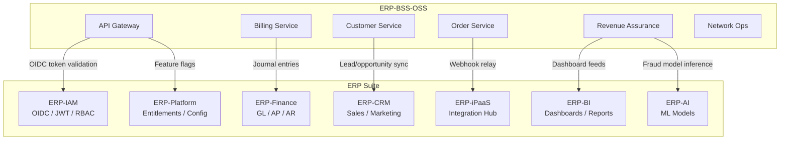
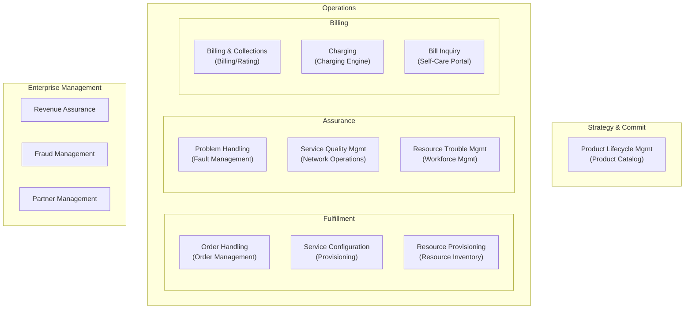
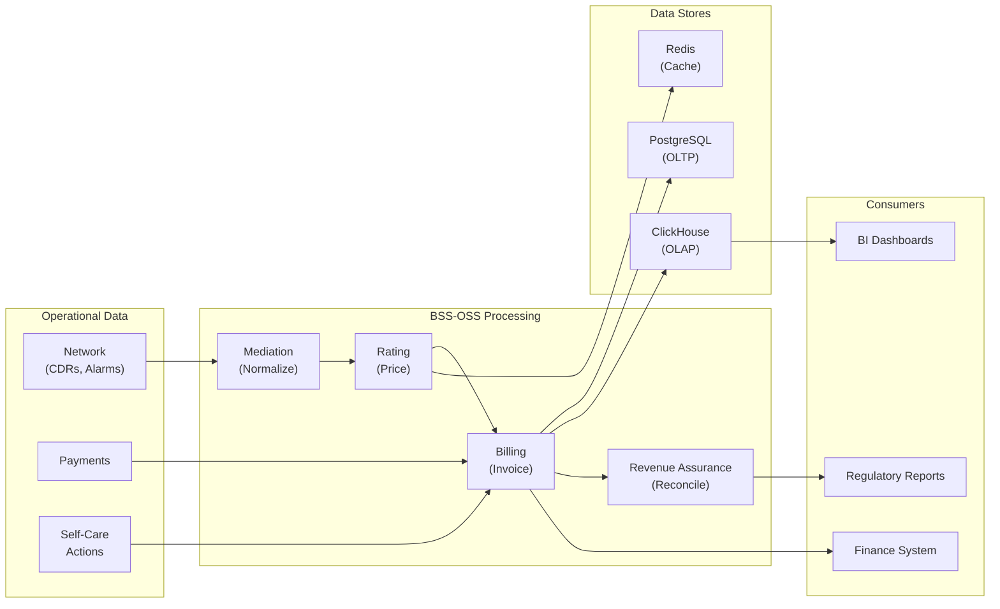
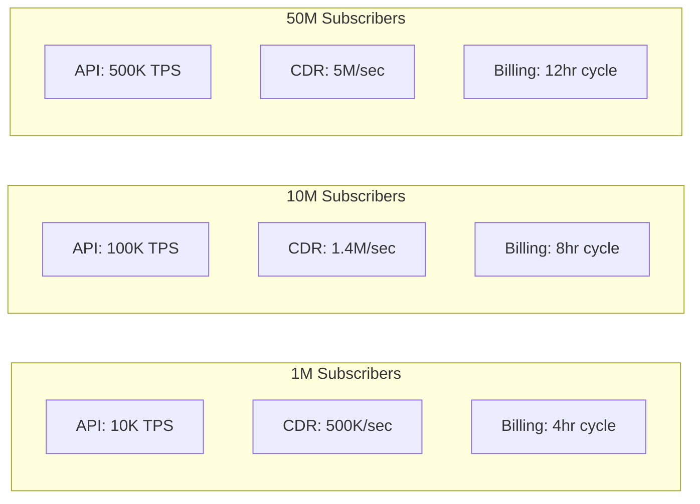

# Enterprise Architecture -- ERP-BSS-OSS
> Version: 1.0 | Last Updated: 2026-02-23 | Status: Draft
> Classification: Internal | Author: AIDD System

---

## 1. Enterprise Context

ERP-BSS-OSS operates as a module within the BillyRonks Global Limited ERP suite. It integrates with ERP-IAM for identity management, ERP-Finance for general ledger entries, ERP-CRM for sales pipeline enrichment, ERP-BI for analytics dashboards, and ERP-AI for machine learning model serving.

---

## 2. Enterprise Integration Map

---

## 3. eTOM Process Alignment

The platform maps to TM Forum eTOM Level 2 processes:

---

## 4. Integration Patterns

### 4.1 Synchronous (Request/Response)

| Integration | Protocol | Pattern | SLA |
|------------|----------|---------|-----|
| ERP-IAM token validation | REST/OIDC | Gateway filter | < 5 ms (cached) |
| Payment gateway (Paystack) | REST + webhook | Request/callback | < 3 sec |
| Tax engine (Avalara) | REST | Request/response | < 500 ms |
| Number portability (NPC) | SOAP/REST | Request/response | < 10 sec |

### 4.2 Asynchronous (Event-Driven)

| Integration | Protocol | Pattern | Topics |
|------------|----------|---------|--------|
| BSS -> ERP-Finance | Kafka | Publish/subscribe | `erp.bss_oss.billing-rating.created` |
| BSS -> ERP-CRM | Kafka | Publish/subscribe | `erp.bss_oss.customer-management.created` |
| BSS -> ERP-BI | Kafka | Publish/subscribe | All `erp.bss_oss.*` topics |
| BSS -> ERP-AI | Kafka + gRPC | Publish + inference | `erp.bss_oss.revenue-assurance.*` |
| Network -> BSS | DIAMETER/RADIUS | Stream | CDR events |

### 4.3 File-Based

| Integration | Format | Protocol | Frequency |
|------------|--------|----------|-----------|
| Roaming (TAP/RAP) | ASN.1 | SFTP | Daily |
| Bank reconciliation | CSV/ISO 20022 | SFTP | Daily |
| Regulatory reporting | XML | HTTPS upload | Monthly |
| Meter readings (AMI) | DLMS/COSEM | MQTT/HTTPS | Every 15 min |

---

## 5. Data Flow Architecture

---

## 6. Governance Model

### 6.1 API Governance

- All APIs must conform to TM Forum Open API specifications
- API versioning: URI path (`/v1/`, `/v2/`)
- Breaking changes require major version bump
- Deprecation period: minimum 6 months

### 6.2 Data Governance

- PII fields encrypted at column level
- Data retention: CDRs (7 years), invoices (10 years), audit logs (5 years)
- Right-to-erasure: soft delete with 30-day purge cycle
- Data classification: Public, Internal, Confidential, Restricted

### 6.3 Service Governance

- Each service owns its database schema (database-per-service)
- No direct database access across service boundaries
- Inter-service communication via API or events only
- Service SLOs: P99 < 100ms, error rate < 0.1%, availability > 99.9%

---

## 7. Capacity Planning

### 7.1 Subscriber Tiers

| Tier | Subscribers | K8s Nodes | PostgreSQL | Redis | Kafka |
|------|------------|-----------|-----------|-------|-------|
| Starter | 1K - 50K | 3 | 1 primary + 1 replica | 1 node | 3 brokers |
| Growth | 50K - 500K | 6 | 1 primary + 2 replicas | 3 nodes | 3 brokers |
| Scale | 500K - 5M | 15 | 3 primary (sharded) + 6 replicas | 6 nodes | 6 brokers |
| Enterprise | 5M - 50M | 50+ | YugabyteDB 9+ nodes | 12 nodes | 12 brokers |

### 7.2 Throughput Projections

---

## 8. Disaster Recovery

| Component | Strategy | RTO | RPO |
|-----------|----------|-----|-----|
| Application services | Multi-PoP active-active | 0 | 0 |
| PostgreSQL | Streaming replication + WAL archiving | 5 min | 30 sec |
| Redis | AOF + RDB snapshots | 1 min | 10 sec |
| ClickHouse | Partition backups to S3 | 30 min | 1 hour |
| Kafka | Multi-broker replication (RF=3) | 0 | 0 |
| Configuration | GitOps (Terraform + Helm) | 15 min | 0 |
