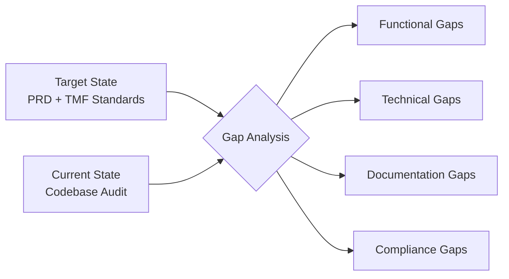
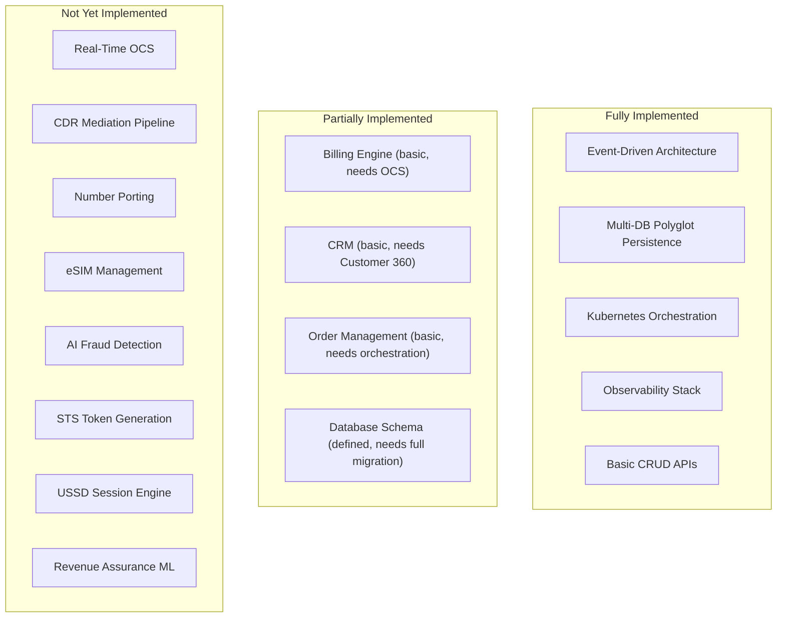
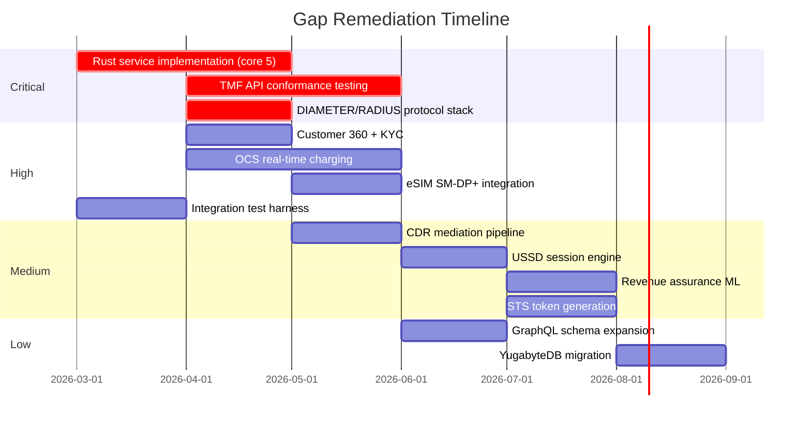

# Gap Analysis -- ERP-BSS-OSS
> Version: 1.0 | Last Updated: 2026-02-23 | Status: Draft
> Classification: Internal | Author: AIDD System

---

## 1. Purpose

This document identifies functional, technical, and documentation gaps in the ERP-BSS-OSS module by comparing the current implementation against the target architecture defined in the PRD and against capabilities of incumbent vendors (Amdocs, Netcracker, Oracle Communications, Ericsson BSS, CSG).

---

## 2. Assessment Methodology

Each gap is rated on a severity scale:

| Severity | Definition |
|----------|-----------|
| **Critical** | Blocks production deployment or regulatory compliance |
| **High** | Significant functionality missing; workaround possible |
| **Medium** | Feature incomplete but core path works |
| **Low** | Enhancement; not blocking |

---

## 3. Functional Gap Analysis

### 3.1 Service Implementation Status

| Service | Target | Current State | Gap Severity |
|---------|--------|---------------|-------------|
| Product Catalog (TMF620) | Full Rust impl with versioning | Go stub (health + CRUD scaffold) | **Critical** |
| Customer Management (TMF629) | KYC, Customer 360, segmentation | Go stub (health + CRUD scaffold) | **Critical** |
| Order Management (TMF622) | State machine, orchestration, fallout | Go stub (health + CRUD scaffold) | **Critical** |
| Billing/Rating (TMF678) | OCS, batch rating, convergent billing | Go stub (health + CRUD scaffold) | **Critical** |
| Mediation | CDR collection, normalization, aggregation | Go stub (health + CRUD scaffold) | **Critical** |
| Provisioning (TMF641) | SIM swap, number porting, eSIM | Go stub (health + CRUD scaffold) | **High** |
| Resource Inventory (TMF639) | Network elements, IPAM, SIM/number inventory | Go stub (health + CRUD scaffold) | **High** |
| Service Inventory (TMF638) | Active services, dependencies, health | Go stub (health + CRUD scaffold) | **High** |
| Partner Management (TMF668) | MVNO, revenue sharing, settlement | Go stub (health + CRUD scaffold) | **High** |
| Revenue Assurance | AI leakage detection, fraud detection | Go stub (health + CRUD scaffold) | **Medium** |
| Self-Care Portal | Usage dashboard, plan management | Go stub (health + CRUD scaffold) | **Medium** |
| Network Operations | Fault mgmt, performance, SLA | Go stub (health + CRUD scaffold) | **Medium** |
| USSD/IVR Gateway | Session management, shortcode routing | Go stub (health + CRUD scaffold) | **Medium** |
| Meter Management | Smart meter, AMI | Go stub (health + CRUD scaffold) | **Medium** |
| Tariff Service | Time-of-use, STS tokens | Go stub (health + CRUD scaffold) | **Medium** |

### 3.2 Core Rust Crates Status

| Crate | Target | Current State | Gap |
|-------|--------|---------------|-----|
| bss-core | DB, cache, messaging abstractions | Implemented | Low -- needs YugabyteDB migration |
| bss-api | REST API with Axum | Implemented | Low -- needs GraphQL layer |
| bss-billing | Billing engine, rating, invoicing | Implemented (basic) | High -- needs OCS, convergent |
| bss-crm | Contact + lead management | Implemented (basic) | High -- needs Customer 360 |
| bss-ordering | Order state machine | Implemented (basic) | Medium -- needs orchestration |
| bss-inventory | Resource tracking | Implemented (basic) | Medium -- needs TMF639 |
| bss-analytics | ClickHouse analytics | Implemented (basic) | Medium |
| bss-integration | External connectors | Implemented (basic) | Medium |
| bss-ddd | Domain-driven design patterns | Implemented | Low |

### 3.3 Feature Gaps vs Incumbent Vendors

---

## 4. Technical Gap Analysis

| Area | Target | Current | Gap | Severity |
|------|--------|---------|-----|----------|
| **Language consistency** | Rust for all services | Go stubs for 16 services; Rust for 9 crates | Need Rust reimplementation | High |
| **GraphQL API** | Full GraphQL schema for all entities | Basic schema (users, organizations, projects) | Need telecom entity schema | High |
| **Database migrations** | Versioned migrations (sqlx migrate) | Manual SQL scripts | Need automated migration pipeline | Medium |
| **TMF API conformance** | Certified TMF620/622/629/638/639/641/668/678 | Partial TMF620/622 | Need full conformance test suite | Critical |
| **Integration tests** | End-to-end across all services | Unit tests in Rust crates | Need integration test harness | High |
| **Load testing** | Benchmarked at 150K TPS | Documented targets only | Need k6/Gatling test suite | Medium |
| **eSIM (SM-DP+)** | Full GSMA SGP.22 integration | Not implemented | Need SM-DP+ adapter | High |
| **DIAMETER/RADIUS** | Protocol adapters for OCS | Not implemented | Need protocol stack | Critical |
| **TAP/RAP files** | Roaming billing exchange | Not implemented | Need file processor | Medium |
| **SMPP gateway** | SMS delivery | Not implemented | Need SMPP client | Medium |

---

## 5. Documentation Gap Analysis

| Document | Required | Current State | Gap |
|----------|----------|---------------|-----|
| PRD | Yes | Exists in docs/ (good quality) | Low -- needs vendor comparison update |
| BRD | Yes | Exists in docs/ | Low |
| Architecture | Yes | Exists but auto-generated (minimal) | High -- needs C4 model depth |
| Database Schema | Yes | Exists (good quality) | Low |
| API Documentation | Yes | Exists (basic) | Medium -- needs full TMF spec |
| Use Cases | Yes | Exists (8 use cases) | High -- needs 25+ telecom use cases |
| HLD | Yes | Exists | Medium |
| LLD | Yes | Exists | Medium |
| Figma Prompts | Yes | Exists (minimal) | High -- needs 8 portal designs |
| Training Manuals | Yes | Exist (3 manuals) | Medium -- needs telecom context |
| Deployment Guide | Yes | Exists (good quality) | Low |
| Compliance | No | Not present | Critical -- needs TMF + telecom regs |

---

## 6. Compliance Gap Analysis

| Standard | Requirement | Status | Gap |
|----------|-------------|--------|-----|
| TMF620 (Product Catalog) | Full API conformance | Partial | Need conformance test pass |
| TMF622 (Order Management) | Full API conformance | Partial | Need state machine + fallout |
| TMF629 (Customer Management) | Full API conformance | Not started | Critical |
| TMF638 (Service Inventory) | Full API conformance | Not started | High |
| TMF639 (Resource Inventory) | Full API conformance | Not started | High |
| TMF641 (Service Provisioning) | Full API conformance | Not started | High |
| TMF656 (Fault Management) | Full API conformance | Not started | Medium |
| TMF668 (Partner Management) | Full API conformance | Not started | High |
| TMF678 (Billing/Rating) | Full API conformance | Not started | Critical |
| GDPR | Data protection, right to erasure | Soft delete implemented | Medium |
| PCI DSS | Payment card security | Not assessed | High |
| ETSI LI | Lawful intercept interfaces | Not implemented | Medium |

---

## 7. Remediation Roadmap

---

## 8. Summary

The ERP-BSS-OSS platform has a strong architectural foundation with its Rust crate ecosystem, polyglot persistence, event-driven backbone, and Kubernetes orchestration. The primary gaps are in the depth of service implementation -- the 16 newer microservices exist as Go stubs with health checks and CRUD scaffolding but lack domain logic. The critical path to production requires implementing the Rust domain logic for billing, customer management, order management, and mediation, followed by TMF API conformance certification.
