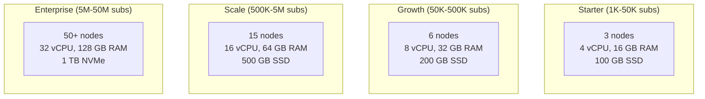
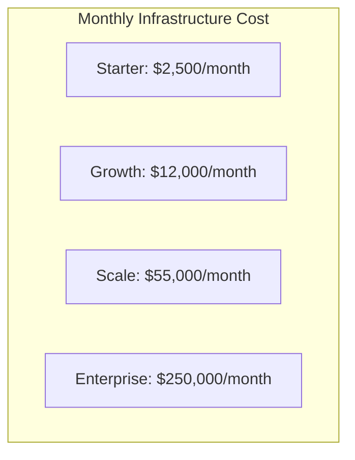

# Hardware Requirements -- ERP-BSS-OSS
> Version: 1.0 | Last Updated: 2026-02-23 | Status: Draft
> Classification: Internal | Author: AIDD System

---

## 1. Overview

This document specifies hardware requirements for ERP-BSS-OSS deployments across four subscriber tiers, covering compute, storage, network, and infrastructure components.

---

## 2. Subscriber Tier Definitions

| Tier | Subscribers | CDR Volume | Monthly Invoices | API TPS |
|------|------------|------------|------------------|---------|
| **Starter** | 1K - 50K | 10M CDR/month | 50K | 1K |
| **Growth** | 50K - 500K | 200M CDR/month | 500K | 10K |
| **Scale** | 500K - 5M | 2B CDR/month | 5M | 50K |
| **Enterprise** | 5M - 50M | 20B CDR/month | 50M | 500K |

---

## 3. Compute Requirements

### 3.1 Kubernetes Worker Nodes

| Tier | Nodes | vCPU/Node | RAM/Node | Storage/Node | Total vCPU | Total RAM |
|------|-------|-----------|----------|-------------|------------|-----------|
| Starter | 3 | 4 | 16 GB | 100 GB SSD | 12 | 48 GB |
| Growth | 6 | 8 | 32 GB | 200 GB SSD | 48 | 192 GB |
| Scale | 15 | 16 | 64 GB | 500 GB SSD | 240 | 960 GB |
| Enterprise | 50 | 32 | 128 GB | 1 TB NVMe | 1600 | 6.4 TB |

### 3.2 Control Plane Nodes

| Tier | Nodes | vCPU | RAM | Storage |
|------|-------|------|-----|---------|
| Starter | 3 | 2 | 4 GB | 50 GB |
| Growth | 3 | 4 | 8 GB | 100 GB |
| Scale | 3 | 8 | 16 GB | 200 GB |
| Enterprise | 5 | 8 | 16 GB | 200 GB |

---

## 4. Database Requirements

### 4.1 PostgreSQL

| Tier | Nodes | vCPU | RAM | Storage | IOPS |
|------|-------|------|-----|---------|------|
| Starter | 1 primary + 1 replica | 4 | 16 GB | 200 GB SSD | 3K |
| Growth | 1 primary + 2 replicas | 8 | 32 GB | 500 GB SSD | 10K |
| Scale | 3 primary (sharded) + 6 replicas | 16 | 64 GB | 1 TB NVMe | 30K |
| Enterprise | YugabyteDB 9+ nodes | 32 | 128 GB | 2 TB NVMe | 100K |

### 4.2 Redis

| Tier | Nodes | RAM | Persistence |
|------|-------|-----|------------|
| Starter | 1 | 4 GB | RDB + AOF |
| Growth | 3 (Sentinel) | 8 GB | RDB + AOF |
| Scale | 6 (Cluster) | 16 GB | RDB + AOF |
| Enterprise | 12 (Cluster) | 32 GB | RDB + AOF |

### 4.3 ClickHouse

| Tier | Nodes | vCPU | RAM | Storage | Retention |
|------|-------|------|-----|---------|-----------|
| Starter | 1 | 4 | 16 GB | 500 GB SSD | 1 year |
| Growth | 2 (replicated) | 8 | 32 GB | 2 TB SSD | 2 years |
| Scale | 4 (sharded + replicated) | 16 | 64 GB | 5 TB SSD | 3 years |
| Enterprise | 8 (sharded + replicated) | 32 | 128 GB | 20 TB SSD | 7 years |

### 4.4 Kafka

| Tier | Brokers | vCPU | RAM | Storage | Retention |
|------|---------|------|-----|---------|-----------|
| Starter | 3 | 4 | 8 GB | 200 GB SSD | 7 days |
| Growth | 3 | 8 | 16 GB | 500 GB SSD | 7 days |
| Scale | 6 | 16 | 32 GB | 1 TB SSD | 14 days |
| Enterprise | 12 | 32 | 64 GB | 2 TB NVMe | 30 days |

---

## 5. Network Requirements

| Tier | Bandwidth (inter-node) | Bandwidth (internet) | Latency (inter-node) |
|------|----------------------|---------------------|---------------------|
| Starter | 1 Gbps | 100 Mbps | < 1 ms |
| Growth | 10 Gbps | 500 Mbps | < 1 ms |
| Scale | 25 Gbps | 1 Gbps | < 0.5 ms |
| Enterprise | 100 Gbps | 10 Gbps | < 0.5 ms |

---

## 6. Cloud Provider Mappings

### 6.1 AWS

| Component | Starter | Growth | Scale | Enterprise |
|-----------|---------|--------|-------|-----------|
| K8s Workers | 3x m6i.xlarge | 6x m6i.2xlarge | 15x m6i.4xlarge | 50x m6i.8xlarge |
| PostgreSQL | db.r6g.xlarge | db.r6g.2xlarge | 3x db.r6g.4xlarge | YugabyteDB on i3.4xlarge |
| Redis | cache.r6g.large | cache.r6g.xlarge | 6x cache.r6g.2xlarge | 12x cache.r6g.2xlarge |
| ClickHouse | 1x i3.xlarge | 2x i3.2xlarge | 4x i3.4xlarge | 8x i3.8xlarge |
| Kafka (MSK) | kafka.m5.large (3) | kafka.m5.xlarge (3) | kafka.m5.2xlarge (6) | kafka.m5.4xlarge (12) |

### 6.2 Estimated Monthly Cloud Cost

---

## 7. On-Premises Hardware Specifications

### 7.1 Recommended Server Specifications (Scale Tier)

| Component | Specification |
|-----------|--------------|
| CPU | 2x Intel Xeon Gold 6342 (24 cores, 2.8 GHz) |
| RAM | 256 GB DDR4-3200 ECC |
| Storage (OS) | 2x 480 GB SSD (RAID-1) |
| Storage (Data) | 8x 1.92 TB NVMe SSD (RAID-10) |
| Network | 2x 25 GbE (bonded) |
| Power | Dual redundant PSU |
| BMC | IPMI 2.0 for remote management |

### 7.2 Rack Layout (Scale Tier)

| Rack Unit | Equipment | Count |
|-----------|----------|-------|
| U1-U2 | Top-of-rack switch (25 GbE) | 2 |
| U3-U8 | K8s worker nodes | 6 |
| U9-U11 | K8s control plane | 3 |
| U12-U14 | Database servers | 3 |
| U15-U17 | Kafka brokers | 3 |
| U18-U19 | Redis nodes | 2 |
| U20 | ClickHouse node | 1 |
| U21-U22 | Management (monitoring, bastion) | 2 |

---

## 8. Disaster Recovery Hardware

| Component | DR Strategy | Additional Hardware |
|-----------|------------|-------------------|
| K8s cluster | Active-passive in second site | 50% of primary capacity |
| PostgreSQL | Streaming replication to DR site | Same spec as primary |
| Redis | Sentinel across sites | Same spec |
| ClickHouse | Async replication | Same spec |
| Kafka | MirrorMaker 2 to DR | Same spec |
| Storage | S3-compatible object store for backups | 10 TB |
