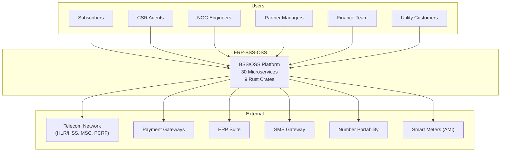
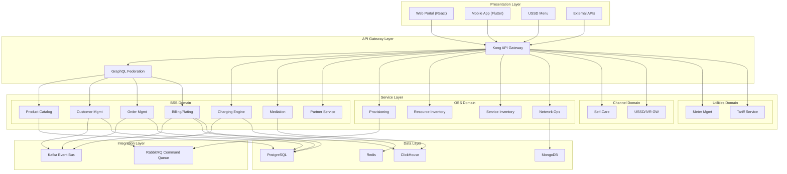
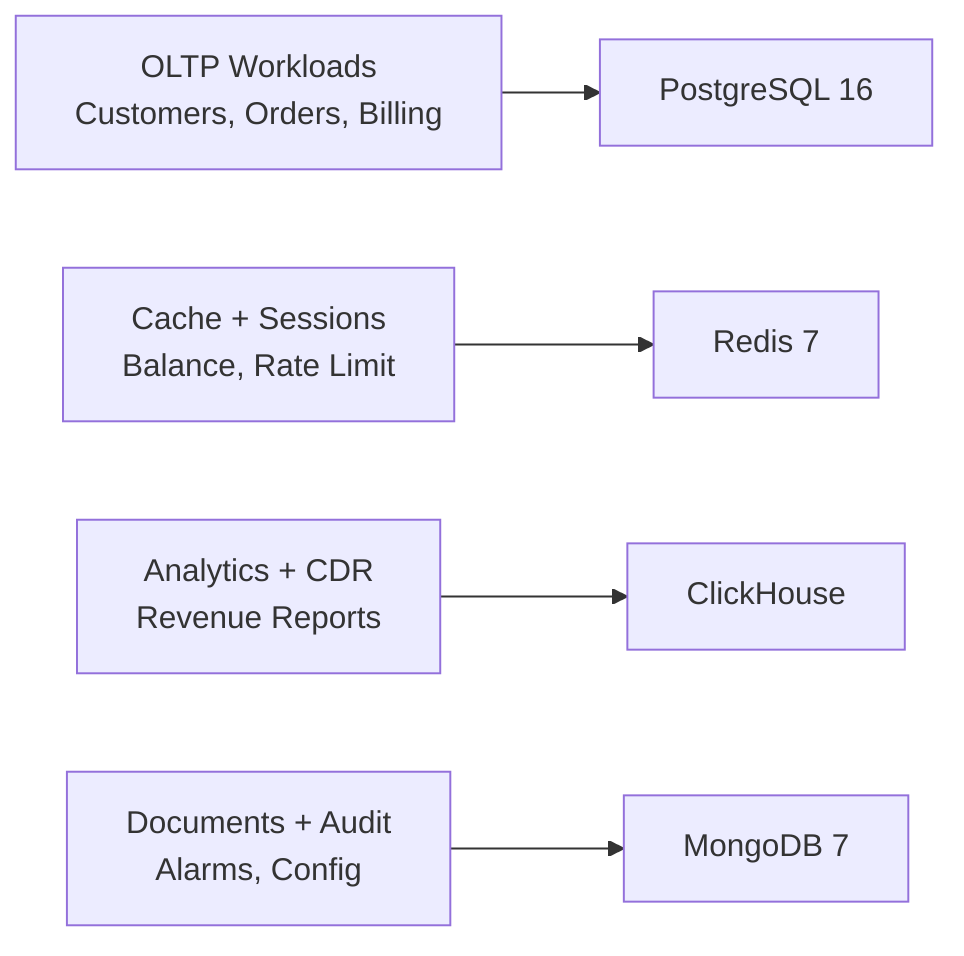
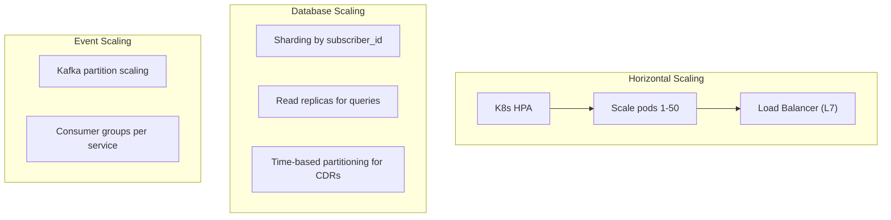
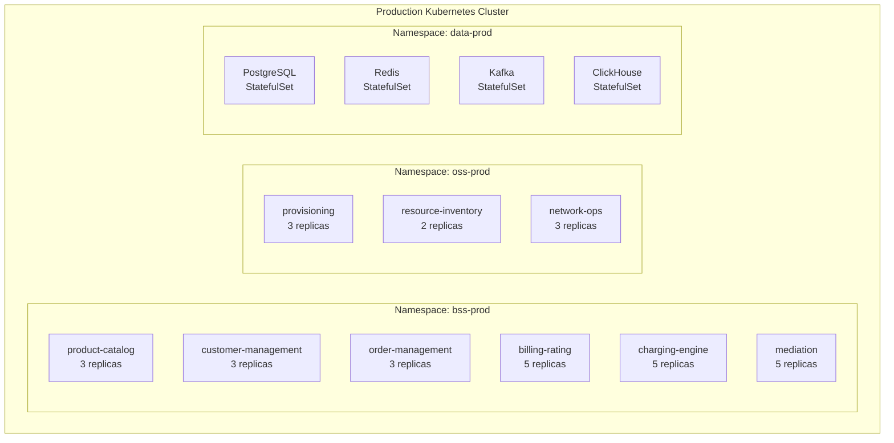
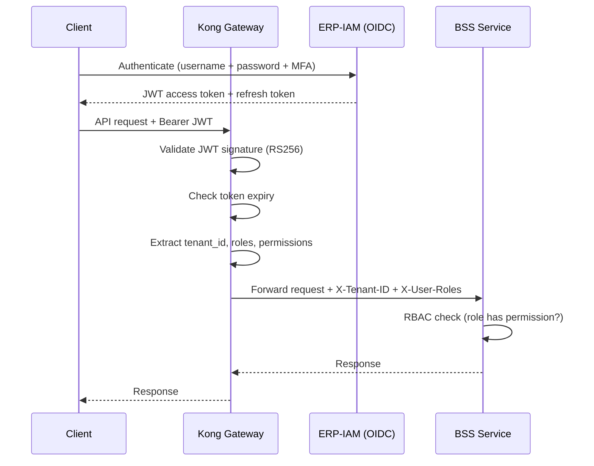

# High-Level Design (HLD) -- ERP-BSS-OSS
> Version: 1.0 | Last Updated: 2026-02-23 | Status: Draft
> Classification: Internal | Author: AIDD System

---

## 1. Purpose

This High-Level Design document describes the system-level architecture, component interactions, deployment model, and key design decisions for the ERP-BSS-OSS telecom and utilities BSS/OSS platform.

---

## 2. System Context

---

## 3. Component Architecture

### 3.1 Layered Architecture

### 3.2 Service Interaction Matrix

| Service | Depends On | Depended By |
|---------|-----------|-------------|
| Product Catalog | - | Order Mgmt, Billing, Self-Care, Partner |
| Customer Mgmt | - | Order Mgmt, Billing, Self-Care, USSD, Partner |
| Order Mgmt | Product Catalog, Customer Mgmt | Billing, Provisioning |
| Billing/Rating | Product Catalog, Customer Mgmt, Mediation | Self-Care, Partner, Revenue Assurance |
| Charging Engine | Billing/Rating | Mediation |
| Mediation | Charging Engine | Billing, Revenue Assurance |
| Provisioning | Order Mgmt, Resource Inventory | Service Inventory |
| Resource Inventory | - | Provisioning, Network Ops |
| Service Inventory | Provisioning | Network Ops, Self-Care |
| Partner Service | Billing, Product Catalog | - |
| Revenue Assurance | Billing, Mediation | - |
| Self-Care | Customer Mgmt, Billing, Service Inventory | - |
| USSD/IVR | Customer Mgmt, Billing | - |
| Meter Mgmt | Customer Mgmt | Tariff Service |
| Tariff Service | Meter Mgmt | Billing |

---

## 4. Key Design Decisions

### 4.1 Language Selection: Rust

**Decision:** Use Rust as the primary language for performance-critical services.

**Rationale:**
- Zero-cost abstractions for telecom-grade performance (sub-millisecond latency)
- Memory safety without garbage collector (critical for OCS real-time charging)
- Async runtime (Tokio) for high-concurrency CDR processing
- Strong type system prevents billing calculation errors at compile time

### 4.2 Polyglot Persistence

**Decision:** Use four database technologies, each optimized for its workload.

### 4.3 Event-Driven Communication

**Decision:** All inter-service communication for state changes uses Kafka events; synchronous REST for queries.

**Rationale:**
- Decouples services temporally and spatially
- Enables event sourcing for audit trail
- Supports replay for data recovery
- Scales independently per consumer group

### 4.4 Multi-Tenant Architecture

**Decision:** Tenant isolation via `X-Tenant-ID` header with row-level security in PostgreSQL.

All service endpoints require the `X-Tenant-ID` header, enabling a single deployment to serve multiple operators/MVNOs.

---

## 5. Non-Functional Design

### 5.1 Scalability

### 5.2 High Availability

| Component | HA Strategy | Failover Time |
|-----------|------------|---------------|
| API Gateway | Active-active across PoPs | 0 ms (DNS routing) |
| Microservices | 3+ replicas per service | < 5 sec (K8s reschedule) |
| PostgreSQL | Streaming replication (primary + 2 replicas) | < 30 sec (automatic) |
| Redis | Sentinel (3 nodes) | < 15 sec |
| Kafka | 3+ brokers, RF=3 | 0 ms (leader election) |
| ClickHouse | 2 replicas | < 1 min |

### 5.3 Performance Targets

| Metric | Target |
|--------|--------|
| API P99 latency | < 50 ms |
| OCS charging latency | < 1 ms |
| CDR mediation throughput | 1.4 M/sec |
| Invoice generation (1M subs) | < 4 hours |
| USSD session response | < 200 ms |
| Kafka event delivery | < 10 ms |

---

## 6. Deployment Model

---

## 7. Security Design

### 7.1 Authentication Flow

### 7.2 Data Classification

| Level | Examples | Controls |
|-------|---------|----------|
| **Restricted** | Passwords, encryption keys, PUK codes | HSM storage, no logging |
| **Confidential** | KYC documents, payment card data | Encrypted at rest + transit, PCI scope |
| **Internal** | Customer names, phone numbers, CDRs | Encrypted at rest, RBAC |
| **Public** | Product catalog, tariff rates | No special controls |
