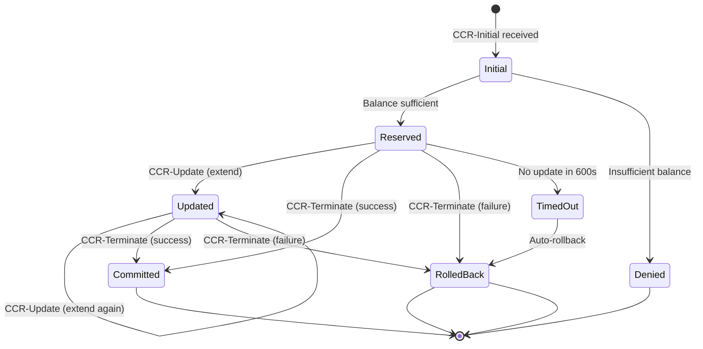
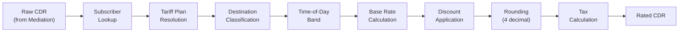
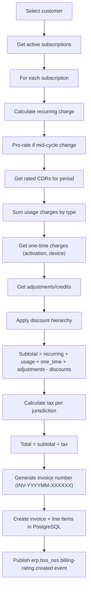
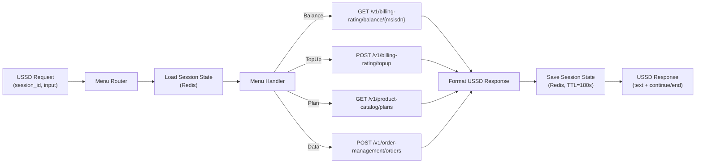
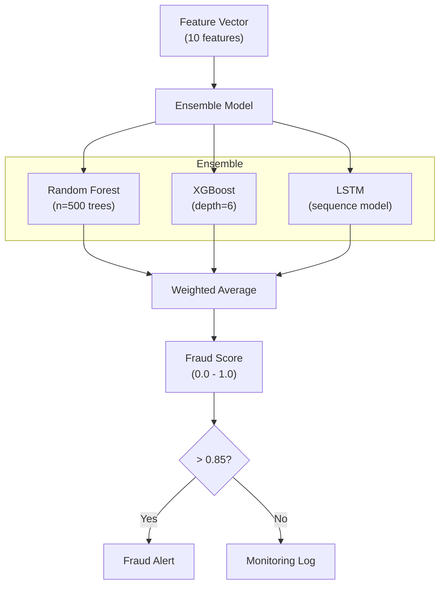

# Low-Level Design (LLD) -- ERP-BSS-OSS
> Version: 1.0 | Last Updated: 2026-02-23 | Status: Draft
> Classification: Internal | Author: AIDD System

---

## 1. Purpose

This Low-Level Design document provides implementation-level detail for the core components of ERP-BSS-OSS, including data structures, algorithms, API contracts, and internal service flows.

---

## 2. Charging Engine -- OCS Design

### 2.1 Balance Data Structure

```rust
/// Core balance aggregate
pub struct Balance {
    pub subscriber_id: String,
    pub main_balance: Money,
    pub data_balance: DataBalance,
    pub sms_balance: i64,
    pub bonus_balances: Vec<BonusBalance>,
    pub credit_limit: Money,
    pub auto_recharge: Option<AutoRechargeConfig>,
    pub last_updated: DateTime<Utc>,
}

#[derive(Clone)]
pub struct Money {
    pub amount_cents: i64,
    pub currency: Currency,
}

pub struct DataBalance {
    pub remaining_bytes: i64,
    pub total_bytes: i64,
    pub expiry: DateTime<Utc>,
}

pub struct BonusBalance {
    pub id: Uuid,
    pub amount: Money,
    pub balance_type: BonusType,  // promotional, loyalty, referral
    pub expiry: DateTime<Utc>,
    pub priority: i32,            // lower = used first
}

pub struct AutoRechargeConfig {
    pub threshold_cents: i64,
    pub recharge_amount_cents: i64,
    pub payment_method_id: Uuid,
    pub max_daily_recharges: u8,
}
```

### 2.2 Charging Session State Machine



### 2.3 Charging Algorithm

```
FUNCTION process_charging_request(request: ChargingRequest) -> ChargingResponse:
    subscriber = lookup_subscriber(request.msisdn)
    balance = get_balance(subscriber.id)  // Redis first, fallback to PG

    tariff = lookup_tariff(
        service_type = request.service_type,
        destination = request.destination,
        time = request.timestamp
    )

    MATCH request.type:
        CASE Initial:
            estimated_cost = tariff.rate_per_unit * request.requested_units
            IF balance.main_balance >= estimated_cost:
                reservation = create_reservation(subscriber.id, estimated_cost)
                balance.main_balance -= estimated_cost
                update_balance_cache(balance)
                RETURN GrantedUnits(request.requested_units, reservation.id)
            ELSE IF balance.main_balance > 0:
                affordable_units = balance.main_balance / tariff.rate_per_unit
                reservation = create_reservation(subscriber.id, balance.main_balance)
                balance.main_balance = 0
                update_balance_cache(balance)
                RETURN GrantedUnits(affordable_units, reservation.id)
            ELSE:
                check_auto_recharge(subscriber)
                RETURN Denied("Insufficient balance")

        CASE Update:
            // Same logic as Initial, extend existing reservation

        CASE Terminate:
            actual_cost = tariff.rate_per_unit * request.actual_units
            reservation = get_reservation(request.reservation_id)
            delta = reservation.amount - actual_cost
            IF delta > 0:
                refund(subscriber.id, delta)  // Refund unused
            ELSE IF delta < 0:
                debit(subscriber.id, abs(delta))  // Additional charge
            commit_reservation(request.reservation_id)
            write_cdr(subscriber, request, actual_cost, tariff)
            RETURN Success
```

---

## 3. Rating Engine -- Batch Rating

### 3.1 Rating Pipeline



### 3.2 Discount Hierarchy

```
1. Plan-level discount (e.g., "Gold plan: 20% off international calls")
2. Volume discount (e.g., "After 1000 minutes: 50% off")
3. Loyalty discount (e.g., "Customer > 2 years: 10% off")
4. Promotional discount (e.g., "Weekend special: 30% off data")
5. Manual adjustment (e.g., "Goodwill credit: $5.00")

Rule: Discounts apply sequentially; total discount cannot exceed 100%.
```

---

## 4. Mediation Engine -- CDR Processing

### 4.1 CDR Normalization Schema

```rust
/// Unified CDR format after normalization
pub struct NormalizedCdr {
    pub id: Uuid,
    pub record_type: CdrType,           // voice_moc, voice_mtc, data, sms_mo, sms_mt, mms, content
    pub subscriber_id: String,
    pub a_party: String,                 // Calling party MSISDN
    pub b_party: Option<String>,         // Called party MSISDN
    pub start_time: DateTime<Utc>,
    pub end_time: Option<DateTime<Utc>>,
    pub duration_seconds: Option<i32>,
    pub data_volume_bytes: Option<i64>,
    pub sms_count: Option<i32>,
    pub service_type: ServiceType,
    pub destination_type: DestinationType, // on_net, off_net, international, premium
    pub cell_id: Option<String>,
    pub imsi: String,
    pub imei: Option<String>,
    pub cause_code: Option<i32>,
    pub source_file: String,
    pub source_format: SourceFormat,     // asn1, csv, xml, diameter, radius
    pub normalized_at: DateTime<Utc>,
}
```

### 4.2 Duplicate Detection Algorithm

```
FUNCTION is_duplicate(cdr: NormalizedCdr) -> bool:
    // Generate composite key
    key = hash(cdr.a_party + cdr.b_party + cdr.start_time + cdr.duration)

    // Check Bloom filter (fast path)
    IF bloom_filter.might_contain(key):
        // Check exact match in Redis (5-minute window)
        IF redis.exists("cdr_dedup:" + key):
            RETURN true

    // Not a duplicate
    bloom_filter.add(key)
    redis.setex("cdr_dedup:" + key, 300, "1")
    RETURN false
```

---

## 5. Invoice Generation Algorithm



---

## 6. STS Token Generation (IEC 62055-41)

### 6.1 Token Encoding Structure

```
20-digit STS token structure:
  Positions 1-4:   Decoder Key Number (DKN)
  Positions 5-8:   Token Identifier (TID)
  Positions 9-16:  kWh amount encoded
  Positions 17-20: CRC check digits

Algorithm:
1. Input: meter_number, kWh_amount, supply_group_code, key_revision
2. Encode kWh amount using transfer amount encoding table
3. Generate token class (0 = credit transfer)
4. Apply DES/STS encryption using meter key derived from supply group code
5. Generate 20-digit token
6. Verify with CRC check
```

### 6.2 Token Generation Flow

```rust
pub struct StsTokenRequest {
    pub meter_number: String,
    pub kwh_amount: Decimal,
    pub supply_group_code: String,
    pub key_revision: u8,
    pub tariff_index: u8,
}

pub struct StsToken {
    pub token: String,           // 20-digit token
    pub kwh_amount: Decimal,
    pub token_class: u8,         // 0 = credit transfer
    pub valid_from: DateTime<Utc>,
    pub generated_at: DateTime<Utc>,
}
```

---

## 7. USSD Session Management

### 7.1 Session State Machine

```rust
pub struct UssdSession {
    pub session_id: String,
    pub msisdn: String,
    pub shortcode: String,
    pub current_state: MenuState,
    pub context: HashMap<String, String>,  // accumulated user inputs
    pub created_at: DateTime<Utc>,
    pub ttl_seconds: u32,                   // default 180
}

pub enum MenuState {
    MainMenu,
    BalanceCheck,
    TopUpSelectAmount,
    TopUpConfirm,
    TopUpProcess,
    PlanBrowse,
    PlanSelect,
    PlanConfirm,
    DataBundle,
    Help,
    End,
}
```

### 7.2 USSD-to-API Bridge



---

## 8. Fraud Detection ML Pipeline

### 8.1 Feature Engineering

| Feature | Description | Window |
|---------|-------------|--------|
| `outgoing_call_ratio` | Outgoing calls / total calls | 24 hours |
| `unique_destinations` | Distinct B-party numbers | 24 hours |
| `avg_call_duration` | Mean call duration in seconds | 24 hours |
| `call_duration_stddev` | Standard deviation of duration | 24 hours |
| `sms_to_call_ratio` | SMS count / call count | 7 days |
| `data_usage_bytes` | Total data consumption | 7 days |
| `unique_cell_ids` | Distinct cell IDs visited | 24 hours |
| `imei_count` | SIMs detected on same IMEI | 30 days |
| `international_call_ratio` | International / total calls | 7 days |
| `off_peak_ratio` | Off-peak calls / total calls | 7 days |

### 8.2 Model Architecture



---

## 9. API Response Envelope

All API responses follow a consistent envelope:

```json
{
    "status": "success",
    "data": { ... },
    "meta": {
        "request_id": "uuid-v4",
        "timestamp": "2026-02-23T10:00:00Z",
        "page": 1,
        "per_page": 20,
        "total": 150
    },
    "event_topic": "erp.bss_oss.entity.action"
}
```

Error responses:

```json
{
    "status": "error",
    "error": {
        "code": "INSUFFICIENT_BALANCE",
        "message": "Subscriber balance is insufficient for this transaction",
        "details": {
            "required_cents": 5000,
            "available_cents": 3200
        }
    },
    "meta": {
        "request_id": "uuid-v4",
        "timestamp": "2026-02-23T10:00:00Z"
    }
}
```

---

## 10. Database Query Optimization

### 10.1 Critical Query Patterns

| Query | Frequency | Target Latency | Index Strategy |
|-------|-----------|---------------|----------------|
| Balance lookup by subscriber_id | 100K/sec | < 1 ms | Primary key (Redis cache) |
| CDR insert | 1.4M/sec | < 5 ms | Partitioned by month, no secondary index on hot path |
| Customer by phone number | 10K/sec | < 10 ms | B-tree index on contact_mediums.characteristic_phone_number |
| Invoice by customer + period | 1K/sec | < 20 ms | Composite index (customer_id, billing_period_start) |
| Active products by category | 500/sec | < 10 ms | Composite index (category, status) WHERE status='active' |
| SIM by ICCID | 5K/sec | < 5 ms | Unique index on iccid |
| Order by order_number | 2K/sec | < 5 ms | Unique index on order_number |

### 10.2 Partitioning Strategy

```sql
-- CDR table partitioned by month for optimal query performance
CREATE TABLE cdrs (
    id UUID NOT NULL,
    subscriber_id VARCHAR(255) NOT NULL,
    start_time TIMESTAMP NOT NULL,
    ...
) PARTITION BY RANGE (start_time);

CREATE TABLE cdrs_2026_01 PARTITION OF cdrs
    FOR VALUES FROM ('2026-01-01') TO ('2026-02-01');
CREATE TABLE cdrs_2026_02 PARTITION OF cdrs
    FOR VALUES FROM ('2026-02-01') TO ('2026-03-01');
-- Auto-create future partitions via pg_partman
```
