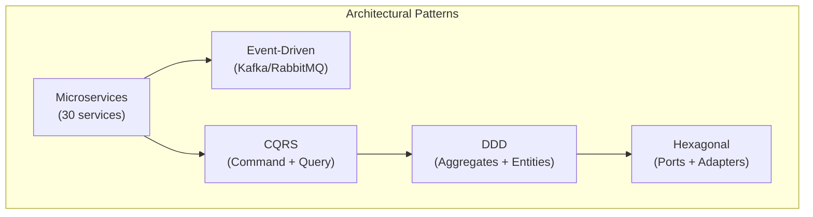
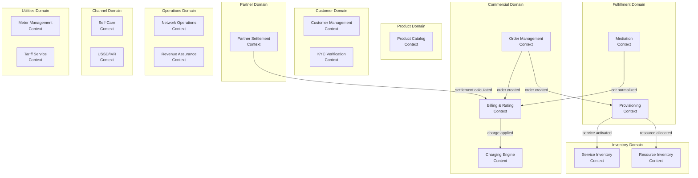
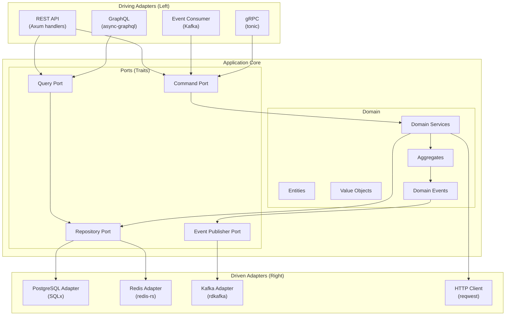
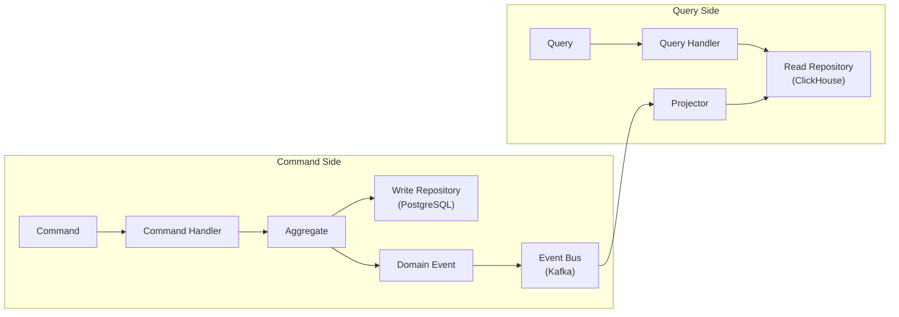
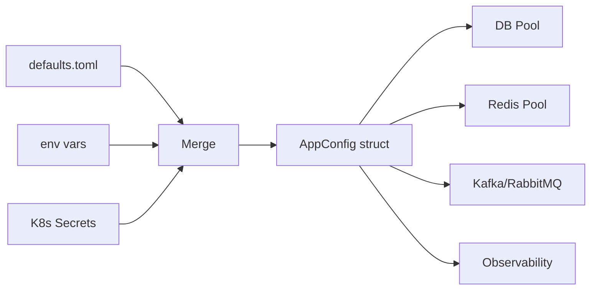

# Software Architecture -- ERP-BSS-OSS
> Version: 1.0 | Last Updated: 2026-02-23 | Status: Draft
> Classification: Internal | Author: AIDD System

---

## 1. Overview

This document details the internal software architecture of the ERP-BSS-OSS platform, covering module decomposition, design patterns, inter-service communication protocols, domain modeling, and code organization.

---

## 2. Architectural Style

ERP-BSS-OSS employs a **hybrid microservices + modular monolith** approach:

- **Microservices** for independently deployable business capabilities (30 services)
- **Modular monolith** within the Rust workspace (9 crates compiled into shared binaries)
- **Event-driven** communication between bounded contexts
- **CQRS** (Command Query Responsibility Segregation) for billing and analytics
- **DDD** (Domain-Driven Design) for domain modeling



---

## 3. Domain-Driven Design Model

### 3.1 Bounded Contexts



### 3.2 Aggregate Roots

| Bounded Context | Aggregate Root | Key Entities | Value Objects |
|----------------|---------------|--------------|---------------|
| Product Catalog | `Product` | ProductOffering, PricingRule, ProductSpec | Money, Duration, Version |
| Customer Management | `Customer` | Account, ContactMedium, CustomerCharacteristic | Address, PhoneNumber, Email |
| Order Management | `Order` | OrderItem, OrderNote | OrderNumber, Priority |
| Billing | `Invoice` | InvoiceLineItem, Payment, Adjustment | Money, TaxAmount, Period |
| Charging Engine | `Balance` | BalanceOperation, Reservation | Money, Currency |
| Provisioning | `ProvisioningTask` | TaskStep, TaskDependency | SIMProfile, ServiceConfig |
| Resource Inventory | `NetworkElement` | Port, IPAddress, SIM, PhoneNumber | ICCID, IMSI, MSISDN |
| Partner | `Partner` | RevenueShareAgreement, SettlementRun | SharePercentage, Period |

---

## 4. Hexagonal Architecture (Ports and Adapters)

Each Rust crate follows hexagonal architecture:



---

## 5. Module Structure

### 5.1 Rust Workspace Layout

```
ERP-BSS-OSS/
  Cargo.toml                  # Workspace manifest
  crates/
    bss-core/                 # Shared infrastructure
      src/
        lib.rs
        db.rs                 # PostgreSQL connection pool
        cache.rs              # Redis connection manager
        messaging.rs          # Kafka + RabbitMQ producers
        config.rs             # Environment configuration
        error.rs              # Error types
    bss-ddd/                  # DDD building blocks
      src/
        aggregate.rs
        entity.rs
        value_object.rs
        repository.rs
        domain_event.rs
    bss-api/                  # REST API server
      src/
        main.rs
        routes/
        handlers/
        middleware/
    bss-billing/              # Billing domain
      src/
        domain/
          invoice.rs
          rating.rs
          tax.rs
          dunning.rs
        application/
          commands.rs
          queries.rs
        infrastructure/
          postgres_repo.rs
          clickhouse_repo.rs
    bss-crm/                  # CRM domain
    bss-ordering/             # Order management domain
    bss-inventory/            # Resource inventory domain
    bss-analytics/            # Analytics domain
    bss-integration/          # External integrations
  services/
    billing-rating-service/   # Go microservice stub
    customer-management-service/
    order-management-service/
    ... (30 services total)
```

### 5.2 Service Internal Structure (Go Stubs)

Each Go microservice follows a consistent pattern:

```
services/<name>/
  main.go          # HTTP server with health + CRUD endpoints
  Dockerfile       # Multi-stage build
  README.md        # Service description
```

---

## 6. CQRS Implementation



**Command examples:** CreateOrder, RateUsage, TopUpBalance, ProvisionService
**Query examples:** GetCustomer360, GetUsageSummary, GetRevenueReport, GetBillHistory

---

## 7. Error Handling Strategy

```rust
// Unified error type using thiserror
#[derive(Debug, thiserror::Error)]
pub enum BssError {
    #[error("Not found: {0}")]
    NotFound(String),
    #[error("Validation error: {0}")]
    Validation(String),
    #[error("Unauthorized: {0}")]
    Unauthorized(String),
    #[error("Conflict: {0}")]
    Conflict(String),
    #[error("Database error: {0}")]
    Database(#[from] sqlx::Error),
    #[error("Cache error: {0}")]
    Cache(#[from] redis::RedisError),
    #[error("Internal error: {0}")]
    Internal(#[from] anyhow::Error),
}
```

All errors map to HTTP status codes via Axum's IntoResponse trait, and are logged with OpenTelemetry trace context for distributed tracing.

---

## 8. Configuration Management

Configuration follows a layered approach:

1. **Default values** in code
2. **config/default.toml** for base configuration
3. **Environment variables** (BSS__SERVER__PORT, BSS__DATABASE__HOST, etc.)
4. **.env file** for local development
5. **Kubernetes ConfigMaps/Secrets** for production



---

## 9. Middleware Pipeline

```mermaid
graph LR
    REQ["HTTP Request"] --> TRACE["Tracing<br/>(trace_id injection)"]
    TRACE --> CORS["CORS"]
    CORS --> RATE["Rate Limiter<br/>(Redis-backed)"]
    RATE --> AUTH["JWT Authentication"]
    AUTH --> AUTHZ["RBAC Authorization"]
    AUTHZ --> VALIDATE["Request Validation"]
    VALIDATE --> HANDLER["Business Logic"]
    HANDLER --> COMPRESS["Response Compression"]
    COMPRESS --> LOG["Access Logging"]
    LOG --> RES["HTTP Response"]
```



---

## 10. Testing Strategy

| Level | Tool | Coverage Target |
|-------|------|----------------|
| Unit | `cargo test`, mockall | 80 % |
| Integration | sqlx test fixtures, testcontainers | 60 % |
| Contract | TMF conformance test kit | 100 % TMF APIs |
| Load | k6, custom Rust benchmarks | Peak: 150K TPS |
| E2E | Playwright (portal), curl scripts | Critical paths |
