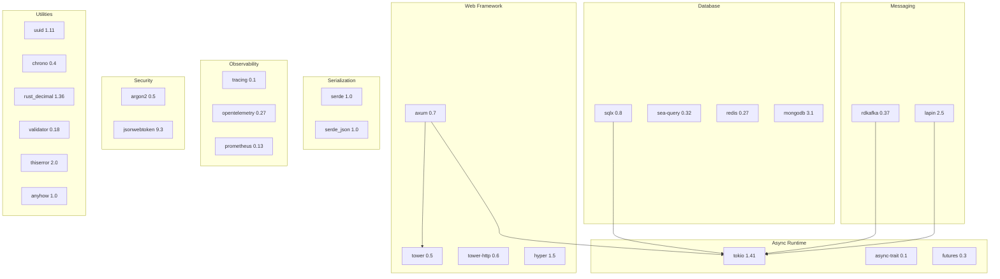
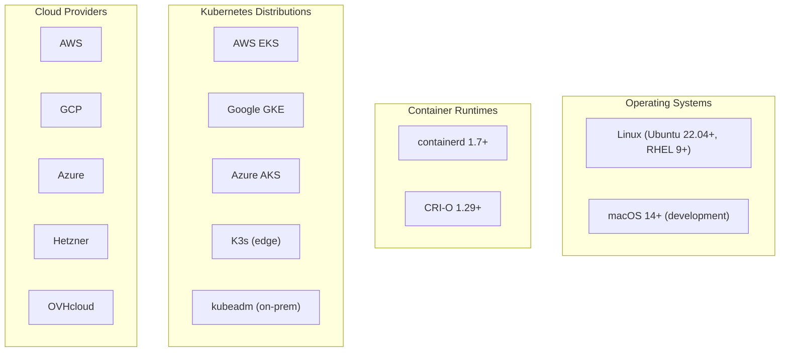

# Software Requirements -- ERP-BSS-OSS
> Version: 1.0 | Last Updated: 2026-02-23 | Status: Draft
> Classification: Internal | Author: AIDD System

---

## 1. Runtime Dependencies

### 1.1 Core Runtime

| Software | Version | Purpose | License |
|----------|---------|---------|---------|
| Rust | 1.83+ | Primary language | MIT/Apache-2.0 |
| Go | 1.22+ | Microservice stubs | BSD-3 |
| Docker | 24+ | Containerization | Apache-2.0 |
| Kubernetes | 1.29+ | Orchestration | Apache-2.0 |

### 1.2 Databases

| Software | Version | Purpose | License |
|----------|---------|---------|---------|
| PostgreSQL | 16 (Alpine) | OLTP primary store | PostgreSQL License |
| Redis | 7 (Alpine) | Cache, sessions, rate limiting | BSD-3 |
| MongoDB | 7 | Documents, audit logs | SSPL |
| ClickHouse | Latest | OLAP analytics | Apache-2.0 |

### 1.3 Messaging

| Software | Version | Purpose | License |
|----------|---------|---------|---------|
| Apache Kafka | 3.6 (Confluent 7.6) | Event streaming | Apache-2.0 |
| RabbitMQ | 3 (Management) | Command queues | MPL-2.0 |
| Apache ZooKeeper | 3.8 (Confluent 7.6) | Kafka coordination | Apache-2.0 |

### 1.4 Observability

| Software | Version | Purpose | License |
|----------|---------|---------|---------|
| Prometheus | 2.49+ | Metrics collection | Apache-2.0 |
| Grafana | 10.3+ | Dashboards | AGPL-3.0 |
| Jaeger | 1.54+ | Distributed tracing | Apache-2.0 |
| OpenTelemetry Collector | Latest | Telemetry pipeline | Apache-2.0 |

### 1.5 Infrastructure

| Software | Version | Purpose | License |
|----------|---------|---------|---------|
| Kong | 3.5+ | API gateway | Apache-2.0 |
| Istio | 1.20+ | Service mesh | Apache-2.0 |
| Terraform | 1.7+ | Infrastructure as Code | BUSL-1.1 |
| Helm | 3.14+ | K8s package manager | Apache-2.0 |

---

## 2. Rust Crate Dependencies

### 2.1 Dependency Tree

### 2.2 Security Audit Status

| Crate | Version | Audit Status | CVEs |
|-------|---------|-------------|------|
| axum | 0.7 | Audited (Tower ecosystem) | None |
| sqlx | 0.8 | Compile-time query checking | None |
| tokio | 1.41 | Extensively audited | None |
| jsonwebtoken | 9.3 | Reviewed | None |
| rdkafka | 0.37 | Wraps librdkafka (audited) | None |
| argon2 | 0.5 | RustCrypto (peer reviewed) | None |

---

## 3. Development Dependencies

| Software | Version | Purpose |
|----------|---------|---------|
| cargo | 1.83+ | Rust package manager |
| clippy | Latest | Lint checks |
| rustfmt | Latest | Code formatting |
| cargo-watch | Latest | File watcher for dev |
| mockall | 0.13 | Mock framework |
| wiremock | 0.6 | HTTP mock server |
| docker-compose | 2.0+ | Local dev environment |

---

## 4. Frontend Dependencies

| Software | Version | Purpose |
|----------|---------|---------|
| Node.js | 20 LTS | Build toolchain |
| React | 18+ | Web portal |
| TypeScript | 5.0+ | Type safety |
| Flutter | 3.19+ | Mobile apps (iOS/Android) |
| Kotlin | 1.9+ | Android native modules |
| Swift | 5.9+ | iOS native modules |

---

## 5. Compatibility Matrix

---

## 6. Compliance Software Requirements

| Requirement | Software | Purpose |
|------------|---------|---------|
| TM Forum Conformance | TMF Open API Test Kit | API certification |
| Security Scanning | Trivy | Container vulnerability scanning |
| SAST | cargo-audit | Rust dependency audit |
| DAST | OWASP ZAP | Dynamic application testing |
| License Compliance | cargo-deny | License verification |
| Code Coverage | cargo-tarpaulin | Test coverage reporting |
