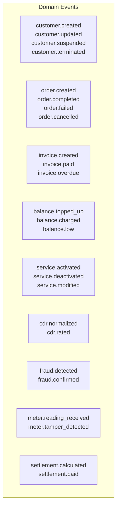

# Technical Specifications -- ERP-BSS-OSS
> Version: 1.0 | Last Updated: 2026-02-23 | Status: Draft
> Classification: Internal | Author: AIDD System

---

## 1. API Specifications

### 1.1 Product Catalog API (TMF620)

**Base URL:** `/v1/product-catalog`

| Method | Endpoint | Description | TMF |
|--------|----------|-------------|-----|
| GET | `/products` | List products with filtering | TMF620 |
| POST | `/products` | Create product | TMF620 |
| GET | `/products/{id}` | Get product by ID | TMF620 |
| PATCH | `/products/{id}` | Update product | TMF620 |
| DELETE | `/products/{id}` | Retire product | TMF620 |
| GET | `/products/{id}/pricing` | Get pricing rules | TMF620 |
| POST | `/products/{id}/pricing` | Add pricing rule | TMF620 |

**Request Headers:**
```
X-Tenant-ID: required (UUID)
Authorization: Bearer <JWT>
Content-Type: application/json
X-Correlation-ID: optional (UUID, auto-generated if absent)
```

**Example: Create Product**
```json
POST /v1/product-catalog/products
{
    "name": "Unlimited Data Plus",
    "description": "50GB data + unlimited calls + 500 SMS",
    "category": "mobile",
    "product_type": "bundle",
    "version": "1.0.0",
    "pricing": [
        {
            "pricing_type": "recurring",
            "amount": 29.99,
            "currency": "USD",
            "recurring_period": "monthly"
        }
    ],
    "characteristics": [
        { "name": "data_cap_gb", "value": "50", "value_type": "integer" },
        { "name": "voice_minutes", "value": "unlimited", "value_type": "string" },
        { "name": "sms_count", "value": "500", "value_type": "integer" }
    ]
}
```

### 1.2 Customer Management API (TMF629)

**Base URL:** `/v1/customer-management`

| Method | Endpoint | Description |
|--------|----------|-------------|
| GET | `/customers` | List customers |
| POST | `/customers` | Create customer |
| GET | `/customers/{id}` | Get customer |
| PATCH | `/customers/{id}` | Update customer |
| GET | `/customers/{id}/360` | Customer 360 view |
| POST | `/customers/{id}/kyc` | Submit KYC documents |
| GET | `/customers/{id}/kyc/status` | KYC verification status |

### 1.3 Order Management API (TMF622)

**Base URL:** `/v1/order-management`

| Method | Endpoint | Description |
|--------|----------|-------------|
| POST | `/orders` | Create order |
| GET | `/orders/{id}` | Get order |
| PATCH | `/orders/{id}` | Update order |
| POST | `/orders/{id}/cancel` | Cancel order |
| GET | `/orders/{id}/items` | List order items |
| GET | `/orders/{id}/fallout` | Get fallout details |

### 1.4 Billing/Rating API (TMF678)

**Base URL:** `/v1/billing-rating`

| Method | Endpoint | Description |
|--------|----------|-------------|
| GET | `/balances/{subscriber_id}` | Get balance |
| POST | `/topup` | Top-up balance |
| POST | `/charge` | Apply charge |
| GET | `/invoices` | List invoices |
| GET | `/invoices/{id}` | Get invoice detail |
| GET | `/invoices/{id}/pdf` | Download invoice PDF |
| POST | `/disputes` | Create dispute |
| GET | `/dunning/{customer_id}` | Get dunning status |

### 1.5 USSD/IVR Gateway API

**Base URL:** `/v1/ussd-ivr-gateway`

| Method | Endpoint | Description |
|--------|----------|-------------|
| POST | `/sessions` | Create USSD session |
| POST | `/sessions/{id}/continue` | Continue session (user input) |
| POST | `/sessions/{id}/end` | End session |
| GET | `/shortcodes` | List registered shortcodes |
| POST | `/shortcodes` | Register shortcode |

**USSD Request Format:**
```json
POST /v1/ussd-ivr-gateway/sessions
{
    "msisdn": "+2348012345678",
    "shortcode": "*123#",
    "session_id": "sess_abc123",
    "type": "begin"
}
```

**USSD Response Format:**
```json
{
    "session_id": "sess_abc123",
    "type": "continue",
    "message": "Welcome to BSS-OSS\n1. Check Balance\n2. Top Up\n3. Buy Data\n4. My Plan\n0. Exit"
}
```

---

## 2. Event Specifications

### 2.1 CloudEvents Envelope

All events follow the CloudEvents v1.0 specification:

```json
{
    "specversion": "1.0",
    "type": "erp.bss_oss.billing-rating.created",
    "source": "/v1/billing-rating",
    "id": "uuid-v4",
    "time": "2026-02-23T10:00:00Z",
    "datacontenttype": "application/json",
    "tenantid": "uuid-v4",
    "data": { ... }
}
```

### 2.2 Event Catalog



---

## 3. Protocol Specifications

### 3.1 DIAMETER (RFC 6733) -- OCS Interface

| AVP | Code | Description |
|-----|------|-------------|
| CC-Request-Type | 416 | INITIAL/UPDATE/TERMINATE |
| CC-Request-Number | 415 | Sequence number |
| Subscription-Id | 443 | MSISDN or IMSI |
| Requested-Service-Unit | 437 | Requested units (time/data/events) |
| Used-Service-Unit | 446 | Consumed units |
| Granted-Service-Unit | 431 | Granted units |
| Result-Code | 268 | Success/failure |

### 3.2 DLMS/COSEM -- Smart Meter Interface

| OBIS Code | Description | Unit |
|-----------|-------------|------|
| 1.0.1.8.0 | Active energy import (+A) | kWh |
| 1.0.2.8.0 | Active energy export (-A) | kWh |
| 1.0.1.7.0 | Active power import | kW |
| 1.0.2.7.0 | Active power export | kW |
| 0.0.96.1.0 | Meter serial number | string |

---

## 4. Configuration Specifications

### 4.1 Environment Variables

| Variable | Default | Description |
|----------|---------|-------------|
| `BSS__SERVER__HOST` | 0.0.0.0 | Bind address |
| `BSS__SERVER__PORT` | 8080 | HTTP port |
| `BSS__DATABASE__HOST` | localhost | PostgreSQL host |
| `BSS__DATABASE__PORT` | 5432 | PostgreSQL port |
| `BSS__DATABASE__NAME` | bss | Database name |
| `BSS__DATABASE__MAX_CONNECTIONS` | 200 | Connection pool size |
| `BSS__REDIS__HOST` | localhost | Redis host |
| `BSS__REDIS__PORT` | 6379 | Redis port |
| `BSS__KAFKA__BROKERS` | localhost:9092 | Kafka broker list |
| `BSS__OBSERVABILITY__OTLP_ENDPOINT` | http://localhost:4317 | OTLP gRPC endpoint |
| `MODULE_NAME` | ERP-BSS-OSS | Module identifier |
| `ENVIRONMENT` | development | Environment name |

### 4.2 Kubernetes Resource Specifications

```yaml
# Billing service (high throughput)
resources:
  requests:
    cpu: "500m"
    memory: "512Mi"
  limits:
    cpu: "2000m"
    memory: "2Gi"
replicas: 5
hpa:
  minReplicas: 3
  maxReplicas: 20
  metrics:
    - type: Resource
      resource:
        name: cpu
        target:
          type: Utilization
          averageUtilization: 70

# Charging engine (latency sensitive)
resources:
  requests:
    cpu: "1000m"
    memory: "1Gi"
  limits:
    cpu: "4000m"
    memory: "4Gi"
replicas: 5
```

---

## 5. Data Format Specifications

### 5.1 CDR Input Formats

| Source | Format | Fields |
|--------|--------|--------|
| MSC (Voice) | ASN.1 (TAP3) | A-number, B-number, duration, start-time, cell-id |
| SGSN/PGW (Data) | CSV/DIAMETER | IMSI, APN, volume-up, volume-down, duration, RAT |
| SMSC (SMS) | CSV | A-number, B-number, timestamp, status, type (MO/MT) |
| MMSC (MMS) | XML | A-number, B-number, timestamp, content-type, size |
| VAS Platform | JSON | MSISDN, service-id, content-id, amount, timestamp |

### 5.2 Invoice Format

Invoices are generated as structured JSON and rendered to PDF:

```json
{
    "invoice_number": "INV-202602-000001",
    "customer": {
        "name": "John Doe",
        "account_number": "ACC-12345",
        "address": "123 Main St, Lagos"
    },
    "billing_period": {
        "start": "2026-02-01",
        "end": "2026-02-28"
    },
    "line_items": [
        { "description": "Monthly Plan - Gold", "type": "subscription", "amount": 29.99 },
        { "description": "Voice (120 min @ $0.05/min)", "type": "usage", "amount": 6.00 },
        { "description": "Data (15 GB @ $0.01/MB)", "type": "usage", "amount": 15.00 },
        { "description": "SMS (50 @ $0.02/SMS)", "type": "usage", "amount": 1.00 },
        { "description": "Loyalty Discount (-10%)", "type": "adjustment", "amount": -5.20 }
    ],
    "subtotal": 46.79,
    "tax": { "vat_rate": 0.075, "vat_amount": 3.51 },
    "total": 50.30,
    "currency": "USD",
    "due_date": "2026-03-15"
}
```
