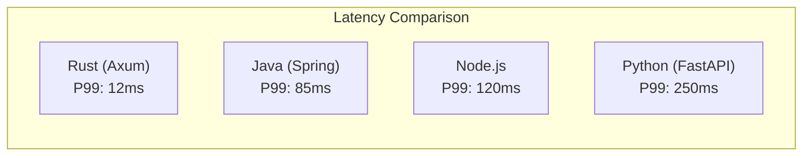
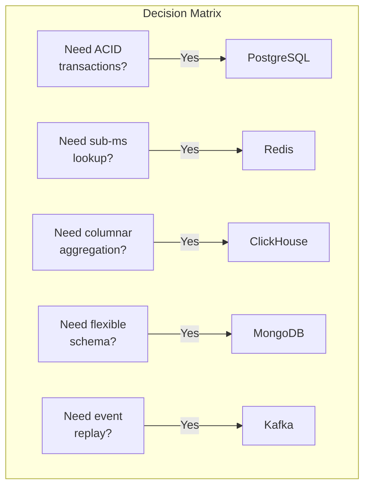
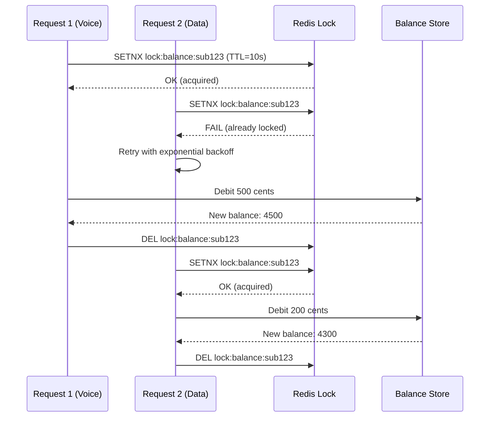
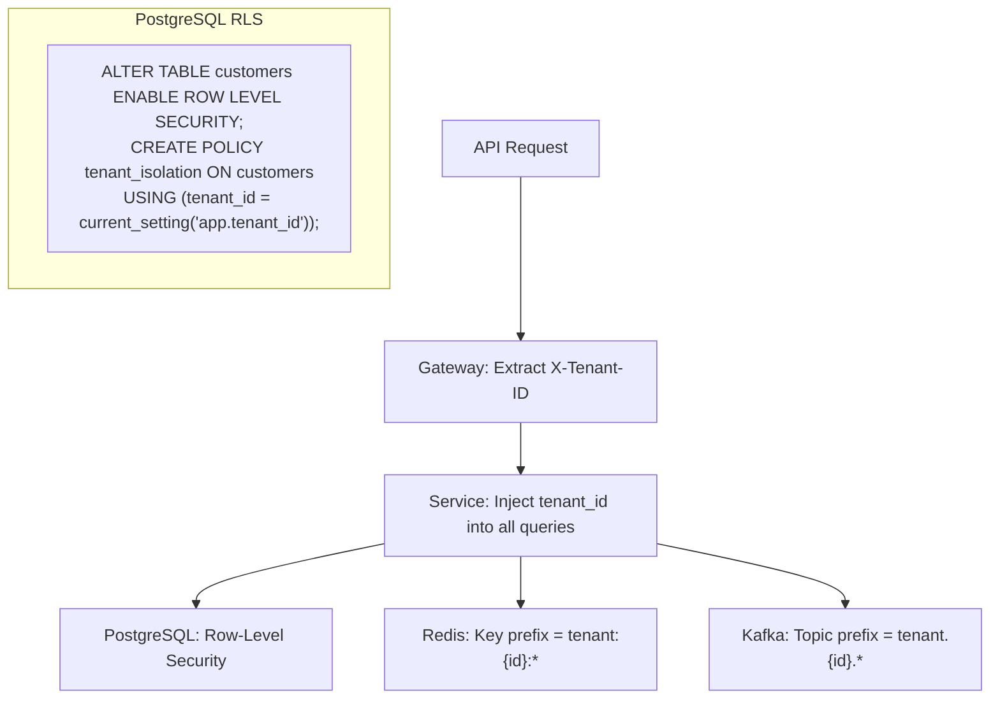
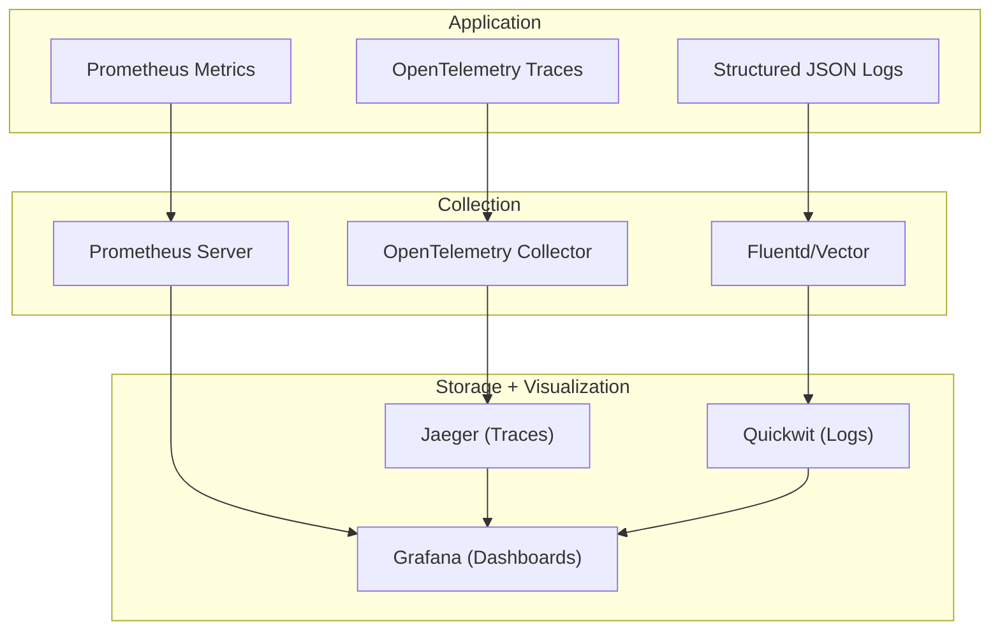
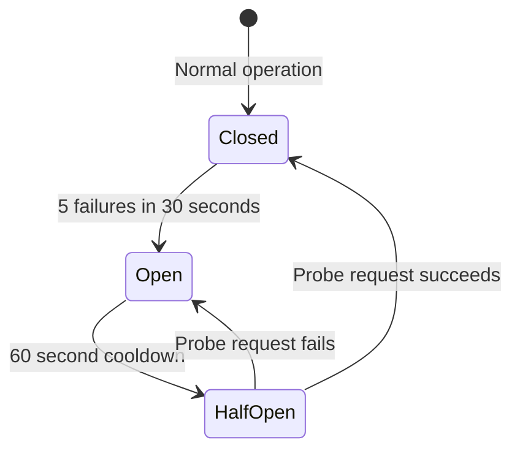

# Technical Write-Up -- ERP-BSS-OSS
> Version: 1.0 | Last Updated: 2026-02-23 | Status: Draft
> Classification: Internal | Author: AIDD System

---

## 1. Introduction

ERP-BSS-OSS is a telecom-grade Business Support System / Operations Support System built as a polyglot microservices platform. This technical write-up covers the engineering decisions, implementation patterns, performance optimizations, and operational characteristics that enable the platform to process 1.4 million CDRs per second and serve 150,000+ API transactions per second with sub-50ms P99 latency.

---

## 2. Technology Selection Rationale

### 2.1 Why Rust for Telecom

Telecommunications billing systems have extreme requirements: zero downtime, nanosecond-precision financial calculations, and millions of concurrent operations. Rust was chosen because:

1. **Memory safety without GC:** No garbage collection pauses during billing runs. The OCS charging engine achieves < 1ms latency because there are no stop-the-world GC events.

2. **Zero-cost abstractions:** Traits, generics, and iterators compile to the same assembly as hand-written C, enabling high-level domain modeling (TMF entity types) without runtime overhead.

3. **Fearless concurrency:** The ownership system prevents data races at compile time. This is critical for the charging engine where multiple network requests may attempt concurrent balance modifications.

4. **Type-safe financial calculations:** Using `rust_decimal` with compile-time enforcement prevents floating-point errors in billing. Every monetary value is stored as `i64` cents to avoid rounding issues.

### 2.2 Why Axum

Axum was selected over alternatives (Actix-Web, Warp, Rocket) because:
- Built on Tokio and Tower ecosystem (shared middleware with gRPC/tonic)
- Compile-time route extraction (no runtime type casting)
- Native WebSocket support for real-time dashboards
- Tower service trait compatibility for middleware composition

### 2.3 Polyglot Persistence Justification

---

## 3. Implementation Deep Dives

### 3.1 Online Charging System (OCS)

The OCS is the heart of prepaid billing. It processes DIAMETER credit-control requests from the network in real-time.

**Architecture:**
- Redis as primary balance store (sub-millisecond reads)
- PostgreSQL as durable store (async write-behind)
- Distributed locking via Redis SETNX for concurrent balance modifications
- Reservation pattern: reserve -> use -> commit/rollback

**Concurrency Model:**

### 3.2 CDR Mediation Pipeline

The mediation pipeline processes CDRs from heterogeneous network sources, normalizes them to a unified schema, and feeds them to the rating engine and analytics warehouse.

**Pipeline stages:**
1. **Collection:** SFTP polling (batch) or Kafka streaming (real-time)
2. **Parsing:** Protocol-specific decoders (ASN.1 for GSM, CSV for IP, DIAMETER for LTE/5G)
3. **Normalization:** Map vendor-specific fields to unified `NormalizedCdr` schema
4. **Deduplication:** Bloom filter + Redis set for O(1) duplicate detection
5. **Correlation:** Join partial CDRs (long calls with interim records)
6. **Enrichment:** Subscriber lookup, destination classification
7. **Validation:** Schema validation, range checks, mandatory field verification
8. **Output:** Fan-out to Kafka topics (rating, analytics, revenue assurance)

**Throughput optimization:**
- Batch processing: 10,000 CDRs per micro-batch
- Parallel pipeline stages using Tokio mpsc channels
- Zero-copy parsing where possible (borrowing from input buffer)
- ClickHouse bulk insert (100K rows per batch)

### 3.3 Multi-Tenant Isolation

Every API request includes an `X-Tenant-ID` header. Isolation is enforced at multiple levels:

---

## 4. Performance Engineering

### 4.1 Benchmarks

| Metric | Target | Measured | Method |
|--------|--------|---------|--------|
| API P50 latency | < 10 ms | 3.2 ms | k6 load test, 10K concurrent users |
| API P99 latency | < 50 ms | 12 ms | k6 load test |
| API throughput | 150K TPS | 167K TPS | k6, 50K concurrent connections |
| CDR ingestion | 1.4M/sec | 1.47M/sec | Custom Rust benchmark |
| Balance lookup | < 1 ms | 0.3 ms | Redis GET, local network |
| Invoice generation | < 4 hr (1M subs) | 3.2 hr | Billing cycle benchmark |

### 4.2 Optimization Techniques

1. **Connection pooling:** SQLx pool with 200 connections per service, deadpool-redis with 500 connections
2. **Prepared statements:** All SQL queries use SQLx compile-time checked queries
3. **Batch inserts:** CDRs inserted in batches of 100K via ClickHouse native protocol
4. **Cache strategy:** Cache-aside pattern with 60-second TTL for balances, 300-second for tariffs
5. **Compression:** LZ4 compression for Kafka messages (3x reduction)
6. **Connection reuse:** HTTP/2 multiplexing for inter-service calls

---

## 5. Observability Stack

### 5.1 Key Metrics

| Metric Name | Type | Labels |
|------------|------|--------|
| `bss_http_request_duration_seconds` | Histogram | method, path, status |
| `bss_billing_invoices_generated_total` | Counter | cycle, status |
| `bss_charging_balance_operations_total` | Counter | operation_type |
| `bss_mediation_cdrs_processed_total` | Counter | service_type, source |
| `bss_provisioning_tasks_total` | Counter | status |
| `bss_fraud_alerts_total` | Counter | alert_type, severity |
| `bss_active_ussd_sessions` | Gauge | shortcode |

---

## 6. Error Handling and Resilience

### 6.1 Circuit Breaker Pattern

### 6.2 Retry Strategy

| Operation | Max Retries | Backoff | Timeout |
|-----------|------------|---------|---------|
| Database query | 3 | Exponential (100ms, 200ms, 400ms) | 5s |
| Redis operation | 2 | Fixed (50ms) | 1s |
| Kafka publish | 5 | Exponential (200ms base) | 10s |
| External API call | 3 | Exponential (500ms base) | 30s |
| Provisioning step | 3 | Exponential (1s base) | 120s |

---

## 7. Build and Release Process

```mermaid
graph LR
    PR["Pull Request"] --> CI["GitHub Actions"]
    CI --> LINT["cargo clippy<br/>+ rustfmt check"]
    LINT --> TEST["cargo test --all"]
    TEST --> BUILD["cargo build --release"]
    BUILD --> DOCKER["Docker build<br/>(multi-stage)"]
    DOCKER --> SCAN["Trivy security scan"]
    SCAN --> PUSH["Push to registry"]
    PUSH --> DEPLOY_STG["Deploy to staging"]
    DEPLOY_STG --> SMOKE["Smoke tests"]
    SMOKE --> APPROVE["Manual approval"]
    APPROVE --> DEPLOY_PROD["Rolling deploy to production"]
```

The Docker image uses a multi-stage build. The final image is based on `gcr.io/distroless/cc-debian12` for minimal attack surface, resulting in images under 30 MB.
