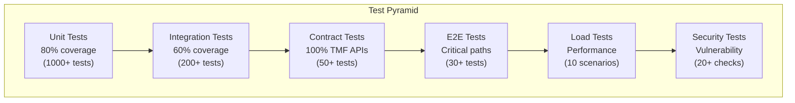
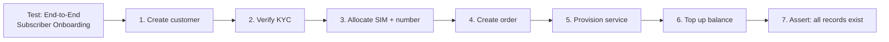
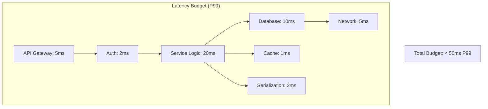
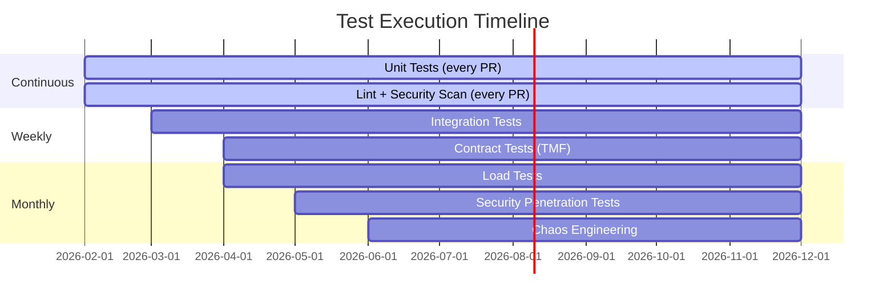

# AIDD Testing Requirements -- ERP-BSS-OSS
> Version: 1.0 | Last Updated: 2026-02-23 | Status: Draft
> Classification: Internal | Author: AIDD System

---

## 1. Test Strategy Overview



---

## 2. Unit Testing

### 2.1 Coverage Requirements

| Crate | Target Coverage | Current | Priority |
|-------|----------------|---------|----------|
| bss-core | 85% | TBD | High |
| bss-billing | 90% | TBD | Critical |
| bss-crm | 80% | TBD | High |
| bss-ordering | 85% | TBD | High |
| bss-inventory | 80% | TBD | Medium |
| bss-analytics | 70% | TBD | Low |
| bss-integration | 75% | TBD | Medium |

### 2.2 Test Categories

| Category | Description | Example |
|----------|-------------|---------|
| **Domain Logic** | Business rule validation | Order state transition rules |
| **Calculation** | Financial accuracy | Rating calculation, tax calculation, discount hierarchy |
| **Validation** | Input validation | MSISDN format, ICCID checksum, email format |
| **Serialization** | JSON/protobuf encoding | TMF entity serialization/deserialization |
| **Error Handling** | Error path testing | Insufficient balance, not found, conflict |

### 2.3 Billing Calculation Test Cases

| Test | Input | Expected Output |
|------|-------|-----------------|
| Voice rating (domestic) | 5 min, on-net, $0.03/min | $0.15 |
| Voice rating (international) | 3 min, US->UK, $0.20/min | $0.60 |
| Data rating | 500 MB, $0.01/MB | $5.00 |
| Tiered pricing | 1500 min, tier 1: $0.05 (0-1000), tier 2: $0.03 (1000+) | $65.00 |
| Pro-rata (15 days of 30-day plan at $30) | - | $15.00 |
| Discount stack | $100 base, 10% plan + 5% loyalty | $85.50 |
| Tax calculation | $85.50 subtotal, 7.5% VAT | $91.91 |

---

## 3. Integration Testing

### 3.1 Database Integration

```rust
#[sqlx::test]
async fn test_create_customer(pool: PgPool) {
    let customer = create_customer(&pool, "John Doe", "individual").await.unwrap();
    assert_eq!(customer.name, "John Doe");
    assert_eq!(customer.status, "active");
    assert!(customer.id != Uuid::nil());
}

#[sqlx::test]
async fn test_balance_topup(pool: PgPool) {
    setup_subscriber(&pool, "sub123", 1000).await;
    let new_balance = topup(&pool, "sub123", 5000).await.unwrap();
    assert_eq!(new_balance, 6000);
}
```

### 3.2 Event Integration

| Test | Producer | Consumer | Assertion |
|------|----------|----------|-----------|
| Order triggers billing | Order Service | Billing Service | Invoice created |
| Order triggers provisioning | Order Service | Provisioning | Task created |
| CDR triggers rating | Mediation | Billing | Charge applied |
| Payment updates dunning | Billing | Dunning | Dunning cleared |

### 3.3 Cross-Service Workflows



---

## 4. Contract Testing (TMF Conformance)

### 4.1 TMF API Test Matrix

| TMF API | Endpoint | Method | Test Count |
|---------|----------|--------|-----------|
| TMF620 | /productCatalogManagement/v4/productOffering | GET, POST, PATCH, DELETE | 8 |
| TMF622 | /productOrderingManagement/v4/productOrder | GET, POST, PATCH | 6 |
| TMF629 | /customerManagement/v4/customer | GET, POST, PATCH, DELETE | 8 |
| TMF638 | /serviceInventoryManagement/v4/service | GET, POST, PATCH | 6 |
| TMF639 | /resourceInventoryManagement/v4/resource | GET, POST, PATCH | 6 |
| TMF641 | /serviceActivationAndConfiguration/v4/service | POST, PATCH | 4 |
| TMF668 | /partnerManagement/v4/partnership | GET, POST, PATCH | 6 |
| TMF678 | /customerBillManagement/v4/customerBill | GET, POST | 4 |

### 4.2 Conformance Validation

Each TMF endpoint must:
1. Accept the standard request schema
2. Return the standard response schema
3. Include mandatory fields per TMF spec
4. Support filtering, pagination, and field selection
5. Return appropriate HTTP status codes

---

## 5. Load Testing

### 5.1 Load Test Scenarios

| Scenario | Description | Target | Duration |
|----------|-------------|--------|----------|
| LT-01 | API steady state | 100K TPS | 30 min |
| LT-02 | API peak | 200K TPS | 10 min |
| LT-03 | CDR ingestion | 1.5M CDR/sec | 15 min |
| LT-04 | Billing cycle (1M subs) | Complete < 4 hours | Full cycle |
| LT-05 | Balance top-up burst | 50K concurrent top-ups | 5 min |
| LT-06 | USSD session concurrency | 10K concurrent sessions | 15 min |
| LT-07 | Invoice PDF generation | 1000 invoices/min | 10 min |
| LT-08 | Partner settlement (100 partners) | Complete < 1 hour | Full cycle |
| LT-09 | Fraud detection throughput | 100K CDRs/sec through ML | 15 min |
| LT-10 | Multi-tenant isolation under load | 10 tenants, 10K TPS each | 15 min |

### 5.2 Performance Budgets



---

## 6. Security Testing

### 6.1 OWASP Top 10 Coverage

| Risk | Test Method | Tool |
|------|-----------|------|
| A01 Broken Access Control | RBAC bypass attempts | Manual + OWASP ZAP |
| A02 Cryptographic Failures | TLS verification, key management | SSLyze + manual |
| A03 Injection | SQL injection, command injection | SQLMap + manual |
| A04 Insecure Design | Threat modeling review | Manual |
| A05 Security Misconfiguration | Container scan, K8s config | Trivy + kube-bench |
| A06 Vulnerable Components | Dependency audit | cargo-audit + Trivy |
| A07 Auth Failures | Brute force, session management | Manual + OWASP ZAP |
| A08 Data Integrity | Event tampering, CDR manipulation | Manual |
| A09 Logging Failures | Audit log completeness | Log analysis |
| A10 SSRF | Internal service access via API | Manual + OWASP ZAP |

### 6.2 Telecom-Specific Security Tests

| Test | Description |
|------|-------------|
| Tenant isolation | Verify tenant A cannot access tenant B data |
| Balance manipulation | Attempt to top-up without valid payment |
| CDR tampering | Submit modified CDRs; verify rejection |
| SIM cloning detection | Test duplicate IMSI detection |
| PII exposure | Verify PII masking in logs and error messages |

---

## 7. Chaos Engineering

| Experiment | Method | Expected Outcome |
|-----------|--------|-----------------|
| Kill billing pod | `kubectl delete pod` | K8s restarts; no lost transactions |
| Database failover | Stop primary PG | Replica promoted; < 30s downtime |
| Redis failure | Stop Redis | Fallback to PostgreSQL for balance lookup |
| Kafka broker down | Kill 1 of 3 brokers | Events continue on remaining brokers |
| Network partition | iptables drop between services | Circuit breaker activates; graceful degradation |
| Full PoP failure | Simulate zone outage | DNS routes to next-closest PoP |

---

## 8. Test Execution Schedule


