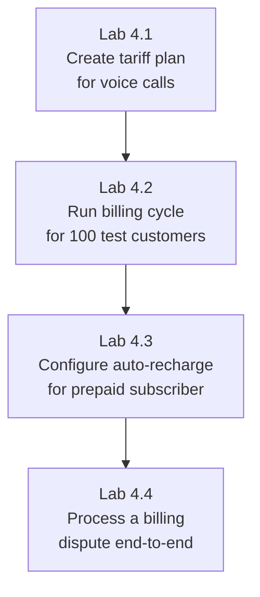
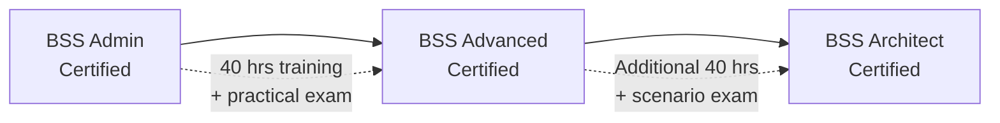

# Administrator Training Manual -- ERP-BSS-OSS
> Version: 1.0 | Last Updated: 2026-02-23 | Status: Draft
> Classification: Internal | Author: AIDD System

---

## 1. Training Overview

This training program covers the complete BSS/OSS administration skillset across 10 modules, designed for system administrators, billing managers, and operations team leads.

**Duration:** 40 hours (5 days)
**Prerequisites:** Basic telecom domain knowledge, familiarity with web administration interfaces

---

## 2. Training Curriculum

```mermaid
graph LR
    M1["Module 1<br/>Platform Overview<br/>(4 hrs)"] --> M2["Module 2<br/>Product Catalog<br/>(4 hrs)"]
    M2 --> M3["Module 3<br/>Customer Mgmt<br/>(4 hrs)"]
    M3 --> M4["Module 4<br/>Billing Admin<br/>(8 hrs)"]
    M4 --> M5["Module 5<br/>Partner Mgmt<br/>(4 hrs)"]
    M5 --> M6["Module 6<br/>Provisioning<br/>(4 hrs)"]
    M6 --> M7["Module 7<br/>Network Ops<br/>(4 hrs)"]
    M7 --> M8["Module 8<br/>Revenue Assurance<br/>(4 hrs)"]
    M8 --> M9["Module 9<br/>Utilities<br/>(2 hrs)"]
    M9 --> M10["Module 10<br/>Monitoring<br/>(2 hrs)"]
```

---

## 3. Module 1: Platform Overview (4 hours)

### 3.1 Learning Objectives
- Understand BSS/OSS architecture and TM Forum alignment
- Navigate the admin console confidently
- Understand multi-tenant architecture

### 3.2 Topics
1. **What is BSS/OSS?** -- Business Support vs Operations Support Systems
2. **ERP-BSS-OSS Architecture** -- 30 microservices, polyglot persistence, event-driven
3. **TM Forum Alignment** -- TMF620, TMF622, TMF629, TMF638, TMF639, TMF641, TMF668, TMF678
4. **Admin Console Tour** -- Dashboard, navigation, tenant switching

### 3.3 Lab Exercise
- Log in to the admin console
- Navigate to each major section
- View system health dashboard
- Identify the 30 services and their health status

---

## 4. Module 4: Billing Administration (8 hours)

### 4.1 Learning Objectives
- Configure billing cycles and tariff plans
- Run billing cycles and resolve errors
- Manage dunning escalation
- Handle billing disputes

### 4.2 Topics

**Session 1: Tariff and Rating (2 hours)**
- Creating tariff plans for voice, data, SMS
- Time-of-day tariff bands
- Destination-based rating (on-net, off-net, international)
- Promotional tariffs with validity periods

**Session 2: Billing Cycle Management (2 hours)**
- Billing cycle scheduling (daily, weekly, monthly)
- Running a billing cycle
- Monitoring billing progress
- Handling failed invoices

**Session 3: Prepaid Management (2 hours)**
- Balance management concepts
- Top-up channel configuration
- Auto-recharge setup
- Balance expiry policies

**Session 4: Dunning and Disputes (2 hours)**
- Dunning level configuration
- Dunning action templates (SMS, email, bar, suspend, terminate)
- Dispute investigation process
- Credit issuance and adjustments

### 4.3 Lab Exercises

**Lab 4.1: Create a Voice Tariff Plan**
1. Create a new tariff: "Standard Voice Plan"
2. Set rates: On-net $0.03/min, Off-net $0.08/min, International $0.25/min
3. Set peak hours: 8:00-20:00 (1.5x multiplier)
4. Activate the tariff
5. Verify with a test charge

**Lab 4.2: Run a Billing Cycle**
1. Ensure 100 test customers have usage records
2. Trigger monthly billing cycle
3. Monitor the billing progress dashboard
4. Download a sample invoice PDF
5. Verify line items match expected charges

---

## 5. Module 5: Partner Management (4 hours)

### 5.1 Lab: Onboard an MVNO Partner
1. Create partner record with KYC details
2. Define revenue share: 65% fixed for voice, tiered for data
3. Allocate 1,000 MSISDNs and 1,000 SIMs
4. Generate API credentials for partner
5. Run monthly settlement
6. Review settlement report on partner portal

---

## 6. Module 8: Revenue Assurance (4 hours)

### 6.1 Topics
- CDR-to-bill reconciliation
- Revenue leakage types and detection
- Fraud detection: SIM box, IRSF, Wangiri
- ML model monitoring and retraining

### 6.2 Lab: Investigate a Revenue Leakage Alert
1. Navigate to Revenue Assurance dashboard
2. Review high-confidence leakage alert
3. Drill down to CDR level
4. Compare CDR charges to invoice line items
5. Identify root cause (e.g., wrong tariff applied)
6. Document finding and corrective action
7. Verify fix resolves variance

---

## 7. Assessment

### 7.1 Practical Exam (2 hours)

| Task | Points |
|------|--------|
| Create a product bundle with 3 components and publish it | 15 |
| Onboard a new customer with KYC verification | 15 |
| Run a billing cycle and resolve one failed invoice | 20 |
| Configure dunning levels and trigger an escalation | 15 |
| Set up an MVNO partner with revenue share | 20 |
| Investigate a fraud alert and take appropriate action | 15 |
| **Total** | **100** |

**Passing score:** 75/100

---

## 8. Certification Path

