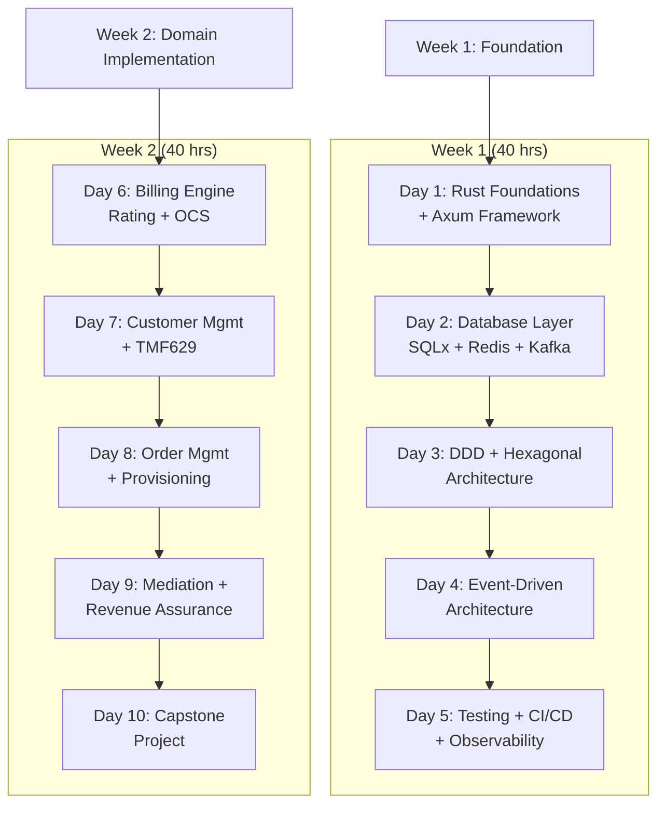
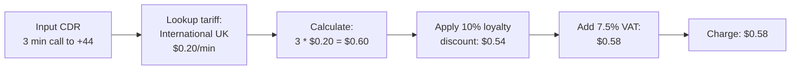

# Developer Training Manual -- ERP-BSS-OSS
> Version: 1.0 | Last Updated: 2026-02-23 | Status: Draft
> Classification: Internal | Author: AIDD System

---

## 1. Training Overview

This training program equips developers to build, extend, and maintain ERP-BSS-OSS services. It covers the Rust + Go technology stack, domain-driven design patterns, event-driven architecture, and TM Forum API compliance.

**Duration:** 80 hours (10 days)
**Prerequisites:** Proficiency in at least one systems programming language; familiarity with REST APIs, Docker, and SQL

---

## 2. Curriculum



---

## 3. Day 1: Rust Foundations + Axum (8 hours)

### 3.1 Topics

1. **Rust ownership and borrowing** -- Why it matters for telecom (no GC pauses in OCS)
2. **Error handling** -- `thiserror` for domain errors, `anyhow` for infrastructure
3. **Async programming** -- Tokio runtime, `async/await`, `Future` trait
4. **Axum framework** -- Handlers, extractors, state, middleware
5. **Tower middleware** -- Request tracing, rate limiting, CORS

### 3.2 Lab: Build a Health-Check Service

```rust
// Lab 1.1: Create a minimal Axum service
use axum::{Router, routing::get, Json};
use serde::Serialize;

#[derive(Serialize)]
struct Health {
    status: String,
    service: String,
}

async fn health() -> Json<Health> {
    Json(Health {
        status: "healthy".into(),
        service: "my-first-service".into(),
    })
}

#[tokio::main]
async fn main() {
    let app = Router::new().route("/healthz", get(health));
    let listener = tokio::net::TcpListener::bind("0.0.0.0:8080").await.unwrap();
    axum::serve(listener, app).await.unwrap();
}
```

### 3.3 Lab: Add CRUD Endpoints

Extend the service with:
- `POST /products` -- Create a product
- `GET /products` -- List products
- `GET /products/:id` -- Get by ID
- `PATCH /products/:id` -- Update
- `DELETE /products/:id` -- Soft delete

---

## 4. Day 2: Database Layer (8 hours)

### 4.1 Topics

1. **SQLx** -- Compile-time checked queries, connection pools, migrations
2. **Redis** -- Balance caching, distributed locks, rate limiting
3. **Kafka** -- Producer/consumer patterns, CloudEvents envelope
4. **MongoDB** -- Document storage for audit logs

### 4.2 Lab: Balance Management

```rust
// Lab 2.1: Implement prepaid balance operations
pub async fn get_balance(pool: &PgPool, subscriber_id: &str) -> Result<i64, BssError> {
    let row = sqlx::query!(
        "SELECT balance_cents FROM balances WHERE subscriber_id = $1",
        subscriber_id
    )
    .fetch_optional(pool)
    .await?;

    match row {
        Some(r) => Ok(r.balance_cents),
        None => Err(BssError::NotFound("Subscriber not found".into())),
    }
}

pub async fn top_up(
    pool: &PgPool,
    redis: &redis::Client,
    subscriber_id: &str,
    amount_cents: i64,
) -> Result<i64, BssError> {
    // 1. Update PostgreSQL
    let new_balance = sqlx::query_scalar!(
        "UPDATE balances SET balance_cents = balance_cents + $1, last_updated = NOW()
         WHERE subscriber_id = $2 RETURNING balance_cents",
        amount_cents, subscriber_id
    )
    .fetch_one(pool)
    .await?;

    // 2. Update Redis cache
    let mut conn = redis.get_multiplexed_async_connection().await?;
    redis::cmd("SETEX")
        .arg(format!("balance:{}", subscriber_id))
        .arg(60)
        .arg(new_balance.to_string())
        .query_async(&mut conn)
        .await?;

    Ok(new_balance)
}
```

---

## 5. Day 3: DDD + Hexagonal Architecture (8 hours)

### 5.1 Topics

1. **Aggregates and Entities** -- Modeling telecom domain objects
2. **Value Objects** -- Money, PhoneNumber, ICCID, MSISDN
3. **Domain Events** -- order.created, balance.charged, service.activated
4. **Repositories** -- Port (trait) + Adapter (implementation)
5. **Application Services** -- Command and query handlers

### 5.2 Lab: Model the Order Aggregate

```rust
// Lab 3.1: Implement Order aggregate with state machine
pub struct Order {
    pub id: Uuid,
    pub order_number: String,
    pub customer_id: Uuid,
    pub status: OrderStatus,
    pub items: Vec<OrderItem>,
    pub events: Vec<DomainEvent>,  // uncommitted events
}

impl Order {
    pub fn new(customer_id: Uuid, items: Vec<OrderItem>) -> Self {
        let order = Order {
            id: Uuid::new_v4(),
            order_number: generate_order_number(),
            customer_id,
            status: OrderStatus::Acknowledged,
            items,
            events: vec![],
        };
        // Emit domain event
        order.events.push(DomainEvent::OrderCreated {
            order_id: order.id,
            customer_id,
        });
        order
    }

    pub fn start_fulfillment(&mut self) -> Result<(), BssError> {
        match self.status {
            OrderStatus::Acknowledged => {
                self.status = OrderStatus::InProgress;
                self.events.push(DomainEvent::OrderStarted { order_id: self.id });
                Ok(())
            }
            _ => Err(BssError::Validation(
                "Can only start fulfillment from Acknowledged status".into()
            )),
        }
    }
}
```

---

## 6. Day 6: Billing Engine (8 hours)

### 6.1 Topics

1. **Rating engine** -- Tariff lookup, rate calculation, discount application
2. **OCS charging** -- Reserve/commit/rollback, DIAMETER CCR/CCA mapping
3. **Invoice generation** -- Aggregation, tax calculation, PDF rendering
4. **Dunning** -- Escalation rules, notification templates

### 6.2 Lab: Implement End-to-End Rating



---

## 7. Day 10: Capstone Project (8 hours)

### 7.1 Requirements

Build a complete mini-BSS that:
1. Registers a customer with KYC
2. Creates a product with recurring + usage pricing
3. Creates an order linking customer to product
4. Simulates 100 voice CDRs
5. Rates all CDRs against the tariff plan
6. Generates a monthly invoice
7. Publishes events at each step
8. Displays results in a simple web UI

### 7.2 Evaluation Criteria

| Criteria | Weight |
|----------|--------|
| Correct domain modeling (DDD) | 20% |
| Working CRUD APIs (Axum) | 20% |
| Event-driven integration (Kafka) | 15% |
| Accurate billing calculation | 20% |
| Test coverage (> 60%) | 15% |
| Code quality (clippy clean) | 10% |

---

## 8. Certification

**BSS Developer Certified** requires:
- 80% attendance (8/10 days)
- All lab exercises completed
- Capstone project score >= 70%
- Written assessment score >= 75%
