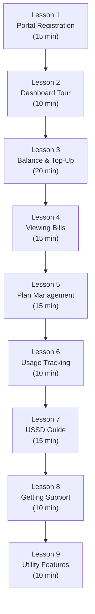
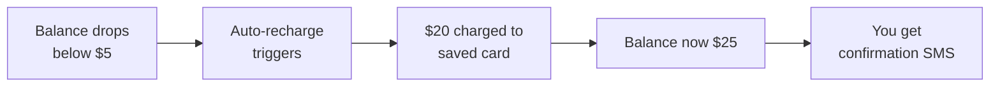
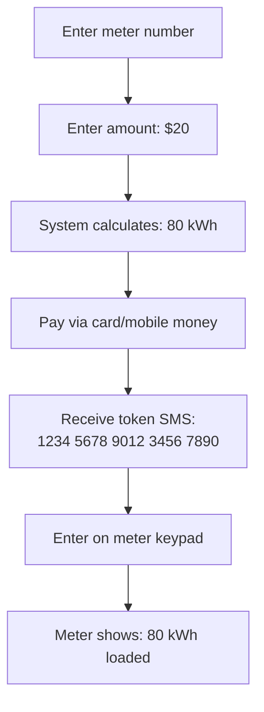

# End User Training Manual -- ERP-BSS-OSS Self-Care
> Version: 1.0 | Last Updated: 2026-02-23 | Status: Draft
> Classification: Internal | Author: AIDD System

---

## 1. Training Overview

This training guide helps subscribers and utility customers learn to use the self-care portal, mobile app, and USSD services to manage their accounts independently.

**Duration:** 2 hours (self-paced)
**Prerequisites:** Active subscription, access to portal or mobile app

---

## 2. Course Modules

---

## 3. Lesson 1: Portal Registration (15 min)

### Step-by-Step Guide

1. **Open your browser** and go to `https://my.operator.example.com`
2. **Click "Register"** on the login page
3. **Enter your phone number** exactly as it appears on your SIM (e.g., +234-801-234-5678)
4. **Check your phone** for an SMS with a 6-digit OTP code
5. **Enter the OTP** in the portal
6. **Create a password** (minimum 8 characters, include number and special character)
7. **Login** with your phone number and password

**Troubleshooting:**
- OTP not received? Wait 60 seconds and click "Resend OTP"
- Still not received? Ensure you entered the correct phone number
- Account locked? Contact customer service

---

## 4. Lesson 3: Balance and Top-Up (20 min)

### 4.1 Checking Your Balance

Your balance shows on the dashboard immediately after login:
- **Airtime Balance:** Money available for calls and services
- **Data Balance:** GB/MB remaining
- **SMS Balance:** Text messages remaining
- **Voice Minutes:** Call minutes remaining

### 4.2 Topping Up Your Account

**Practice Exercise:**
1. Click **Top-Up** on the dashboard
2. Select an amount (start with the smallest option for practice)
3. Choose a payment method:
   - **Bank card:** Enter card details (Visa, Mastercard)
   - **Mobile money:** Use your mobile money wallet
   - **Voucher:** Enter a recharge card PIN
4. Click **Confirm**
5. Verify your balance has increased

### 4.3 Setting Up Auto-Recharge

Auto-recharge automatically tops up your account so you never run out of airtime:

1. Go to **Settings** > **Auto-Recharge**
2. Turn it **ON**
3. Set the **threshold** (e.g., top up when balance falls below $5)
4. Set the **amount** (e.g., recharge $20 each time)
5. Select a saved payment method
6. Click **Save**

---

## 5. Lesson 5: Plan Management (15 min)

### 5.1 Viewing Your Current Plan

1. Navigate to **Plans & Add-ons**
2. Your current plan shows:
   - Plan name
   - Monthly cost
   - Included allowances
   - Renewal date

### 5.2 Changing Your Plan

**Practice Exercise:**
1. Click **Change Plan**
2. Browse the available plans
3. Use the **Compare** feature to see differences
4. Select a new plan
5. Review any pro-rated charges
6. Click **Confirm Change**
7. Your new plan will activate at your next billing cycle (or immediately, depending on operator policy)

---

## 6. Lesson 7: USSD Guide (15 min)

USSD works on any phone, including basic phones without internet.

### Quick Reference Card

| Dial Code | What It Does |
|-----------|-------------|
| `*123#` | Open main menu |
| `*123*1#` | Quick balance check |
| `*123*2#` | Top-up menu |
| `*123*3#` | Buy data bundle |
| `*123*4#` | Check data balance |
| `*123*5#` | Buy electricity token |
| `*123*0#` | Help |

### Practice Exercise: Check Balance via USSD
1. Open your phone dialer
2. Type `*123*1#`
3. Press **Call/Send**
4. Read your balance on screen

---

## 7. Lesson 9: Utility Features (10 min)

### 7.1 Buying Prepaid Electricity

1. Dial `*123*5#` or go to **Meter** > **Buy Token** in the portal
2. Enter your meter number (printed on the meter)
3. Enter the amount you want to spend
4. See how many kWh you will receive
5. Confirm payment
6. Receive a 20-digit token via SMS
7. Enter the token on your meter:
   - Press `Enter` or the key button on your meter
   - Type the 20 digits
   - Press `Enter` again
   - Meter beeps and shows kWh loaded

---

## 8. Knowledge Check

| Question | Answer |
|----------|--------|
| How do you check your balance via USSD? | Dial `*123*1#` |
| Where do you set up auto-recharge? | Settings > Auto-Recharge |
| How do you file a support ticket? | Support > Create Ticket |
| What do you do with an electricity token? | Enter the 20 digits on your meter keypad |
| How do you change your plan? | Plans & Add-ons > Change Plan |
