# Use Cases -- ERP-BSS-OSS
> Version: 1.0 | Last Updated: 2026-02-23 | Status: Draft
> Classification: Internal | Author: AIDD System

---

## 1. Overview

This document defines 28 use cases covering the complete telecom subscriber lifecycle, utility metering, and operational scenarios. Each use case includes actors, preconditions, flow, postconditions, and a Mermaid diagram.

---

## 2. Use Case Index

| # | Use Case | Domain | Priority |
|---|----------|--------|----------|
| UC-01 | New Prepaid Subscriber Onboarding | Customer | Critical |
| UC-02 | Postpaid Subscriber Registration | Customer | Critical |
| UC-03 | KYC Document Verification | Customer | Critical |
| UC-04 | Customer 360 View | Customer | High |
| UC-05 | Product Catalog Browsing | Product | High |
| UC-06 | Create Product Bundle | Product | Medium |
| UC-07 | Place New Subscription Order | Order | Critical |
| UC-08 | Order Cancellation | Order | High |
| UC-09 | Plan Upgrade / Downgrade | Order | High |
| UC-10 | Real-Time Voice Call Rating | Billing | Critical |
| UC-11 | Data Session Charging | Billing | Critical |
| UC-12 | Prepaid Balance Top-Up | Billing | Critical |
| UC-13 | Auto-Recharge Trigger | Billing | High |
| UC-14 | Postpaid Invoice Generation | Billing | Critical |
| UC-15 | Bill Shock Prevention Alert | Billing | High |
| UC-16 | Dunning Escalation | Billing | High |
| UC-17 | Billing Dispute Resolution | Billing | Medium |
| UC-18 | CDR Collection and Normalization | Mediation | Critical |
| UC-19 | SIM Swap (Physical to eSIM) | Provisioning | High |
| UC-20 | Number Porting (Port-In) | Provisioning | High |
| UC-21 | Network Fault Detection and Ticketing | Operations | High |
| UC-22 | Field Workforce Dispatch | Operations | Medium |
| UC-23 | MVNO Partner Onboarding | Partner | High |
| UC-24 | Monthly Revenue Settlement | Partner | High |
| UC-25 | USSD Balance Check | Channel | High |
| UC-26 | SIM Box Fraud Detection | Revenue Assurance | High |
| UC-27 | Smart Meter Reading Collection | Utilities | Medium |
| UC-28 | Prepaid Electricity STS Token Purchase | Utilities | Medium |

---

## 3. Detailed Use Cases

### UC-01: New Prepaid Subscriber Onboarding

**Actors:** Subscriber, Customer Service Agent, System
**Preconditions:** SIM inventory has available SIMs; number pool has available MSISDNs
**Trigger:** Customer visits retail point or self-service portal

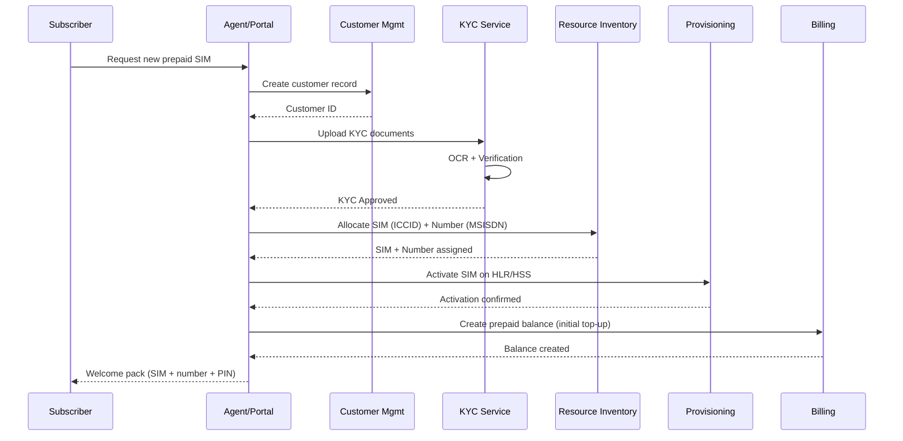

**Postconditions:** Customer record created, KYC verified, SIM active on network, prepaid balance initialized.

---

### UC-05: Product Catalog Browsing

**Actors:** Subscriber, System
**Preconditions:** Product catalog has active products

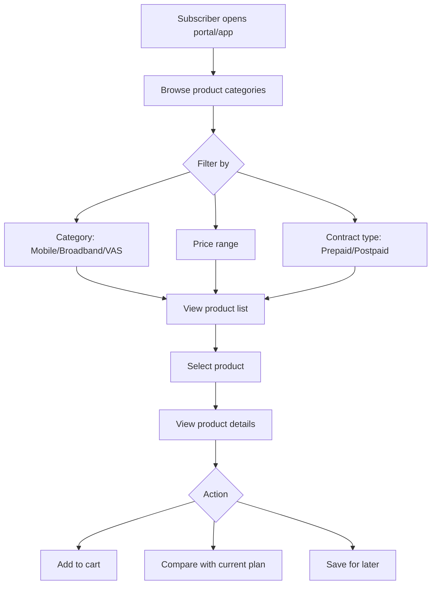

---

### UC-07: Place New Subscription Order

**Actors:** Customer Service Agent, Subscriber (self-service), System
**Preconditions:** Customer exists, product is active, resources available

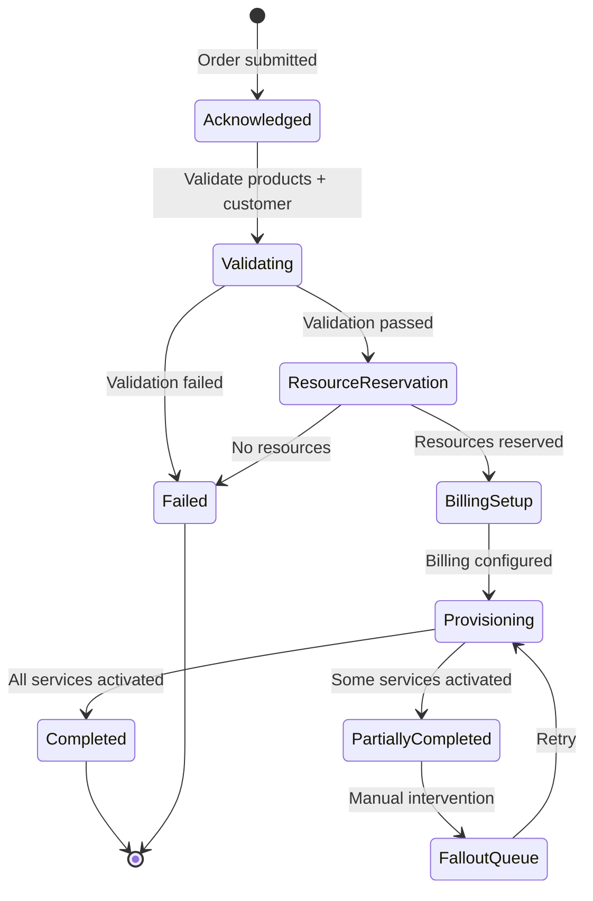

---

### UC-10: Real-Time Voice Call Rating

**Actors:** Subscriber (caller), Network, Charging Engine
**Preconditions:** Subscriber has active subscription; balance > 0 (prepaid) or credit available (postpaid)

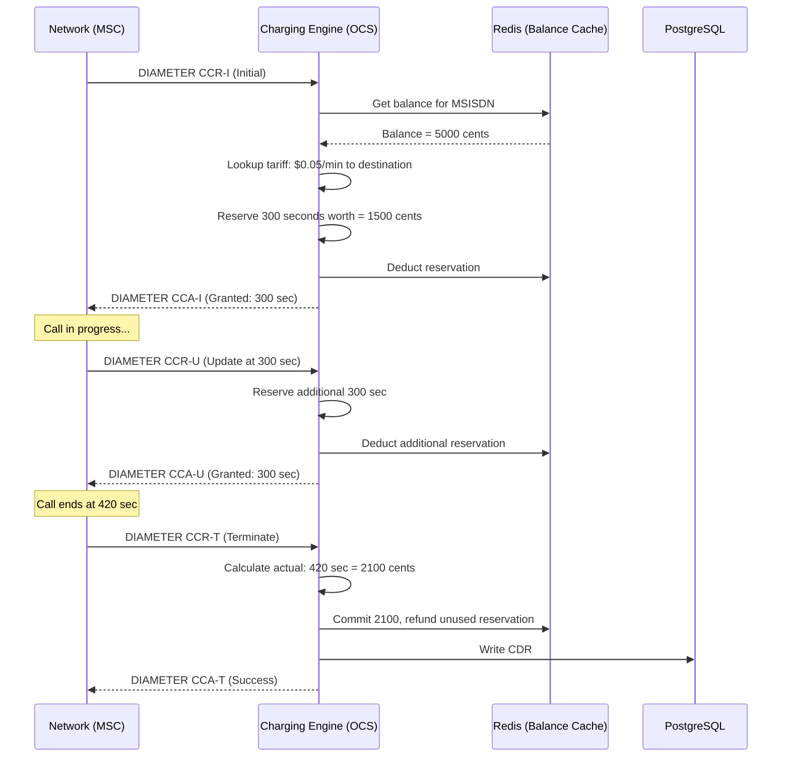

**Postconditions:** Balance decremented by actual usage, CDR recorded, unused reservation refunded.

---

### UC-12: Prepaid Balance Top-Up

**Actors:** Subscriber, System
**Preconditions:** Active subscriber, valid payment method

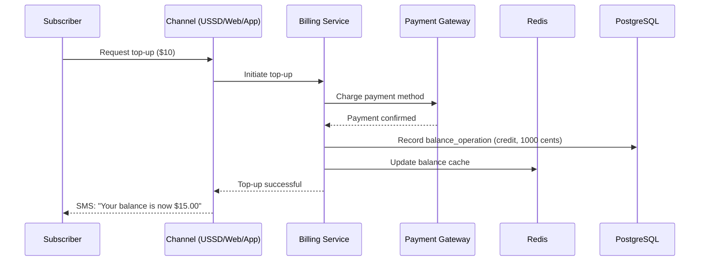

---

### UC-13: Auto-Recharge Trigger

**Actors:** System
**Preconditions:** Subscriber has auto-recharge enabled with threshold and amount configured

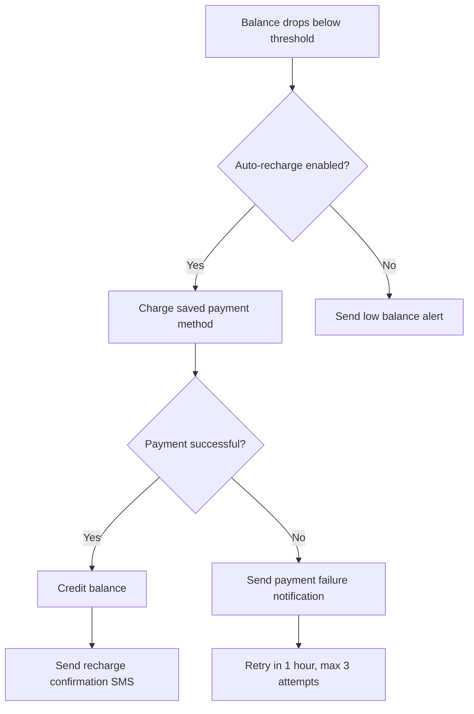

---

### UC-14: Postpaid Invoice Generation

**Actors:** System (scheduler), Billing Service
**Preconditions:** Billing cycle date reached

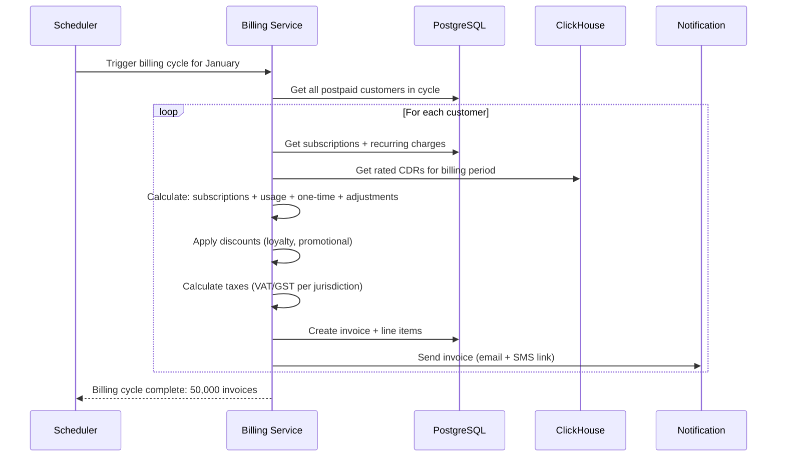

---

### UC-15: Bill Shock Prevention Alert

**Actors:** System, Subscriber
**Preconditions:** Postpaid subscriber with spend threshold configured

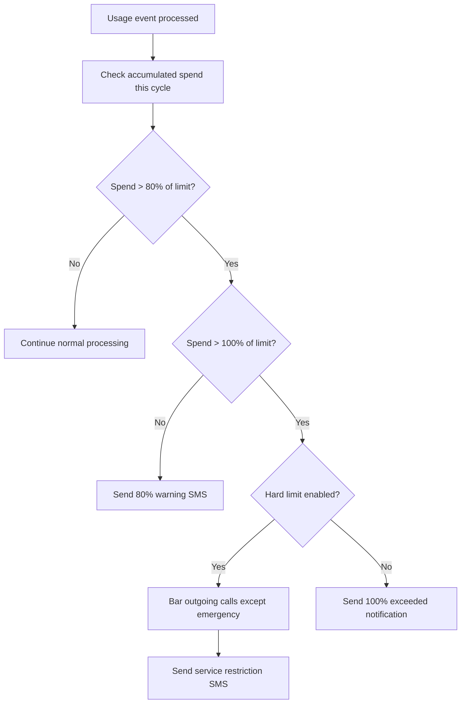

---

### UC-16: Dunning Escalation

**Actors:** System, Collections Team
**Preconditions:** Invoice past due date

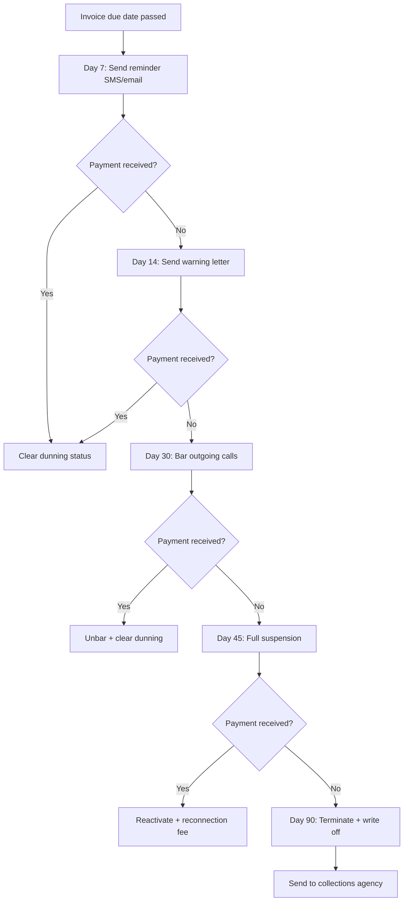

---

### UC-18: CDR Collection and Normalization

**Actors:** Network Elements, Mediation Service
**Preconditions:** Network generating CDRs

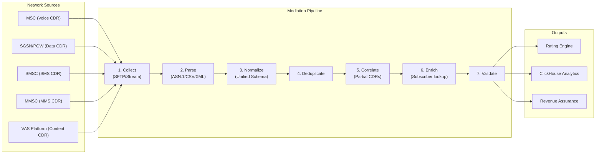

---

### UC-19: SIM Swap (Physical to eSIM)

**Actors:** Subscriber, Customer Service Agent, Provisioning Service
**Preconditions:** Subscriber has active SIM, device supports eSIM

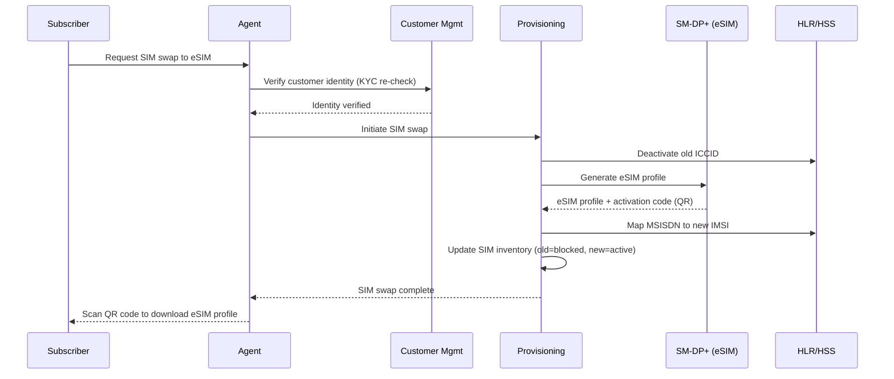

---

### UC-20: Number Porting (Port-In)

**Actors:** Subscriber, Receiving Operator (us), Donor Operator, NPC
**Preconditions:** Subscriber has valid account with donor; no outstanding debt

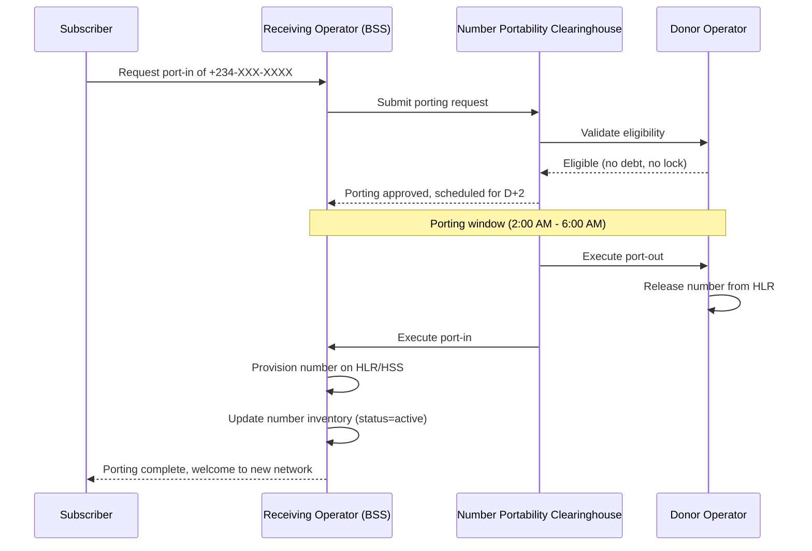

---

### UC-23: MVNO Partner Onboarding

**Actors:** MVNO Partner, Partner Manager, System

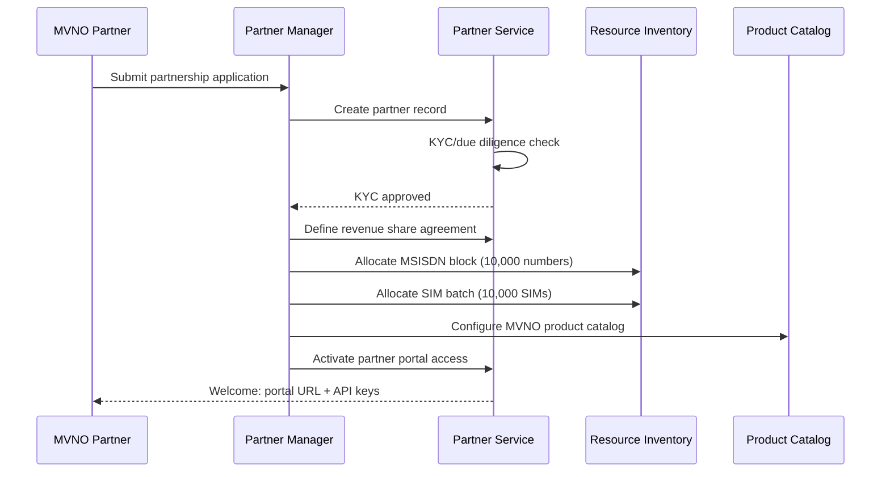

---

### UC-25: USSD Balance Check

**Actors:** Subscriber (feature phone), USSD Gateway

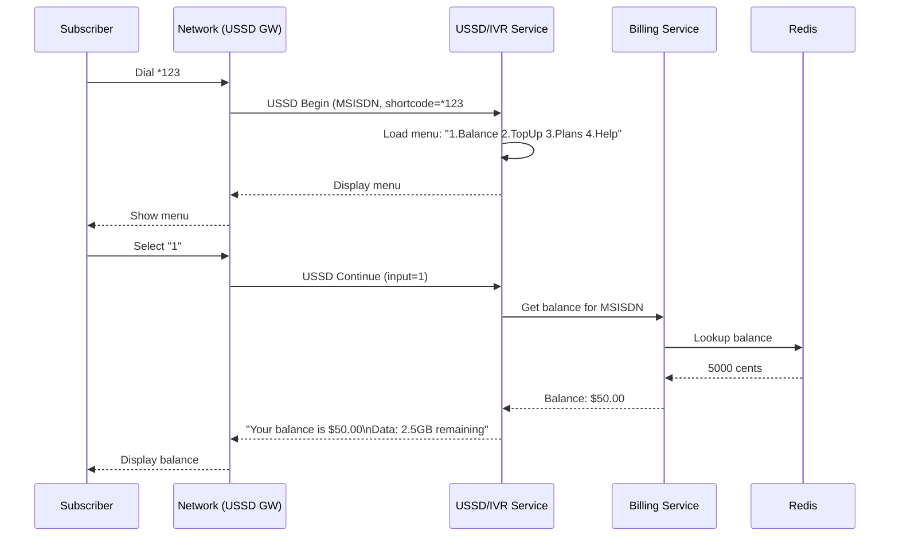

---

### UC-26: SIM Box Fraud Detection

**Actors:** System (ML model), Revenue Assurance Analyst

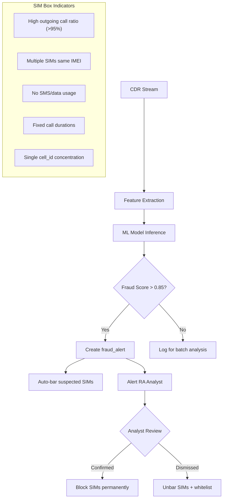

---

### UC-27: Smart Meter Reading Collection

**Actors:** Smart Meter, AMI Head-End, Meter Management Service

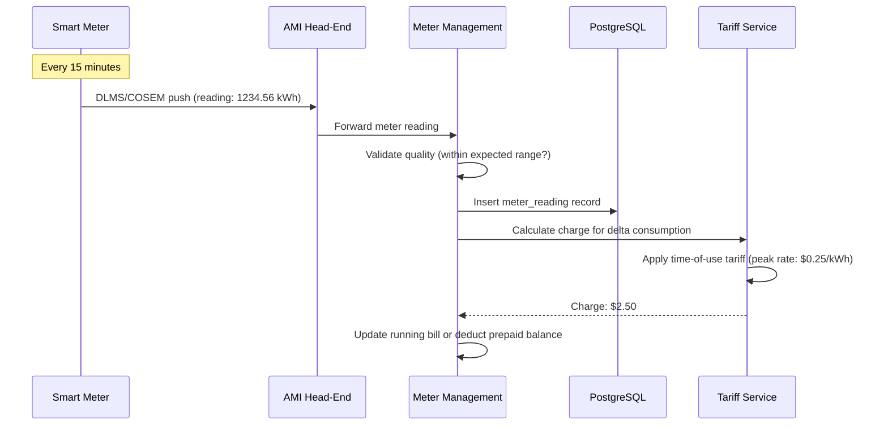

---

### UC-28: Prepaid Electricity STS Token Purchase

**Actors:** Customer, USSD/Web Portal, Tariff Service

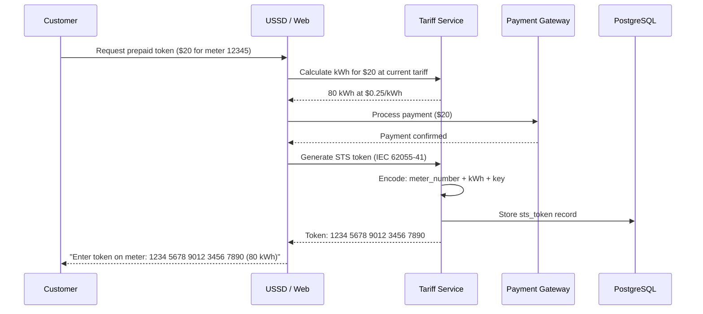

---

## 4. Use Case Traceability Matrix

| Use Case | TMF API | Service(s) | Database Table(s) |
|----------|---------|------------|-------------------|
| UC-01 | TMF629 | customer-management, provisioning, billing | customers, sim_inventory, number_inventory, balances |
| UC-07 | TMF622 | order-management, product-catalog | orders, order_items, products |
| UC-10 | TMF678 | charging-engine | balances, balance_operations, cdrs |
| UC-12 | TMF678 | billing-rating | balances, balance_operations, payments |
| UC-14 | TMF678 | billing-rating | invoices, invoice_line_items, cdrs |
| UC-18 | - | mediation | cdrs |
| UC-19 | TMF641 | provisioning | sim_inventory |
| UC-20 | TMF641 | provisioning | number_inventory |
| UC-23 | TMF668 | partner-service | partners, revenue_share_agreements |
| UC-25 | - | ussd-ivr-gateway, billing | ussd_sessions, balances |
| UC-26 | - | revenue-assurance | fraud_alerts, cdrs |
| UC-27 | - | meter-management | meters, meter_readings |
| UC-28 | - | tariff-service | sts_tokens, meters, utility_tariffs |
