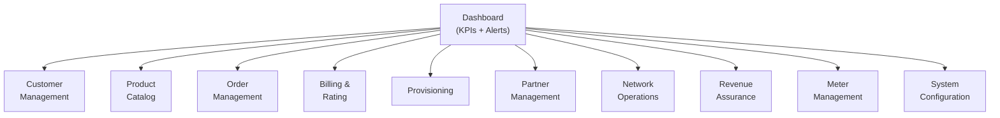
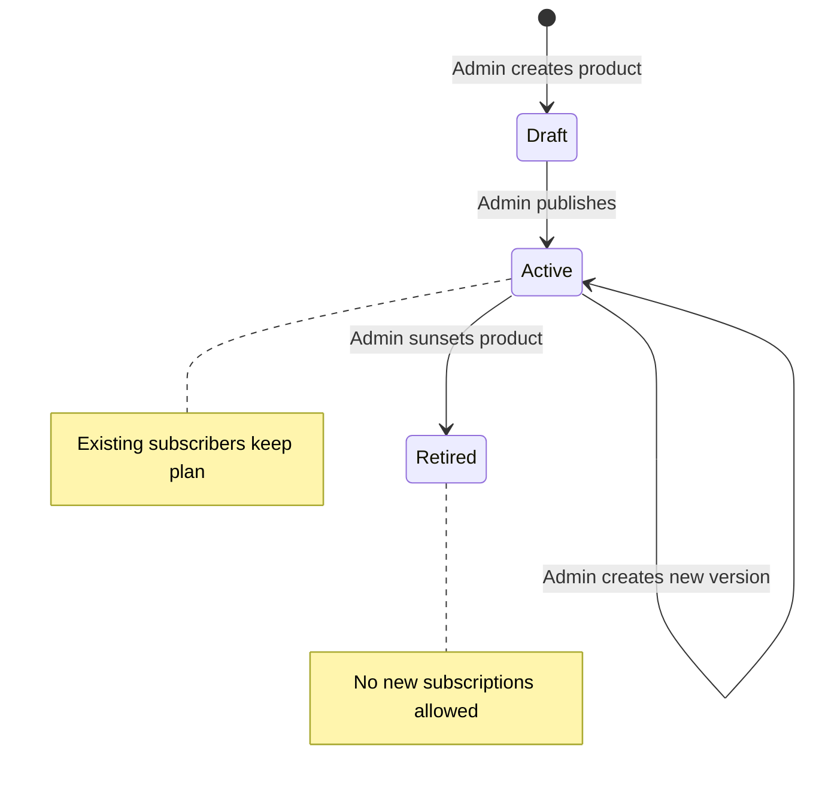

# Administrator User Manual -- ERP-BSS-OSS
> Version: 1.0 | Last Updated: 2026-02-23 | Status: Draft
> Classification: Internal | Author: AIDD System

---

## 1. Introduction

This manual is for BSS/OSS platform administrators responsible for system configuration, user management, product catalog maintenance, billing cycle management, partner administration, and operational monitoring.

---

## 2. Getting Started

### 2.1 Accessing the Admin Console

1. Navigate to `https://admin.bss-oss.example.com`
2. Log in with your credentials (OIDC via ERP-IAM)
3. Complete MFA verification (TOTP or hardware key)
4. Select your tenant from the tenant picker (if multi-tenant)

### 2.2 Admin Console Navigation

---

## 3. Product Catalog Management

### 3.1 Creating a New Product

1. Navigate to **Product Catalog** > **Products** > **Create New**
2. Fill in product details:
   - **Name:** e.g., "Unlimited Data Gold"
   - **Category:** Mobile / Broadband / Voice / Data / VAS / Bundle
   - **Type:** Simple / Bundle / Add-on
   - **Description:** Customer-facing description
3. Add pricing rules:
   - **One-time:** Activation fee
   - **Recurring:** Monthly subscription
   - **Usage:** Per-minute/MB/SMS rates
   - **Tiered:** Volume-based pricing
4. Define characteristics (data cap, speed, minutes included)
5. Set validity period
6. Save as **Draft**
7. Review and **Publish** to make active

### 3.2 Product Lifecycle Management

### 3.3 Creating Product Bundles

1. Create a parent product of type **Bundle**
2. Add component products:
   - Voice plan (e.g., 1000 minutes)
   - Data plan (e.g., 50 GB)
   - SMS pack (e.g., 500 SMS)
3. Set bundle discount (e.g., 15% off combined price)
4. Publish bundle

---

## 4. Customer Management

### 4.1 Customer Search

Search customers by:
- Name, phone number, email
- Account number
- SIM ICCID or IMSI
- MSISDN
- Segment (Bronze/Silver/Gold/Platinum)

### 4.2 Customer 360 View

The Customer 360 view consolidates:
- **Profile:** Name, contact details, segment, KYC status
- **Subscriptions:** Active plans and services
- **Billing:** Current balance, invoice history, payment history
- **Usage:** Voice minutes, data MB, SMS count
- **Orders:** Active and historical orders
- **Tickets:** Open trouble tickets
- **Interactions:** Call/email/chat history

### 4.3 KYC Management

1. Navigate to **Customer** > **KYC Queue**
2. Review pending verifications
3. Examine uploaded documents (ID, passport, utility bill)
4. Approve or reject with reason
5. System automatically updates customer status

---

## 5. Billing Administration

### 5.1 Running a Billing Cycle

1. Navigate to **Billing** > **Billing Cycles**
2. Select cycle (Monthly, Weekly, etc.)
3. Click **Run Billing Cycle**
4. Monitor progress dashboard:
   - Customers processed
   - Invoices generated
   - Errors encountered
5. Review error queue for failed invoices
6. Approve and release invoices for delivery

### 5.2 Dunning Configuration

Configure dunning levels:

| Level | Days Overdue | Action | Template |
|-------|-------------|--------|----------|
| 1 | 7 | SMS reminder | dunning_reminder_sms |
| 2 | 14 | Email warning | dunning_warning_email |
| 3 | 30 | Bar outgoing calls | dunning_bar_notice |
| 4 | 45 | Full suspension | dunning_suspend_notice |
| 5 | 90 | Termination | dunning_terminate_notice |

### 5.3 Dispute Resolution

1. Navigate to **Billing** > **Disputes**
2. Review disputed invoice and line items
3. Investigate: check CDRs, tariff applied, discounts
4. Decision: **Approve** (issue credit) or **Reject** (with explanation)
5. Customer is notified automatically

---

## 6. Partner Administration

### 6.1 Onboarding a New MVNO Partner

1. Navigate to **Partners** > **Onboard New Partner**
2. Enter partner details and KYC documents
3. Define revenue share agreement:
   - Share model: Fixed %, Tiered, Hybrid
   - Products covered
   - Effective dates
4. Allocate resources:
   - MSISDN block (e.g., +234-8XX-0000000 to +234-8XX-9999999)
   - SIM batch
5. Configure partner portal access
6. Activate partner

### 6.2 Monthly Settlement

1. Navigate to **Partners** > **Settlement**
2. Select period (e.g., January 2026)
3. Review calculated settlement:
   - Gross revenue by product
   - Partner share calculation
   - Operator share
4. Approve settlement
5. System posts AP entry to ERP-Finance
6. Partner receives notification + invoice

---

## 7. Network Operations

### 7.1 Alarm Dashboard

The NOC dashboard shows:
- Active alarms by severity (Critical / Major / Minor / Warning)
- Alarm trends (last 24 hours)
- Top alarming network elements
- SLA compliance metrics

### 7.2 Workforce Dispatch

1. Navigate to **Network Operations** > **Trouble Tickets**
2. Select ticket requiring field visit
3. Click **Dispatch**
4. Select available field engineer (nearest, skill match)
5. Assign and track via mobile workforce app

---

## 8. System Configuration

### 8.1 Tariff Management

1. Navigate to **Configuration** > **Tariff Plans**
2. Create or modify tariff plans
3. Set rates per service type and destination
4. Define time-of-day bands (peak, off-peak, shoulder)
5. Set effective dates (future-dated for planned changes)

### 8.2 Notification Templates

Manage SMS and email templates for:
- Welcome messages
- Balance alerts
- Invoice delivery
- Dunning notices
- Service change confirmations
- Fraud alerts

---

## 9. Monitoring and Alerts

### 9.1 Key Dashboards

| Dashboard | URL | Purpose |
|-----------|-----|---------|
| API Performance | Grafana /d/api-perf | Latency, throughput, errors |
| Billing Cycle | Grafana /d/billing | Invoice generation progress |
| Charging Engine | Grafana /d/ocs | Real-time balance operations |
| CDR Pipeline | Grafana /d/mediation | CDR processing rates |
| Infrastructure | Grafana /d/infra | Node CPU, memory, disk |

### 9.2 Alert Configuration

| Alert | Condition | Channel |
|-------|-----------|---------|
| API P99 > 100ms | 5 min sustained | Slack + PagerDuty |
| Error rate > 1% | 2 min sustained | PagerDuty |
| CDR pipeline backlog > 10M | Immediate | Slack |
| Database replication lag > 30s | Immediate | PagerDuty |
| Disk usage > 85% | Immediate | Slack |
