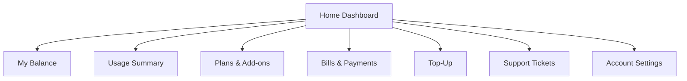
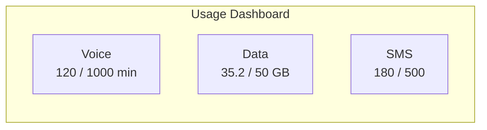

# End User Manual -- ERP-BSS-OSS Self-Care Portal
> Version: 1.0 | Last Updated: 2026-02-23 | Status: Draft
> Classification: Internal | Author: AIDD System

---

## 1. Introduction

Welcome to your self-care portal. This guide helps you manage your telecom or utility account, check balances, pay bills, change plans, and get support -- all from your phone or computer.

---

## 2. Getting Started

### 2.1 Registration

1. Visit `https://my.operator.example.com` or download the mobile app
2. Click **Register**
3. Enter your phone number (MSISDN)
4. Receive an OTP via SMS
5. Enter the OTP
6. Create a password
7. You are now logged in

### 2.2 Portal Navigation

---

## 3. Checking Your Balance

### 3.1 Via Self-Care Portal

1. Log in to the portal
2. Your balance is displayed on the home dashboard:
   - **Airtime Balance:** e.g., $50.00
   - **Data Remaining:** e.g., 15.3 GB of 50 GB
   - **SMS Remaining:** e.g., 320 of 500
   - **Voice Minutes:** e.g., 800 of 1000

### 3.2 Via USSD

1. Dial `*123#` from your phone
2. Select option **1** (Check Balance)
3. Your balance is displayed on screen

### 3.3 Balance Alerts

Configure balance alerts in **Settings** > **Notifications**:
- Low balance alert (e.g., when below $5.00)
- Data threshold alert (e.g., when 80% used)
- Auto-recharge when balance drops below threshold

---

## 4. Topping Up

### 4.1 Online Top-Up

1. Navigate to **Top-Up**
2. Select amount ($5, $10, $20, $50, or custom)
3. Choose payment method:
   - Debit/credit card
   - Bank transfer
   - Mobile money
4. Confirm payment
5. Balance is credited instantly

### 4.2 Voucher Top-Up

1. Navigate to **Top-Up** > **Voucher**
2. Scratch your recharge card
3. Enter the 16-digit voucher code
4. Click **Recharge**
5. Balance is credited instantly

### 4.3 Auto-Recharge

1. Navigate to **Settings** > **Auto-Recharge**
2. Enable auto-recharge
3. Set threshold (e.g., recharge when balance falls below $5)
4. Set recharge amount (e.g., $20)
5. Add a payment method
6. Save

---

## 5. Viewing and Paying Bills (Postpaid)

### 5.1 View Invoice

1. Navigate to **Bills & Payments**
2. Select a billing period
3. View invoice summary:
   - Subscription charges
   - Usage charges (voice, data, SMS)
   - One-time charges
   - Discounts applied
   - Tax
   - **Total due**
4. Click **Download PDF** for a printable copy

### 5.2 Make a Payment

1. On the invoice page, click **Pay Now**
2. Select payment method
3. Confirm payment
4. Receive confirmation SMS and email

### 5.3 Set Up Auto-Pay

1. Navigate to **Settings** > **Auto-Pay**
2. Enable auto-pay
3. Add payment method
4. Choose pay date (invoice date, due date, or custom)
5. Save

---

## 6. Managing Your Plan

### 6.1 View Current Plan

Navigate to **Plans & Add-ons** to see:
- Plan name and description
- Included allowances (voice, data, SMS)
- Monthly cost
- Renewal date

### 6.2 Upgrade or Downgrade Plan

1. Navigate to **Plans & Add-ons** > **Change Plan**
2. Browse available plans
3. Compare with your current plan
4. Select new plan
5. Review pro-rated charges (if applicable)
6. Confirm change
7. New plan activates immediately (or at next cycle, based on your choice)

### 6.3 Buy Data Add-Ons

1. Navigate to **Plans & Add-ons** > **Data Bundles**
2. Select a data bundle (e.g., 5 GB for $5, valid 30 days)
3. Confirm purchase
4. Data is added to your account immediately

---

## 7. Usage Summary

### 7.1 View Usage

Navigate to **Usage Summary** to see:
- **Voice:** Minutes used this period (with breakdown by on-net/off-net/international)
- **Data:** MB/GB used (daily breakdown chart)
- **SMS:** Messages sent
- **Roaming:** Usage while traveling

### 7.2 Call History

View your recent call records:
- Date and time
- Number called / received
- Duration
- Charge amount

---

## 8. Support and Trouble Tickets

### 8.1 Creating a Trouble Ticket

1. Navigate to **Support** > **Create Ticket**
2. Select category: Billing / Network / Service / General
3. Describe your issue
4. Attach screenshots if needed
5. Submit
6. Receive ticket number via SMS

### 8.2 Tracking a Ticket

1. Navigate to **Support** > **My Tickets**
2. View status: Open / In Progress / Resolved / Closed
3. Add comments or additional information
4. Rate resolution when ticket is closed

---

## 9. Utility Customers (Electricity/Water/Gas)

### 9.1 View Meter Readings

1. Navigate to **Meter** > **Readings**
2. View consumption history (daily, weekly, monthly charts)
3. See current reading and estimated bill

### 9.2 Buy Prepaid Electricity Token

1. Navigate to **Meter** > **Buy Token**
2. Enter your meter number
3. Enter amount (e.g., $20)
4. System calculates kWh (e.g., 80 kWh)
5. Make payment
6. Receive 20-digit STS token via SMS
7. Enter token on your meter keypad

---

## 10. USSD Quick Reference

| USSD Code | Function |
|-----------|----------|
| `*123#` | Main menu |
| `*123*1#` | Check balance |
| `*123*2#` | Top-up |
| `*123*3#` | Buy data bundle |
| `*123*4#` | Check data balance |
| `*123*5#` | Buy electricity token |
| `*123*0#` | Help |

---

## 11. Troubleshooting

| Issue | Solution |
|-------|---------|
| Cannot make calls | Check balance; dial *123*1# to verify |
| No data connection | Check data balance; restart device; check APN settings |
| Bill seems incorrect | Log in to portal, review line items, file a dispute if needed |
| USSD not responding | Try again in 30 seconds; check network signal |
| Token not accepted by meter | Verify token digits; contact support with meter number |
