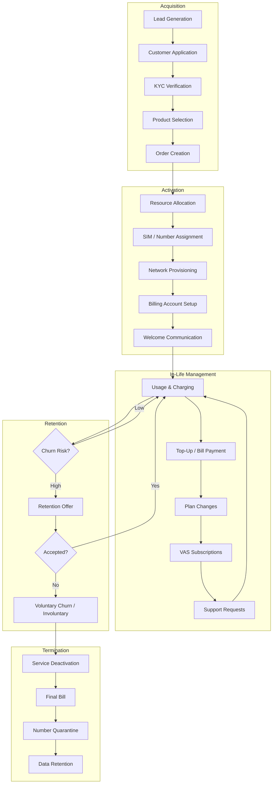
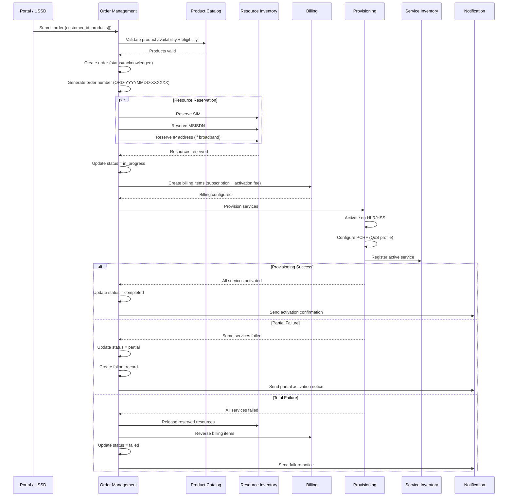
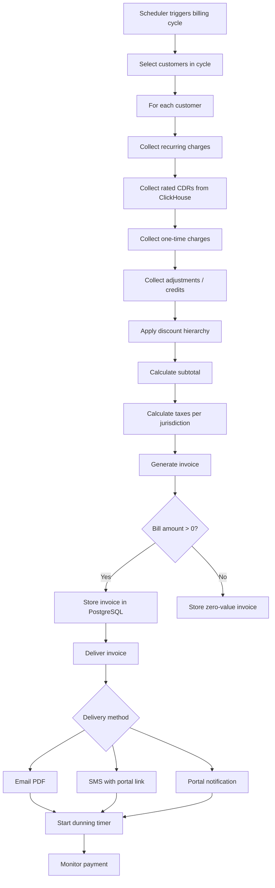
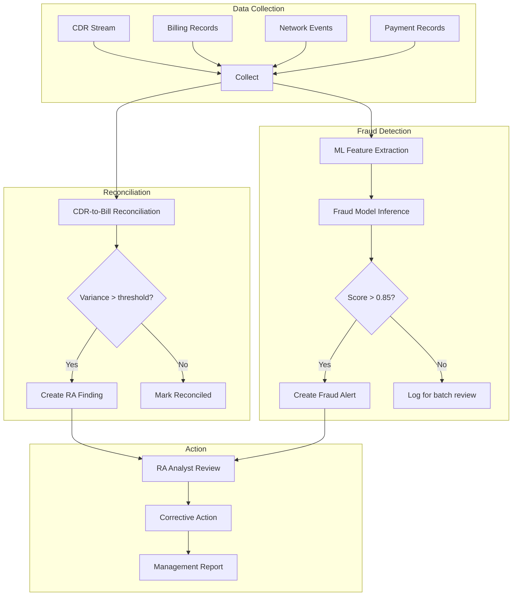
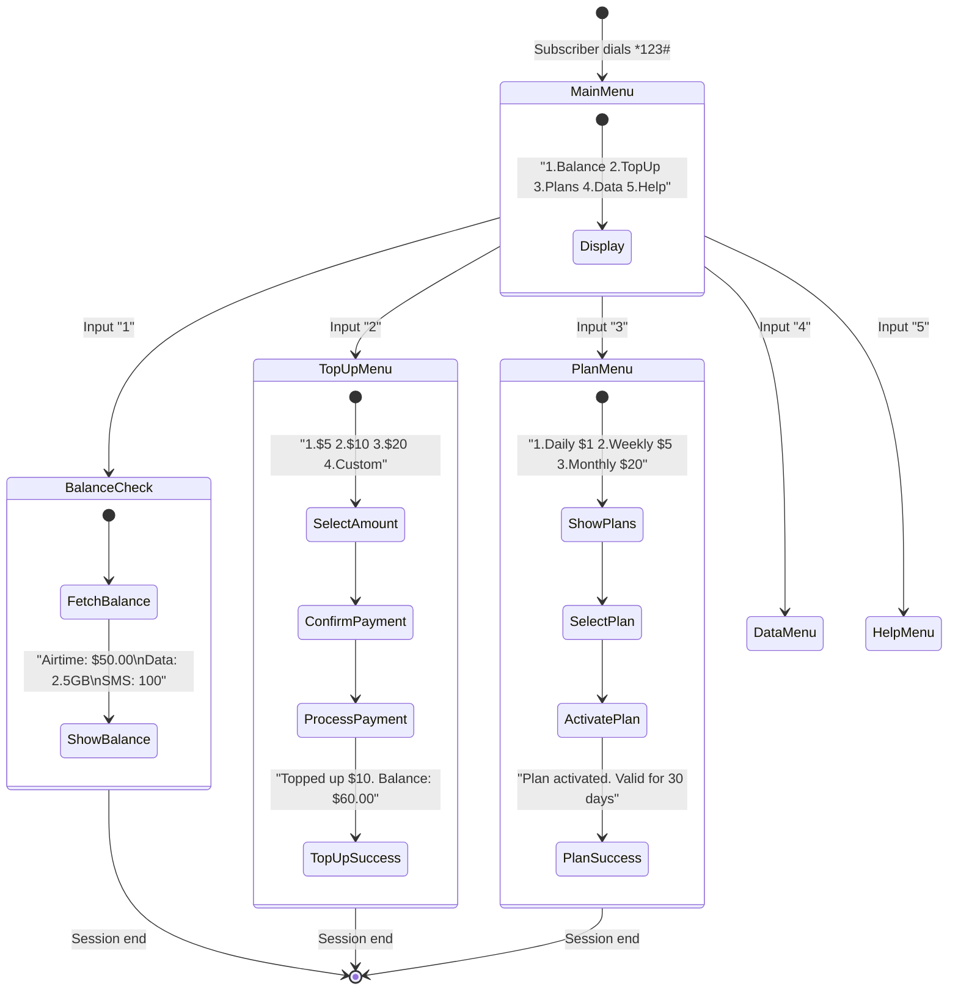
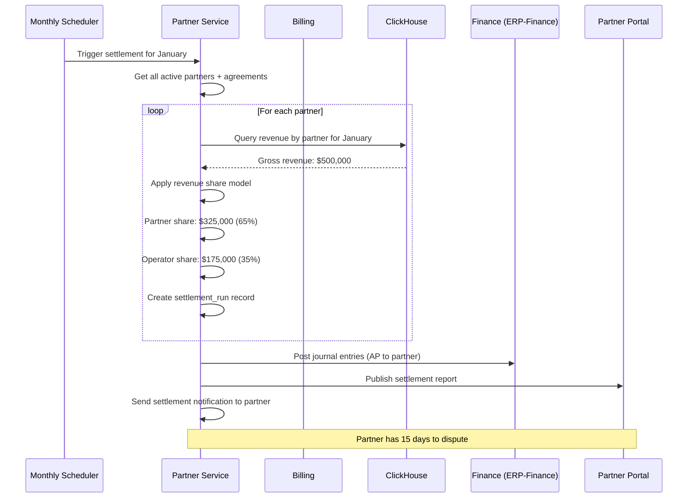
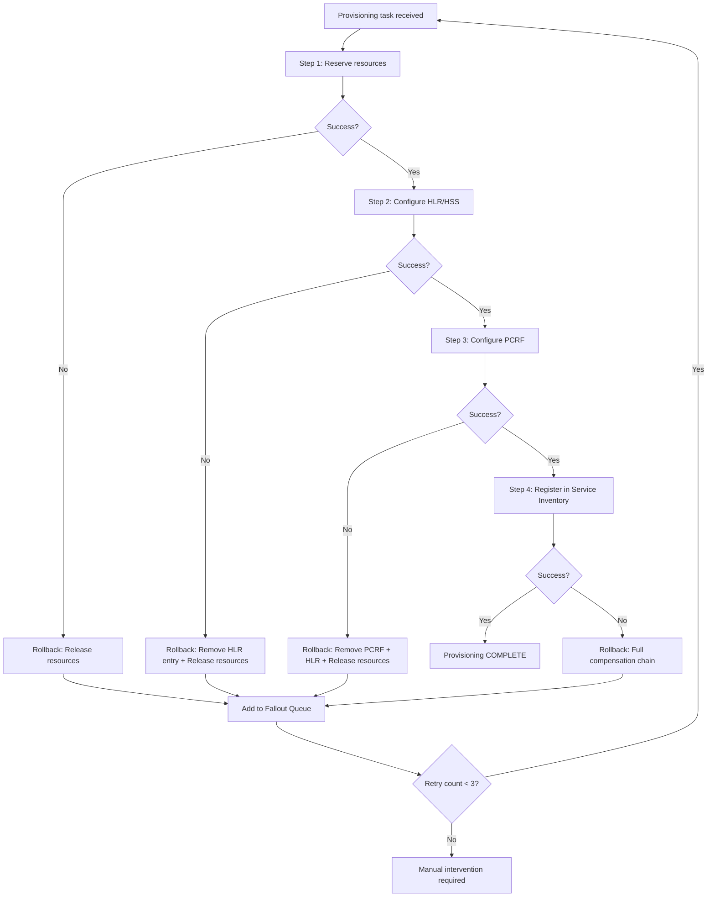

# Workflows and User Journeys -- ERP-BSS-OSS
> Version: 1.0 | Last Updated: 2026-02-23 | Status: Draft
> Classification: Internal | Author: AIDD System

---

## 1. Overview

This document maps the end-to-end workflows for key business processes in the ERP-BSS-OSS platform, covering the complete telecom subscriber lifecycle from acquisition through retention and winback, plus utility metering workflows.

---

## 2. Subscriber Lifecycle Workflow



---

## 3. Order-to-Activate (O2A) Workflow

The O2A workflow is the most critical cross-service orchestration in the platform.



---

## 4. Billing Cycle Workflow



---

## 5. Revenue Assurance Workflow



---

## 6. USSD Session Workflow



---

## 7. Partner Settlement Workflow



---

## 8. Network Fault Management Workflow

```mermaid
graph TB
    A[Network alarm received<br/>SNMP trap / syslog] --> B[Alarm correlation engine]
    B --> C{Known pattern?}
    C -->|Yes| D[Auto-create trouble ticket]
    C -->|No| E[Queue for NOC review]

    D --> F{Service impacting?}
    F -->|Yes| G[Priority: Critical]
    F -->|No| H[Priority: Medium]

    G --> I[Notify on-call engineer]
    I --> J[SLA timer starts (4 hour resolution)]
    J --> K{Remote fix possible?}
    K -->|Yes| L[Remote remediation]
    K -->|No| M[Dispatch field engineer]

    M --> N[Workforce management]
    N --> O[Assign nearest available tech]
    O --> P[Travel + repair]
    P --> Q[Verify service restored]

    L --> Q
    Q --> R[Close trouble ticket]
    R --> S[Update SLA metrics]
```

---

## 9. Provisioning Rollback Workflow



---

## 10. Smart Meter Lifecycle Workflow

```mermaid
graph TB
    subgraph "Installation"
        M1[Meter procurement] --> M2[Meter registration in system]
        M2 --> M3[Assign to customer + location]
        M3 --> M4[Field installation]
        M4 --> M5[Communication test (DLMS/COSEM)]
        M5 --> M6[Initial reading recorded]
    end

    subgraph "Operations"
        M6 --> O1[Periodic readings every 15 min]
        O1 --> O2{Reading valid?}
        O2 -->|Yes| O3[Store + calculate charges]
        O2 -->|No| O4[Flag for investigation]
        O4 --> O5{Tamper detected?}
        O5 -->|Yes| O6[Create tamper alert + dispatch]
        O5 -->|No| O7[Estimate reading + flag]
        O3 --> O1
    end

    subgraph "Decommission"
        D1[Meter end of life / customer move] --> D2[Final reading]
        D2 --> D3[Final bill]
        D3 --> D4[Decommission meter]
        D4 --> D5[Return to inventory or dispose]
    end
```
