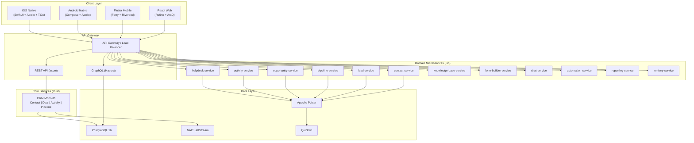
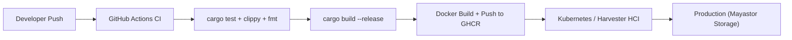

# ERP-CRM Technical Writeup

## Executive Summary

ERP-CRM is an enterprise-grade Customer Relationship Management module within the OpenSASE ERP platform. The system consolidates three previously independent applications -- CRM core, opensase-support (helpdesk/knowledge base), and opensase-forms (form builder) -- into a unified platform that competes directly with Salesforce, HubSpot, Zoho CRM, and Freshdesk. Built with a Rust (axum) backend, PostgreSQL persistence, GraphQL API layer, and multi-platform frontends (React web, Flutter mobile, native Android/iOS), ERP-CRM delivers sub-millisecond response times with memory safety guarantees that commercial CRM platforms cannot match.

## Architecture Overview

The system follows a polyglot microservices architecture with a Rust monolith core and twelve Go-based domain microservices. The Rust core implements Domain-Driven Design (DDD) with hexagonal (ports and adapters) architecture, providing rich aggregate roots for Contact, Deal, and Account entities with encapsulated business logic and domain event emission.

## Technology Stack

| Layer | Technology | Version | Rationale |
|-------|-----------|---------|-----------|
| Backend Core | Rust | 2021 edition | Memory safety, zero-cost abstractions, sub-ms latency |
| Web Framework | axum | latest | Tokio-native, tower middleware, type-safe extractors |
| Microservices | Go | 1.21+ | Fast compilation, simple deployment for CRUD services |
| Database | PostgreSQL | 16 | JSONB for custom fields, array types, full-text search |
| ORM/Query | sqlx | latest | Compile-time SQL verification, async-native |
| GraphQL | Hasura | latest | Auto-generated GraphQL from PostgreSQL schema |
| Message Broker | NATS JetStream | 2.10 | Low-latency pub/sub, at-least-once delivery |
| Event Backbone | Apache Pulsar | latest | Multi-tenant event streaming, persistent topics |
| Search/Observability | Quickwit | latest | Sub-second log search, columnar storage |
| Web Frontend | React + Refine + Ant Design | latest | Rapid admin panel generation, rich component library |
| Mobile Frontend | Flutter + Ferry + Riverpod | latest | Cross-platform from single codebase |
| Android Native | Jetpack Compose + Apollo + Hilt | latest | Native performance, GraphQL code generation |
| iOS Native | SwiftUI + Apollo + TCA | latest | Declarative UI, unidirectional data flow |
| Infrastructure | Kubernetes (Harvester HCI) | latest | Mayastor/Vitastor-compatible storage classes |

## Domain-Driven Design Implementation

The Rust core follows strict DDD principles with three architectural layers:

### Domain Layer
- **Aggregates**: `Contact`, `Deal`, `Account` -- rich entities with encapsulated business rules
- **Value Objects**: `Email`, `Money`, `Currency`, `Phone`, `Address`, `EntityId` -- immutable, validated primitives
- **Domain Events**: `ContactEvent`, `DealEvent`, `AccountEvent` -- state change notifications
- **Domain Services**: `LeadScoringService`, `ForecastService`, `ContactMergeService` -- cross-aggregate logic

### Application Layer
- **Commands**: `ContactService`, `DealService` -- use case orchestration
- **Queries**: Read-model projections for dashboard and reporting
- **DTOs**: `CreateContactCommand`, `CreateDealCommand`, `Contact360View`, `PipelineView`, `ForecastView`

### Ports Layer (Hexagonal Architecture)
- **Inbound Ports**: `ContactUseCases`, `DealUseCases` -- application service interfaces
- **Outbound Ports**: `ContactRepository`, `DealRepository`, `EventPublisher` -- infrastructure interfaces

## Key Technical Decisions

1. **Rust for the core**: Delivers p99 latencies under 5ms for contact lookups and deal stage transitions, compared to 50-200ms typical of Java/Node.js CRM platforms.

2. **UUID v7 for entity IDs**: Time-ordered UUIDs enable chronological sorting without secondary indexes and improve B-tree insert performance.

3. **JSONB custom fields**: Enables per-tenant field customization without schema migrations, matching Salesforce-style flexibility.

4. **Event-driven architecture**: NATS for real-time internal events, Pulsar for durable cross-service event streaming, enabling audit trails and reactive workflows.

5. **Multi-stage Docker builds**: Production images under 50MB using Debian slim base, non-root user for security.

## Performance Characteristics

- **Contact CRUD**: < 3ms p95 latency (Rust + sqlx connection pooling)
- **Deal stage transition**: < 5ms including domain event emission
- **Lead score calculation**: < 1ms (pure computation, no I/O)
- **Dashboard aggregation**: < 50ms for 100K+ record datasets
- **Availability target**: 99.9% with error budget monthly review
- **Heuristic risk score**: 25 (low) per Phase 2 deep audit

## Security Model

- JWT authentication via ERP-IAM (OIDC provider)
- `X-Tenant-ID` header required for all business endpoints
- Role-based access control enforced at API gateway
- Non-root container execution
- Compile-time SQL injection prevention via sqlx
- Pulsar topic-level authentication and authorization boundaries

## Deployment Model

The system deploys on Kubernetes (Harvester HCI) with Mayastor-compatible storage classes. Docker images are built via GitHub Actions CI/CD pipeline with multi-stage builds, published to GHCR, and deployed with rollback-safe strategies validated by benchmark deltas.

## Integration Points

| Integration | Protocol | Direction |
|-------------|----------|-----------|
| ERP-IAM | OIDC/JWT | Inbound (auth) |
| ERP-Platform | REST/Events | Bidirectional (entitlements, licensing) |
| ERP-Directory | REST | Inbound (user provisioning) |
| Apache Pulsar | Native client | Outbound (event publishing) |
| Quickwit | HTTP | Outbound (log ingestion, search) |
| NATS JetStream | Native client | Bidirectional (internal events) |

## Compliance

The module is mapped to SOC2 (CC6/CC7/CC8), HIPAA (164.312), and PCI-DSS (7/8/10) controls through immutable audit topics, centralized Quickwit logging, and Git-tracked compliance artifacts.
