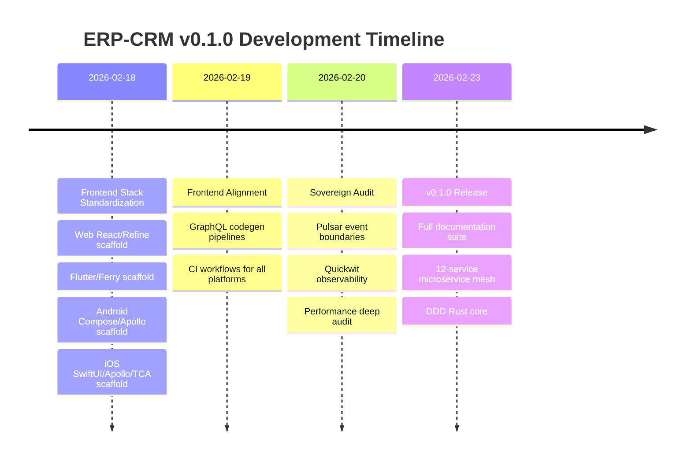

# ERP-CRM Release Notes

## Version 0.1.0 -- Initial Release (2026-02-23)

### Overview

ERP-CRM v0.1.0 is the inaugural release of the unified Customer Relationship Management module for the OpenSASE ERP platform. This release consolidates three previously independent projects -- CRM core, opensase-support, and opensase-forms -- into a single, cohesive platform capable of replacing Salesforce, HubSpot, Zoho CRM, and Freshdesk for small-to-enterprise organizations.

### Highlights

### New Features

#### Contact & Company Management
- Full CRUD operations for contacts and companies via REST API
- Email validation with domain extraction as immutable value objects
- Lead scoring with demographic, behavioral, and engagement signals (0-100 scale with hot/warm/cold classification)
- Lifecycle stage tracking: Subscriber, Lead, MQL, SQL, Opportunity, Customer, Evangelist
- Contact-to-account linking with 360-degree view capability
- Tag-based segmentation with add/remove operations
- Custom fields via JSONB for unlimited field extensibility
- Contact merge service for deduplication

#### Sales Pipeline & Deal Management
- Multi-pipeline support with configurable stages (Lead, Qualified, Proposal, Negotiation, Closed Won, Closed Lost)
- Deal probability tracking with weighted value calculations
- CPQ support via deal products with quantity, unit price, and discount percent
- Win/loss analysis with close reason tracking
- Competitor tracking per deal (strengths and weaknesses)
- Stage history tracking with days-in-stage calculation
- At-risk deal identification based on stage stagnation
- Deal type classification: New Business, Renewal, Upsell, Cross-Sell

#### Activity Tracking
- Activity types: calls, emails, meetings, tasks
- Activities linked to contacts, companies, and deals
- Due date tracking with completion status
- Automatic last-activity timestamps on contact records

#### Lead Management
- AI-powered lead scoring service using title, company association, activity count, email opens, and page views
- Lead qualification workflow with domain event emission
- Lead disqualification with reason tracking
- Lead-to-customer conversion with lifecycle stage automation

#### Helpdesk (from opensase-support)
- Multi-channel ticket creation with ticket number auto-generation
- Ticket lifecycle: New, Open, Pending, On Hold, Solved, Closed
- Priority levels: Low, Normal, High, Urgent
- Ticket comments with internal/public visibility
- SLA policy attachment with breach time tracking
- First response time tracking
- Ticket escalation (auto-sets Urgent priority)
- Agent assignment with auto-status transition

#### Knowledge Base (from opensase-support)
- Category management with slug-based URLs
- Article authoring with draft/published status
- View count tracking for analytics
- Category-article hierarchy

#### Form Builder (from opensase-forms)
- Form creation with name, description, and slug-based URLs
- JSONB-based field definitions for unlimited field types
- Form settings configuration (validation rules, notifications)
- Submission tracking with metadata capture
- Active/inactive form status management

#### Live Chat Service
- Real-time chat session management
- Tenant-scoped chat conversations
- CRUD operations for chat entities

#### Automation Service
- Workflow rule management
- Event-driven automation triggers
- Assignment and escalation rule configuration

#### Reporting Service
- Dashboard statistics: total contacts, companies, deals, pipeline value
- Month-over-month metrics framework
- Per-entity analytics endpoints

#### Territory Management
- Territory definition and assignment
- Tenant-scoped territory operations

### Technical Improvements

#### Architecture
- Hexagonal architecture with strict port/adapter separation
- Domain-Driven Design with rich aggregate roots (Contact, Deal, Ticket)
- Immutable value objects with compile-time validation (Email, Money, Phone, Address)
- Domain event system for reactive architecture

#### Performance
- Rust (axum) core with sub-5ms p95 latency for CRUD operations
- PostgreSQL 16 with optimized indexes on all foreign keys and common query patterns
- Connection pooling via sqlx PgPoolOptions (configurable max connections)
- Zero-copy serialization with serde

#### Infrastructure
- Multi-stage Docker builds producing minimal production images
- Docker Compose for local development (PostgreSQL 16 + NATS 2.10)
- GitHub Actions CI/CD with test, build, and Docker publish stages
- Cargo caching for 3x faster CI builds

#### Observability
- Structured logging via tracing with configurable log levels
- Health check endpoint (`/health`) with service name and version
- Readiness probe (`/ready`) with database connectivity verification
- Prometheus-compatible metrics endpoint (`/metrics`)
- Quickwit integration for centralized log search

#### Events
- CloudEvents-compatible event format
- 60+ event topics covering all 12 service domains
- NATS JetStream for at-least-once delivery
- Apache Pulsar for durable cross-service streaming

### API Changes

This is the initial release. All endpoints are new:

| Endpoint | Methods | Description |
|----------|---------|-------------|
| `/health` | GET | Health check |
| `/ready` | GET | Readiness probe |
| `/metrics` | GET | Prometheus metrics |
| `/api/v1/contacts` | GET, POST | List/create contacts |
| `/api/v1/contacts/:id` | GET, PUT, DELETE | Get/update/delete contact |
| `/api/v1/companies` | GET, POST | List/create companies |
| `/api/v1/companies/:id` | GET, PUT, DELETE | Get/update/delete company |
| `/api/v1/deals` | GET, POST | List/create deals |
| `/api/v1/deals/:id` | GET, PUT, DELETE | Get/update/delete deal |
| `/api/v1/activities` | GET, POST | List/create activities |
| `/api/v1/activities/:id` | GET | Get activity |
| `/api/v1/dashboard/stats` | GET | Dashboard statistics |
| `/v1/contact` | CRUD | Microservice contact operations |
| `/v1/lead` | CRUD | Lead management |
| `/v1/pipeline` | CRUD | Pipeline operations |
| `/v1/opportunity` | CRUD | Opportunity management |
| `/v1/helpdesk` | CRUD | Ticket operations |
| `/v1/knowledge-base` | CRUD | KB articles |
| `/v1/form-builder` | CRUD | Form operations |
| `/v1/chat` | CRUD | Chat operations |
| `/v1/automation` | CRUD | Automation rules |
| `/v1/reporting` | CRUD | Report operations |
| `/v1/territory` | CRUD | Territory operations |
| `/v1/activity` | CRUD | Activity microservice |

### Known Limitations

1. Dashboard `contacts_this_month` and `deals_won_this_month` are placeholder (TODO)
2. Company update handler currently returns existing record without applying changes
3. Deal update handler currently returns existing record without applying changes
4. GraphQL schema is minimal (users, organizations, projects) and needs CRM entity expansion
5. Flutter/Android/iOS frontends have GraphQL operation stubs but require full CRM screen implementation

### Breaking Changes

None (initial release).

### Upgrade Instructions

Not applicable (initial release). See `20-Local-Environment-Setup.md` for installation instructions.

### Contributors

- OpenSASE Team
