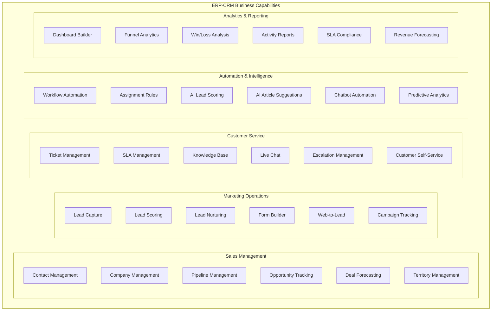
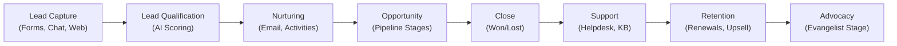
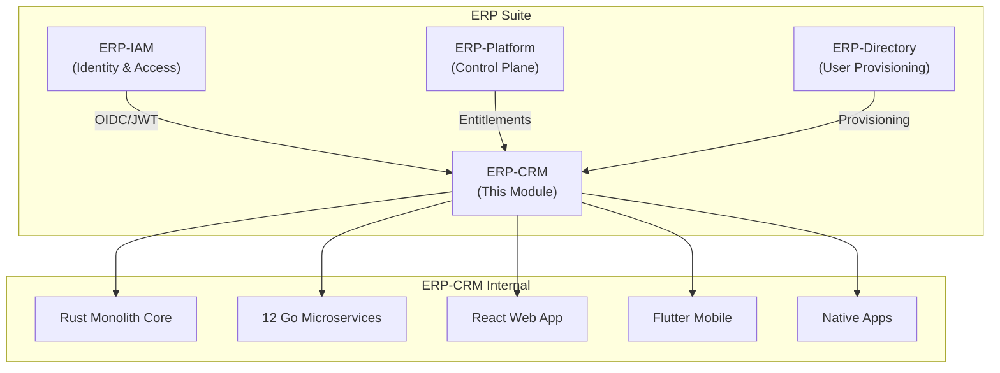
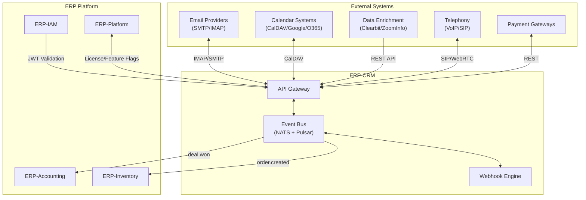
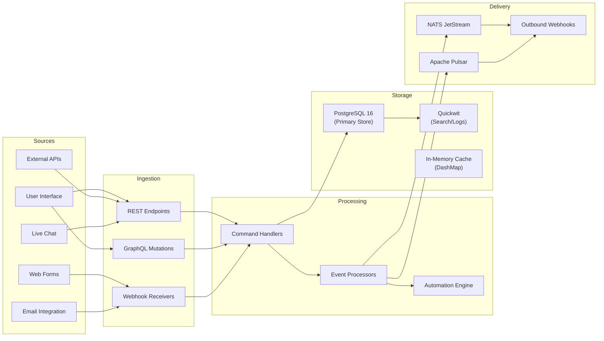
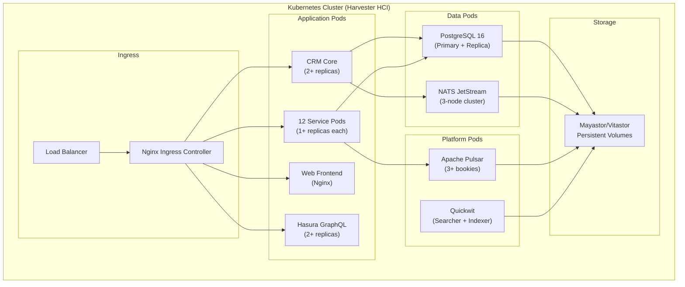

# ERP-CRM Enterprise Architecture

## 1. Business Architecture

### 1.1 Business Capability Model

### 1.2 Value Stream Mapping

### 1.3 Stakeholder Map

| Stakeholder | Role | Primary Concerns |
|------------|------|-----------------|
| Sales Representatives | End User | Pipeline visibility, contact 360 view, mobile access |
| Sales Managers | End User | Forecasting, territory management, team performance |
| Support Agents | End User | Ticket queue, SLA tracking, knowledge base |
| Marketing Team | End User | Lead capture, scoring, form builder |
| CRM Administrator | Admin | Configuration, automation rules, reporting |
| IT Operations | Technical | Deployment, monitoring, security, compliance |
| Executive Leadership | Sponsor | Revenue insights, customer health, ROI |
| Customers | External | Self-service portal, chat, knowledge base |

## 2. Application Architecture

### 2.1 Application Portfolio

### 2.2 Integration Architecture

### 2.3 Application Decomposition

| Application Component | Technology | Deployment | Scaling Strategy |
|-----------------------|-----------|------------|-----------------|
| CRM Core Monolith | Rust (axum) | Docker/K8s | Horizontal (stateless) |
| Contact Service | Go | Docker/K8s | Horizontal |
| Lead Service | Go | Docker/K8s | Horizontal |
| Pipeline Service | Go | Docker/K8s | Horizontal |
| Opportunity Service | Go | Docker/K8s | Horizontal |
| Activity Service | Go | Docker/K8s | Horizontal |
| Helpdesk Service | Go | Docker/K8s | Horizontal |
| Knowledge Base Service | Go | Docker/K8s | Horizontal |
| Form Builder Service | Go | Docker/K8s | Horizontal |
| Chat Service | Go | Docker/K8s | Horizontal (WebSocket affinity) |
| Automation Service | Go | Docker/K8s | Horizontal |
| Reporting Service | Go | Docker/K8s | Vertical (memory-bound) |
| Territory Service | Go | Docker/K8s | Horizontal |
| Web Frontend | React (static) | CDN/Nginx | CDN edge caching |
| Mobile Frontend | Flutter | App Stores | N/A (client-side) |
| GraphQL Engine | Hasura | Docker/K8s | Horizontal |

## 3. Data Architecture

### 3.1 Data Flow Architecture

### 3.2 Data Classification

| Data Category | Sensitivity | Retention | Encryption |
|--------------|------------|-----------|-----------|
| Contact PII (email, phone, name) | High | Per tenant policy | AES-256 at rest, TLS in transit |
| Company Information | Medium | Indefinite | TLS in transit |
| Deal Financial Data | High | 7 years (regulatory) | AES-256 at rest, TLS in transit |
| Activity Logs | Medium | 2 years | TLS in transit |
| Ticket Content | Medium | Per tenant policy | TLS in transit |
| Form Submissions | High (may contain PII) | Per form policy | AES-256 at rest, TLS in transit |
| Chat Transcripts | Medium | 1 year default | TLS in transit |
| Audit Events | High | 7 years | Immutable, signed |
| Analytics/Reports | Low | 90 days cache | TLS in transit |

## 4. Technology Architecture

### 4.1 Infrastructure Topology

### 4.2 Technology Standards

| Standard | Implementation |
|----------|---------------|
| Authentication | OIDC/JWT via ERP-IAM |
| Authorization | RBAC with tenant isolation |
| API Style | REST (core) + GraphQL (frontend) |
| Messaging | Apache Pulsar (async inter-service) |
| Internal Events | NATS JetStream (real-time) |
| Observability | Quickwit (logs) + shared log schema |
| Storage | Mayastor/Vitastor on Harvester HCI |
| CI/CD | GitHub Actions |
| Containerization | Docker (multi-stage) |
| Orchestration | Kubernetes |
| Event Format | CloudEvents v1.0 |

## 5. Governance

### 5.1 Architecture Principles

1. **Sovereign-first**: Self-hosted, no external SaaS dependencies for core functionality
2. **Event-driven**: All state changes emit domain events for reactive architecture
3. **DDD alignment**: Business logic encapsulated in domain aggregates, not in handlers
4. **Hexagonal isolation**: Infrastructure concerns never leak into domain logic
5. **Multi-tenant by design**: All data scoped by `X-Tenant-ID`
6. **Performance-first**: Rust core for latency-critical paths, Go for CRUD services
7. **Compliance-as-code**: SOC2/HIPAA/PCI-DSS controls tracked as Git artifacts

### 5.2 Architecture Review Checklist

- [ ] All new services follow the standard Go microservice template
- [ ] Domain events published for all state-changing operations
- [ ] Tenant isolation verified at API gateway and database layers
- [ ] Performance benchmarks established for critical paths
- [ ] Compliance artifacts updated in `COMPLIANCE.md`
- [ ] Architecture Decision Record created for significant changes
