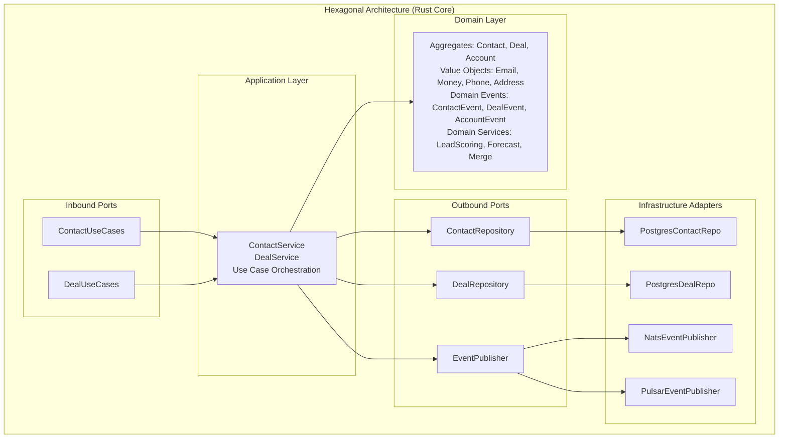
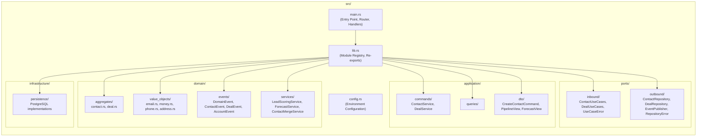
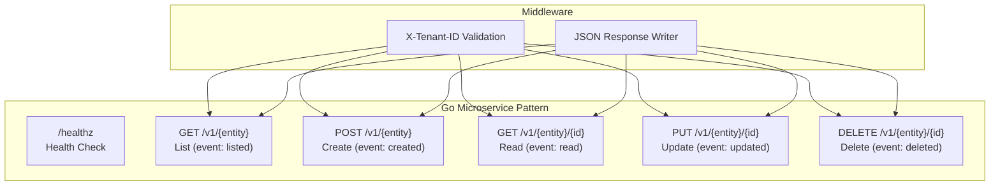
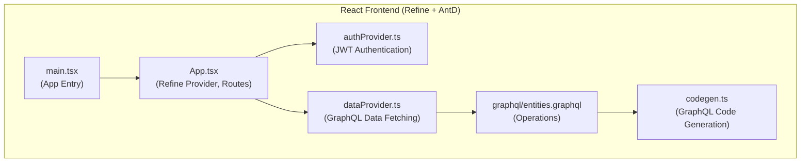
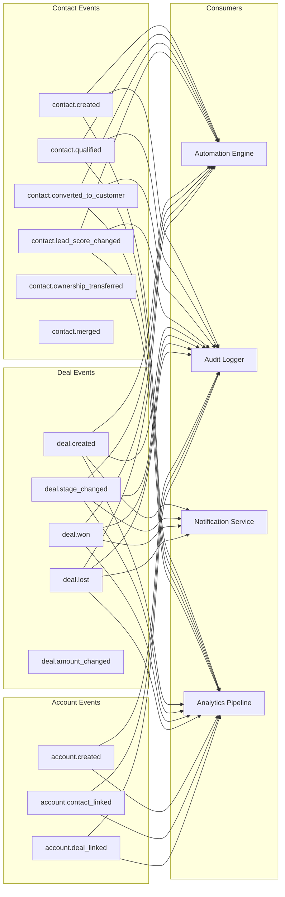
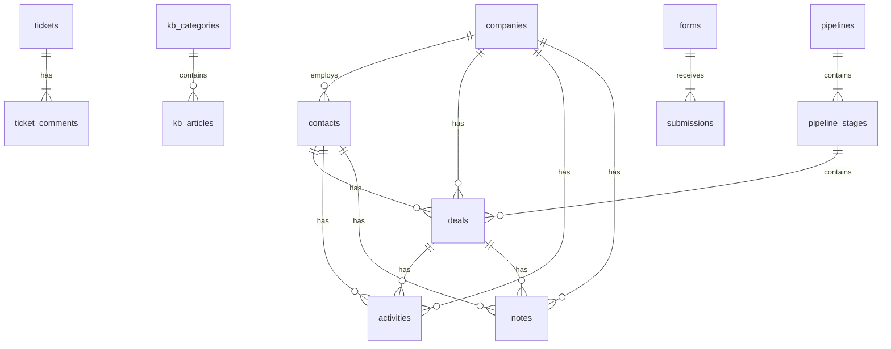
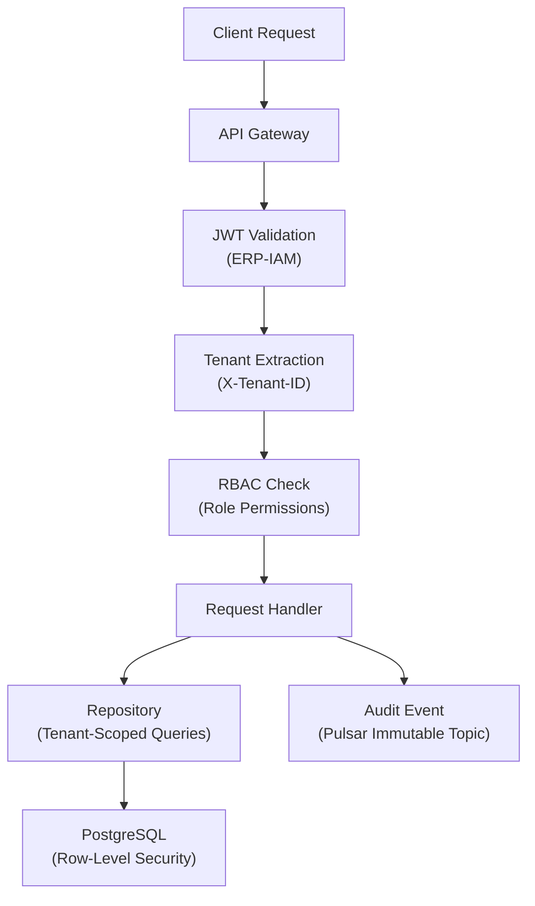

# ERP-CRM Software Architecture

## 1. Architecture Style

ERP-CRM employs a hybrid architecture combining a Domain-Driven Design (DDD) Rust monolith for core CRM logic with twelve Go microservices for domain-specific CRUD operations. The system follows hexagonal (ports and adapters) architecture internally and communicates across service boundaries via event-driven messaging.



## 2. Component Architecture

### 2.1 Rust Core Monolith (`src/`)

The Rust core is the authoritative system of record for contacts, companies, deals, activities, and pipelines. It exposes REST API endpoints via axum and publishes domain events via NATS.



### 2.2 Go Microservices (`services/`)

Each Go microservice follows an identical structure with health check, CRUD endpoints, tenant isolation, and CloudEvents topic emission.



### 2.3 Web Frontend (`web/`)



## 3. Domain Model

### 3.1 Contact Aggregate

The Contact aggregate is the richest domain object, encapsulating lead lifecycle management, scoring, qualification, and ownership.

```mermaid
statechart-v2
    [*] --> New
    New --> Contacted: Record Activity
    Contacted --> Qualified: qualify()
    Contacted --> Unqualified: disqualify()
    Qualified --> Nurturing: Needs Nurture
    Nurturing --> Qualified: Re-qualify
    Qualified --> Converted: convert_to_customer()
    Unqualified --> [*]: Archived

    state Qualified {
        [*] --> SalesQualifiedLead
        SalesQualifiedLead --> Opportunity: Deal Created
    }

    state Converted {
        [*] --> Customer
        Customer --> Evangelist: High NPS
    }
```

**Key Business Rules:**
- Cannot qualify an already-unqualified contact
- Cannot qualify an already-qualified contact
- Cannot convert to customer if already a customer
- Lead score changes of 10+ points emit LeadScoreChanged event
- Ownership transfer emits OwnershipTransferred event

### 3.2 Deal Aggregate

```mermaid
statechart-v2
    [*] --> Open
    Open --> Open: move_to_stage()
    Open --> Won: close_won()
    Open --> Lost: close_lost()
    Won --> Open: reopen()
    Lost --> Open: reopen()
    Won --> [*]: Archived
    Lost --> [*]: Archived

    state Open {
        [*] --> Lead
        Lead --> Qualified: 25%
        Qualified --> Proposal: 50%
        Proposal --> Negotiation: 75%
        Negotiation --> ClosedWon: 100%
    }
```

**Key Business Rules:**
- Closed deals cannot have stage changes or amount updates
- Currency mismatch on amount updates raises error
- Product addition/removal triggers amount recalculation
- Weighted value = amount x (probability / 100)
- Stage history is immutable and append-only

### 3.3 Ticket Aggregate (Support)

```mermaid
statechart-v2
    [*] --> New
    New --> Open: assign()
    Open --> Pending: Awaiting Customer
    Open --> OnHold: Paused
    Pending --> Open: Customer Reply
    OnHold --> Open: Resume
    Open --> Solved: solve()
    Solved --> Closed: close()
    Solved --> Open: reopen()
    Closed --> Open: reopen()
```

## 4. Event Architecture

### 4.1 Domain Events



### 4.2 Event Format (CloudEvents)

```json
{
  "specversion": "1.0",
  "type": "com.opensase.crm.contact.created",
  "source": "opensase-crm",
  "id": "550e8400-e29b-41d4-a716-446655440000",
  "time": "2026-02-23T10:00:00Z",
  "data": {
    "contact_id": "019503a2-...",
    "email": "john@example.com"
  }
}
```

## 5. Data Architecture

### 5.1 Database Schema Overview



### 5.2 Query Patterns

| Pattern | Implementation | Index Strategy |
|---------|---------------|---------------|
| Contact by email | `SELECT * FROM contacts WHERE email = $1` | B-tree on `email` |
| Contacts by company | `SELECT * FROM contacts WHERE company_id = $1` | B-tree on `company_id` |
| Contacts by lifecycle | `SELECT * FROM contacts WHERE lifecycle_stage = $1` | B-tree on `lifecycle_stage` |
| Deals by pipeline | `SELECT * FROM deals WHERE pipeline_id = $1` | B-tree on `pipeline_id` |
| Deals by stage | `SELECT * FROM deals WHERE stage_id = $1` | B-tree on `stage_id` |
| Activities by contact | `SELECT * FROM activities WHERE contact_id = $1` | B-tree on `contact_id` |
| Activities by due date | `SELECT * FROM activities WHERE due_date < $1` | B-tree on `due_date` |
| Tickets by status | `SELECT * FROM tickets WHERE status = $1` | B-tree on `status` |
| Tickets by customer | `SELECT * FROM tickets WHERE customer_email = $1` | B-tree on `customer_email` |
| Form submissions | `SELECT * FROM submissions WHERE form_id = $1` | B-tree on `form_id` |

## 6. Security Architecture



## 7. Concurrency Model

The Rust core uses Tokio's async runtime for non-blocking I/O:

- **Database pool**: sqlx PgPoolOptions with configurable max connections (default: 10)
- **Request handling**: axum handlers are `async fn` with shared `AppState` via `Arc`
- **Event publishing**: Non-blocking NATS publish with fire-and-forget semantics
- **In-memory caching**: `DashMap` for concurrent read/write access to hot data
- **Connection management**: Graceful degradation when NATS is unavailable (optional integration)
