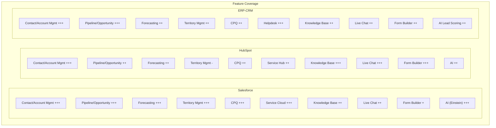

# ERP-CRM Product Requirements Document

## 1. Product Vision

ERP-CRM aims to be the definitive open-source, self-hosted CRM platform that replaces Salesforce for sales automation, HubSpot for marketing and lead management, Zoho CRM for mid-market flexibility, and Freshdesk for customer support -- all within a single, unified module of the OpenSASE ERP suite.

## 2. Target Market

| Segment | Size | Key Needs |
|---------|------|-----------|
| SMB (10-50 users) | Primary | Affordable, easy setup, core CRM + helpdesk |
| Mid-Market (50-500 users) | Secondary | Multi-pipeline, territory management, automation |
| Enterprise (500+ users) | Tertiary | Multi-tenant, compliance, custom workflows, forecasting |

## 3. Competitive Analysis

### 3.1 Feature Comparison Matrix

### 3.2 Detailed Competitive Analysis

| Feature | Salesforce | HubSpot | Zoho CRM | Freshdesk | ERP-CRM |
|---------|-----------|---------|----------|-----------|---------|
| **Pricing** | $25-300/user/mo | Free-$1200/mo | $14-52/user/mo | $15-79/agent/mo | Self-hosted (free) |
| **Contact Management** | Excellent | Excellent | Good | Basic | Excellent |
| **Company/Account Mgmt** | Excellent | Good | Good | Basic | Excellent |
| **Multi-Pipeline** | Yes | Yes (paid) | Yes | No | Yes |
| **Visual Pipeline** | Yes | Yes | Yes | No | Yes |
| **Deal Forecasting** | Advanced | Basic | Basic | No | Weighted + At-Risk |
| **Territory Mgmt** | Enterprise only | No | No | No | Included |
| **Lead Scoring** | Einstein AI | HubSpot AI | Zia AI | No | Rule + AI hybrid |
| **Lead Lifecycle** | 7 stages | 7 stages | 5 stages | N/A | 7 stages |
| **CPQ/Products** | Separate SKU | Add-on | Basic | No | Built-in |
| **Contact Merge/Dedup** | Yes | Yes | Yes | No | Yes |
| **Custom Fields** | Metadata-driven | Limited free | Yes | Yes | JSONB unlimited |
| **Helpdesk/Ticketing** | Service Cloud ($) | Service Hub ($) | Zoho Desk ($) | Core product | Included |
| **SLA Management** | Yes | Basic | Basic | Yes | Yes |
| **Knowledge Base** | Yes | Yes | Yes | Yes | Yes |
| **Live Chat** | Yes ($) | Yes | Yes | Yes | Included |
| **Chatbot AI** | Einstein Bots | HubBot | Zia Chat | Freddy AI | Planned |
| **Form Builder** | Web-to-Lead only | Excellent | Basic | No | Included |
| **Automation/Workflows** | Flow Builder | Workflows | Blueprint | Automations | Rule engine |
| **Reporting/Dashboards** | Excellent | Good | Good | Basic | Drag-and-drop builder |
| **API** | REST + SOAP | REST + GraphQL | REST | REST | REST + GraphQL |
| **Mobile App** | Yes | Yes | Yes | Yes | Flutter + Native |
| **Self-Hosted** | No | No | No | No | **Yes** |
| **Multi-Tenant** | Yes | Yes | Yes | Yes | Yes |
| **Open Source** | No | No | No | No | **Yes (Apache 2.0)** |
| **Data Sovereignty** | Cloud only | Cloud only | Cloud only | Cloud only | **Full control** |
| **Event Architecture** | Platform Events | Webhooks | Webhooks | Webhooks | Pulsar + NATS |
| **Compliance** | SOC2/HIPAA | SOC2 | SOC2 | SOC2 | SOC2/HIPAA/PCI-DSS |

### 3.3 Competitive Advantages

1. **Self-hosted data sovereignty**: Unlike all four competitors, ERP-CRM runs entirely on customer infrastructure with zero data leaving the premises.
2. **Unified platform**: Salesforce requires separate licenses for Sales Cloud, Service Cloud, and Marketing Cloud. HubSpot charges per hub. ERP-CRM includes everything in one module.
3. **Performance**: Rust core delivers 10-100x lower latency than Java (Salesforce) or Node.js (HubSpot) backends.
4. **No per-user pricing**: Eliminates the #1 cost driver for CRM platforms.
5. **Event-native architecture**: Built on Pulsar/NATS from day one, not bolted-on webhooks.

### 3.4 Competitive Gaps (Roadmap Items)

1. **AI**: Salesforce Einstein and HubSpot AI have years of model training advantage
2. **Marketplace/Ecosystem**: No equivalent to Salesforce AppExchange or HubSpot App Marketplace
3. **Email marketing**: HubSpot excels at email campaigns; ERP-CRM needs integration
4. **Social selling**: LinkedIn integration available in Salesforce/HubSpot, not yet in ERP-CRM
5. **Mobile polish**: Native apps are scaffold-stage vs. mature competitor apps

## 4. Functional Requirements

### 4.1 Contact & Company Management

| ID | Requirement | Priority | Status |
|----|------------|----------|--------|
| FR-CM-001 | Create, read, update, delete contacts with email validation | P0 | Done |
| FR-CM-002 | Create, read, update, delete companies | P0 | Done |
| FR-CM-003 | Link contacts to companies | P0 | Done |
| FR-CM-004 | Contact 360-degree view (deals, activities, notes) | P0 | Interface defined |
| FR-CM-005 | Contact deduplication and merge | P1 | Domain service done |
| FR-CM-006 | Custom fields per contact/company (unlimited) | P0 | Done (JSONB) |
| FR-CM-007 | Tag-based segmentation | P0 | Done |
| FR-CM-008 | Contact import/export (CSV) | P1 | Planned |
| FR-CM-009 | Data enrichment integration (Clearbit/ZoomInfo) | P2 | Planned |
| FR-CM-010 | Duplicate detection on create | P1 | Planned |

### 4.2 Sales Pipeline & Deals

| ID | Requirement | Priority | Status |
|----|------------|----------|--------|
| FR-PL-001 | Multiple pipelines with custom stages | P0 | Done |
| FR-PL-002 | Visual Kanban pipeline board | P0 | Frontend planned |
| FR-PL-003 | Deal CRUD with amount, probability, close date | P0 | Done |
| FR-PL-004 | Stage transitions with history tracking | P0 | Done |
| FR-PL-005 | Weighted pipeline value calculation | P0 | Done |
| FR-PL-006 | Win/loss analysis with close reasons | P0 | Done |
| FR-PL-007 | CPQ: Products with quantity, price, discount | P1 | Domain model done |
| FR-PL-008 | Competitor tracking per deal | P1 | Domain model done |
| FR-PL-009 | At-risk deal identification | P1 | Done |
| FR-PL-010 | Deal type classification (New/Renewal/Upsell/Cross-Sell) | P1 | Done |

### 4.3 Lead Management

| ID | Requirement | Priority | Status |
|----|------------|----------|--------|
| FR-LD-001 | Lead scoring (0-100) with hot/warm/cold | P0 | Done |
| FR-LD-002 | Lead qualification workflow | P0 | Done |
| FR-LD-003 | Lead disqualification with reasons | P0 | Done |
| FR-LD-004 | Lead-to-customer conversion | P0 | Done |
| FR-LD-005 | AI scoring based on demographics + behavior | P1 | Done |
| FR-LD-006 | Lead routing/assignment rules | P1 | Service created |
| FR-LD-007 | Lead nurturing campaigns | P2 | Planned |
| FR-LD-008 | Web-to-lead form integration | P1 | Form builder done |

### 4.4 Helpdesk

| ID | Requirement | Priority | Status |
|----|------------|----------|--------|
| FR-HD-001 | Multi-channel ticket creation | P0 | Done |
| FR-HD-002 | Ticket lifecycle (New/Open/Pending/Solved/Closed) | P0 | Done |
| FR-HD-003 | Agent assignment with auto-status transition | P0 | Done |
| FR-HD-004 | SLA policy attachment and breach tracking | P0 | Done |
| FR-HD-005 | Internal/public comments | P0 | Done |
| FR-HD-006 | Ticket escalation | P0 | Done |
| FR-HD-007 | Knowledge base with categories and articles | P0 | Done |
| FR-HD-008 | Customer self-service portal | P1 | Planned |
| FR-HD-009 | Canned responses | P1 | Planned |
| FR-HD-010 | Satisfaction surveys (CSAT) | P2 | Planned |

### 4.5 Form Builder

| ID | Requirement | Priority | Status |
|----|------------|----------|--------|
| FR-FB-001 | Create forms with custom fields (JSONB) | P0 | Done |
| FR-FB-002 | Form submission tracking with metadata | P0 | Done |
| FR-FB-003 | Drag-and-drop form builder UI | P1 | Frontend planned |
| FR-FB-004 | Conditional logic for field visibility | P1 | Planned |
| FR-FB-005 | Web-to-lead form embedding | P1 | Planned |
| FR-FB-006 | Form analytics (views, submissions, conversion) | P2 | Planned |

### 4.6 Live Chat

| ID | Requirement | Priority | Status |
|----|------------|----------|--------|
| FR-CH-001 | Real-time chat sessions | P0 | Service created |
| FR-CH-002 | Visitor tracking and identification | P1 | Planned |
| FR-CH-003 | Chat-to-ticket escalation | P1 | Planned |
| FR-CH-004 | Chatbot with AI responses | P2 | Planned |
| FR-CH-005 | Chat widget for websites | P1 | Planned |

## 5. Non-Functional Requirements

| ID | Requirement | Target |
|----|------------|--------|
| NFR-001 | API response time (p95) | < 50ms for CRUD, < 200ms for aggregations |
| NFR-002 | Availability | 99.9% uptime |
| NFR-003 | Concurrent users | 10,000+ simultaneous |
| NFR-004 | Data volume | 10M+ contacts per tenant |
| NFR-005 | Search latency | < 100ms for full-text search |
| NFR-006 | Event delivery | At-least-once, < 500ms end-to-end |
| NFR-007 | Backup RTO | < 1 hour |
| NFR-008 | Backup RPO | < 5 minutes |
| NFR-009 | Compliance | SOC2, HIPAA, PCI-DSS, GDPR |
| NFR-010 | Browser support | Chrome, Firefox, Safari, Edge (latest 2 versions) |

## 6. Success Metrics

| Metric | Target | Measurement |
|--------|--------|-------------|
| Feature parity with HubSpot Free | 100% | Feature checklist |
| API latency p95 | < 50ms | Quickwit metrics |
| Test coverage | > 80% | cargo tarpaulin |
| Zero critical security vulnerabilities | 0 | cargo audit |
| Documentation completeness | 32/32 docs | This document set |
