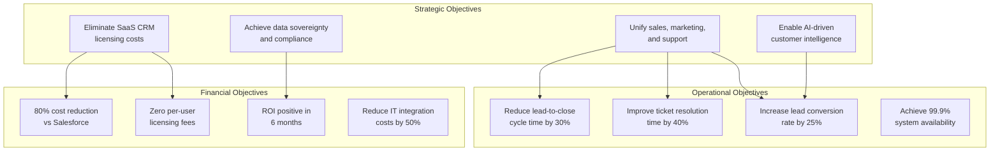
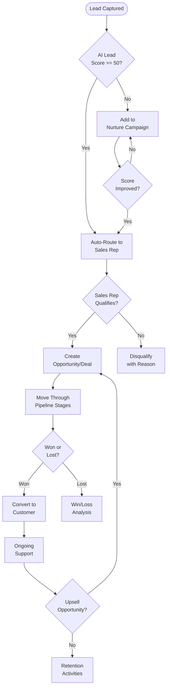
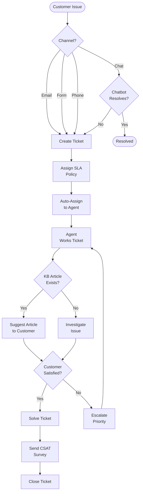
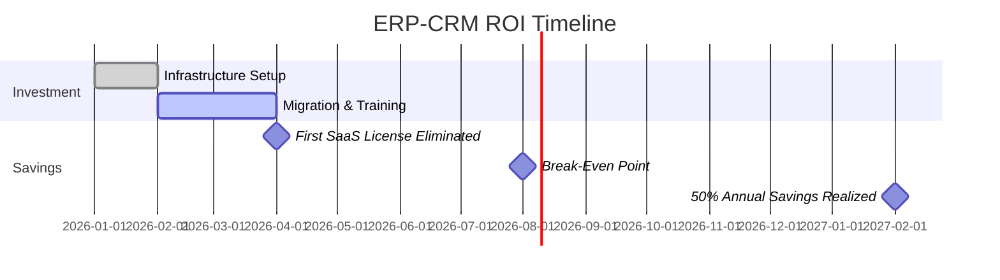

# ERP-CRM Business Requirements Document

## 1. Executive Summary

ERP-CRM addresses the business need for a self-hosted, cost-effective customer relationship management solution that eliminates per-user SaaS licensing costs while providing feature parity with commercial leaders. Organizations using Salesforce, HubSpot, Zoho CRM, or Freshdesk face annual costs of $50,000-$500,000+ for 100-user deployments. ERP-CRM eliminates these recurring costs while ensuring full data sovereignty and regulatory compliance.

## 2. Business Objectives

## 3. Business Process Requirements

### 3.1 Lead-to-Revenue Process

### 3.2 Support Ticket Process

## 4. Business Rules

### 4.1 Contact Management Rules

| Rule ID | Rule | Enforcement |
|---------|------|------------|
| BR-CM-001 | Every contact must have a valid email address | Email value object validation |
| BR-CM-002 | Contact email must be unique within a tenant | Database unique constraint |
| BR-CM-003 | Lead score must be between 0 and 100 | LeadScore value object (capped) |
| BR-CM-004 | Unqualified contacts cannot be re-qualified | Domain aggregate guard |
| BR-CM-005 | Contact ownership transfer requires manager approval | Workflow automation |
| BR-CM-006 | Contact deletion must cascade to activities and notes | Foreign key ON DELETE CASCADE |

### 4.2 Deal Management Rules

| Rule ID | Rule | Enforcement |
|---------|------|------------|
| BR-DL-001 | Closed deals cannot be modified (stage, amount) | DealNotOpen error |
| BR-DL-002 | Deal amount and payment must be in same currency | CurrencyMismatch error |
| BR-DL-003 | Default pipeline must always exist | Seed data in migration |
| BR-DL-004 | Won deals set probability to 100% | close_won() method |
| BR-DL-005 | Lost deals set probability to 0% | close_lost() method |
| BR-DL-006 | Deals stale > 30 days flagged as at-risk | ForecastService |

### 4.3 Support Rules

| Rule ID | Rule | Enforcement |
|---------|------|------------|
| BR-SP-001 | Every ticket must have a requester | Required field in create() |
| BR-SP-002 | First agent response sets first_responded_at | Comment handler logic |
| BR-SP-003 | SLA breach time must be tracked | sla_breach_at field |
| BR-SP-004 | Escalation auto-sets priority to Urgent | escalate() method |
| BR-SP-005 | Solved/Closed tickets can be reopened | reopen() method |

## 5. Organizational Impact

### 5.1 Role-Based Requirements

| Role | Primary Requirements | Secondary Requirements |
|------|---------------------|----------------------|
| Sales Representative | Contact 360 view, deal pipeline, mobile access | Activity logging, email integration |
| Sales Manager | Forecasting, territory management, team dashboard | Performance analytics, approval workflows |
| Support Agent | Ticket queue, KB search, SLA tracking | Canned responses, internal notes |
| Support Manager | SLA compliance reports, agent performance | Escalation rules, queue management |
| Marketing Specialist | Form builder, lead capture, lead scoring | Campaign tracking, analytics |
| CRM Administrator | User management, automation rules, custom fields | Data import/export, security settings |
| Executive | Revenue dashboard, pipeline health, win/loss trends | Customer health scores, churn prediction |

### 5.2 Training Requirements

| Audience | Training Type | Duration | Delivery |
|----------|-------------|----------|----------|
| Sales Reps | Hands-on workshop | 4 hours | In-person or video |
| Sales Managers | Advanced features + reporting | 6 hours | In-person or video |
| Support Agents | Ticket workflow + KB | 3 hours | In-person or video |
| Administrators | Full system configuration | 8 hours | In-person |
| Executives | Dashboard and reporting | 1 hour | Video |

## 6. Cost-Benefit Analysis

### 6.1 Cost Comparison (100-User Organization, Annual)

| Cost Category | Salesforce | HubSpot Pro | Zoho CRM | ERP-CRM |
|--------------|-----------|-------------|----------|---------|
| CRM License | $180,000 | $54,000 | $62,400 | $0 |
| Service/Helpdesk | $180,000 | $54,000 | $18,000 | $0 |
| Form Builder | Included | Included | $7,200 | $0 |
| Infrastructure | $0 (SaaS) | $0 (SaaS) | $0 (SaaS) | $12,000 |
| Admin/DevOps | $30,000 | $20,000 | $15,000 | $40,000 |
| **Total Annual** | **$390,000** | **$128,000** | **$102,600** | **$52,000** |
| **3-Year TCO** | **$1,170,000** | **$384,000** | **$307,800** | **$156,000** |

### 6.2 ROI Timeline

## 7. Constraints

| Constraint | Impact | Mitigation |
|-----------|--------|-----------|
| Self-hosted requires IT staff | Higher operational burden than SaaS | Detailed runbooks, automation, managed K8s |
| No app marketplace ecosystem | Fewer integrations than Salesforce | Open API + webhook architecture |
| Rust expertise required for core changes | Smaller talent pool | Go microservices for most extensions |
| Initial feature gap vs. mature platforms | Some features not yet available | Phased roadmap with competitive parity targets |

## 8. Acceptance Criteria

| Criterion | Measure | Target |
|-----------|---------|--------|
| All CRUD operations functional | API test suite | 100% pass |
| Contact lifecycle stages work end-to-end | Integration test | Pass |
| Deal pipeline stages track correctly | Integration test | Pass |
| Ticket lifecycle works end-to-end | Integration test | Pass |
| Lead scoring produces valid scores | Unit test | Pass |
| Multi-tenant isolation verified | Security test | Pass |
| API latency within SLA | Performance test | p95 < 50ms |
| Zero data loss during failover | DR test | RPO < 5 min |
