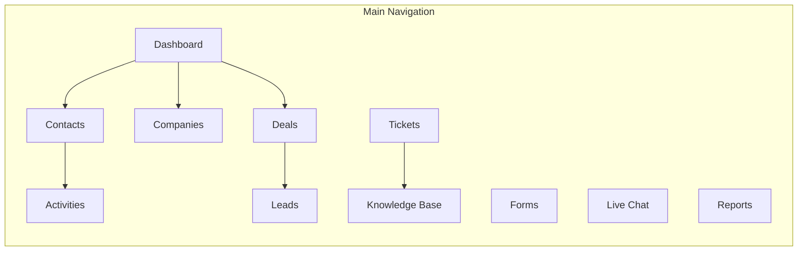
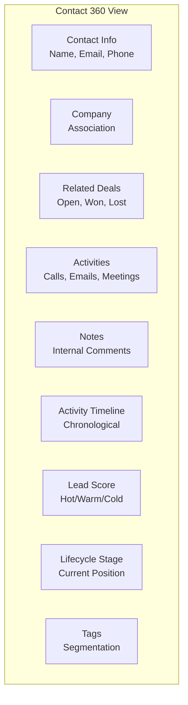
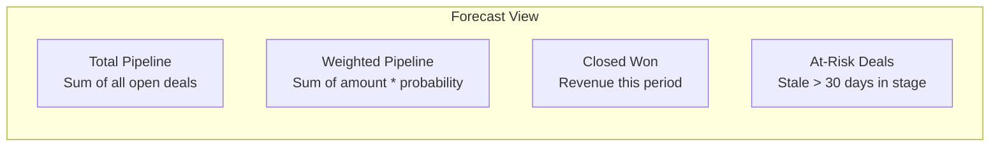
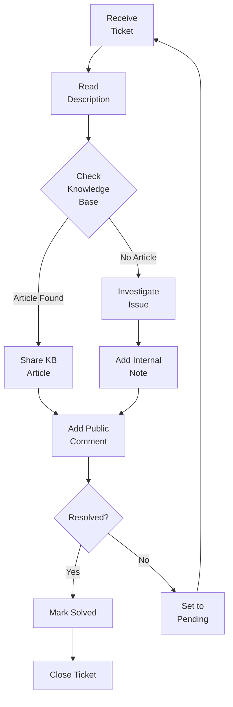

# ERP-CRM User Manual

## Table of Contents

1. [Getting Started](#1-getting-started)
2. [For Sales Representatives](#2-for-sales-representatives)
3. [For Sales Managers](#3-for-sales-managers)
4. [For Support Agents](#4-for-support-agents)
5. [For Administrators](#5-for-administrators)

---

## 1. Getting Started

### 1.1 Logging In

ERP-CRM authenticates through ERP-IAM using OIDC/JWT. Navigate to your organization's CRM URL and sign in with your corporate credentials. Upon successful authentication, a JWT token is issued and stored in your browser session.

### 1.2 Navigation Overview



### 1.3 Understanding the Dashboard

The dashboard provides an at-a-glance view of your CRM metrics:

- **Total Contacts**: Number of contacts in the system
- **Total Companies**: Number of company accounts
- **Total Deals**: Number of active deals
- **Pipeline Value**: Sum of all deal amounts
- **Contacts This Month**: New contacts added this month
- **Deals Won This Month**: Revenue closed this month

The dashboard is accessed via `GET /api/v1/dashboard/stats` and refreshes automatically.

---

## 2. For Sales Representatives

### 2.1 Managing Contacts

#### Creating a Contact

1. Navigate to **Contacts** in the sidebar
2. Click **+ New Contact**
3. Fill in the required fields:
   - **Email** (required, must be valid format)
   - **First Name** (optional)
   - **Last Name** (optional)
   - **Phone** (optional)
   - **Company** (optional, select from existing)
   - **Source** (optional, e.g., "website", "referral", "trade show")
   - **Tags** (optional, comma-separated)
4. Click **Save**

The system automatically assigns:
- Lead score: 0
- Lifecycle stage: Subscriber
- Created/Updated timestamps

#### Contact 360-Degree View

The contact detail page shows everything related to a contact:



#### Searching and Filtering Contacts

Use the search bar to find contacts by name or email. Filter by:
- Lifecycle stage (Subscriber, Lead, MQL, SQL, Opportunity, Customer, Evangelist)
- Owner (assigned sales rep)
- Company
- Tags
- Date range (created, last activity)

Pagination: Default 20 per page, maximum 100. Use `page` and `per_page` query parameters.

#### Updating Contact Information

1. Open the contact record
2. Click **Edit**
3. Modify fields as needed (email, name, phone, lifecycle stage, lead score, tags)
4. Click **Save**

All changes update the `updated_at` timestamp automatically.

### 2.2 Working with Deals

#### Creating a Deal

1. Navigate to **Deals** or click **+ New Deal** from a contact record
2. Fill in:
   - **Name** (required, descriptive deal name)
   - **Pipeline** (required, select from available pipelines)
   - **Stage** (required, initial pipeline stage)
   - **Amount** (optional, deal value)
   - **Currency** (defaults to NGN)
   - **Expected Close Date** (optional)
   - **Contact** (optional, link to a contact)
   - **Company** (optional, link to a company)
3. Click **Save**

#### Pipeline Board View

The pipeline board displays deals as cards organized by stage columns:

```
| Lead (10%) | Qualified (25%) | Proposal (50%) | Negotiation (75%) | Closed Won (100%) | Closed Lost (0%) |
|------------|-----------------|----------------|-------------------|--------------------|--------------------|
| Deal A     | Deal B          | Deal C         | Deal D            | Deal E             | Deal F              |
| $50K       | $120K           | $75K           | $200K             | $180K              | $90K                |
```

Drag and drop deals between columns to advance them through stages. Each move records a stage change in the deal history.

#### Deal Products (CPQ)

For complex deals, add products:
1. Open a deal
2. Click **Add Product**
3. Select product, set quantity, unit price, and discount percentage
4. The deal amount auto-recalculates: `total = SUM(unit_price * quantity * (1 - discount/100))`

#### Tracking Competitors

1. Open a deal
2. Go to **Competitors** tab
3. Add competitor name, strengths, and weaknesses
4. Use this data for win/loss analysis later

#### Closing Deals

**Won**: Click **Mark as Won** -- sets probability to 100%, records close date, emits `deal.won` event.

**Lost**: Click **Mark as Lost** -- enter loss reason, sets probability to 0%, emits `deal.lost` event.

**Reopen**: Click **Reopen Deal** on a closed deal to return it to Open status with 10% probability.

### 2.3 Activities

#### Logging Activities

1. From any contact, company, or deal record, click **+ Activity**
2. Select type: Call, Email, Meeting, Task
3. Enter subject and description
4. Set due date (for tasks/meetings)
5. Click **Save**

Activities auto-update the contact's `last_activity_at` timestamp, which factors into lead scoring.

#### Activity Types

| Type | Description | Auto-Logged |
|------|------------|------------|
| Call | Phone call with contact | Manual |
| Email | Email sent/received | Planned (IMAP sync) |
| Meeting | Scheduled meeting | Planned (CalDAV sync) |
| Task | Follow-up action item | Manual |
| Note | Internal comment | Manual |

### 2.4 Lead Management

#### Understanding Lead Scores

Scores range from 0-100 and classify leads:

| Score Range | Classification | Action |
|------------|---------------|--------|
| 80-100 | Hot | Immediate follow-up |
| 50-79 | Warm | Schedule contact within 48h |
| 0-49 | Cold | Continue nurturing |

Score factors:
- **Title/Role** (CEO/Founder: +25, VP/Director: +20, Manager: +15)
- **Company association**: +10
- **Activity count**: up to +20 (2 per activity, max 10 activities)
- **Email opens**: up to +20
- **Page views**: up to +10
- **Engagement recency bonus**: +5 if already hot

#### Qualifying Leads

1. Review the contact's lead score and activity history
2. If the lead meets your qualification criteria, click **Qualify**
3. The system automatically:
   - Sets lead status to "Qualified"
   - Advances lifecycle stage to "Sales Qualified Lead"
   - Emits a `contact.qualified` domain event

#### Converting Leads to Customers

After a deal closes won:
1. Open the contact record
2. Click **Convert to Customer**
3. The system sets lifecycle stage to "Customer"
4. Emits `contact.converted_to_customer` event

---

## 3. For Sales Managers

### 3.1 Pipeline Forecasting

The forecast view provides weighted pipeline analysis:



- **Weighted Value** = Deal Amount x (Probability / 100)
- **At-Risk**: Deals stagnant in a stage beyond the configurable threshold (default 30 days)

### 3.2 Territory Management

1. Navigate to **Territories**
2. Define territories by geography, industry, or account size
3. Assign sales reps to territories
4. Contacts and deals auto-route based on territory rules

### 3.3 Team Performance

Monitor your team via the dashboard:
- Deals per rep
- Win rate by rep
- Average deal size
- Average cycle time (lead to close)
- Activity volume per rep

### 3.4 Ownership Transfer

To reassign a contact:
1. Open the contact record
2. Click **Transfer Ownership**
3. Select the new owner
4. The system emits `contact.ownership_transferred` event
5. All linked deals and activities follow the contact

---

## 4. For Support Agents

### 4.1 Ticket Queue

Navigate to **Tickets** to see your assigned ticket queue. Tickets display:
- Ticket number (unique identifier)
- Subject
- Priority (Low, Normal, High, Urgent)
- Status (New, Open, Pending, On Hold, Solved, Closed)
- SLA status (time remaining or breached)
- Requester info

### 4.2 Working a Ticket



1. **Open the ticket** from your queue
2. **Read the description** and any existing comments
3. **Search the Knowledge Base** for relevant articles
4. **Add a comment**: Choose "Public" (visible to customer) or "Internal" (agents only)
5. When resolved, click **Solve** to set status to Solved
6. After confirmation, click **Close** to finalize

### 4.3 Escalation

If a ticket requires urgent attention:
1. Click **Escalate**
2. Priority auto-sets to **Urgent**
3. The ticket routes to senior agents or managers
4. SLA timers adjust to the urgent SLA policy

### 4.4 Knowledge Base

#### Finding Articles
1. Navigate to **Knowledge Base**
2. Browse by category or use the search bar
3. View count tracks article popularity

#### Creating Articles (with permission)
1. Click **+ New Article**
2. Select a category
3. Enter title, slug, and content (Markdown supported)
4. Set status to "Draft" or "Published"
5. Click **Save**

---

## 5. For Administrators

### 5.1 Pipeline Configuration

1. Navigate to **Settings > Pipelines**
2. Create new pipelines or modify existing ones
3. Add/reorder stages with position and probability values
4. Set one pipeline as default

Default pipeline stages:
| Stage | Position | Probability |
|-------|----------|------------|
| Lead | 1 | 10% |
| Qualified | 2 | 25% |
| Proposal | 3 | 50% |
| Negotiation | 4 | 75% |
| Closed Won | 5 | 100% |
| Closed Lost | 6 | 0% |

### 5.2 Custom Fields

All entities support unlimited custom fields via JSONB:

```json
{
  "custom_fields": {
    "industry_vertical": "Healthcare",
    "annual_revenue": 5000000,
    "preferred_language": "English",
    "contract_renewal_date": "2027-03-15"
  }
}
```

### 5.3 Automation Rules

Navigate to **Settings > Automation** to configure:
- **Assignment rules**: Auto-assign contacts/deals based on criteria
- **Escalation rules**: Auto-escalate tickets approaching SLA breach
- **Workflow rules**: Trigger actions on entity state changes

### 5.4 Form Builder

1. Navigate to **Forms > + New Form**
2. Enter form name, description, and URL slug
3. Define fields using the JSONB field editor
4. Configure form settings (validation, notifications, redirect URL)
5. Publish the form and embed it on your website

### 5.5 User Management

User management is handled through ERP-IAM:
1. Navigate to **Settings > Users**
2. Users are provisioned via ERP-Directory
3. Assign CRM roles: Sales Rep, Sales Manager, Support Agent, Admin
4. Configure tenant access via `X-Tenant-ID`

### 5.6 Data Import/Export

**Import** (planned):
- Upload CSV files with contact/company/deal data
- Map columns to CRM fields
- Deduplicate during import

**Export**:
- Export contact lists, deal pipelines, and reports to CSV
- Schedule automated exports

### 5.7 System Health

Monitor system health via:
- `/health` -- Service health check (returns service name and version)
- `/ready` -- Database connectivity check
- `/metrics` -- Prometheus-compatible metrics

```json
{
  "status": "healthy",
  "service": "opensase-crm",
  "version": "0.1.0"
}
```
