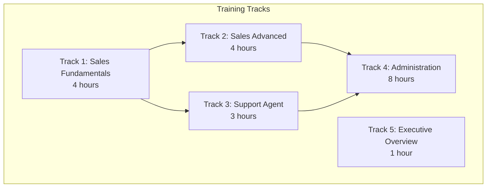
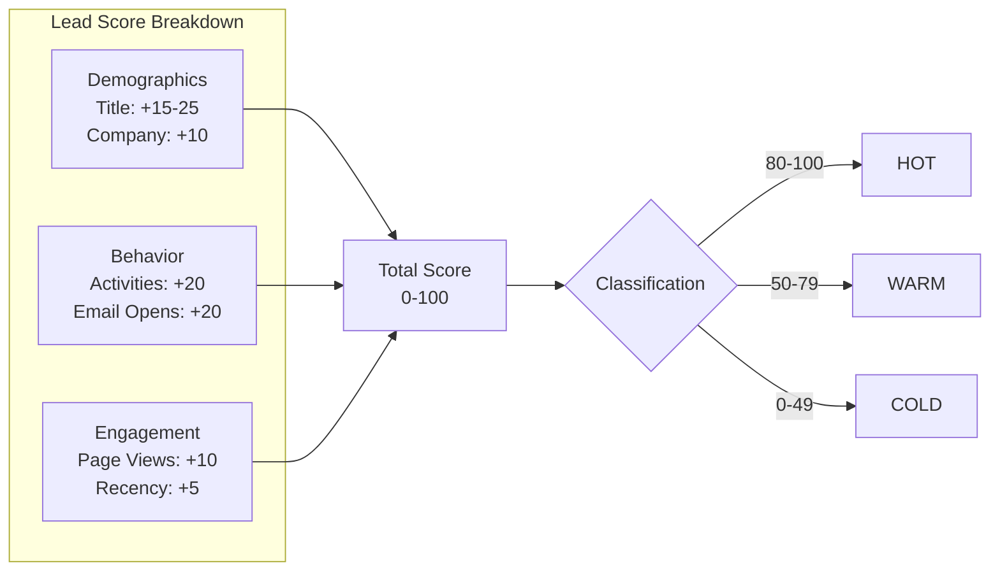
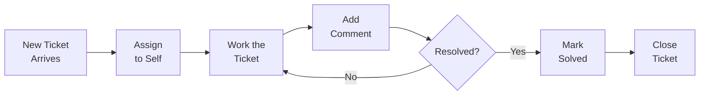

# ERP-CRM Training Manual

## Training Program Overview

This training manual provides structured learning paths for all ERP-CRM user roles. Each module includes objectives, hands-on exercises, and assessment criteria.

---

## Track 1: Sales Fundamentals (4 Hours)

### Module 1.1: System Navigation (30 minutes)

**Objectives:**
- Log in using OIDC credentials
- Navigate the main dashboard
- Understand the sidebar menu structure
- Customize personal settings

**Exercise 1.1.1:** Log in to the CRM and identify the total number of contacts and deals on the dashboard.

**Exercise 1.1.2:** Navigate to Contacts, Companies, Deals, and Activities sections. Note the available actions in each.

### Module 1.2: Contact Management (60 minutes)

**Objectives:**
- Create, edit, and delete contacts
- Understand contact fields and custom fields
- Use tags for segmentation
- Search and filter contacts

**Exercise 1.2.1: Create a Contact**
1. Navigate to Contacts
2. Create a new contact with the following data:
   - Email: training-test@example.com
   - First Name: Jane
   - Last Name: Smith
   - Phone: +1-555-0100
   - Source: "training"
   - Tags: ["vip", "enterprise"]
3. Verify the contact appears in the contact list
4. Verify lead score is 0 and lifecycle stage is "subscriber"

**Exercise 1.2.2: Update a Contact**
1. Open the contact created in Exercise 1.2.1
2. Update the lifecycle stage to "Lead"
3. Add custom field: `preferred_contact_method: "email"`
4. Add a new tag: "training-complete"
5. Verify changes are saved

**Exercise 1.2.3: Search and Filter**
1. Use the search bar to find "Jane Smith"
2. Filter contacts by tag "vip"
3. Sort contacts by creation date (newest first)

### Module 1.3: Deal Management (90 minutes)

**Objectives:**
- Create deals and link to contacts/companies
- Understand pipeline stages and probabilities
- Move deals through pipeline stages
- Close deals as won or lost

**Exercise 1.3.1: Create a Deal**
1. Create a new deal:
   - Name: "Enterprise License - Jane Smith"
   - Pipeline: Sales Pipeline (default)
   - Stage: Lead
   - Amount: 50000
   - Currency: NGN
   - Link to the contact created earlier
2. Verify the deal appears in the pipeline board

**Exercise 1.3.2: Advance a Deal**
1. Move the deal from "Lead" to "Qualified" (25% probability)
2. Move from "Qualified" to "Proposal" (50% probability)
3. Check the stage history -- should show 2 transitions
4. Verify weighted value = 50000 * 0.50 = 25000

**Exercise 1.3.3: Close a Deal**
1. Move the deal to "Negotiation" (75%)
2. Close the deal as Won
3. Verify: probability = 100%, closed_at is set
4. Attempt to move the closed deal -- verify error message

### Module 1.4: Activity Tracking (60 minutes)

**Objectives:**
- Log calls, emails, and meetings
- Link activities to contacts and deals
- Track due dates and completions

**Exercise 1.4.1: Log an Activity**
1. Open the contact from Module 1.2
2. Create a new activity:
   - Type: "call"
   - Subject: "Initial discovery call"
   - Description: "Discussed requirements and timeline"
   - Link to the deal from Module 1.3
3. Verify the activity appears on the contact's timeline

---

## Track 2: Sales Advanced (4 Hours)

### Module 2.1: Lead Scoring and Qualification (60 minutes)

**Objectives:**
- Understand lead scoring factors
- Interpret hot/warm/cold classifications
- Qualify and disqualify leads
- Convert leads to customers

**Exercise 2.1.1: Lead Qualification Workflow**
1. Find a contact with lead status "New"
2. Review their lead score and activity history
3. If score >= 50, click Qualify
4. Verify: lead status = "Qualified", lifecycle = "SalesQualifiedLead"
5. Attempt to qualify again -- verify "already qualified" error

### Module 2.2: Pipeline Forecasting (60 minutes)

**Objectives:**
- Read weighted pipeline forecast
- Identify at-risk deals
- Understand forecast calculations

**Exercise 2.2.1: Forecast Analysis**
1. Navigate to the Forecast view
2. Identify:
   - Total pipeline value (sum of all open deal amounts)
   - Weighted pipeline value (sum of amount * probability)
   - Closed won value
   - At-risk deals (stale > 30 days in current stage)

### Module 2.3: Territory Management (60 minutes)

**Objectives:**
- View territory assignments
- Understand territory-based routing

### Module 2.4: Competitor Analysis (60 minutes)

**Objectives:**
- Add competitors to deals
- Track competitor strengths and weaknesses
- Use competitor data in deal strategy

**Exercise 2.4.1: Track a Competitor**
1. Open a deal
2. Add competitor: "Salesforce"
   - Strengths: ["brand recognition", "ecosystem"]
   - Weaknesses: ["high cost", "complexity"]
3. Add competitor: "HubSpot"
   - Strengths: ["ease of use", "marketing tools"]
   - Weaknesses: ["limited enterprise features"]

---

## Track 3: Support Agent (3 Hours)

### Module 3.1: Ticket Management (90 minutes)

**Objectives:**
- View and manage ticket queue
- Assign and work tickets
- Add public and internal comments
- Solve and close tickets

**Exercise 3.1.1: Work a Ticket**
1. Find a ticket in "New" status
2. Assign it to yourself (status auto-changes to "Open")
3. Add an internal note: "Investigating the issue"
4. Add a public reply: "Thank you for reaching out. Let me help you with that."
5. Verify first_responded_at is set
6. Mark the ticket as Solved
7. Close the ticket

### Module 3.2: Knowledge Base Usage (45 minutes)

**Objectives:**
- Search the knowledge base for solutions
- Share KB articles with customers
- Create and update articles

**Exercise 3.2.1: Find and Share an Article**
1. Navigate to Knowledge Base
2. Browse categories
3. Search for a relevant article
4. Copy the article link to share in a ticket response

### Module 3.3: Escalation Procedures (45 minutes)

**Objectives:**
- Identify when to escalate
- Execute escalation procedure
- Monitor SLA timers

**Exercise 3.3.1: Escalate a Ticket**
1. Open a high-priority ticket
2. Click Escalate
3. Verify priority changed to "Urgent"
4. Check that SLA timer reflects the urgent policy

---

## Track 4: Administration (8 Hours)

### Module 4.1: System Configuration (2 hours)

**Objectives:**
- Configure pipelines and stages
- Set up custom fields
- Configure tenant settings

### Module 4.2: Automation Setup (2 hours)

**Objectives:**
- Create assignment rules
- Configure escalation rules
- Build workflow automations

### Module 4.3: Form Builder (2 hours)

**Objectives:**
- Create forms with custom fields
- Configure form settings and validation
- Embed forms on external websites
- Monitor form submissions

### Module 4.4: Reporting and Analytics (2 hours)

**Objectives:**
- Build custom reports
- Create dashboards
- Schedule automated reports
- Analyze funnel metrics

---

## Track 5: Executive Overview (1 Hour)

### Module 5.1: Dashboard Interpretation (30 minutes)

**Objectives:**
- Read key metrics (contacts, deals, pipeline value)
- Understand win/loss trends
- Interpret forecast data

### Module 5.2: Strategic Insights (30 minutes)

**Objectives:**
- Pipeline health indicators
- Revenue forecasting accuracy
- Support SLA compliance overview
- Customer satisfaction trends

---

## Assessment and Certification

Each track concludes with a practical assessment:

| Track | Assessment | Passing Score |
|-------|-----------|--------------|
| Sales Fundamentals | Create contact, deal, log activity, close deal | Complete all exercises |
| Sales Advanced | Forecast analysis, competitor tracking | 80% accuracy |
| Support Agent | Ticket lifecycle, KB search, escalation | Complete all exercises |
| Administration | Configure pipeline, create automation, build form | Complete all exercises |
| Executive Overview | Dashboard interpretation quiz | 80% accuracy |

Certification is valid for 12 months and requires re-certification upon major version upgrades.
