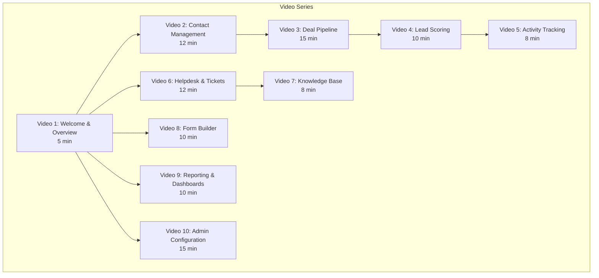

# ERP-CRM Video Training Scripts

## Video Series Overview

This document contains production-ready scripts for 10 training videos covering all ERP-CRM functionality. Each script includes narration, screen directions, and timing markers.

---

## Video 1: Welcome and Overview (5 minutes)

### TITLE CARD
**"ERP-CRM: Your Complete Customer Relationship Management Platform"**

### NARRATION

**[0:00 - 0:30] Opening**

> Welcome to ERP-CRM, the enterprise-grade customer relationship management module of the OpenSASE ERP suite. In this video, you will get an overview of the platform and understand how it helps your organization manage contacts, close deals, support customers, and capture leads -- all in one place.

**[0:30 - 1:30] What is ERP-CRM?**

*[Screen: Show the main dashboard with all metrics visible]*

> ERP-CRM consolidates three critical business functions into a single platform. First, Customer Relationship Management -- contact and company management, sales pipelines, deal tracking, and forecasting. Second, Customer Support -- helpdesk ticketing, SLA management, and a knowledge base. Third, Lead Capture -- a form builder, live chat, and web-to-lead forms. Think of it as Salesforce, Freshdesk, and HubSpot Forms combined into one self-hosted solution.

**[1:30 - 3:00] Navigation Tour**

*[Screen: Click through each sidebar item]*

> Let me walk you through the main navigation. The Dashboard shows your key metrics at a glance -- total contacts, companies, deals, and pipeline value. The Contacts section is where you manage all your leads and customers. Companies houses your account records. Deals shows your sales pipeline with a visual Kanban board. Leads provides specialized lead management with scoring and qualification workflows. Activities tracks all your calls, emails, meetings, and tasks. Tickets is your helpdesk queue. Knowledge Base contains your support articles. Forms lets you build web forms for lead capture. Live Chat handles real-time customer conversations. And Reports gives you drag-and-drop analytics.

**[3:00 - 4:30] Key Concepts**

*[Screen: Show a diagram of lifecycle stages]*

> Before we dive into specifics, let me introduce three key concepts. First, the Contact Lifecycle. Every contact moves through stages: Subscriber, Lead, Marketing Qualified Lead, Sales Qualified Lead, Opportunity, Customer, and Evangelist. Second, Lead Scoring. Every contact gets a score from 0 to 100 based on their demographics and behavior. Scores above 80 are hot leads requiring immediate attention. Third, the Sales Pipeline. Deals move through customizable stages from Lead to Qualified to Proposal to Negotiation to Closed Won or Closed Lost.

**[4:30 - 5:00] Closing**

> In the following videos, we will dive deep into each of these areas. Let us start with Contact Management.

---

## Video 2: Contact Management Deep Dive (12 minutes)

### NARRATION

**[0:00 - 0:30] Introduction**

> In this video, you will learn how to create, manage, and organize contacts in ERP-CRM. Contacts are the foundation of your CRM -- every deal, activity, and support ticket connects back to a contact record.

**[0:30 - 2:30] Creating a Contact**

*[Screen: Navigate to Contacts, click New Contact]*

> Click the plus button to create a new contact. The only required field is email address -- the system validates that it is in the correct format and normalizes it to lowercase. Enter the first name, last name, and phone number. Select a company to associate this contact with. Choose a source to track where this lead came from -- website, referral, trade show, or any custom value. Add tags for segmentation -- for example, "enterprise" and "decision-maker". You can also add custom fields for any data specific to your business. Click Save, and the contact is created with an initial lead score of 0 and lifecycle stage of Subscriber.

*[Screen: Show the API call in a terminal]*

> Behind the scenes, this creates a POST request to the contacts API. The system generates a UUID v7 identifier -- time-ordered for efficient database indexing -- validates the email, persists to PostgreSQL, and publishes a contact.created event to the message bus.

**[2:30 - 5:00] Contact 360 View**

*[Screen: Open a contact record and show all tabs]*

> The Contact 360 View is the heart of your CRM. At the top, you see the contact's basic information, lead score badge, and lifecycle stage indicator. Below that, tabs organize all related data. The Deals tab shows every deal associated with this contact, with status indicators for open, won, and lost. The Activities tab displays a chronological timeline of all interactions -- calls logged, emails tracked, meetings scheduled. The Notes tab contains internal notes from your team. The Companies tab shows the contact's company association.

**[5:00 - 7:00] Tags and Segmentation**

*[Screen: Demonstrate adding and removing tags]*

> Tags are your flexible segmentation tool. Add tags like "vip", "enterprise", "trial-user", or "webinar-attendee" to categorize contacts without rigid folder structures. Tags are unique per contact -- adding a duplicate tag is silently ignored. Remove tags by clicking the X next to each tag. Use the filter panel to find all contacts with specific tag combinations.

**[7:00 - 9:00] Lead Lifecycle Management**

*[Screen: Show qualification workflow]*

> Every contact has a lead status and lifecycle stage. When a new contact arrives, they start as New with a Subscriber lifecycle stage. As you engage with them, their lead score increases based on their demographics, activity, and engagement. When the score is high enough, you can Qualify the contact, which advances them to Sales Qualified Lead. If they are not a fit, you can Disqualify them with a reason. Once a deal closes successfully, you Convert the contact to Customer status. Each of these transitions emits domain events that trigger automations.

**[9:00 - 11:00] Merging Duplicates**

*[Screen: Show merge interface]*

> Duplicate contacts are inevitable. ERP-CRM provides a merge capability. Select two contacts, choose which one is the primary record, and merge. The primary contact absorbs all deals, activities, and notes from the secondary contact. The secondary contact is archived. A contact.merged event is emitted for audit purposes.

**[11:00 - 12:00] Summary**

> That covers contact management. Remember: contacts are the foundation -- every other CRM function links back to contacts. Keep your contact data clean, tag consistently, and use lead scoring to prioritize your time.

---

## Video 3: Sales Pipeline and Deal Management (15 minutes)

### NARRATION

**[0:00 - 0:30] Introduction**

> The sales pipeline is where revenue is made or lost. In this video, you will learn how to manage deals through every stage of your sales process, from initial lead to closed won.

**[0:30 - 3:00] Pipeline Overview**

*[Screen: Show the pipeline Kanban board]*

> The pipeline view displays your deals as cards organized in columns by stage. The default Sales Pipeline includes six stages: Lead at 10% probability, Qualified at 25%, Proposal at 50%, Negotiation at 75%, Closed Won at 100%, and Closed Lost at 0%. Each card shows the deal name, amount, and expected close date. The column headers display the count and total value of deals in each stage.

**[3:00 - 6:00] Creating and Managing Deals**

*[Screen: Create a new deal, step by step]*

> To create a deal, click New Deal. Give it a descriptive name like "Acme Corp Enterprise License". Select the pipeline -- you can have multiple pipelines for different sales processes. Choose the initial stage. Enter the amount and currency -- the default currency is NGN but nine currencies are supported including USD, EUR, and GBP. Set the expected close date and link the deal to a contact and company. Click Save.

*[Screen: Move deal between stages]*

> To advance a deal, drag it from one column to the next. Each stage transition records the from-stage, to-stage, and timestamp in the deal's history. The probability automatically updates to match the new stage's default probability, or you can override it manually. The system emits a deal.stage_changed event on every transition.

**[6:00 - 9:00] Deal Products and Amount Calculation**

*[Screen: Add products to a deal]*

> For complex deals, you can add individual products. Each product has a name, quantity, unit price, and discount percentage. The deal amount auto-recalculates as the sum of all product line items. For example, 10 units at 5000 each with a 10% discount equals 45,000. Adding or removing products triggers an immediate recalculation.

**[9:00 - 12:00] Closing Deals and Win/Loss Analysis**

*[Screen: Close a deal as won, then show a lost deal]*

> When you are ready to close a deal, click Mark as Won. This sets the probability to 100%, records the actual close date, and emits a deal.won event that triggers downstream automations like invoice creation. For lost deals, click Mark as Lost and enter the reason -- budget constraints, chose competitor, timing not right, or a custom reason. This data feeds into win/loss analysis reports.

*[Screen: Show reopening a deal]*

> Deals can be reopened if circumstances change. Reopening resets the probability to 10% and clears the close date and lost reason.

**[12:00 - 14:00] Forecasting**

*[Screen: Show forecast view]*

> The Forecast view aggregates deal data into actionable insights. Total Pipeline is the sum of all open deal amounts. Weighted Pipeline multiplies each deal's amount by its probability -- this is your statistically likely revenue. Closed Won shows actual revenue. At-Risk Deals highlights deals that have been stagnant in their current stage beyond the threshold, defaulting to 30 days. Use this to identify deals that need attention.

**[14:00 - 15:00] Summary**

> Master the pipeline and you master your revenue. Track every deal, maintain accurate probabilities, log your close reasons, and review your forecast weekly.

---

## Video 4: Lead Scoring and AI (10 minutes)

### NARRATION

**[0:00 - 2:00] How Lead Scoring Works**

*[Screen: Show lead score breakdown diagram]*

> ERP-CRM uses a hybrid scoring model combining demographic factors and behavioral signals. Demographic scoring looks at the contact's title -- executives like CEO or CTO score 25 points, VPs and directors get 20, managers get 15. Having an associated company adds 10 points. Behavioral scoring considers activity count for up to 20 points, email opens for up to 20 points, and page views for up to 10 points. There is also a 5-point engagement recency bonus for already-hot leads. The maximum score is capped at 100.

**[2:00 - 5:00] Score Classification and Actions**

> Leads are classified into three tiers. Hot leads, scoring 80 to 100, should receive immediate outreach -- call them today. Warm leads at 50 to 79 should be contacted within 48 hours. Cold leads below 50 should continue receiving nurturing content until their score improves.

**[5:00 - 8:00] Qualification Workflow**

*[Screen: Walk through qualifying a lead]*

> When a lead's score indicates readiness, you can formally qualify them. Open the contact, review their score and activity timeline, and click Qualify. The system validates that the contact is in a qualifiable state -- you cannot qualify someone already qualified or disqualified -- then transitions them to Sales Qualified Lead status and emits a domain event. This event can trigger automations like creating a deal, notifying the assigned rep, or adding to a campaign.

**[8:00 - 10:00] Improving Score Accuracy**

> Monitor your qualification outcomes. If hot leads frequently do not convert, your scoring weights may need adjustment. If warm leads convert at high rates, consider lowering the hot threshold. The scoring algorithm in the domain service is the single source of truth and can be tuned by administrators.

---

## Video 5: Activity Tracking (8 minutes)

### NARRATION

**[0:00 - 2:00] Why Activity Tracking Matters**

> Activities are the heartbeat of your CRM. Every call, email, meeting, and task tells the story of your customer relationships. ERP-CRM tracks activities across contacts, companies, and deals, giving you a complete timeline of every interaction.

**[2:00 - 5:00] Logging Activities**

*[Screen: Create activities of each type]*

> Create an activity by clicking the plus button from any contact, company, or deal. Choose the type: call, email, meeting, or task. Enter a subject and description. For scheduled activities, set a due date. You can link an activity to multiple entities -- a discovery call can be linked to both a contact and a deal. Each logged activity updates the contact's last_activity_at timestamp, which feeds into lead scoring.

**[5:00 - 8:00] Activity Timeline and Reporting**

*[Screen: Show the activity timeline on a contact]*

> The contact 360 view displays all activities in chronological order, creating a complete interaction history. Managers can view activity reports across their team to measure engagement levels. High-performing reps typically log more activities per deal.

---

## Video 6: Helpdesk and Ticket Management (12 minutes)

### NARRATION

**[0:00 - 3:00] Ticket Lifecycle**

*[Screen: Show the ticket queue and lifecycle diagram]*

> The helpdesk manages customer support through a structured ticket lifecycle. New tickets arrive from email, chat, forms, or manual creation. When an agent picks up a ticket, it moves to Open. If the agent needs customer input, it goes to Pending. If work is paused, On Hold. When resolved, Solved. After confirmation, Closed. Tickets can be reopened at any time.

**[3:00 - 6:00] Working Tickets**

*[Screen: Walk through a complete ticket workflow]*

> Open a ticket from your queue. Read the subject and description. Check the Knowledge Base for existing solutions. Add an internal note for your team, then a public reply for the customer. If the issue is resolved, mark it as Solved. The system tracks your first response time for SLA compliance.

**[6:00 - 9:00] SLA Management**

> SLA policies define response and resolution time targets. When a ticket is created, the matching SLA policy attaches automatically. A breach timer starts counting down. If the timer expires, the ticket is flagged as SLA-breached. Escalation rules can auto-elevate breached tickets.

**[9:00 - 12:00] Escalation**

> When a ticket needs urgent attention, click Escalate. This sets priority to Urgent and routes the ticket to senior agents. Always escalate when: the customer is at risk of churn, the issue affects multiple customers, or the SLA breach timer is critical.

---

## Video 7: Knowledge Base (8 minutes)

### NARRATION

**[0:00 - 3:00] Organizing Knowledge**

> The Knowledge Base organizes support articles into categories. Categories have names, URL-friendly slugs, and descriptions. Articles belong to categories and support draft and published statuses. View counts track article popularity.

**[3:00 - 6:00] Creating Articles**

> Create a new article by selecting a category, entering a title and URL slug, writing the content in Markdown, and publishing. Well-written KB articles reduce ticket volume by enabling customer self-service.

**[6:00 - 8:00] Using KB in Ticket Resolution**

> When working a ticket, search the KB for relevant articles. Share the article link in your ticket reply. This both resolves the ticket and incrementally improves the KB view count data, helping you identify your most valuable articles.

---

## Video 8: Form Builder (10 minutes)

### NARRATION

**[0:00 - 3:00] Creating Forms**

> The Form Builder lets you create web forms for lead capture, contact forms, surveys, and more. Each form has a name, description, and URL slug for embedding. Fields are defined as JSON, allowing unlimited customization.

**[3:00 - 6:00] Field Configuration**

> Configure form fields with types (text, email, number, dropdown, checkbox, textarea), validation rules, and conditional logic. Each field can be required or optional.

**[6:00 - 8:00] Embedding and Submissions**

> Once published, embed the form on your website using the provided iframe or JavaScript snippet. Submissions are captured with the form data and metadata (IP address, user agent, referrer). Submissions can trigger web-to-lead flows, creating new contacts automatically.

**[8:00 - 10:00] Form Analytics**

> Monitor form performance via submission counts and conversion rates. Identify which forms generate the most qualified leads.

---

## Video 9: Reporting and Dashboards (10 minutes)

### NARRATION

**[0:00 - 5:00] Dashboard Overview**

> The main dashboard provides six key metrics: total contacts, total companies, total deals, pipeline value, contacts this month, and deals won this month. Each metric links to its detailed view.

**[5:00 - 10:00] Building Custom Reports**

> The reporting service allows you to build custom reports with drag-and-drop field selection, filters, grouping, and charting. Create funnel reports to visualize pipeline conversion rates, activity reports to measure team productivity, and SLA compliance reports for support management.

---

## Video 10: Administrator Configuration (15 minutes)

### NARRATION

**[0:00 - 5:00] Pipeline and Stage Configuration**

*[Screen: Navigate to Settings > Pipelines]*

> Administrators can create multiple pipelines for different sales processes. Each pipeline has customizable stages with names, positions, and default probability percentages. The default pipeline is used when no specific pipeline is selected during deal creation.

**[5:00 - 10:00] Automation Rules**

> Configure automation rules to reduce manual work. Assignment rules auto-assign new contacts based on territory, source, or round-robin. Escalation rules auto-escalate tickets approaching SLA breach. Workflow rules trigger actions when entity states change.

**[10:00 - 15:00] System Configuration**

> System settings include tenant configuration, user provisioning via ERP-IAM, custom field definitions, form builder defaults, and integration settings for email, calendar, and enrichment services. Monitor system health via the health, readiness, and metrics endpoints.

---

## Production Notes

| Video | Resolution | Format | Estimated File Size |
|-------|-----------|--------|-------------------|
| All | 1920x1080 | MP4 (H.264) | 50-150 MB each |
| Screen recording | 60 FPS | Lossless capture | Post-process to 30 FPS |
| Audio | 48kHz/16-bit | WAV capture | Post-process to AAC |
| Captions | SRT format | Auto + manual review | - |

Total series duration: approximately 105 minutes.
