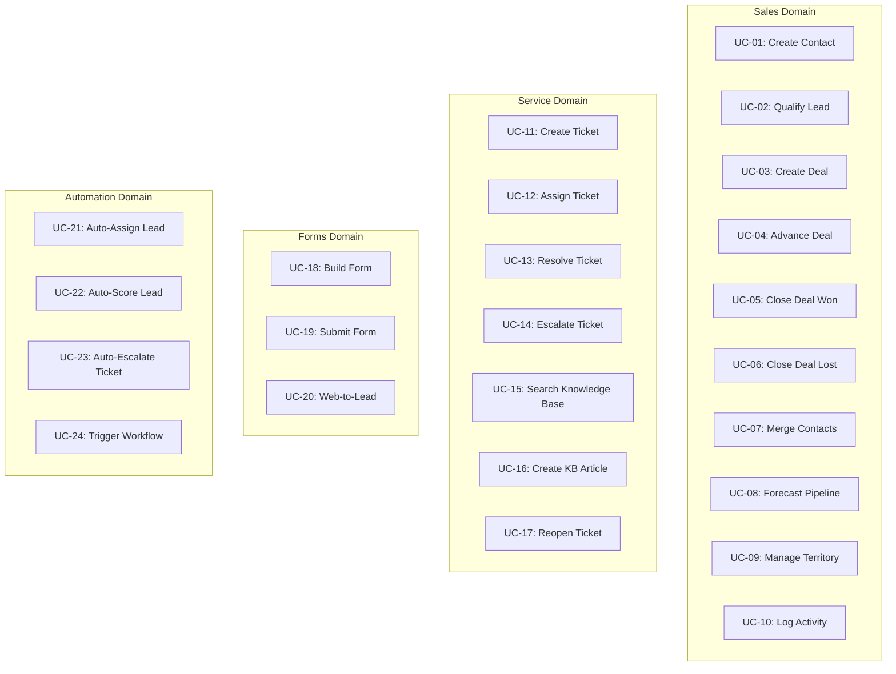

# ERP-CRM Use Cases

## Use Case Overview

This document defines 24 use cases spanning sales, service, forms, and automation domains within ERP-CRM.

---

## Sales Domain Use Cases

### UC-01: Create Contact

**Actor:** Sales Representative
**Precondition:** User is authenticated with CRM access
**Trigger:** New lead information received

**Main Flow:**
1. Sales rep navigates to Contacts and clicks New Contact
2. System displays contact creation form
3. Sales rep enters email (required), first name, last name, phone, company, source, tags
4. System validates email format (valid characters, domain with dot)
5. System generates UUID v7 identifier
6. System sets lead_score = 0, lifecycle_stage = "subscriber"
7. System persists contact to PostgreSQL
8. System publishes `contact.created` event to NATS
9. System returns created contact with HTTP 201

**Alternative Flows:**
- 4a. Invalid email: System returns 400 Bad Request with validation details
- 7a. Duplicate email: System returns 500 with constraint violation (planned: return 409 Conflict)

**Postcondition:** Contact exists in database, event published

---

### UC-02: Qualify Lead

**Actor:** Sales Representative
**Precondition:** Contact exists with lead_status != "Qualified" and != "Unqualified"
**Trigger:** Sales rep determines lead is qualified

**Main Flow:**
1. Sales rep opens contact record
2. Sales rep reviews lead score, activity history, and company association
3. Sales rep clicks Qualify
4. System validates current lead_status is qualifiable
5. System sets lead_status = "Qualified", lifecycle_stage = "SalesQualifiedLead"
6. System publishes `contact.qualified` event with previous status
7. System updates `updated_at` timestamp

**Alternative Flows:**
- 4a. Already Qualified: System returns AlreadyQualified error
- 4b. Already Unqualified: System returns CannotQualifyUnqualified error

**Postcondition:** Contact is in Qualified status with SQL lifecycle stage

---

### UC-03: Create Deal

**Actor:** Sales Representative
**Precondition:** At least one pipeline exists with stages
**Trigger:** Qualified lead enters sales process

**Main Flow:**
1. Sales rep clicks New Deal (from Deals or Contact 360)
2. System displays deal creation form with available pipelines
3. Sales rep enters: name, pipeline, initial stage, amount, currency, expected close date
4. Sales rep optionally links contact and company
5. System validates required fields (name, pipeline_id, stage_id)
6. System creates deal with probability from stage default, status = "Open"
7. System publishes `deal.created` event
8. System returns created deal with HTTP 201

**Postcondition:** Deal exists in pipeline at initial stage

---

### UC-04: Advance Deal Through Pipeline

**Actor:** Sales Representative
**Precondition:** Deal exists with status "Open"
**Trigger:** Deal progresses to next stage

**Main Flow:**
1. Sales rep views pipeline Kanban board
2. Sales rep drags deal card to new stage column
3. System validates deal is open and not already in target stage
4. System records StageChange (from_stage, to_stage, timestamp)
5. System updates stage_id and probability
6. System publishes `deal.stage_changed` event
7. Pipeline view refreshes with deal in new column

**Alternative Flows:**
- 3a. Deal not open: System returns DealNotOpen error
- 3b. Same stage: System returns AlreadyInStage error

**Postcondition:** Deal is in new stage with updated probability and stage history entry

---

### UC-05: Close Deal Won

**Actor:** Sales Representative
**Precondition:** Deal exists with status "Open"
**Trigger:** Customer signs contract

**Main Flow:**
1. Sales rep opens deal
2. Sales rep clicks Mark as Won
3. System sets status = "Won", probability = 100%
4. System records actual_close_date and closed_at
5. System publishes `deal.won` event with amount
6. System triggers downstream automations (invoice creation, customer conversion)

**Postcondition:** Deal is Won with probability 100% and close date recorded

---

### UC-06: Close Deal Lost

**Actor:** Sales Representative
**Precondition:** Deal exists with status "Open"
**Trigger:** Customer declines or competitor wins

**Main Flow:**
1. Sales rep opens deal
2. Sales rep clicks Mark as Lost
3. System prompts for loss reason
4. Sales rep enters reason (e.g., "Budget constraints", "Chose competitor")
5. System sets status = "Lost", probability = 0%, records lost_reason
6. System records actual_close_date and closed_at
7. System publishes `deal.lost` event with reason

**Postcondition:** Deal is Lost with reason recorded for win/loss analysis

---

### UC-07: Merge Duplicate Contacts

**Actor:** Sales Representative or Administrator
**Precondition:** Two contact records exist for the same person
**Trigger:** Duplicate detected

**Main Flow:**
1. User identifies duplicate contacts
2. User selects primary contact (the one to keep)
3. User selects secondary contact (the one to merge)
4. System invokes ContactMergeService
5. System transfers all deals, activities, and notes from secondary to primary
6. System records activity on primary contact
7. System publishes `contact.merged` event
8. System archives or deletes secondary contact

**Postcondition:** Single contact record with all associated data

---

### UC-08: Forecast Pipeline Revenue

**Actor:** Sales Manager
**Precondition:** Open deals exist in the pipeline
**Trigger:** Weekly/monthly forecast review

**Main Flow:**
1. Manager navigates to Forecast view
2. System queries all open deals
3. ForecastService calculates:
   - Total pipeline: SUM(amount) WHERE status = Open
   - Weighted pipeline: SUM(amount * probability / 100) WHERE status = Open
   - Closed won: SUM(amount) WHERE status = Won
4. ForecastService identifies at-risk deals (days_in_stage > threshold)
5. System displays forecast dashboard with totals and at-risk list

**Postcondition:** Manager has visibility into pipeline health and revenue forecast

---

### UC-09: Manage Sales Territory

**Actor:** Sales Manager
**Precondition:** Territory management is configured
**Trigger:** Territory restructuring or new hire

**Main Flow:**
1. Manager navigates to Territories
2. Manager creates or modifies territory (geography, industry, size criteria)
3. Manager assigns sales reps to territories
4. System routes new contacts matching territory criteria to assigned rep
5. System updates ownership on existing contacts if reassigned

**Postcondition:** Territories are configured with assigned reps

---

### UC-10: Log Activity

**Actor:** Sales Representative
**Precondition:** Contact, company, or deal exists
**Trigger:** Interaction with customer completed

**Main Flow:**
1. Sales rep opens entity record (contact, company, or deal)
2. Sales rep clicks New Activity
3. Sales rep selects type (call, email, meeting, task)
4. Sales rep enters subject, description, and optional due date
5. System creates activity linked to entity
6. System updates contact's last_activity_at
7. Activity appears in entity timeline

**Postcondition:** Activity recorded, contact engagement timestamp updated

---

## Service Domain Use Cases

### UC-11: Create Support Ticket

**Actor:** Customer (via form/email/chat) or Support Agent
**Precondition:** Customer identity exists or is captured
**Trigger:** Customer reports an issue

**Main Flow:**
1. Ticket arrives via channel (email, form, chat, or manual creation)
2. System generates unique ticket number
3. System sets status = "New", priority = "Normal"
4. System persists ticket with subject, description, requester
5. System applies SLA policy based on priority/category
6. System publishes `erp.crm.helpdesk.created` event
7. System adds ticket to unassigned queue

**Postcondition:** Ticket exists in New status with SLA timer started

---

### UC-12: Assign Ticket to Agent

**Actor:** Support Agent or Assignment Rule
**Precondition:** Ticket exists in New or unassigned state
**Trigger:** Agent picks ticket or auto-assignment rule fires

**Main Flow:**
1. Agent views ticket queue
2. Agent clicks Assign to Me (or auto-assignment triggers)
3. System sets assignee_id to agent
4. System transitions status from New to Open
5. System updates timestamp

**Postcondition:** Ticket assigned to agent with Open status

---

### UC-13: Resolve Support Ticket

**Actor:** Support Agent
**Precondition:** Ticket is in Open or Pending status
**Trigger:** Issue is resolved

**Main Flow:**
1. Agent completes investigation/resolution
2. Agent adds public comment explaining the resolution
3. Agent clicks Solve
4. System sets status = "Solved", records solved_at timestamp
5. System publishes `ticket.solved` event
6. After customer confirmation, agent clicks Close
7. System sets status = "Closed"

**Postcondition:** Ticket is Solved/Closed with resolution documented

---

### UC-14: Escalate Support Ticket

**Actor:** Support Agent
**Precondition:** Ticket exists and requires urgent attention
**Trigger:** SLA breach imminent or customer at risk

**Main Flow:**
1. Agent identifies need for escalation
2. Agent clicks Escalate
3. System sets priority = "Urgent"
4. System routes ticket to escalation group
5. System updates SLA timers for urgent policy

**Postcondition:** Ticket priority is Urgent, routed to escalation team

---

### UC-15: Search Knowledge Base

**Actor:** Support Agent or Customer
**Precondition:** KB articles exist
**Trigger:** Looking for solution to a problem

**Main Flow:**
1. User navigates to Knowledge Base
2. User enters search query or browses categories
3. System returns matching articles ranked by relevance
4. User opens article
5. System increments view_count

**Postcondition:** User finds relevant article, view count updated

---

### UC-16: Create Knowledge Base Article

**Actor:** Support Agent or Administrator
**Precondition:** KB categories exist
**Trigger:** New solution needs documentation

**Main Flow:**
1. Agent navigates to Knowledge Base management
2. Agent clicks New Article
3. Agent selects category, enters title, slug, and content
4. Agent sets status to "Draft"
5. Agent previews and edits
6. Agent publishes (status = "Published")

**Postcondition:** Article is published and searchable

---

### UC-17: Reopen Resolved Ticket

**Actor:** Customer or Support Agent
**Precondition:** Ticket is in Solved or Closed status
**Trigger:** Issue recurs or was not fully resolved

**Main Flow:**
1. Customer replies to ticket or agent clicks Reopen
2. System sets status = "Open"
3. System clears solved_at timestamp
4. Ticket returns to agent's queue

**Postcondition:** Ticket is reopened for further work

---

## Forms Domain Use Cases

### UC-18: Build a Web Form

**Actor:** Administrator or Marketing Specialist
**Precondition:** Form builder access granted
**Trigger:** New lead capture form needed

**Main Flow:**
1. User navigates to Forms > New Form
2. User enters form name, description, and URL slug
3. User adds fields (text, email, dropdown, checkbox, textarea)
4. User configures validation rules per field
5. User sets form settings (notification email, redirect URL)
6. User saves form with status "Active"

**Postcondition:** Form is active and available for embedding

---

### UC-19: Submit Form

**Actor:** Website Visitor (anonymous)
**Precondition:** Form is active and embedded on website
**Trigger:** Visitor fills out form

**Main Flow:**
1. Visitor loads webpage with embedded form
2. Visitor fills in form fields
3. Visitor clicks Submit
4. System validates all fields against form rules
5. System creates submission record with data and metadata
6. System increments form's submission_count
7. System publishes `erp.crm.form-builder.created` event
8. Visitor sees confirmation message or redirect

**Postcondition:** Submission recorded with metadata

---

### UC-20: Web-to-Lead Conversion

**Actor:** System (automated)
**Precondition:** Form submission with email field exists
**Trigger:** Form submission event received

**Main Flow:**
1. Automation service receives form submission event
2. System extracts email from submission data
3. System checks for existing contact with that email
4. If no contact exists, system creates new contact:
   - Email from form
   - Source = form slug
   - Tags = ["web-form", form_name]
   - Custom fields populated from form data
5. If contact exists, system updates custom fields
6. System publishes `contact.created` or `contact.updated` event

**Postcondition:** Contact record exists or is updated from form submission

---

## Automation Domain Use Cases

### UC-21: Auto-Assign Lead to Sales Rep

**Actor:** System (automated)
**Precondition:** Assignment rules configured
**Trigger:** New contact created

**Main Flow:**
1. Automation service receives `contact.created` event
2. System evaluates assignment rules (territory, source, round-robin)
3. System selects matching sales rep
4. System sets contact owner_id to selected rep
5. System publishes `contact.ownership_transferred` event
6. Rep receives notification of new lead

**Postcondition:** Contact automatically assigned to correct rep

---

### UC-22: Auto-Score Lead

**Actor:** System (automated)
**Precondition:** LeadScoringService configured
**Trigger:** Contact activity or profile change

**Main Flow:**
1. System detects contact update or new activity
2. LeadScoringService calculates new score from demographics, activities, email opens, page views
3. If score change >= 10, system publishes `contact.lead_score_changed` event
4. System updates contact lead_score
5. If score crosses hot threshold (80), system notifies assigned rep

**Postcondition:** Contact lead score updated, significant changes trigger notifications

---

### UC-23: Auto-Escalate Approaching SLA Breach

**Actor:** System (automated)
**Precondition:** Ticket with SLA policy assigned
**Trigger:** SLA breach timer crosses warning threshold

**Main Flow:**
1. Scheduler checks SLA timers for all open tickets
2. Tickets approaching breach (e.g., 80% of SLA time elapsed) are flagged
3. System auto-escalates flagged tickets (priority = Urgent)
4. System notifies escalation group
5. System publishes escalation event

**Postcondition:** At-risk tickets escalated before SLA breach

---

### UC-24: Trigger Workflow on Entity Change

**Actor:** System (automated)
**Precondition:** Workflow rules configured
**Trigger:** Entity state change matches workflow criteria

**Main Flow:**
1. System receives domain event (e.g., deal.won)
2. Automation service evaluates workflow rules
3. Matching rules execute configured actions:
   - Send notification
   - Create follow-up activity
   - Update related entity
   - Publish webhook
4. System logs workflow execution for audit

**Postcondition:** Configured actions executed automatically
