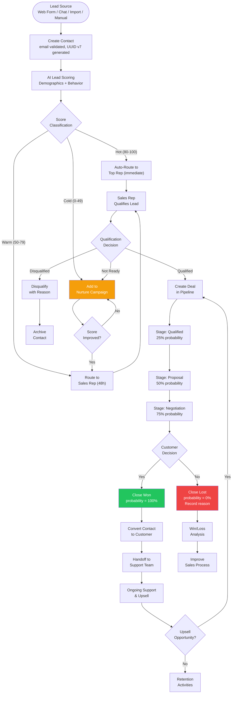
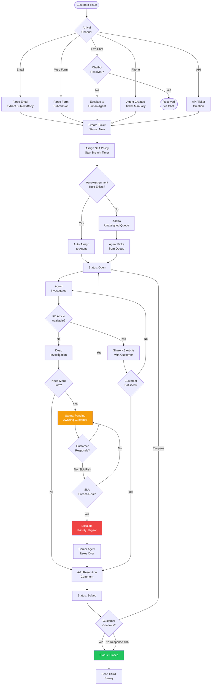
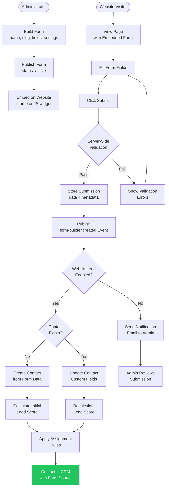
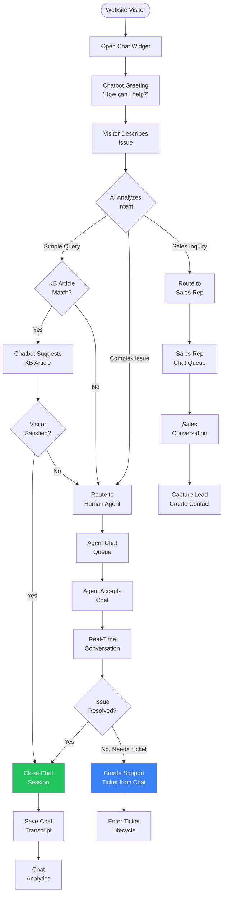
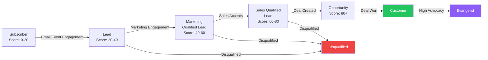
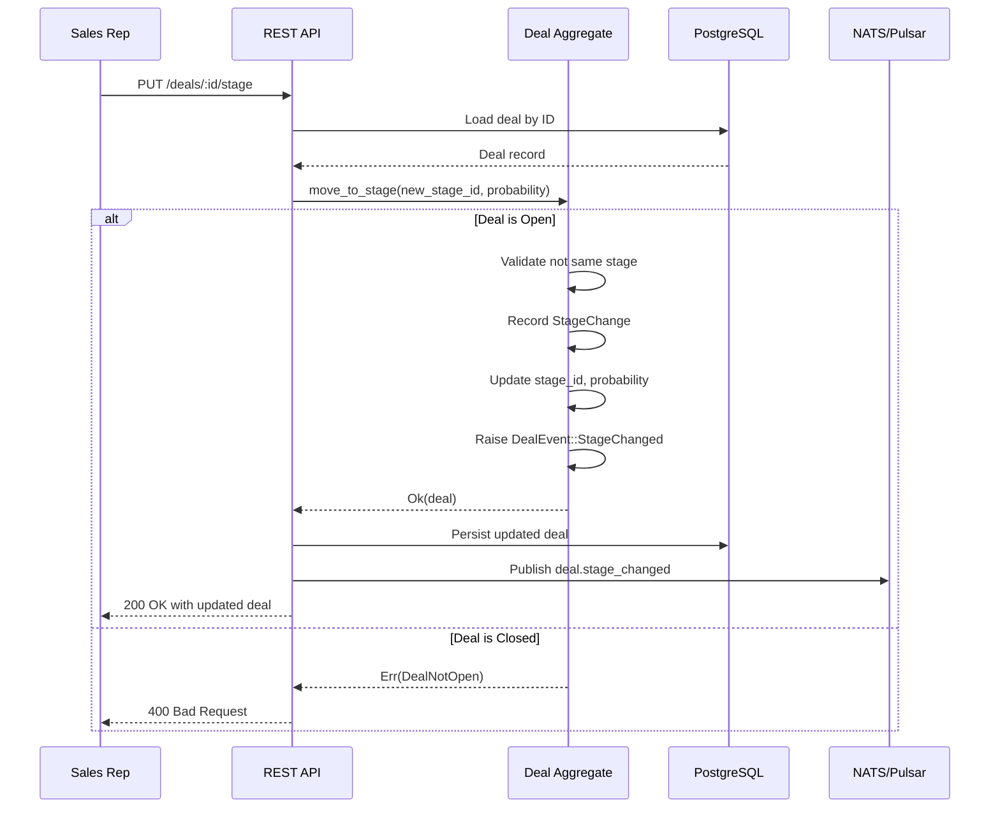
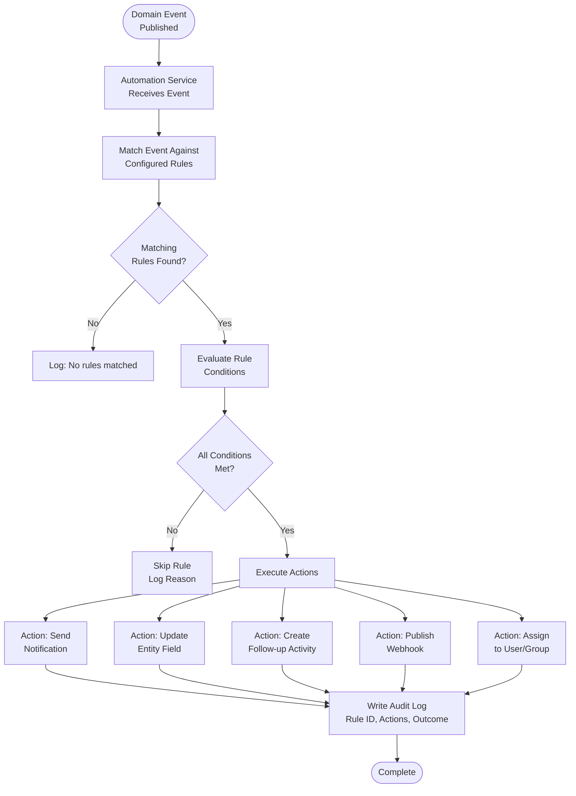
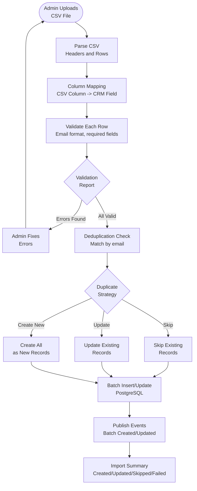

# ERP-CRM Workflow Diagrams

## 1. Lead-to-Close Workflow

This is the primary revenue workflow, tracking a lead from initial capture through deal closure.

## 2. Ticket Lifecycle Workflow

The complete support ticket lifecycle from creation to closure.

## 3. Form Submission Workflow

From form creation to lead capture and CRM integration.

## 4. Chat Escalation Workflow

Live chat conversation flow with chatbot and human agent escalation.

## 5. Contact Lifecycle Workflow

The complete lifecycle of a contact through all stages.

## 6. Deal Stage Transition Workflow

Internal system flow when a deal moves between stages.

## 7. Automation Engine Workflow

How the automation service processes events and executes rules.

## 8. Data Import Workflow

Bulk data import process for CRM migration.

