# ERP-CRM High-Level Design

## 1. System Context

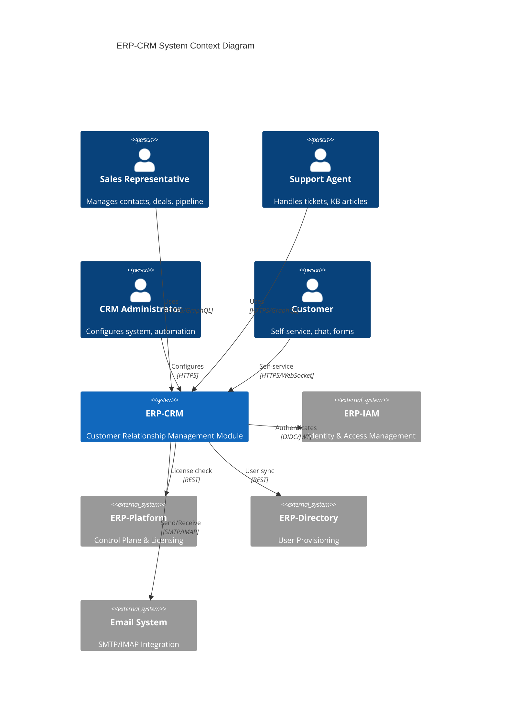

## 2. Container Architecture

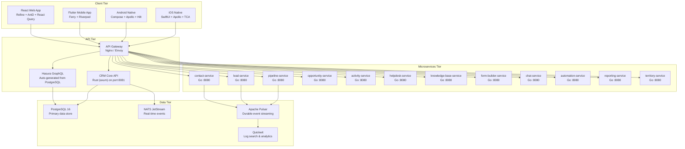

## 3. Component Design

### 3.1 CRM Core Components

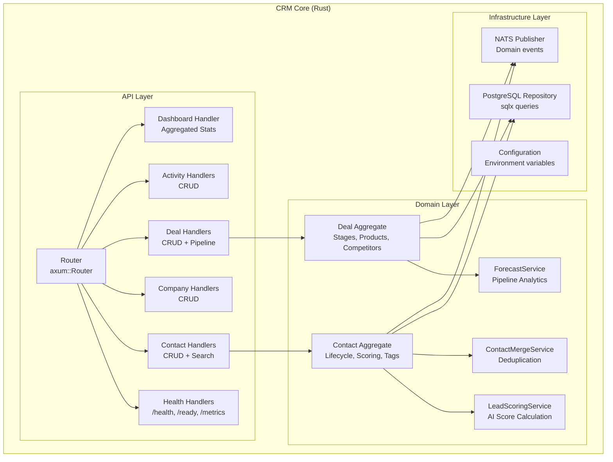

### 3.2 Microservice Component (Generic)

Each Go microservice follows an identical internal pattern:

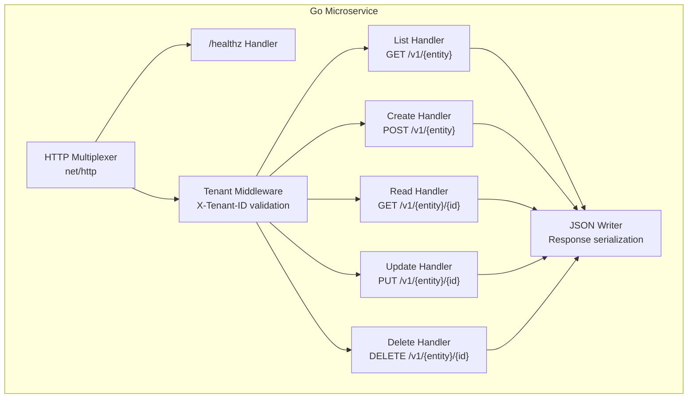

## 4. Data Flow Design

### 4.1 Read Path

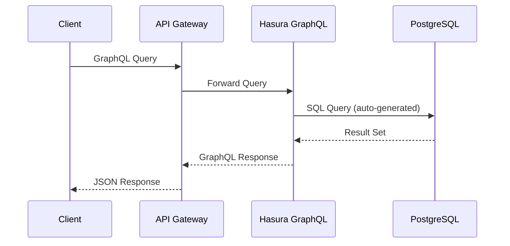

### 4.2 Write Path

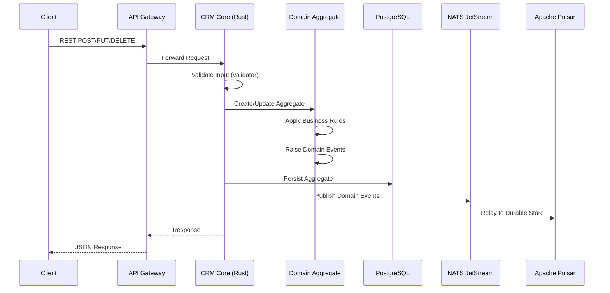

## 5. Deployment Architecture

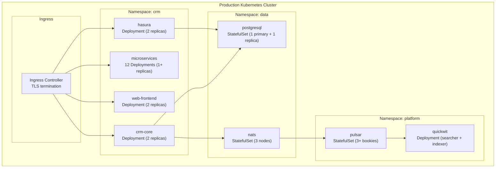

## 6. Security Design

### 6.1 Authentication and Authorization Flow

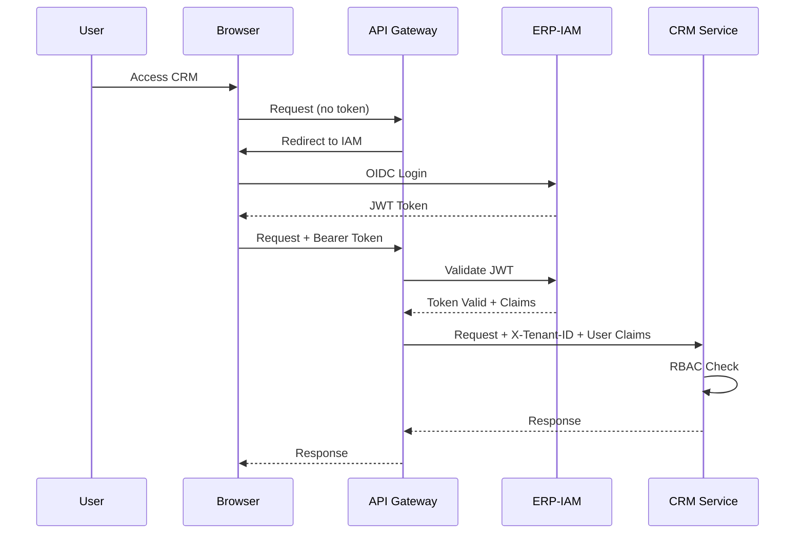

### 6.2 Tenant Isolation

All data access is scoped by tenant:

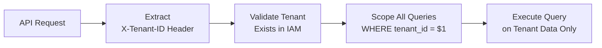

## 7. Scalability Design

### 7.1 Horizontal Scaling Strategy

| Component | Scaling Method | Scaling Trigger | Max Scale |
|-----------|---------------|----------------|-----------|
| CRM Core | HPA (CPU 70%) | Request rate | 10 replicas |
| Go Microservices | HPA (CPU 60%) | Request rate | 5 replicas each |
| Web Frontend | HPA (CPU 50%) | Connection count | 5 replicas |
| Hasura | HPA (CPU 70%) | Query rate | 5 replicas |
| PostgreSQL | Vertical + Read Replicas | Query latency | 1 primary + 3 replicas |
| NATS | StatefulSet | Message backlog | 5 nodes |

### 7.2 Caching Strategy

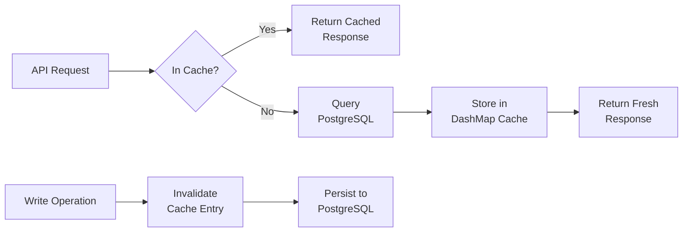

## 8. Reliability Design

### 8.1 Failure Handling

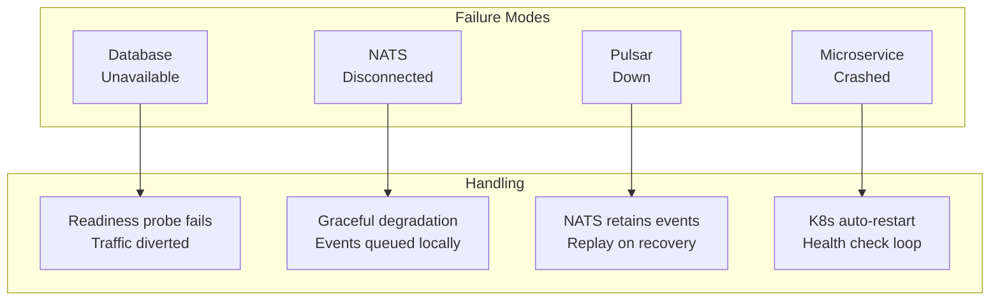

The CRM core handles NATS disconnection gracefully -- the connection is optional, and the system continues to function without event publishing. This is implemented in `main.rs` with a fallback that logs a warning and sets `nats = None`.
