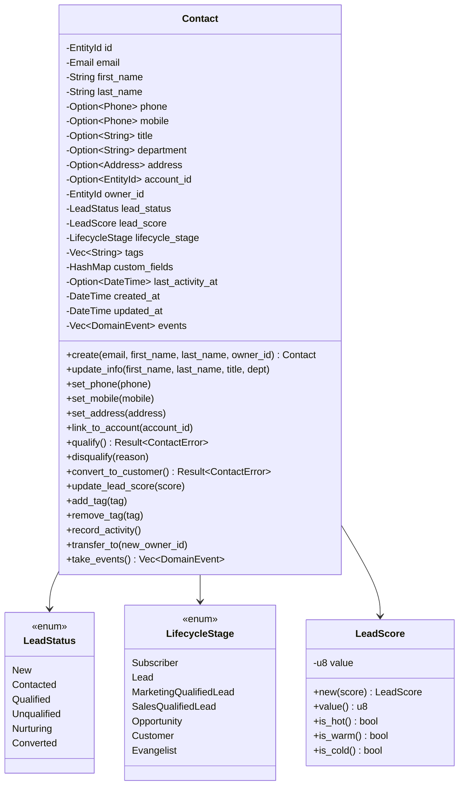
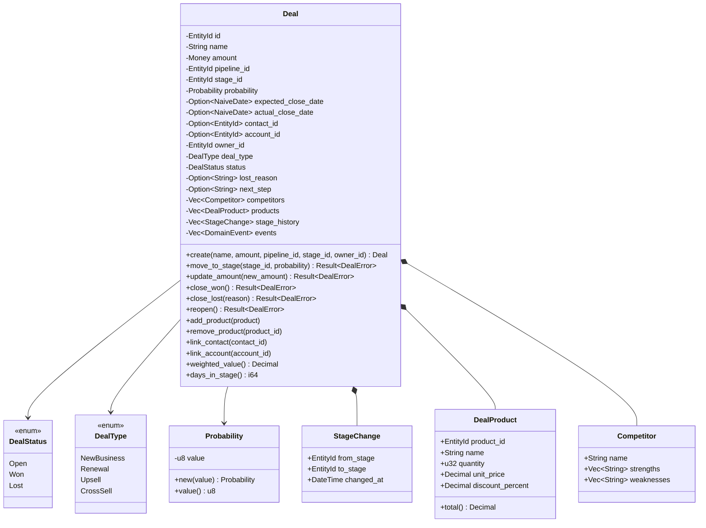
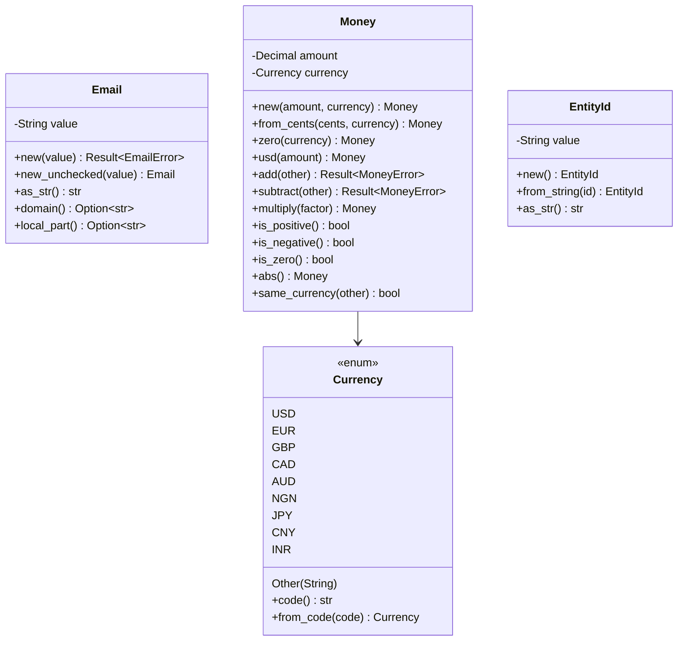
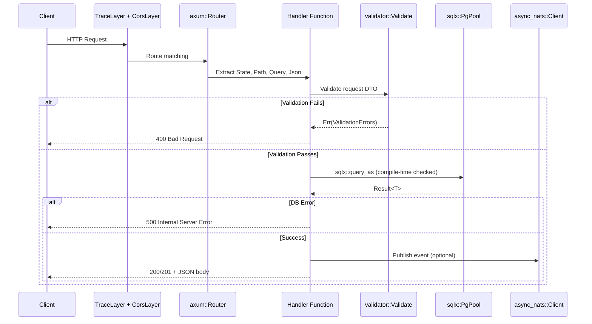
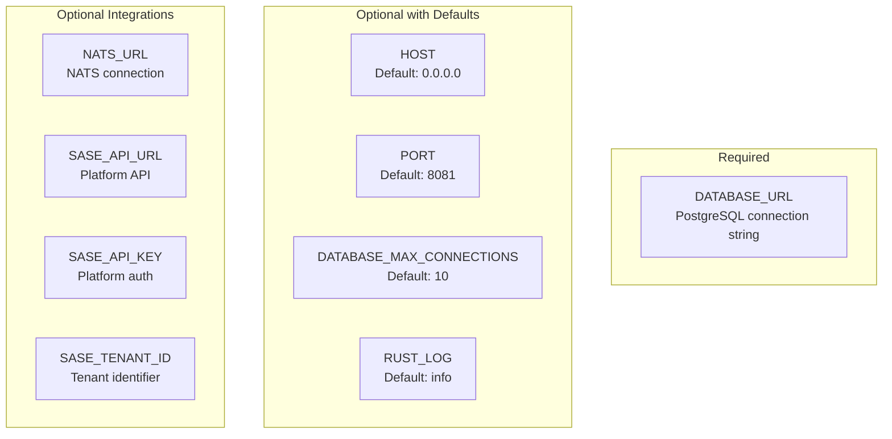
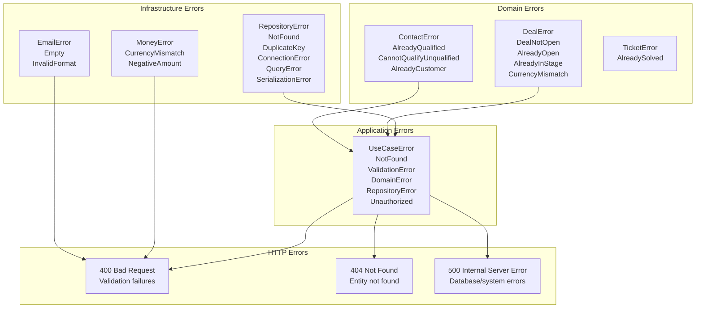

# ERP-CRM Low-Level Design

## 1. Module Structure

### 1.1 Rust Core File Layout

```
src/
  main.rs              -- Entry point, router, all HTTP handlers, domain models
  lib.rs               -- Module registry, re-exports, legacy stubs
  config.rs            -- Environment-based configuration loading
  domain/
    mod.rs             -- Domain module root
    aggregates/
      mod.rs           -- Aggregate module root
      contact.rs       -- Contact aggregate (345 lines): lifecycle, scoring, tags, merge
      deal.rs          -- Deal aggregate (478 lines): stages, products, competitors
    value_objects/
      mod.rs           -- Value object module root, EntityId definition
      email.rs         -- Email value object with validation
      money.rs         -- Money value object with currency arithmetic
      phone.rs         -- Phone value object with formatting
      address.rs       -- Address value object with country codes
    events/
      mod.rs           -- DomainEvent, ContactEvent, DealEvent, AccountEvent enums
    services/
      mod.rs           -- LeadScoringService, ForecastService, ContactMergeService
  application/
    mod.rs             -- Application layer root
    commands/
      mod.rs           -- ContactService, DealService (use case orchestration)
    queries/
      mod.rs           -- Read model queries
    dto/
      mod.rs           -- DTOs: CreateContactCommand, PipelineView, ForecastView
  ports/
    mod.rs             -- Ports layer root
    inbound/
      mod.rs           -- ContactUseCases, DealUseCases traits
    outbound/
      mod.rs           -- ContactRepository, DealRepository, EventPublisher traits
  infrastructure/
    mod.rs             -- Infrastructure layer root
    persistence/
      mod.rs           -- PostgreSQL repository implementations
```

### 1.2 Go Microservice File Layout (per service)

```
services/{name}-service/
  main.go              -- HTTP server, handlers, tenant validation
  Dockerfile           -- Multi-stage build
  README.md            -- Service documentation
```

## 2. Detailed Class/Struct Design

### 2.1 Contact Aggregate



### 2.2 Deal Aggregate



### 2.3 Value Objects



## 3. API Handler Design

### 3.1 Handler Function Signatures

```rust
// Health
async fn health_check() -> impl IntoResponse

// Readiness (database check)
async fn readiness_check(State(state): State<AppState>) -> impl IntoResponse

// Contact CRUD
async fn list_contacts(
    State(state): State<AppState>,
    Query(params): Query<ListParams>,
) -> Result<Json<PaginatedResponse<Contact>>, (StatusCode, String)>

async fn get_contact(
    State(state): State<AppState>,
    Path(id): Path<Uuid>,
) -> Result<Json<Contact>, (StatusCode, String)>

async fn create_contact(
    State(state): State<AppState>,
    Json(req): Json<CreateContactRequest>,
) -> Result<(StatusCode, Json<Contact>), (StatusCode, String)>

async fn update_contact(
    State(state): State<AppState>,
    Path(id): Path<Uuid>,
    Json(req): Json<UpdateContactRequest>,
) -> Result<Json<Contact>, (StatusCode, String)>

async fn delete_contact(
    State(state): State<AppState>,
    Path(id): Path<Uuid>,
) -> Result<StatusCode, (StatusCode, String)>
```

### 3.2 Request/Response Flow



## 4. Database Access Patterns

### 4.1 Pagination Implementation

```rust
// Standard pagination pattern used across all list handlers
let page = params.page.unwrap_or(1).max(1);
let per_page = params.per_page.unwrap_or(20).min(100);
let offset = ((page - 1) * per_page) as i64;

// Data query
let items = sqlx::query_as::<_, T>(
    "SELECT * FROM {table} ORDER BY created_at DESC LIMIT $1 OFFSET $2"
)
.bind(per_page as i64)
.bind(offset)
.fetch_all(&state.db)
.await?;

// Count query
let total: (i64,) = sqlx::query_as("SELECT COUNT(*) FROM {table}")
    .fetch_one(&state.db)
    .await?;
```

### 4.2 Event Publishing Pattern

```rust
// CloudEvents-compatible event format
if let Some(ref nats) = state.nats {
    let event = serde_json::json!({
        "type": "com.opensase.crm.{entity}.{action}",
        "source": "opensase-crm",
        "id": Uuid::new_v4().to_string(),
        "time": Utc::now().to_rfc3339(),
        "data": { /* entity-specific payload */ }
    });
    let _ = nats.publish(
        "com.opensase.crm.{entity}.{action}".to_string(),
        serde_json::to_vec(&event).unwrap().into(),
    ).await;
}
```

## 5. Configuration Design

### 5.1 Environment Variables



### 5.2 Config Loading Flow

```rust
// Config loads from environment variables with fallbacks
Config {
    server: ServerConfig {
        host: env::var("HOST").unwrap_or("0.0.0.0"),
        port: env::var("PORT").parse().unwrap_or(8081),
    },
    database: DatabaseConfig {
        url: env::var("DATABASE_URL").expect("required"),
        max_connections: env::var("DATABASE_MAX_CONNECTIONS")
            .parse().unwrap_or(10),
    },
    nats: env::var("NATS_URL").ok().map(|url| NatsConfig { url }),
    sase: load_sase_config(), // All three vars must be present
}
```

## 6. Error Handling Design

### 6.1 Error Hierarchy



## 7. Testing Design

### 7.1 Test Structure

The codebase includes unit tests co-located with their implementations:

- `domain/aggregates/contact.rs` -- 7 tests: creation, events, qualify, convert, score, tags
- `domain/aggregates/deal.rs` -- 6 tests: creation, stage move, close won/lost, closed modification, weighted value
- `domain/value_objects/email.rs` -- 6 tests: valid, lowercase, trim, empty, no-at, no-domain
- `domain/value_objects/money.rs` -- 5 tests: creation, from-cents, add, currency-mismatch, multiply
- `domain/services/mod.rs` -- 2 tests: lead scoring, weighted pipeline
- `imports/support_core/domain/aggregates/ticket.rs` -- 1 test: ticket workflow

### 7.2 Test Execution

```bash
# Run all unit tests
cargo test --all-features

# Run tests with output
cargo test -- --nocapture

# Run specific test module
cargo test domain::aggregates::contact

# Run with coverage
cargo tarpaulin --all-features
```
