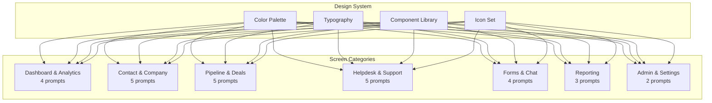

# ERP-CRM Figma Design Prompts

## Overview

This document contains 28 Figma design prompts for the ERP-CRM module. Each prompt is written for a designer or AI design tool to produce enterprise-grade UI components and screens.

---

## Dashboard & Analytics Prompts

### Prompt 1: Main CRM Dashboard

> Design a premium enterprise CRM dashboard for a self-hosted Salesforce alternative. The dashboard must display six KPI cards in a 3x2 grid: Total Contacts, Total Companies, Total Deals, Pipeline Value (currency formatted), Contacts This Month (with month-over-month delta), and Deals Won This Month (with revenue amount). Below the KPIs, include a pipeline funnel chart showing deal counts and values per stage (Lead, Qualified, Proposal, Negotiation, Won, Lost). Add a recent activities feed on the right sidebar showing the last 10 activities with type icons (phone, email, meeting, task), contact name, and timestamp. Include a mini-calendar widget showing upcoming tasks and meetings. The design should use a dark sidebar navigation with a light main content area, enterprise color palette (navy primary, green for positive metrics, red for negative), and support both 1920x1080 desktop and 1366x768 laptop viewports. Include real-time Pulsar health indicator and Quickwit global search bar in the top navigation.

### Prompt 2: Sales Forecast Dashboard

> Design a sales forecasting dashboard showing weighted pipeline analysis. Include four summary cards: Total Pipeline, Weighted Pipeline, Closed Won, and At-Risk Deals. Below, create a stacked bar chart comparing forecast vs. actual revenue by month for the last 12 months. Add a table of at-risk deals showing deal name, owner, amount, days in stage, and a visual SLA-style timer. Include a donut chart for win/loss ratio and a scatter plot of deal size vs. close probability. All charts must support drill-down interactions. Use the same enterprise design language as the main dashboard.

### Prompt 3: Activity Analytics Dashboard

> Design an activity analytics dashboard for sales managers. Show activity volume by type (calls, emails, meetings, tasks) as a stacked area chart over 30 days. Include a leaderboard ranking sales reps by activity count with their photo/avatar, name, and count. Add a heatmap showing activity hours (rows = days of week, columns = hours) to identify peak engagement times. Include an activity-to-deal correlation chart showing how activity volume relates to deal win rate. Design for 1920x1080 with responsive breakpoints.

### Prompt 4: Real-Time Event Stream Dashboard

> Design a real-time event monitoring dashboard for ERP-CRM administrators. Show a live-updating event stream with event type badges (contact.created in blue, deal.won in green, deal.lost in red, ticket.created in orange). Include event rate sparklines for the last hour. Add a Pulsar topic health panel showing message rates, consumer lag, and partition status for command, event, audit, and observability topics. Include a Quickwit search bar with auto-suggest for filtering events by type, entity, or tenant. Use a dark theme for this operational dashboard.

---

## Contact & Company Prompts

### Prompt 5: Contact 360-Degree View

> Design a contact 360-degree view page for an enterprise CRM. The header area should show the contact's avatar (or initials), full name, email, phone, company name (linked), lifecycle stage badge (color-coded: subscriber=gray, lead=blue, MQL=purple, SQL=orange, opportunity=yellow, customer=green, evangelist=gold), and lead score gauge (0-100 with cold/warm/hot zones). Below the header, use a tabbed layout with tabs: Overview, Deals, Activities, Notes, Files, Timeline. The Overview tab shows contact details in a two-column form layout with custom fields section. The Deals tab shows a mini-pipeline view of associated deals. The Activities tab shows a filterable timeline. Include action buttons: Edit, Qualify, Convert to Customer, Transfer Ownership, Merge, Delete. Right sidebar shows "Quick Actions" and "Related Companies" widgets.

### Prompt 6: Contact List with Filters

> Design a contact list view with advanced filtering. Show contacts in a data table with columns: checkbox, avatar/initials, name (first + last), email, company, lifecycle stage (badge), lead score (colored number), owner (avatar), last activity (relative time), created date. Include a multi-filter panel on the left with filters for: lifecycle stage (checkboxes), lead score range (slider), owner (dropdown), tags (multi-select chips), company (searchable dropdown), source (dropdown), date range (date picker). Add bulk actions toolbar for selected contacts: Assign Owner, Add Tags, Change Stage, Export, Delete. Include a search bar with real-time typeahead. Support list/grid toggle view. Design pagination controls at the bottom.

### Prompt 7: Company Account Page

> Design a company/account detail page. Header shows company logo (or generated icon from first letter), company name, industry badge, size indicator, website link, and phone. Below, tabs for: Overview (company details, address on map), Contacts (list of associated contacts with roles), Deals (pipeline chart for this account), Activities (shared timeline), Notes. Include a "Health Score" widget in the sidebar based on deal activity and ticket volume. Add "Similar Companies" recommendation widget.

### Prompt 8: Contact Merge Interface

> Design a contact merge/deduplication interface. Show two contact records side by side in a comparison view. For each field (email, name, phone, company, tags, custom fields), let the user choose which value to keep using radio buttons or a "primary wins" toggle. Show a preview of the merged record at the bottom. Include a warning about linked deals and activities that will be transferred. Add a confirmation dialog summarizing all changes before executing the merge.

### Prompt 9: Contact Import Wizard

> Design a multi-step import wizard. Step 1: Upload CSV file with drag-and-drop zone. Step 2: Column mapping with auto-detection (CSV column -> CRM field dropdown). Step 3: Validation results showing row count, error count, and preview of first 10 rows with error highlighting. Step 4: Duplicate handling strategy selection (skip, update, create new). Step 5: Import progress bar with real-time status. Step 6: Summary showing created, updated, skipped, and failed counts.

---

## Pipeline & Deals Prompts

### Prompt 10: Kanban Pipeline Board

> Design a visual Kanban-style sales pipeline board. Each column represents a stage (Lead, Qualified, Proposal, Negotiation, Closed Won, Closed Lost) with the column header showing stage name, deal count, and total value. Deal cards inside each column show: deal name, company name, amount (currency formatted), owner avatar, expected close date, and a colored bar indicating days-in-stage health (green < 10 days, yellow 10-30 days, red > 30 days). Cards must be draggable between columns. Include a "New Deal" floating action button. Add pipeline selector dropdown for multi-pipeline support. Show a pipeline summary bar at the top with conversion rates between stages. Include filter controls for owner, amount range, and date range.

### Prompt 11: Deal Detail Page

> Design a deal detail page. Header shows deal name, amount (large font), probability percentage (circular gauge), stage badge, and status indicator (open=blue, won=green, lost=red). Include action buttons: Move Stage (dropdown), Close Won, Close Lost, Reopen, Edit. Below, tabs for: Overview (two-column detail layout with expected close date, deal type, next step), Products (line item table with quantity, unit price, discount, total), Contacts (linked contacts with roles), Activities (timeline), Competitors (cards with strengths/weaknesses), Stage History (vertical timeline showing stage transitions with timestamps). Right sidebar shows a "Deal Health" widget with days-in-stage, probability trend, and weighted value.

### Prompt 12: Deal Products/CPQ Editor

> Design a Configure-Price-Quote editor for deal products. Show a line item table with columns: product name (searchable dropdown), quantity (number input), unit price (currency input), discount % (slider or input), line total (calculated). Include "Add Product" button and row delete. Show subtotal, total discount, and grand total at the bottom. Add a "Apply Volume Discount" button that auto-calculates tiered pricing. Support drag-to-reorder rows.

### Prompt 13: Win/Loss Analysis View

> Design a win/loss analysis page. Show win rate as a large donut chart. Below, show two column charts side by side: "Top Won Reasons" and "Top Lost Reasons" with horizontal bars. Include a data table of closed deals filterable by won/lost with columns: deal name, amount, close date, reason, competitor, owner. Add trend lines showing win rate over last 12 months. Include a "Competitor Impact" section showing win rate per competitor.

### Prompt 14: Pipeline Configuration

> Design an admin pipeline configuration page. Show a list of pipelines with drag-to-reorder stages. Each stage has: name (editable), position (auto-numbered), probability (editable), and a delete button. Add "New Stage" button at the bottom. Include a "Set as Default" toggle per pipeline. Show a visual preview of the pipeline as a horizontal funnel diagram updating in real-time as stages are configured.

---

## Helpdesk & Support Prompts

### Prompt 15: Ticket Inbox

> Design a helpdesk ticket inbox similar to an email client. Left panel: ticket list with priority indicator (colored dot), ticket number, subject (truncated), requester name, assignee avatar, time ago, and SLA status badge (on-track=green, warning=yellow, breached=red). Middle panel: selected ticket detail with full conversation thread (public replies styled differently from internal notes), rich text reply composer at the bottom with "Public Reply" and "Internal Note" toggle. Right panel: ticket properties (status, priority, assignee, SLA timer, tags, custom fields). Include quick filter tabs: My Tickets, Unassigned, All, Urgent. Support keyboard shortcuts for navigation.

### Prompt 16: Ticket Detail with SLA Timer

> Design a ticket detail view emphasizing SLA compliance. At the top, show a visual SLA timer bar with time elapsed vs. total SLA time, colored green/yellow/red based on remaining time. Show "First Response" and "Resolution" SLA targets separately. Include the conversation thread with avatars, timestamps, and public/internal badges. Add a sidebar with ticket metadata: requester info, linked contact, linked deal, category, tags, and full audit history. Include action buttons: Assign, Escalate, Solve, Close, Merge, Split.

### Prompt 17: Knowledge Base Article Editor

> Design a knowledge base article editor. Include a WYSIWYG editor with Markdown support, image upload, code blocks, and table insertion. Show a live preview panel alongside the editor. Include fields for: title, URL slug (auto-generated), category (dropdown), tags, status (draft/published), and SEO description. Add a "Related Articles" widget for linking. Show view count and helpfulness rating (thumbs up/down) statistics.

### Prompt 18: Knowledge Base Public Portal

> Design a customer-facing knowledge base portal. Show a search bar prominently at the top with auto-suggest. Below, display category cards in a grid (3x2) with category name, description, article count, and icon. Include "Popular Articles" and "Recently Updated" sections. Article pages should have clean typography, breadcrumb navigation, table of contents sidebar, and "Was this helpful?" feedback buttons. Design for anonymous access without CRM authentication.

### Prompt 19: Agent Performance Dashboard

> Design a support agent performance dashboard. Show per-agent cards with: avatar, name, tickets resolved (number and trend), average resolution time, CSAT score, current workload (open ticket count). Include a team comparison bar chart for resolution times. Add an SLA compliance rate trend line for the team. Show a "Queue Health" section with unassigned ticket count, average wait time, and escalation count.

---

## Forms & Chat Prompts

### Prompt 20: Drag-and-Drop Form Builder

> Design a drag-and-drop form builder interface. Left panel: field type palette with draggable items (text, email, phone, number, dropdown, checkbox, radio, textarea, file upload, date, hidden). Center panel: form canvas where fields are dropped and arranged vertically with drag handles. Right panel: selected field properties (label, placeholder, required toggle, validation rules, conditional logic, help text). Include a top toolbar with: form name, preview toggle, save, publish, embed code. Show a real-time preview updating as fields are configured. Support multi-page forms with page breaks.

### Prompt 21: Form Submission Viewer

> Design a form submissions management page. Show a data table of submissions with columns: submission date, form name, email (if captured), status, and a preview of first 3 field values. Include bulk export (CSV) and individual submission detail view as a slide-out panel showing all field values in a read-only form layout. Add filtering by date range, form name, and field values. Show a chart of submission volume over time at the top.

### Prompt 22: Live Chat Widget

> Design an embeddable live chat widget for websites. Closed state: floating button in bottom-right corner with unread message badge. Open state: chat window (350x500px) with company branding at top, message thread with customer and agent bubbles (different colors), typing indicator, and a message input with attachment button and emoji picker. Include a pre-chat form for capturing name and email before starting. Design both light and dark theme variants. Show "Powered by OpenSASE" footer.

### Prompt 23: Chat Agent Console

> Design the agent-side chat console. Left panel: list of active chat sessions with visitor name, wait time, and status (waiting=red, active=green, idle=gray). Center panel: active chat conversation with visitor info header (name, email, current page URL, location, browser). Bottom: message composer with canned response dropdown and KB article insert. Right panel: visitor CRM context showing linked contact record, recent activities, and open deals. Include "Transfer Chat" and "Create Ticket from Chat" action buttons.

---

## Reporting Prompts

### Prompt 24: Report Builder

> Design a drag-and-drop report builder. Left panel: available fields organized by entity (Contacts, Companies, Deals, Activities, Tickets) as draggable items. Center panel: report canvas with row/column zones for pivot-style reports and a filter zone. Right panel: field configuration (aggregation type: sum/count/avg/min/max, format, filter). Include chart type selector: table, bar, line, pie, funnel, scatter. Show a live preview of the report updating as fields are added. Include save, schedule, and export buttons.

### Prompt 25: Funnel Analytics

> Design a sales funnel analytics page. Show a visual funnel (widest at top, narrowest at bottom) with stages and conversion percentages between each stage. Next to the funnel, show a data table with: stage name, entries, exits, conversion rate, average time in stage, and total value. Include a time period selector and comparison mode (this period vs. last period). Add a "Leaky Bucket" visualization highlighting the stage with the worst conversion rate.

### Prompt 26: Dashboard Builder

> Design a dashboard builder where users can arrange widgets on a grid. Show a widget library panel with widget types: KPI card, line chart, bar chart, pie chart, table, funnel, list. Users drag widgets onto a 12-column grid and resize them. Each widget has a configuration panel for data source, filters, and display options. Include dashboard templates: Sales Overview, Support Metrics, Marketing Performance. Add auto-refresh interval configuration and sharing/embedding options.

---

## Admin & Settings Prompts

### Prompt 27: System Administration Panel

> Design a system administration panel with sections: General Settings, Pipelines, Custom Fields, Automation Rules, Integrations, Users & Roles, and API Keys. Use a left sidebar navigation for sections. The General Settings page shows: tenant name, logo upload, default currency, timezone, and language. Include a system health panel showing service status (green/red indicators) for CRM Core, PostgreSQL, NATS, Pulsar, and Quickwit.

### Prompt 28: Automation Rule Builder

> Design a visual automation rule builder. Use a three-part layout: Trigger (event selection: contact.created, deal.stage_changed, ticket.sla_breach, etc.), Conditions (field-based filters with AND/OR logic, e.g., "lead_score > 80 AND source = 'website'"), and Actions (notification, field update, record creation, webhook, assignment). Show the rule as a visual flow: Trigger -> Conditions -> Actions. Include a test/simulation mode and an execution log table showing recent rule fires with outcomes.
