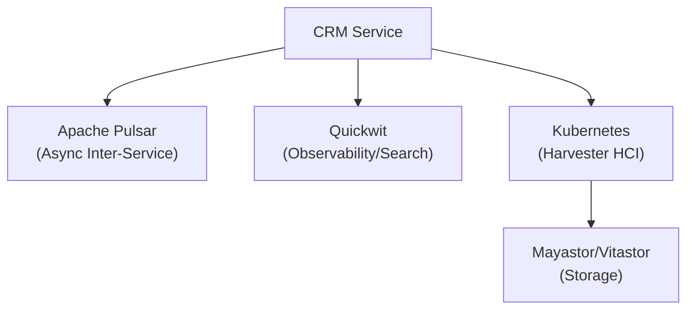
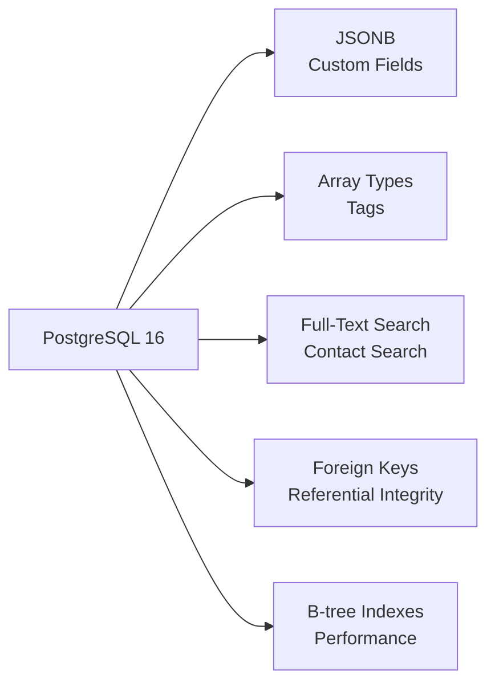
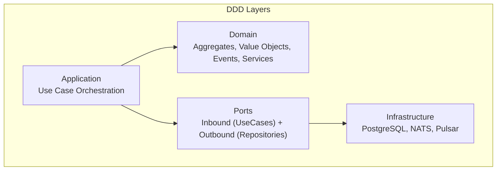
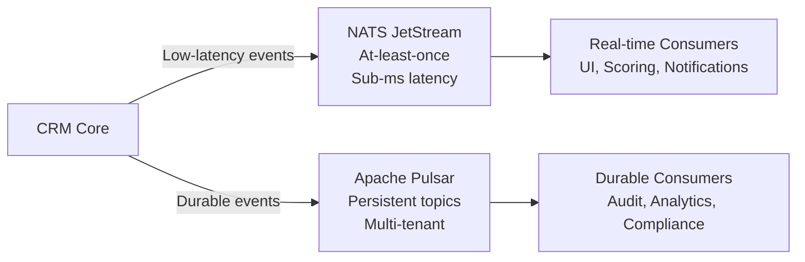
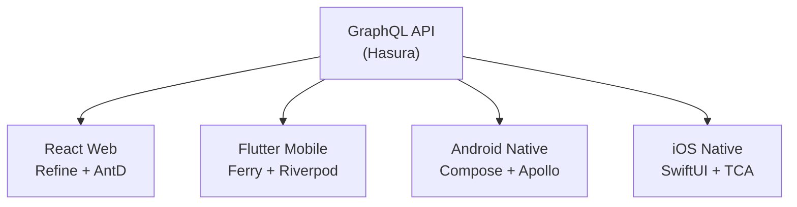

# ERP-CRM Architecture Decision Records

## ADR Index

| ADR | Title | Status | Date |
|-----|-------|--------|------|
| ADR-001 | Sovereign Baseline Architecture | Accepted | 2026-02-20 |
| ADR-002 | Rust for Core CRM Backend | Accepted | 2026-02-18 |
| ADR-003 | PostgreSQL as Primary Database | Accepted | 2026-02-18 |
| ADR-004 | Domain-Driven Design with Hexagonal Architecture | Accepted | 2026-02-18 |
| ADR-005 | Go for Domain Microservices | Accepted | 2026-02-20 |
| ADR-006 | NATS + Pulsar Dual Event Architecture | Accepted | 2026-02-20 |
| ADR-007 | JSONB for Custom Fields | Accepted | 2026-02-18 |
| ADR-008 | UUID v7 for Entity Identifiers | Accepted | 2026-02-18 |
| ADR-009 | Multi-Platform Frontend Strategy | Accepted | 2026-02-18 |
| ADR-010 | Monolith Core + Microservices Hybrid | Accepted | 2026-02-20 |

---

## ADR-001: Sovereign Baseline Architecture

**Status:** Accepted
**Date:** 2026-02-20
**Context:** ERP-CRM needs a standardized architecture that enables data sovereignty, eliminates SaaS dependencies, and aligns with the broader OpenSASE platform.

**Decision:** Adopt the Billyronks sovereign baseline with Apache Pulsar for async messaging, Quickwit for observability, and Harvester HCI with Mayastor/Vitastor storage.

**Consequences:**
- All inter-service communication standardized on Pulsar topics
- Observability standardized on Quickwit with shared log schema
- Infrastructure runs entirely on-premises with Harvester HCI
- No cloud vendor lock-in

---

## ADR-002: Rust for Core CRM Backend

**Status:** Accepted
**Date:** 2026-02-18
**Context:** The CRM core handles latency-sensitive operations (contact lookups, deal transitions) where performance directly impacts user experience. Commercial CRMs like Salesforce (Java) and HubSpot (Node.js) have p95 latencies of 50-200ms.

**Decision:** Use Rust with the axum web framework for the core CRM backend.

**Alternatives Considered:**
- **Go**: Good performance, simpler to write, but lacks strong type system for domain modeling
- **Java (Spring)**: Mature ecosystem, but JVM startup time and GC pauses are concerns
- **Node.js (NestJS)**: Fast development, but single-threaded and not ideal for compute-heavy scoring
- **Python (FastAPI)**: Rapid development, but insufficient performance for enterprise workloads

**Consequences:**
- Sub-5ms p95 latency for CRUD operations
- Memory safety without garbage collection pauses
- Compile-time SQL validation via sqlx
- Steeper learning curve for new contributors
- Smaller talent pool compared to Java/Node.js

---

## ADR-003: PostgreSQL as Primary Database

**Status:** Accepted
**Date:** 2026-02-18
**Context:** The CRM needs a reliable, feature-rich relational database supporting JSONB for custom fields, array types for tags, full-text search for contact/company search, and strong ACID guarantees for financial data (deal amounts).

**Decision:** Use PostgreSQL 16 as the primary and sole database.

**Alternatives Considered:**
- **MySQL/MariaDB**: Less feature-rich (no JSONB, weaker array support)
- **MongoDB**: Good for flexible schemas, but loses relational integrity
- **CockroachDB**: Distributed, but adds operational complexity
- **SQLite**: Insufficient for multi-tenant production workloads

**Consequences:**
- Single database simplifies operations and backup
- JSONB enables unlimited custom fields without migrations
- Array types enable tag-based querying
- Well-understood scaling path (vertical + read replicas)
- Point-in-time recovery for compliance

---

## ADR-004: Domain-Driven Design with Hexagonal Architecture

**Status:** Accepted
**Date:** 2026-02-18
**Context:** CRM has complex business rules (lead qualification, deal stage management, SLA enforcement) that need to be testable independently of infrastructure.

**Decision:** Implement DDD with hexagonal architecture. Domain layer contains aggregates, value objects, domain events, and domain services. Application layer orchestrates use cases. Ports define interfaces. Infrastructure implements adapters.

**Consequences:**
- Business rules are testable without database (26 unit tests prove this)
- Domain events enable reactive architecture
- Infrastructure can be swapped (e.g., different database) without touching domain
- Higher initial development cost but lower maintenance cost

---

## ADR-005: Go for Domain Microservices

**Status:** Accepted
**Date:** 2026-02-20
**Context:** Twelve domain-specific services need CRUD endpoints with tenant isolation. These services are simpler than the core and will be extended by a broader contributor base.

**Decision:** Implement Go microservices using the standard library `net/http` for all 12 domain services.

**Consequences:**
- Fast compilation and deployment
- Single-binary Docker images
- Lower barrier to entry for contributors
- Consistent service pattern (identical structure across all 12 services)
- Less type safety for domain modeling compared to Rust

---

## ADR-006: NATS + Pulsar Dual Event Architecture

**Status:** Accepted
**Date:** 2026-02-20
**Context:** The system needs both low-latency real-time events (UI updates, scoring) and durable persistent events (audit, compliance, cross-service).

**Decision:** Use NATS JetStream for real-time internal events and Apache Pulsar for durable cross-service event streaming.

**Consequences:**
- NATS provides sub-millisecond event delivery for real-time features
- Pulsar provides guaranteed delivery and replay for compliance
- NATS connection is optional (graceful degradation)
- Two systems to operate and monitor

---

## ADR-007: JSONB for Custom Fields

**Status:** Accepted
**Date:** 2026-02-18
**Context:** Enterprise CRM requires unlimited custom fields per entity, similar to Salesforce custom objects. Schema migrations for each custom field would be impractical.

**Decision:** Store custom fields as PostgreSQL JSONB columns with default `'{}'`.

**Consequences:**
- Unlimited custom fields without migrations
- Queryable via PostgreSQL JSONB operators (`->`, `->>`, `@>`)
- Indexable with GIN indexes for complex queries
- No schema enforcement (application-level validation required)
- Slightly slower than dedicated columns for frequently queried fields

---

## ADR-008: UUID v7 for Entity Identifiers

**Status:** Accepted
**Date:** 2026-02-18
**Context:** Entity IDs need to be unique, sortable, and database-friendly.

**Decision:** Use UUID v7 (time-ordered) generated via `Uuid::now_v7()`.

**Consequences:**
- Chronological sorting without secondary indexes
- Better B-tree performance than UUID v4 (sequential inserts)
- 128-bit globally unique identifiers
- Human-readable string representation

---

## ADR-009: Multi-Platform Frontend Strategy

**Status:** Accepted
**Date:** 2026-02-18
**Context:** Enterprise CRM users need web, mobile, and native desktop experiences.

**Decision:** Build four frontend applications: React web (Refine + AntD), Flutter mobile, Android native (Compose + Apollo), iOS native (SwiftUI + Apollo + TCA). All consume the same GraphQL API.

**Consequences:**
- Best-in-class UX per platform
- GraphQL provides a unified data layer
- Code generation ensures type safety across all platforms
- Higher development and maintenance cost than cross-platform only

---

## ADR-010: Monolith Core + Microservices Hybrid

**Status:** Accepted
**Date:** 2026-02-20
**Context:** Pure microservices add operational complexity; pure monolith limits extensibility. CRM has complex core logic (scoring, pipeline, merge) that benefits from tight coupling, and simpler CRUD services that benefit from independent deployment.

**Decision:** Rust monolith for core CRM logic, Go microservices for domain-specific CRUD.

**Consequences:**
- Core business logic is cohesive and testable
- Microservices can be deployed and scaled independently
- Clear boundary between core complexity and service extensions
- Two codebases, two build pipelines, two deployment strategies
