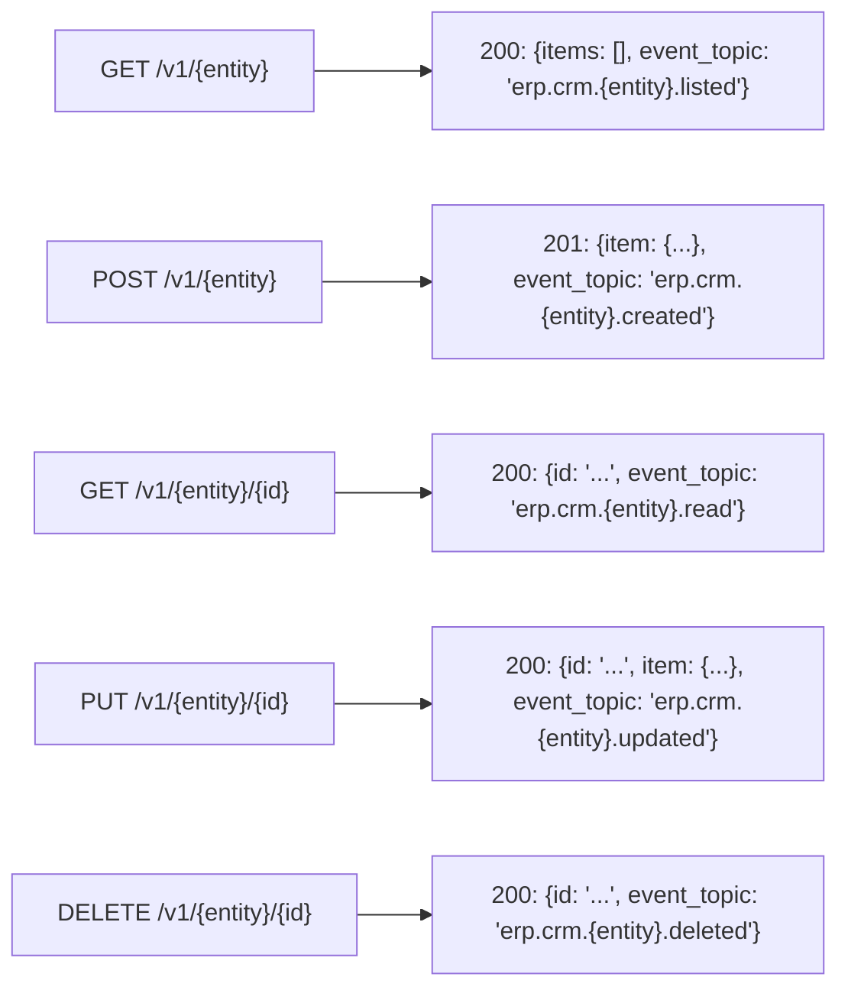

# ERP-CRM API Documentation

## Base URLs

| Environment | Base URL |
|------------|----------|
| Local Development | `http://localhost:8081` |
| Microservices (Local) | `http://localhost:8080` |
| Production | `https://crm.{your-domain}` |

## Authentication

All business endpoints require JWT authentication:

```
Authorization: Bearer <jwt_token>
X-Tenant-ID: <tenant_uuid>
```

Tokens are issued by ERP-IAM via OIDC flow. Health endpoints are unauthenticated.

---

## Health & Operations

### GET /health

Returns service health status.

**Response 200:**
```json
{
  "status": "healthy",
  "service": "opensase-crm",
  "version": "0.1.0"
}
```

### GET /ready

Verifies database connectivity.

**Response 200:** `ready`
**Response 503:** `not ready`

### GET /metrics

Prometheus-compatible metrics.

**Response 200:**
```
# HELP opensase_crm_up Service is up
# TYPE opensase_crm_up gauge
opensase_crm_up 1
```

---

## Contacts API

### GET /api/v1/contacts

List contacts with pagination.

**Query Parameters:**

| Parameter | Type | Default | Description |
|-----------|------|---------|-------------|
| page | u32 | 1 | Page number |
| per_page | u32 | 20 | Items per page (max 100) |
| search | string | - | Search term |
| sort_by | string | created_at | Sort field |
| sort_order | string | desc | asc or desc |

**Response 200:**
```json
{
  "data": [
    {
      "id": "019503a2-xxxx-7xxx-xxxx-xxxxxxxxxxxx",
      "email": "jane@example.com",
      "first_name": "Jane",
      "last_name": "Smith",
      "phone": "+1-555-0100",
      "company_id": null,
      "lead_score": 45,
      "lifecycle_stage": "lead",
      "source": "website",
      "owner_id": null,
      "tags": ["enterprise"],
      "custom_fields": {},
      "created_at": "2026-02-23T10:00:00Z",
      "updated_at": "2026-02-23T10:00:00Z"
    }
  ],
  "total": 1,
  "page": 1,
  "per_page": 20,
  "total_pages": 1
}
```

### POST /api/v1/contacts

Create a new contact.

**Request Body:**
```json
{
  "email": "jane@example.com",
  "first_name": "Jane",
  "last_name": "Smith",
  "phone": "+1-555-0100",
  "company_id": "uuid-optional",
  "source": "website",
  "tags": ["enterprise", "vip"],
  "custom_fields": {"industry": "Technology"}
}
```

| Field | Type | Required | Validation |
|-------|------|----------|-----------|
| email | string | Yes | Valid email format |
| first_name | string | No | Max 100 chars |
| last_name | string | No | Max 100 chars |
| phone | string | No | Max 50 chars |
| company_id | uuid | No | Must exist |
| source | string | No | Max 100 chars |
| tags | string[] | No | Array of strings |
| custom_fields | object | No | Valid JSON |

**Response 201:**
```json
{
  "id": "019503a2-xxxx-7xxx-xxxx-xxxxxxxxxxxx",
  "email": "jane@example.com",
  "first_name": "Jane",
  "last_name": "Smith",
  "phone": "+1-555-0100",
  "company_id": null,
  "lead_score": 0,
  "lifecycle_stage": "subscriber",
  "source": "website",
  "owner_id": null,
  "tags": ["enterprise", "vip"],
  "custom_fields": {"industry": "Technology"},
  "created_at": "2026-02-23T10:00:00Z",
  "updated_at": "2026-02-23T10:00:00Z"
}
```

**Response 400:** Invalid email format or validation failure

**Side Effects:** Publishes `com.opensase.crm.contact.created` event to NATS

### GET /api/v1/contacts/:id

Get a single contact by UUID.

**Response 200:** Contact object
**Response 404:** `Contact not found`

### PUT /api/v1/contacts/:id

Update a contact. All fields are optional (partial update).

**Request Body:**
```json
{
  "email": "updated@example.com",
  "first_name": "Jane",
  "last_name": "Doe",
  "phone": "+1-555-0200",
  "lead_score": 75,
  "lifecycle_stage": "lead",
  "tags": ["enterprise", "vip", "hot-lead"],
  "custom_fields": {"industry": "Healthcare"}
}
```

**Response 200:** Updated contact object
**Response 404:** `Contact not found`

### DELETE /api/v1/contacts/:id

Delete a contact.

**Response 204:** No content (success)
**Response 404:** `Contact not found`

---

## Companies API

### GET /api/v1/companies

List companies with pagination (same parameters as contacts).

### POST /api/v1/companies

Create a company.

**Request Body:**
```json
{
  "name": "Acme Corporation",
  "domain": "acme.com",
  "industry": "Technology",
  "size": "100-500",
  "website": "https://acme.com",
  "phone": "+1-555-0300",
  "address": {
    "street": "123 Main St",
    "city": "Lagos",
    "state": "Lagos",
    "country": "NG",
    "postal_code": "100001"
  },
  "custom_fields": {}
}
```

| Field | Type | Required | Validation |
|-------|------|----------|-----------|
| name | string | Yes | Min 1 char |
| domain | string | No | Domain name |
| industry | string | No | Max 100 chars |
| size | string | No | Max 50 chars |
| website | string | No | Max 500 chars |
| phone | string | No | Max 50 chars |
| address | object | No | JSON object |
| custom_fields | object | No | Valid JSON |

**Response 201:** Created company object

### GET /api/v1/companies/:id
### PUT /api/v1/companies/:id
### DELETE /api/v1/companies/:id

Same patterns as contacts.

---

## Deals API

### GET /api/v1/deals

List deals with pagination.

### POST /api/v1/deals

Create a deal.

**Request Body:**
```json
{
  "name": "Enterprise License - Acme Corp",
  "contact_id": "uuid-optional",
  "company_id": "uuid-optional",
  "pipeline_id": "00000000-0000-0000-0000-000000000001",
  "stage_id": "00000000-0000-0000-0000-000000000011",
  "amount": 50000,
  "currency": "NGN",
  "expected_close_date": "2026-06-30T00:00:00Z",
  "custom_fields": {}
}
```

| Field | Type | Required | Validation |
|-------|------|----------|-----------|
| name | string | Yes | Min 1 char |
| pipeline_id | uuid | Yes | Must exist |
| stage_id | uuid | Yes | Must belong to pipeline |
| amount | i64 | No | Deal value |
| currency | string | No | Default: NGN |
| contact_id | uuid | No | Must exist |
| company_id | uuid | No | Must exist |
| expected_close_date | datetime | No | ISO 8601 |
| custom_fields | object | No | Valid JSON |

**Response 201:** Created deal object

### GET /api/v1/deals/:id
### PUT /api/v1/deals/:id
### DELETE /api/v1/deals/:id

Same patterns as contacts.

---

## Activities API

### GET /api/v1/activities

List activities with pagination.

### POST /api/v1/activities

Create an activity.

**Request Body:**
```json
{
  "activity_type": "call",
  "subject": "Discovery call with Jane",
  "description": "Discussed requirements and timeline",
  "contact_id": "uuid-optional",
  "company_id": "uuid-optional",
  "deal_id": "uuid-optional",
  "due_date": "2026-02-25T14:00:00Z"
}
```

| Field | Type | Required |
|-------|------|----------|
| activity_type | string | Yes (call/email/meeting/task) |
| subject | string | Yes |
| description | string | No |
| contact_id | uuid | No |
| company_id | uuid | No |
| deal_id | uuid | No |
| due_date | datetime | No |

### GET /api/v1/activities/:id

Get activity by ID.

---

## Dashboard API

### GET /api/v1/dashboard/stats

Get aggregated dashboard statistics.

**Response 200:**
```json
{
  "total_contacts": 150,
  "total_companies": 45,
  "total_deals": 32,
  "deals_value": 2500000,
  "contacts_this_month": 0,
  "deals_won_this_month": 0
}
```

---

## Microservice APIs

All microservices follow the same pattern:



**Required Header:** `X-Tenant-ID`

**Services and Endpoints:**

| Service | Base Path | Port |
|---------|----------|------|
| contact-service | `/v1/contact` | 8080 |
| lead-service | `/v1/lead` | 8080 |
| pipeline-service | `/v1/pipeline` | 8080 |
| opportunity-service | `/v1/opportunity` | 8080 |
| activity-service | `/v1/activity` | 8080 |
| helpdesk-service | `/v1/helpdesk` | 8080 |
| knowledge-base-service | `/v1/knowledge-base` | 8080 |
| form-builder-service | `/v1/form-builder` | 8080 |
| chat-service | `/v1/chat` | 8080 |
| automation-service | `/v1/automation` | 8080 |
| reporting-service | `/v1/reporting` | 8080 |
| territory-service | `/v1/territory` | 8080 |

---

## Error Responses

All errors return JSON:

```json
{
  "error": "Error description"
}
```

| Status Code | Description |
|-------------|-------------|
| 400 | Bad Request (validation failure, missing tenant ID) |
| 404 | Not Found (entity does not exist) |
| 405 | Method Not Allowed |
| 500 | Internal Server Error (database/system error) |
