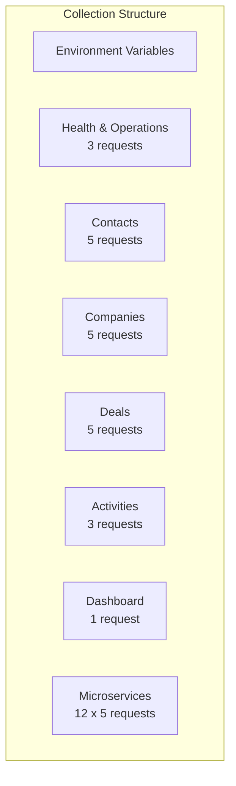
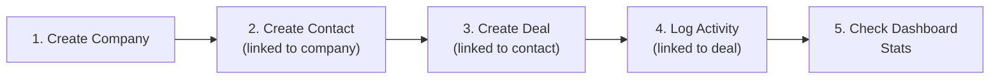

# ERP-CRM Postman Collection

## Collection Overview

This document defines a Postman-compatible collection for testing all ERP-CRM API endpoints. Import the JSON below into Postman or use the curl examples directly.



## Environment Variables

```json
{
  "base_url": "http://localhost:8081",
  "ms_base_url": "http://localhost:8080",
  "tenant_id": "test-tenant-001",
  "auth_token": "your-jwt-token",
  "contact_id": "",
  "company_id": "",
  "deal_id": "",
  "activity_id": "",
  "pipeline_id": "00000000-0000-0000-0000-000000000001",
  "stage_lead": "00000000-0000-0000-0000-000000000011",
  "stage_qualified": "00000000-0000-0000-0000-000000000012",
  "stage_proposal": "00000000-0000-0000-0000-000000000013",
  "stage_negotiation": "00000000-0000-0000-0000-000000000014",
  "stage_won": "00000000-0000-0000-0000-000000000015",
  "stage_lost": "00000000-0000-0000-0000-000000000016"
}
```

## Health & Operations

### 1. Health Check

```bash
curl -s http://localhost:8081/health | jq
```

**Expected Response:**
```json
{"status": "healthy", "service": "opensase-crm", "version": "0.1.0"}
```

### 2. Readiness Check

```bash
curl -s http://localhost:8081/ready
```

**Expected Response:** `ready`

### 3. Metrics

```bash
curl -s http://localhost:8081/metrics
```

---

## Contacts

### 4. Create Contact

```bash
curl -s -X POST http://localhost:8081/api/v1/contacts \
  -H "Content-Type: application/json" \
  -d '{
    "email": "jane.smith@acme.com",
    "first_name": "Jane",
    "last_name": "Smith",
    "phone": "+1-555-0100",
    "source": "website",
    "tags": ["enterprise", "vip"],
    "custom_fields": {"industry": "Technology", "role": "CTO"}
  }' | jq
```

**Post-request script:** Save `response.id` as `contact_id` variable.

### 5. List Contacts

```bash
curl -s "http://localhost:8081/api/v1/contacts?page=1&per_page=10" | jq
```

### 6. Get Contact

```bash
curl -s http://localhost:8081/api/v1/contacts/${contact_id} | jq
```

### 7. Update Contact

```bash
curl -s -X PUT http://localhost:8081/api/v1/contacts/${contact_id} \
  -H "Content-Type: application/json" \
  -d '{
    "lead_score": 75,
    "lifecycle_stage": "lead",
    "tags": ["enterprise", "vip", "hot-lead"]
  }' | jq
```

### 8. Delete Contact

```bash
curl -s -X DELETE http://localhost:8081/api/v1/contacts/${contact_id} -w "\n%{http_code}"
```

**Expected:** HTTP 204

---

## Companies

### 9. Create Company

```bash
curl -s -X POST http://localhost:8081/api/v1/companies \
  -H "Content-Type: application/json" \
  -d '{
    "name": "Acme Corporation",
    "domain": "acme.com",
    "industry": "Technology",
    "size": "100-500",
    "website": "https://acme.com",
    "phone": "+1-555-0300",
    "address": {"street": "123 Main St", "city": "Lagos", "country": "NG"}
  }' | jq
```

### 10. List Companies

```bash
curl -s "http://localhost:8081/api/v1/companies?page=1&per_page=10" | jq
```

### 11. Get Company

```bash
curl -s http://localhost:8081/api/v1/companies/${company_id} | jq
```

### 12. Update Company

```bash
curl -s -X PUT http://localhost:8081/api/v1/companies/${company_id} \
  -H "Content-Type: application/json" \
  -d '{"name": "Acme Corp International", "size": "500-1000"}' | jq
```

### 13. Delete Company

```bash
curl -s -X DELETE http://localhost:8081/api/v1/companies/${company_id} -w "\n%{http_code}"
```

---

## Deals

### 14. Create Deal

```bash
curl -s -X POST http://localhost:8081/api/v1/deals \
  -H "Content-Type: application/json" \
  -d '{
    "name": "Enterprise License - Acme Corp",
    "pipeline_id": "00000000-0000-0000-0000-000000000001",
    "stage_id": "00000000-0000-0000-0000-000000000011",
    "amount": 50000,
    "currency": "NGN",
    "expected_close_date": "2026-06-30T00:00:00Z"
  }' | jq
```

### 15. List Deals

```bash
curl -s "http://localhost:8081/api/v1/deals?page=1&per_page=10" | jq
```

### 16. Get Deal

```bash
curl -s http://localhost:8081/api/v1/deals/${deal_id} | jq
```

### 17. Update Deal

```bash
curl -s -X PUT http://localhost:8081/api/v1/deals/${deal_id} \
  -H "Content-Type: application/json" \
  -d '{
    "name": "Enterprise License - Acme Corp (Updated)",
    "pipeline_id": "00000000-0000-0000-0000-000000000001",
    "stage_id": "00000000-0000-0000-0000-000000000012",
    "amount": 75000
  }' | jq
```

### 18. Delete Deal

```bash
curl -s -X DELETE http://localhost:8081/api/v1/deals/${deal_id} -w "\n%{http_code}"
```

---

## Activities

### 19. Create Activity

```bash
curl -s -X POST http://localhost:8081/api/v1/activities \
  -H "Content-Type: application/json" \
  -d '{
    "activity_type": "call",
    "subject": "Discovery call with Jane Smith",
    "description": "Discussed enterprise licensing requirements",
    "due_date": "2026-02-25T14:00:00Z"
  }' | jq
```

### 20. List Activities

```bash
curl -s "http://localhost:8081/api/v1/activities?page=1&per_page=10" | jq
```

### 21. Get Activity

```bash
curl -s http://localhost:8081/api/v1/activities/${activity_id} | jq
```

---

## Dashboard

### 22. Get Dashboard Stats

```bash
curl -s http://localhost:8081/api/v1/dashboard/stats | jq
```

---

## Microservice Endpoints

### Contact Service

```bash
# List contacts
curl -s http://localhost:8080/v1/contact -H "X-Tenant-ID: test-tenant-001" | jq

# Create contact
curl -s -X POST http://localhost:8080/v1/contact \
  -H "X-Tenant-ID: test-tenant-001" \
  -H "Content-Type: application/json" \
  -d '{"email": "test@example.com", "name": "Test User"}' | jq

# Get contact
curl -s http://localhost:8080/v1/contact/123 -H "X-Tenant-ID: test-tenant-001" | jq

# Update contact
curl -s -X PUT http://localhost:8080/v1/contact/123 \
  -H "X-Tenant-ID: test-tenant-001" \
  -H "Content-Type: application/json" \
  -d '{"name": "Updated User"}' | jq

# Delete contact
curl -s -X DELETE http://localhost:8080/v1/contact/123 -H "X-Tenant-ID: test-tenant-001" | jq
```

### Helpdesk Service

```bash
# Create ticket
curl -s -X POST http://localhost:8080/v1/helpdesk \
  -H "X-Tenant-ID: test-tenant-001" \
  -H "Content-Type: application/json" \
  -d '{"subject": "Cannot login", "description": "Getting 401 error", "priority": "high"}' | jq

# List tickets
curl -s http://localhost:8080/v1/helpdesk -H "X-Tenant-ID: test-tenant-001" | jq
```

### Missing X-Tenant-ID Test

```bash
# Should return 400 error
curl -s http://localhost:8080/v1/contact | jq
# {"error": "missing X-Tenant-ID"}
```

---

## End-to-End Test Scenario

Run these requests in sequence to test a complete sales workflow:



```bash
# Step 1: Create company
COMPANY=$(curl -s -X POST http://localhost:8081/api/v1/companies \
  -H "Content-Type: application/json" \
  -d '{"name": "Acme Corp"}')
COMPANY_ID=$(echo $COMPANY | jq -r '.id')

# Step 2: Create contact linked to company
CONTACT=$(curl -s -X POST http://localhost:8081/api/v1/contacts \
  -H "Content-Type: application/json" \
  -d "{\"email\": \"ceo@acme.com\", \"first_name\": \"John\", \"last_name\": \"Doe\", \"company_id\": \"$COMPANY_ID\"}")
CONTACT_ID=$(echo $CONTACT | jq -r '.id')

# Step 3: Create deal linked to contact
DEAL=$(curl -s -X POST http://localhost:8081/api/v1/deals \
  -H "Content-Type: application/json" \
  -d "{\"name\": \"Acme Enterprise\", \"pipeline_id\": \"00000000-0000-0000-0000-000000000001\", \"stage_id\": \"00000000-0000-0000-0000-000000000011\", \"amount\": 100000, \"contact_id\": \"$CONTACT_ID\", \"company_id\": \"$COMPANY_ID\"}")
DEAL_ID=$(echo $DEAL | jq -r '.id')

# Step 4: Log activity
curl -s -X POST http://localhost:8081/api/v1/activities \
  -H "Content-Type: application/json" \
  -d "{\"activity_type\": \"call\", \"subject\": \"Discovery call\", \"contact_id\": \"$CONTACT_ID\", \"deal_id\": \"$DEAL_ID\"}" | jq

# Step 5: Check dashboard
curl -s http://localhost:8081/api/v1/dashboard/stats | jq
```
