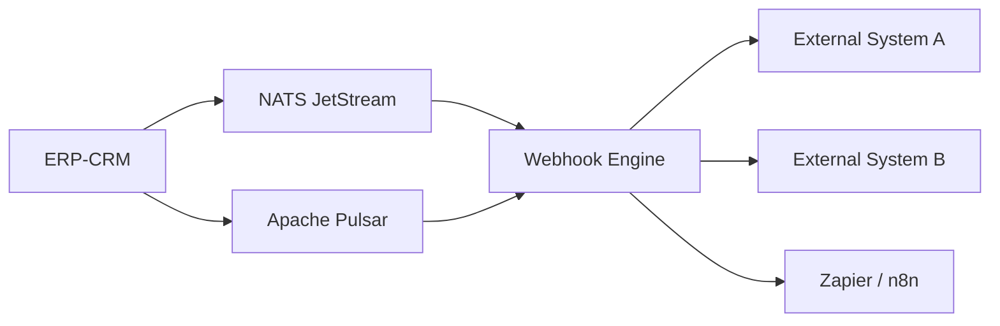
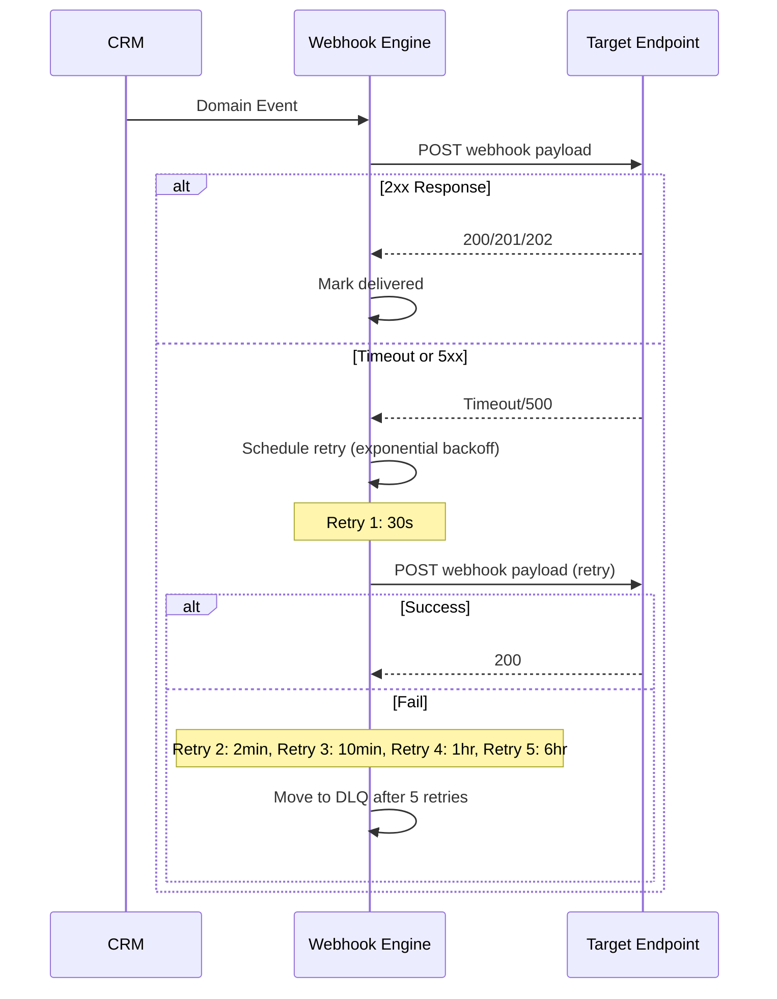

# ERP-CRM Webhook Specifications

## Overview

ERP-CRM publishes events via NATS JetStream and Apache Pulsar. External systems can receive these events through webhooks. This document specifies the webhook payload format, delivery guarantees, and integration patterns.



## Event Catalog

### Contact Events

| Event Type | Trigger | Payload |
|-----------|---------|---------|
| `com.opensase.crm.contact.created` | New contact created | contact_id, email |
| `com.opensase.crm.contact.updated` | Contact fields modified | contact_id, changed_fields |
| `com.opensase.crm.contact.deleted` | Contact deleted | contact_id |
| `com.opensase.crm.contact.qualified` | Lead qualified | contact_id, previous_status |
| `com.opensase.crm.contact.converted_to_customer` | Converted to customer | contact_id |
| `com.opensase.crm.contact.lead_score_changed` | Score changed by 10+ | contact_id, old_score, new_score |
| `com.opensase.crm.contact.ownership_transferred` | Owner changed | contact_id, from_owner, to_owner |
| `com.opensase.crm.contact.merged` | Contacts merged | primary_contact_id, merged_contact_id |

### Deal Events

| Event Type | Trigger | Payload |
|-----------|---------|---------|
| `com.opensase.crm.deal.created` | New deal created | deal_id, name, amount, pipeline_id |
| `com.opensase.crm.deal.stage_changed` | Deal moved to new stage | deal_id, from_stage, to_stage |
| `com.opensase.crm.deal.won` | Deal closed won | deal_id, amount |
| `com.opensase.crm.deal.lost` | Deal closed lost | deal_id, reason |
| `com.opensase.crm.deal.amount_changed` | Deal amount updated | deal_id, old_amount, new_amount |

### Account Events

| Event Type | Trigger | Payload |
|-----------|---------|---------|
| `com.opensase.crm.account.created` | New account created | account_id, name |
| `com.opensase.crm.account.contact_linked` | Contact linked to account | account_id, contact_id |
| `com.opensase.crm.account.deal_linked` | Deal linked to account | account_id, deal_id |

### Microservice Events

| Pattern | Example | Trigger |
|---------|---------|---------|
| `erp.crm.{entity}.created` | `erp.crm.helpdesk.created` | Entity created |
| `erp.crm.{entity}.updated` | `erp.crm.lead.updated` | Entity updated |
| `erp.crm.{entity}.deleted` | `erp.crm.chat.deleted` | Entity deleted |
| `erp.crm.{entity}.listed` | `erp.crm.contact.listed` | Entity list queried |
| `erp.crm.{entity}.read` | `erp.crm.pipeline.read` | Single entity read |

## Webhook Payload Format

All webhooks use CloudEvents v1.0 format:

```json
{
  "specversion": "1.0",
  "type": "com.opensase.crm.contact.created",
  "source": "opensase-crm",
  "id": "550e8400-e29b-41d4-a716-446655440000",
  "time": "2026-02-23T10:00:00.000Z",
  "datacontenttype": "application/json",
  "subject": "019503a2-xxxx-xxxx-xxxx-xxxxxxxxxxxx",
  "data": {
    "contact_id": "019503a2-xxxx-xxxx-xxxx-xxxxxxxxxxxx",
    "email": "jane@example.com",
    "first_name": "Jane",
    "last_name": "Smith",
    "lifecycle_stage": "subscriber",
    "lead_score": 0
  }
}
```

### Envelope Fields

| Field | Type | Description |
|-------|------|-------------|
| specversion | string | Always "1.0" |
| type | string | Event type identifier |
| source | string | Always "opensase-crm" |
| id | string | Unique event UUID |
| time | string | ISO 8601 timestamp |
| datacontenttype | string | Always "application/json" |
| subject | string | Aggregate ID the event belongs to |
| data | object | Event-specific payload |

## Webhook Delivery

### Delivery Semantics



### Retry Policy

| Retry | Delay | Total Elapsed |
|-------|-------|--------------|
| 1 | 30 seconds | 30s |
| 2 | 2 minutes | 2.5 min |
| 3 | 10 minutes | 12.5 min |
| 4 | 1 hour | 1h 12.5min |
| 5 | 6 hours | 7h 12.5min |
| Dead Letter | - | Moved to DLQ |

### Webhook Security

1. **HMAC Signature**: Each webhook includes an `X-Webhook-Signature` header:
   ```
   X-Webhook-Signature: sha256=<hmac_hex_digest>
   ```
   Compute: `HMAC-SHA256(webhook_secret, request_body)`

2. **Timestamp Validation**: Include `X-Webhook-Timestamp` to prevent replay attacks. Reject webhooks older than 5 minutes.

3. **TLS**: All webhook endpoints must use HTTPS.

### Webhook Registration

```json
POST /api/v1/webhooks
{
  "url": "https://your-app.com/webhook",
  "events": ["com.opensase.crm.contact.created", "com.opensase.crm.deal.won"],
  "secret": "your-webhook-secret",
  "active": true
}
```

## Pulsar Topic Subscriptions

For direct Pulsar integration (alternative to webhooks):

```yaml
# Topics available for subscription
persistent://billyronks/extract-crm/command   # Command events
persistent://billyronks/extract-crm/event     # Domain events
persistent://billyronks/extract-crm/audit     # Audit trail
persistent://billyronks/global/observability   # System observability
```

Each topic has 6 partitions for parallel consumption.

## Integration Examples

### Example: Slack Notification on Deal Won

```json
{
  "url": "https://hooks.slack.com/services/T.../B.../xxx",
  "events": ["com.opensase.crm.deal.won"],
  "transform": {
    "text": "Deal '{{data.name}}' won for {{data.amount}}!"
  }
}
```

### Example: Accounting System Integration

```json
{
  "url": "https://accounting.internal/api/invoices",
  "events": ["com.opensase.crm.deal.won"],
  "headers": {"Authorization": "Bearer {{accounting_token}}"},
  "transform": {
    "deal_id": "{{data.deal_id}}",
    "amount": "{{data.amount}}",
    "action": "create_invoice"
  }
}
```

### Example: Lead Enrichment on Contact Created

```json
{
  "url": "https://enrichment.internal/api/enrich",
  "events": ["com.opensase.crm.contact.created"],
  "transform": {
    "email": "{{data.email}}",
    "callback_url": "https://crm.internal/api/v1/contacts/{{data.contact_id}}"
  }
}
```
