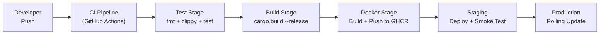
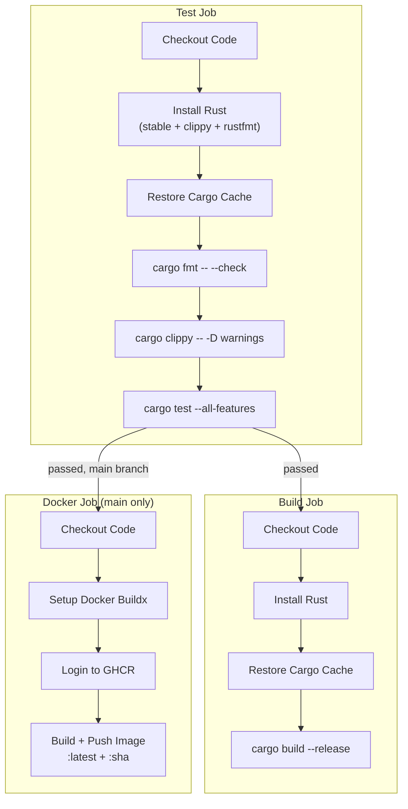
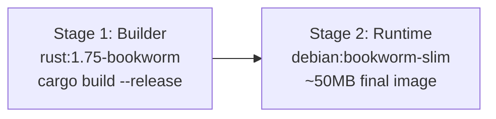
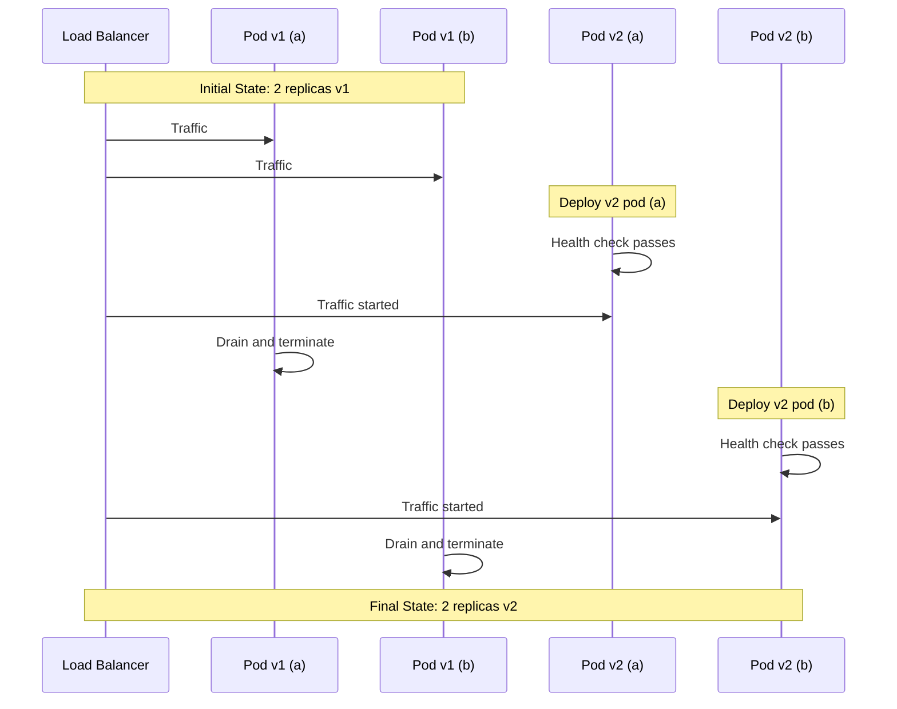
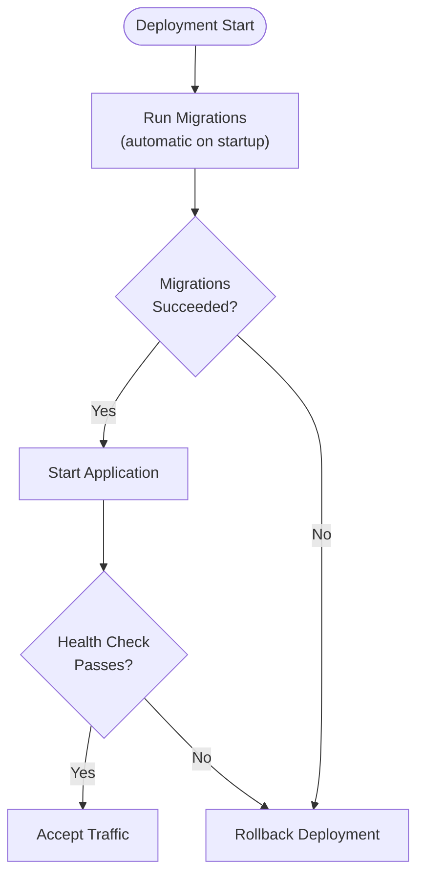
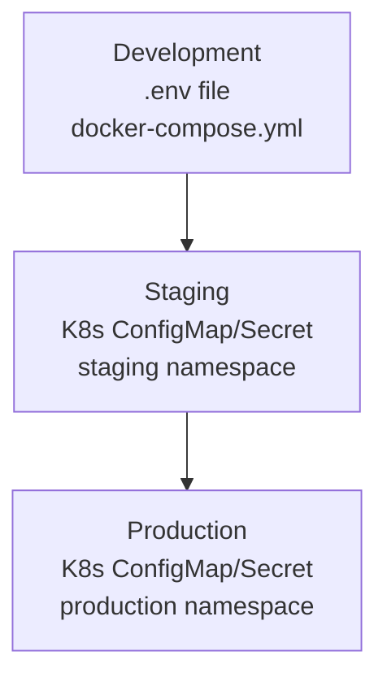

# ERP-CRM Deployment Pipeline

## Pipeline Overview



## GitHub Actions CI/CD

### Trigger Configuration

```yaml
on:
  push:
    branches: [main, develop]
  pull_request:
    branches: [main]
```

### Pipeline Stages



### CI Service Dependencies

The test job spins up a PostgreSQL service container:

```yaml
services:
  postgres:
    image: postgres:16
    env:
      POSTGRES_USER: postgres
      POSTGRES_PASSWORD: postgres
      POSTGRES_DB: crm_test
    ports:
      - 5432:5432
    options: >-
      --health-cmd pg_isready
      --health-interval 10s
      --health-timeout 5s
      --health-retries 5
```

### Docker Image Build

Multi-stage build produces minimal production images:



Key features:
- Dependency caching via dummy `src/main.rs` build
- Non-root user (`appuser`) in production
- Migrations copied into image
- Minimal runtime dependencies (ca-certificates, libssl3)

### Image Tagging Strategy

| Tag | When | Purpose |
|-----|------|---------|
| `ghcr.io/{repo}:latest` | Main branch push | Latest stable |
| `ghcr.io/{repo}:{sha}` | Every main push | Immutable, audit-friendly |
| `ghcr.io/{repo}:v{version}` | Release tag | Semantic version |

## Go Microservice Deployment

Each microservice has its own Dockerfile:

```dockerfile
# Standard Go microservice Dockerfile
FROM golang:1.21-alpine AS builder
WORKDIR /app
COPY main.go .
RUN go build -o service main.go

FROM alpine:3.19
COPY --from=builder /app/service /app/service
ENTRYPOINT ["/app/service"]
```

## Deployment Strategies

### Rolling Update (Default)



### Rollback Procedure

```bash
# Kubernetes rollback
kubectl rollout undo deployment/crm-core -n crm

# Docker Compose rollback
docker compose pull  # pulls previous :latest
docker compose up -d

# Specific version rollback
docker compose up -d --build  # with pinned version in docker-compose.yml
```

## Database Migration Strategy



Rules:
1. Migrations are forward-only (no down migrations)
2. All migrations are idempotent (`CREATE TABLE IF NOT EXISTS`, `ON CONFLICT DO NOTHING`)
3. Migrations run before the application accepts traffic
4. Schema changes must be backward-compatible (add columns, never remove)

## Environment Configuration

### Environment Hierarchy



### Configuration Per Environment

| Variable | Development | Staging | Production |
|----------|------------|---------|-----------|
| DATABASE_URL | localhost:5432/crm | staging-pg:5432/crm | prod-pg:5432/crm |
| RUST_LOG | debug | info | info,opensase_crm=info |
| PORT | 8081 | 8081 | 8081 |
| DATABASE_MAX_CONNECTIONS | 5 | 10 | 25 |
| NATS_URL | localhost:4222 | staging-nats:4222 | prod-nats:4222 |

## Monitoring Post-Deploy

After each deployment, verify:

```bash
# 1. Health check
curl -f http://crm-service:8081/health

# 2. Readiness check
curl -f http://crm-service:8081/ready

# 3. Smoke test: create and retrieve a contact
CONTACT=$(curl -s -X POST http://crm-service:8081/api/v1/contacts \
  -H "Content-Type: application/json" \
  -d '{"email": "smoke-test@example.com"}')
ID=$(echo $CONTACT | jq -r '.id')
curl -f http://crm-service:8081/api/v1/contacts/$ID
# Clean up
curl -X DELETE http://crm-service:8081/api/v1/contacts/$ID

# 4. Check error rates in Quickwit
# 5. Check event publishing in NATS/Pulsar
```

## Quality Gates

| Gate | Criteria | Enforcement |
|------|----------|------------|
| Code Quality | `cargo fmt -- --check` passes | CI blocks merge |
| Linting | `cargo clippy -- -D warnings` passes | CI blocks merge |
| Unit Tests | `cargo test --all-features` passes | CI blocks merge |
| Build | `cargo build --release` succeeds | CI blocks merge |
| Docker Build | Image builds successfully | CI blocks deploy |
| Health Check | `/health` returns 200 | K8s readiness gate |
| DB Ready | `/ready` returns 200 | K8s readiness gate |
