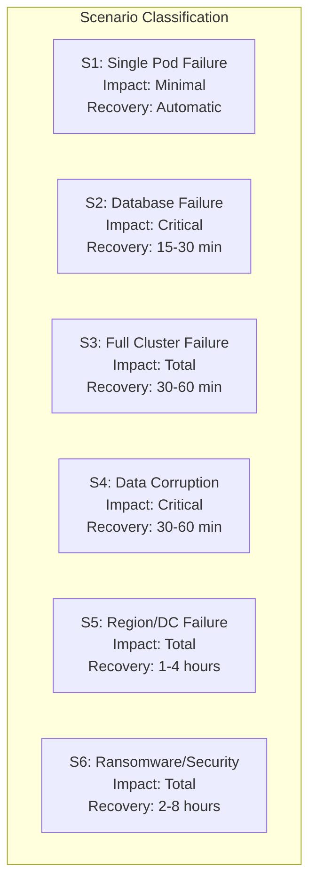
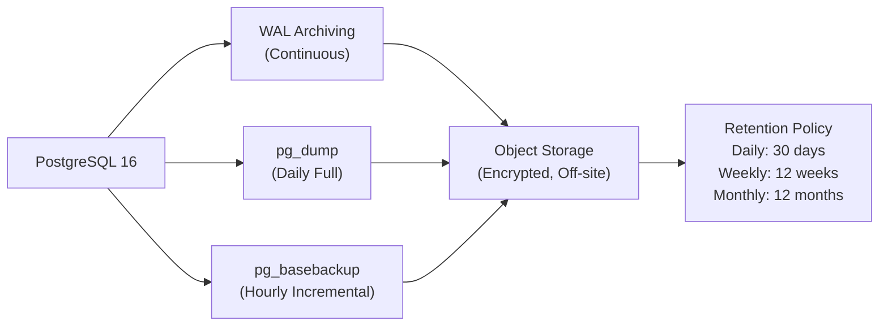
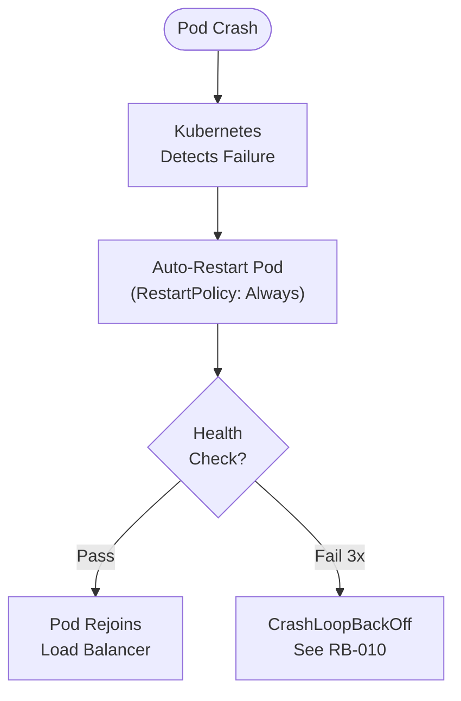
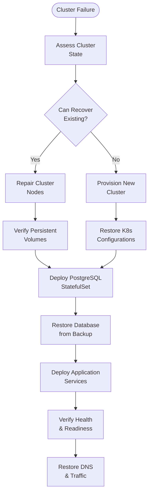
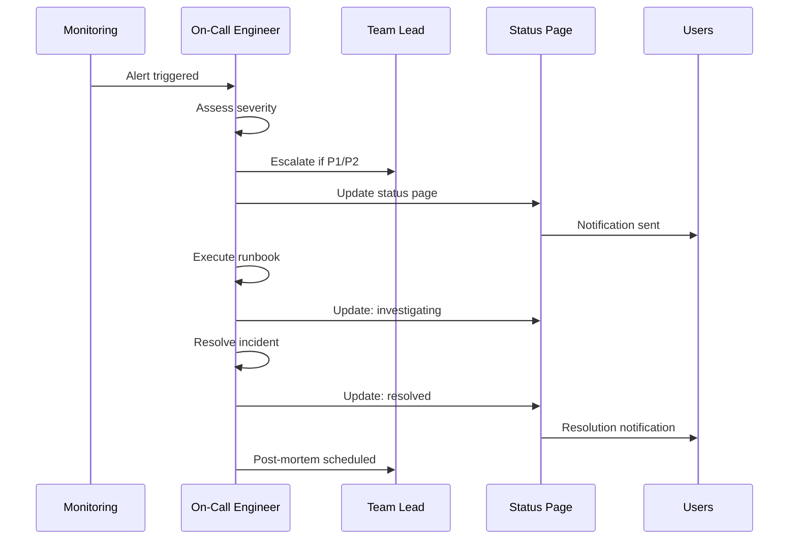

# ERP-CRM Disaster Recovery Plan

## 1. Recovery Objectives

| Metric | Target | Justification |
|--------|--------|--------------|
| RTO (Recovery Time Objective) | < 1 hour | Business operations resume within 1 hour |
| RPO (Recovery Point Objective) | < 5 minutes | Maximum 5 minutes of data loss |
| MTTR (Mean Time To Recovery) | < 30 minutes | Average recovery time |

## 2. Disaster Scenarios



## 3. Backup Strategy

### 3.1 PostgreSQL Backups



**Backup Schedule:**

| Type | Frequency | Retention | Storage |
|------|-----------|-----------|---------|
| WAL Archive | Continuous | 7 days | Off-site object storage |
| Full Backup | Daily at 02:00 UTC | 30 days | Off-site object storage |
| Incremental | Hourly | 48 hours | Local + off-site |
| Point-in-Time | On demand | Until restored | Temporary |

**Backup Commands:**

```bash
# Full backup
pg_dump -Fc -h localhost -U postgres -d crm > /backups/crm_$(date +%Y%m%d_%H%M%S).dump

# Verify backup
pg_restore --list /backups/crm_latest.dump

# WAL archiving (postgresql.conf)
archive_mode = on
archive_command = 'test ! -f /backup/wal/%f && cp %p /backup/wal/%f'
```

### 3.2 Configuration Backups

```bash
# Backup all configuration
kubectl get configmap -n crm -o yaml > /backups/configmaps.yaml
kubectl get secret -n crm -o yaml > /backups/secrets.yaml
kubectl get deployment -n crm -o yaml > /backups/deployments.yaml

# Backup Pulsar topics configuration
cp eventing/pulsar/topics.yaml /backups/pulsar-topics.yaml

# Backup Quickwit index configuration
cp observability/quickwit/index-config.yaml /backups/quickwit-config.yaml
```

### 3.3 Event Store Backups

Pulsar provides built-in message retention. Configure:

```yaml
# Topic-level retention
retention_time_in_minutes: 10080  # 7 days
retention_size_in_mb: 10240       # 10 GB
```

## 4. Recovery Procedures

### 4.1 S1: Single Pod Failure

**Impact:** Minimal -- other replicas serve traffic
**Recovery:** Automatic via Kubernetes



**Actions:** None required. Monitor pod restart count.

### 4.2 S2: Database Failure

**Impact:** Critical -- all CRUD operations fail
**Recovery:** 15-30 minutes

```bash
# Step 1: Assess damage
kubectl exec -n data statefulset/postgresql -- pg_isready -U postgres

# Step 2: If PostgreSQL is down but data intact
kubectl delete pod -n data postgresql-0  # Force recreate
kubectl wait --for=condition=ready pod/postgresql-0 -n data --timeout=120s

# Step 3: If data is corrupted, restore from backup
# Stop application traffic
kubectl scale deployment crm-core -n crm --replicas=0

# Restore from latest full backup
pg_restore -h localhost -U postgres -d crm --clean --create /backups/crm_latest.dump

# If point-in-time recovery needed
# Restore base backup, then replay WAL to target time
pg_restore --target-time="2026-02-23 10:00:00" ...

# Resume application traffic
kubectl scale deployment crm-core -n crm --replicas=2
```

### 4.3 S3: Full Cluster Failure

**Impact:** Total outage
**Recovery:** 30-60 minutes



### 4.4 S4: Data Corruption

```bash
# Step 1: Identify corruption scope
# Check PostgreSQL logs for errors
kubectl logs -n data statefulset/postgresql --tail 100

# Step 2: Determine restore point
# Query audit events to find last known good state
# Check _sqlx_migrations for migration integrity

# Step 3: Point-in-time recovery
kubectl scale deployment crm-core -n crm --replicas=0

# Create new database from backup
createdb -h localhost -U postgres crm_restored
pg_restore -h localhost -U postgres -d crm_restored /backups/crm_latest.dump

# Verify restored data
psql -h localhost -U postgres -d crm_restored -c "SELECT count(*) FROM contacts;"

# Swap databases
psql -h localhost -U postgres -c "ALTER DATABASE crm RENAME TO crm_corrupted;"
psql -h localhost -U postgres -c "ALTER DATABASE crm_restored RENAME TO crm;"

# Resume traffic
kubectl scale deployment crm-core -n crm --replicas=2
```

## 5. Testing Schedule

| Test Type | Frequency | Description |
|-----------|-----------|------------|
| Backup Verification | Daily | Automated restore test to staging |
| Pod Failure Drill | Monthly | Kill a pod, verify auto-recovery |
| Database Failover | Quarterly | Simulate DB failure, time recovery |
| Full DR Drill | Semi-annual | Full cluster recovery from backups |
| Tabletop Exercise | Annual | Walk through all scenarios with team |

## 6. Communication Plan

### Incident Communication Flow



### Contact List

| Role | Contact Method | Response Time |
|------|---------------|--------------|
| On-Call Engineer | PagerDuty | 15 min (P1) |
| Team Lead | Phone + Slack | 30 min |
| Database Admin | Phone | 30 min |
| Infrastructure Lead | Phone | 30 min |

## 7. Data Classification for Recovery Priority

| Data | Priority | RPO | Recovery Order |
|------|----------|-----|---------------|
| Contact/Company records | Critical | 5 min | 1st |
| Deal/Pipeline data | Critical | 5 min | 1st |
| Ticket/Support data | High | 15 min | 2nd |
| Activities/Notes | Medium | 30 min | 3rd |
| Form submissions | Medium | 30 min | 3rd |
| Chat transcripts | Low | 1 hour | 4th |
| Analytics/Reports | Low | Regenerate | 5th |
| Audit events | Critical | 0 (immutable) | 1st (Pulsar) |
