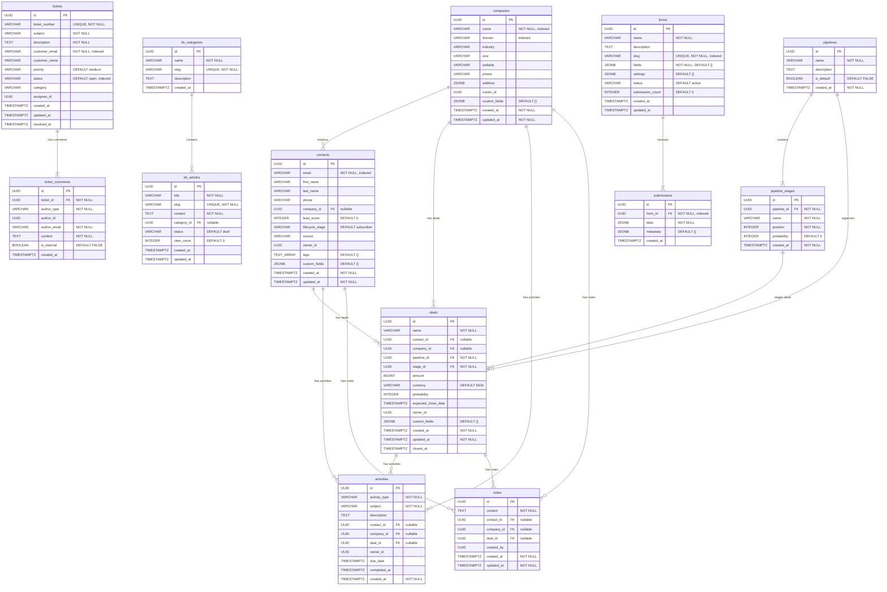
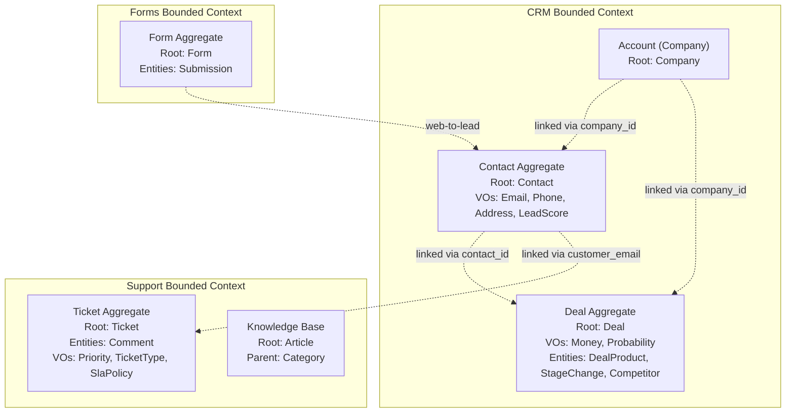

# ERP-CRM Entity-Relationship Diagram

## Complete ER Diagram

## Relationship Summary

| Parent | Child | Cardinality | ON DELETE |
|--------|-------|-------------|----------|
| companies | contacts | 1:N | SET NULL (company_id) |
| contacts | deals | 1:N | SET NULL (contact_id) |
| companies | deals | 1:N | SET NULL (company_id) |
| pipelines | pipeline_stages | 1:N | CASCADE |
| pipelines | deals | 1:N | RESTRICT |
| pipeline_stages | deals | 1:N | RESTRICT |
| contacts | activities | 1:N | CASCADE |
| companies | activities | 1:N | CASCADE |
| deals | activities | 1:N | CASCADE |
| contacts | notes | 1:N | CASCADE |
| companies | notes | 1:N | CASCADE |
| deals | notes | 1:N | CASCADE |
| tickets | ticket_comments | 1:N | CASCADE |
| kb_categories | kb_articles | 1:N | SET NULL |
| forms | submissions | 1:N | CASCADE |

## Index Inventory

| Table | Index Name | Column(s) | Type |
|-------|-----------|-----------|------|
| contacts | idx_contacts_email | email | B-tree |
| contacts | idx_contacts_company_id | company_id | B-tree |
| contacts | idx_contacts_lifecycle_stage | lifecycle_stage | B-tree |
| contacts | idx_contacts_created_at | created_at | B-tree |
| companies | idx_companies_name | name | B-tree |
| companies | idx_companies_domain | domain | B-tree |
| pipeline_stages | idx_pipeline_stages_pipeline_id | pipeline_id | B-tree |
| deals | idx_deals_contact_id | contact_id | B-tree |
| deals | idx_deals_company_id | company_id | B-tree |
| deals | idx_deals_pipeline_id | pipeline_id | B-tree |
| deals | idx_deals_stage_id | stage_id | B-tree |
| activities | idx_activities_contact_id | contact_id | B-tree |
| activities | idx_activities_deal_id | deal_id | B-tree |
| activities | idx_activities_due_date | due_date | B-tree |
| tickets | idx_tickets_status | status | B-tree |
| tickets | idx_tickets_customer | customer_email | B-tree |
| ticket_comments | idx_comments_ticket | ticket_id | B-tree |
| submissions | idx_submissions_form | form_id | B-tree |
| forms | idx_forms_slug | slug | B-tree |

## Domain Model Relationships (DDD)

