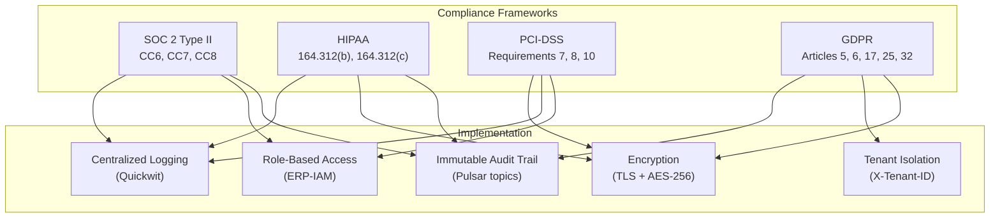
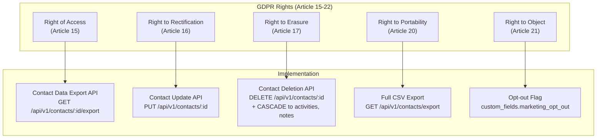
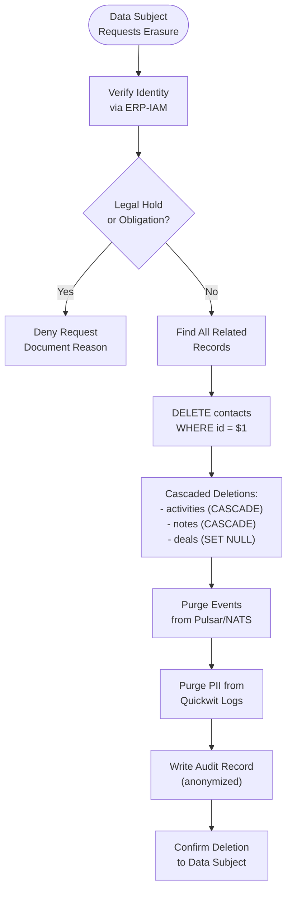
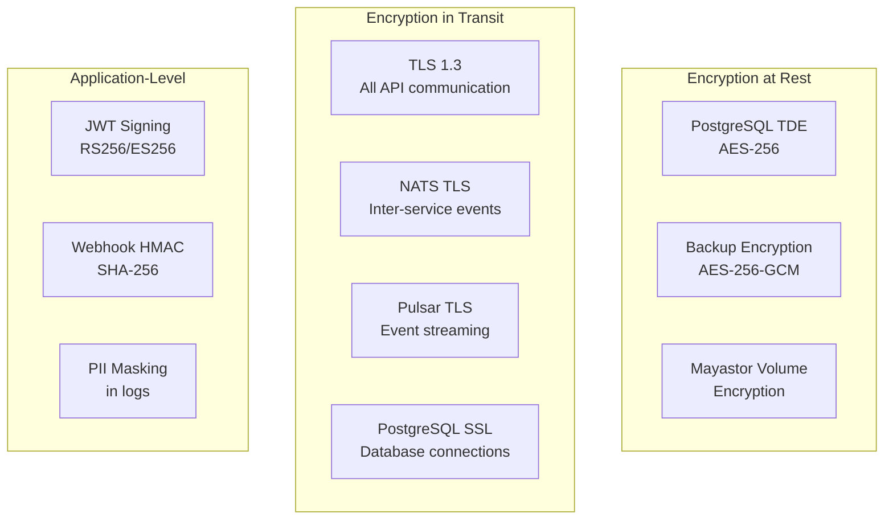

# ERP-CRM Data Privacy & Compliance

## 1. Regulatory Scope



## 2. Data Classification

| Category | Sensitivity | Examples | Handling |
|----------|------------|---------|----------|
| PII - High | Restricted | Email, phone, full name, address | Encrypted at rest, masked in logs |
| PII - Medium | Confidential | Company name, job title | Encrypted in transit |
| Financial | Restricted | Deal amounts, revenue | Encrypted at rest, audit logged |
| Behavioral | Confidential | Activity logs, page views, email opens | Anonymizable, time-bounded retention |
| Operational | Internal | Ticket content, KB articles | Standard access controls |
| System | Internal | Logs, metrics, health checks | Standard access controls |

## 3. GDPR Compliance

### 3.1 Data Subject Rights Implementation



### 3.2 Right to Erasure (RTBF) Process



### 3.3 Lawful Basis for Processing

| Data Processing Activity | Lawful Basis | Documentation |
|-------------------------|-------------|--------------|
| Contact management | Legitimate interest (B2B sales) | Privacy policy |
| Lead scoring | Legitimate interest (sales optimization) | Privacy policy + impact assessment |
| Email tracking | Consent | Opt-in at point of collection |
| Ticket management | Contract performance | Service agreement |
| Form submissions | Consent | Form consent checkbox |
| Chat transcripts | Consent | Pre-chat consent form |
| Analytics/Reporting | Legitimate interest | Privacy policy |

## 4. SOC 2 Control Mapping

| Control | Category | Implementation |
|---------|----------|---------------|
| CC6.1 | Logical Access | JWT authentication via ERP-IAM, role-based permissions |
| CC6.2 | Access Provisioning | User provisioning via ERP-Directory |
| CC6.3 | Access Modification | Ownership transfer with audit events |
| CC6.6 | Access Revocation | Token expiry, immediate revocation via IAM |
| CC7.1 | System Monitoring | Quickwit centralized logging, health checks |
| CC7.2 | Anomaly Detection | Event pattern monitoring via Pulsar consumers |
| CC7.3 | Incident Response | Runbooks, escalation matrix, DR plan |
| CC8.1 | Change Management | Git-tracked changes, PR reviews, CI/CD gates |

## 5. HIPAA Controls (if handling PHI)

| Control | Requirement | Implementation |
|---------|------------|---------------|
| 164.312(a)(1) | Access Control | RBAC via ERP-IAM, tenant isolation |
| 164.312(a)(2)(i) | Unique User ID | UUID-based user identification |
| 164.312(a)(2)(iii) | Auto Logoff | JWT token expiry |
| 164.312(b) | Audit Controls | Immutable Pulsar audit topic, Quickwit logs |
| 164.312(c)(1) | Integrity | Event immutability, signed payloads |
| 164.312(c)(2) | Authentication | JWT + OIDC via ERP-IAM |
| 164.312(d) | Person Authentication | Multi-factor via ERP-IAM |
| 164.312(e)(1) | Transmission Security | TLS 1.3 for all communication |

## 6. PCI-DSS Controls

| Requirement | Control | Implementation |
|------------|---------|---------------|
| 7.1 | Restrict Access | Role-based, need-to-know access via ERP-IAM |
| 7.2 | Access Control System | RBAC with tenant scoping |
| 8.1 | Unique IDs | UUID user identifiers |
| 8.2 | Authentication | JWT tokens with RS256 signing |
| 10.1 | Audit Trail | All data access logged to Pulsar audit topic |
| 10.2 | Event Logging | 60+ event types for all CRUD operations |
| 10.3 | Log Records | CloudEvents format with timestamp, user, action |
| 10.5 | Log Integrity | Pulsar immutable topics, Quickwit indexed |
| 10.7 | Log Retention | 1+ year retention (configurable) |

## 7. Data Retention Policies

| Data Type | Default Retention | Configurable | Justification |
|-----------|-----------------|-------------|--------------|
| Contact Records | Indefinite | Yes (per tenant) | Business relationship |
| Deal Records | 7 years | No (regulatory) | Financial audit requirements |
| Activities | 2 years | Yes | Operational relevance |
| Notes | 5 years | Yes | Business context |
| Tickets | 3 years | Yes | Support history |
| Chat Transcripts | 1 year | Yes | Operational |
| Form Submissions | 2 years | Yes | Lead source evidence |
| KB Articles | Indefinite | Yes | Knowledge asset |
| Audit Events | 7 years | No (compliance) | Regulatory requirement |
| System Logs | 90 days | Yes | Troubleshooting |

## 8. Encryption Standards



## 9. Incident Response

### 9.1 Data Breach Response Plan

```mermaid
flowchart TB
    DETECT([Breach Detected]) --> CONTAIN["1. Contain<br/>Isolate affected systems"]
    CONTAIN --> ASSESS2["2. Assess<br/>Scope, data types, affected subjects"]
    ASSESS2 --> NOTIFY_INT["3. Internal Notification<br/>Security team, management"]
    NOTIFY_INT --> GDPR_72{GDPR Applies?<br/>(EU data subjects)}
    GDPR_72 -->|Yes| DPA["4. Notify DPA<br/>within 72 hours"]
    GDPR_72 -->|No| SKIP_DPA["Skip DPA notification"]
    DPA --> NOTIFY_SUBJECTS["5. Notify Affected<br/>Data Subjects"]
    SKIP_DPA --> NOTIFY_SUBJECTS
    NOTIFY_SUBJECTS --> REMEDIATE["6. Remediate<br/>Fix vulnerability"]
    REMEDIATE --> POSTMORTEM["7. Post-Mortem<br/>Root cause analysis"]
    POSTMORTEM --> IMPROVE2["8. Improve<br/>Update controls"]
```

## 10. Privacy by Design Principles

| Principle | Implementation |
|-----------|---------------|
| Proactive not Reactive | Compile-time SQL injection prevention, input validation |
| Privacy as Default | Minimum data collection, opt-in for tracking |
| Privacy in Design | Tenant isolation architecture, RBAC by default |
| Full Functionality | Privacy controls do not degrade CRM functionality |
| End-to-End Security | TLS in transit, AES at rest, immutable audit |
| Visibility and Transparency | Open-source code, documented data flows |
| Respect for User Privacy | GDPR rights implemented, data export/deletion |

## 11. Evidence Artifacts

| Artifact | Location | Purpose |
|----------|----------|---------|
| COMPLIANCE.md | `/ERP-CRM/COMPLIANCE.md` | Control mapping document |
| SECURITY.md | `/ERP-CRM/SECURITY.md` | Security policy |
| API_SPEC.yaml | `/ERP-CRM/API_SPEC.yaml` | API contracts |
| topics.yaml | `/ERP-CRM/eventing/pulsar/topics.yaml` | Event topic definitions |
| index-config.yaml | `/ERP-CRM/observability/quickwit/index-config.yaml` | Log schema |
| log-schema.json | `/ERP-CRM/observability/log-schema.json` | Structured log format |
| ci.yml | `/ERP-CRM/.github/workflows/ci.yml` | CI/CD pipeline |
| PLAN.md | `/ERP-CRM/PLAN.md` | Engineering plan with audit findings |
