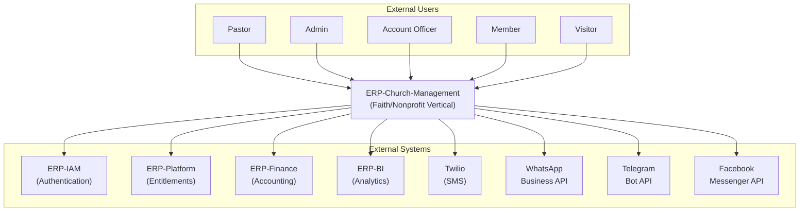
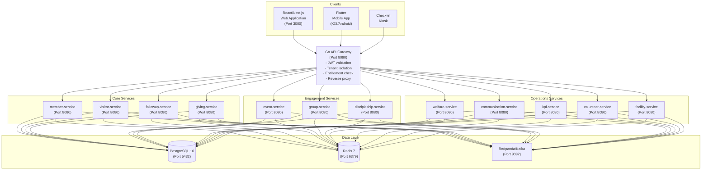
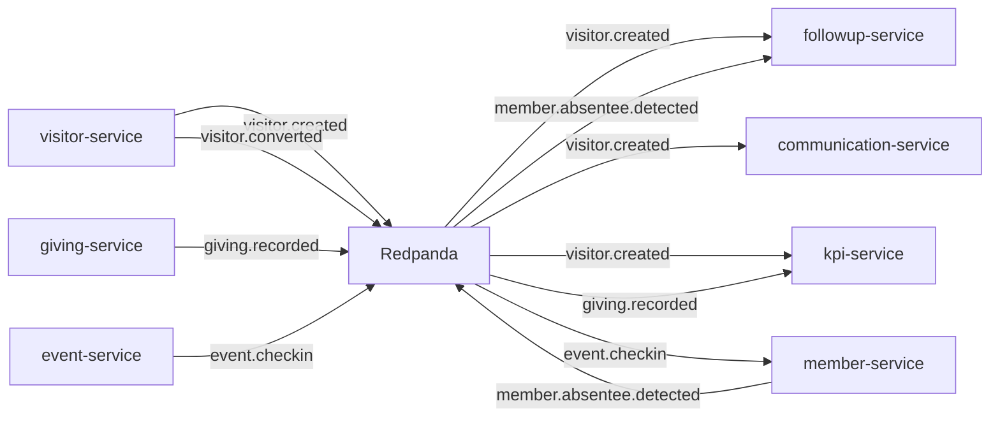
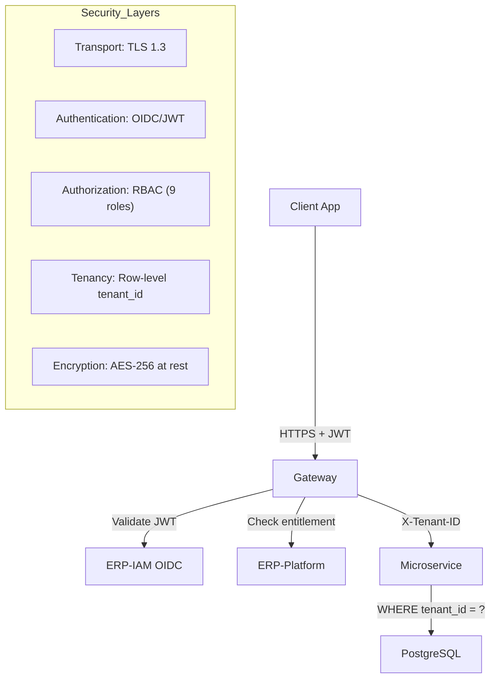
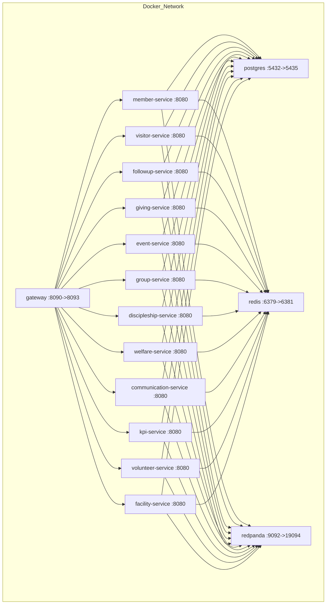
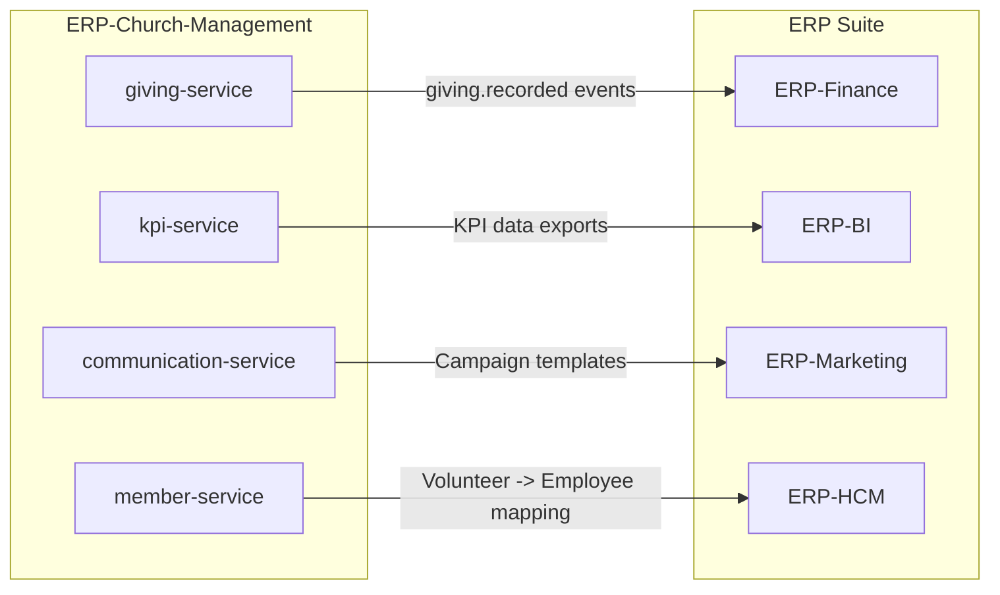
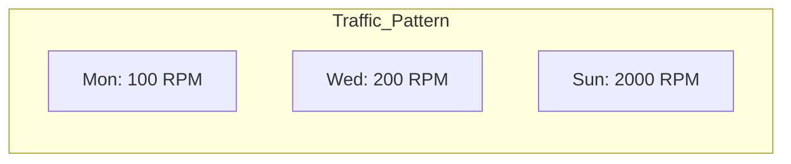

# System Architecture -- ERP-Church-Management
> Version: 1.0 | Last Updated: 2026-02-23 | Status: Draft
> Classification: Internal | Author: AIDD System

---

## 1. Architecture Overview

ERP-Church-Management follows a microservices architecture with 12 domain services behind a Go API gateway. The system operates in **standalone_plus_suite** mode, meaning it can function independently or integrate with the broader BillyRonks ERP ecosystem via ERP-IAM (authentication), ERP-Platform (entitlements), ERP-Finance (giving consolidation), and ERP-BI (analytics).

---

## 2. C4 Model

### 2.1 Level 1 -- System Context



### 2.2 Level 2 -- Container Diagram



### 2.3 Level 3 -- Component Diagram (Gateway)

```mermaid
flowchart TD
    REQ["Incoming HTTP Request"] --> CORS["CORS Middleware"]
    CORS --> CID["Correlation ID\nMiddleware"]
    CID --> JWT["JWT Validation\nMiddleware"]
    JWT --> ENT["Entitlement Check\nMiddleware"]
    ENT --> TNT["Tenant Isolation\nMiddleware"]
    TNT --> MUX["HTTP Mux Router"]
    MUX -->|/healthz| HC["Health Check Handler"]
    MUX -->|/v1/capabilities| CAP["Capabilities Handler"]
    MUX -->|/v1/{service}/...| PROXY["Reverse Proxy\n(httputil.ReverseProxy)"]
    PROXY --> SVC["Upstream Service"]
```

---

## 3. Communication Patterns

### 3.1 Synchronous -- REST via Gateway

All client-facing requests flow through the Go gateway which performs:
1. Correlation ID injection
2. JWT Bearer token validation
3. Entitlement check against ERP-Platform
4. Tenant ID enforcement (`X-Tenant-ID` header)
5. Reverse proxy to target microservice

### 3.2 Asynchronous -- Event-Driven via Redpanda/Kafka



### 3.3 Real-time -- Socket.IO (Legacy Monolith)

The source monolith uses Socket.IO for:
- New visitor notifications
- Child check-in/check-out alerts
- Parent paging
- Live dashboard updates
- Care request notifications

In the microservices architecture, this is replaced by:
- **Server-Sent Events (SSE)** for dashboard updates
- **Kafka consumer -> WebSocket bridge** for real-time notifications
- **Push notifications** via communication-service for mobile

---

## 4. Data Architecture

### 4.1 Database Strategy

All 12 microservices share a single PostgreSQL 16 database (`erp_church_management`) with schema-level isolation via table prefixes and tenant_id column on every table. This is a deliberate choice for Phase 1 to simplify joins across domains; Phase 2 may migrate to per-service databases.

### 4.2 Caching Strategy

Redis 7 is used for:
- Session cache (JWT token metadata)
- API response cache (member lists, KPI snapshots)
- Rate limiting counters
- Distributed locks (account officer assignment)

### 4.3 Event Streaming

Redpanda (Kafka-compatible) handles:
- Domain events between services
- 72-hour follow-up job triggers
- KPI calculation triggers
- Communication outbox pattern

---

## 5. Security Architecture



### 5.1 Role-Based Access Control

| Role | Member | Visitor | Follow-up | Giving | Events | Groups | KPI | Admin |
|---|---|---|---|---|---|---|---|---|
| super_admin | CRUD | CRUD | CRUD | CRUD | CRUD | CRUD | CRUD | CRUD |
| admin | CRUD | CRUD | CRUD | CRUD | CRUD | CRUD | Read | CRUD |
| pastor | Read/Update | Read | Read | Read | CRUD | Read | Read | - |
| minister | Read | Read | Read | - | Read/Update | Read/Update | Read | - |
| HOD | Read | Read | Read | - | Read/Update | CRUD | Read | - |
| directorate_head | Read | Read | CRUD | - | Read | Read | Read | - |
| account_officer | Read (assigned) | Read (assigned) | CRUD (assigned) | - | Read | Read | - | - |
| worker | Read (limited) | Read (limited) | Read | - | Read | Read | - | - |
| member | Read (self) | - | - | Read (self) | Read | Read | - | - |

---

## 6. Infrastructure Architecture

### 6.1 Docker Compose Topology



### 6.2 Production Target

| Component | Technology | Sizing |
|---|---|---|
| Container Orchestration | Kubernetes (EKS/GKE) | 3-node cluster minimum |
| API Gateway | Go binary in Alpine container | 2 replicas, 256MB RAM each |
| Microservices | Go binaries in Alpine containers | 1-2 replicas each, 128-512MB RAM |
| Database | PostgreSQL 16 (RDS/CloudSQL) | db.r6g.large (2 vCPU, 16GB) |
| Cache | Redis 7 (ElastiCache/Memorystore) | cache.t4g.medium (2 vCPU, 3GB) |
| Event Stream | Redpanda / Managed Kafka | 3-broker cluster, 50GB storage |
| CDN | CloudFront / Cloud CDN | For static frontend assets |

---

## 7. Integration Architecture

### 7.1 Suite Integration Points



### 7.2 External Integration Points

| Integration | Protocol | Purpose |
|---|---|---|
| Twilio | REST API | SMS delivery |
| WhatsApp Business API | REST API | WhatsApp messaging |
| Telegram Bot API | REST API | Telegram messaging |
| Facebook Messenger | REST API | Facebook messaging |
| SMTP (Gmail/SendGrid) | SMTP/REST | Email delivery |
| Payment Gateway (future) | REST API | Online giving processing |

---

## 8. Scalability Considerations

### 8.1 Sunday Peak Pattern

Churches experience extreme traffic spikes on Sundays (10x weekday baseline):



Mitigation strategies:
- **Kubernetes HPA** auto-scaling on CPU/memory for event-service and member-service
- **Redis caching** for read-heavy dashboards
- **Kafka buffering** for write-heavy check-in events
- **CDN caching** for static frontend assets
- **Connection pooling** (PgBouncer) for database connections

### 8.2 Multi-Campus Scaling

Each campus operates as a tenant with full data isolation. The system supports:
- Shared infrastructure (cost-efficient for small campuses)
- Dedicated infrastructure (for large campuses with regulatory requirements)
- Cross-campus reporting at denomination level (aggregated KPIs)
